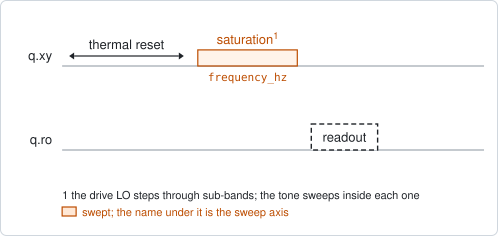
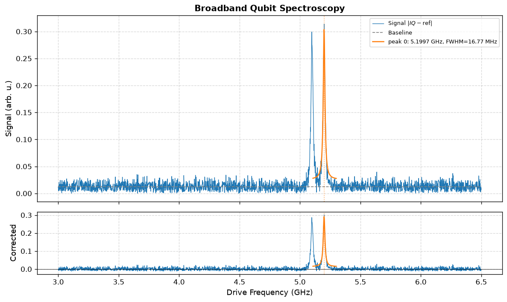

# broadband_qubit_spectroscopy

## Purpose

Searches for the qubit over several GHz. It is the qubit spectroscopy for the
stage at which nobody knows where the qubit is: the drive frequency is swept in
absolute Hz, far wider than one setting of the drive's local oscillator reaches,
by stepping that oscillator through sub-bands and sweeping inside each one.

It reports candidate transition frequencies and writes nothing. Take a candidate,
set the drive frequency to it by hand (`scqo set q1.drive_freq_hz=...`), and run
`qubit_spectroscopy` there for the value that is kept.

```
scqo run broadband_qubit_spectroscopy --targets q1
scqo run broadband_qubit_spectroscopy --targets q1 --set start_freq_hz=4e9 --set stop_freq_hz=6e9 --set max_peaks=3
```

## Before running it

<!-- BEGIN generated: requires -->
GENERATED from `BroadbandQubitSpectroscopy.requires` and its Parameters mixins - edit
the declaration, then run `python scripts/update_docs.py`.

The target is a `transmon` / `flux_transmon` / `fluxonium` carrying the operations `rx`, `readout`.

These device values must already be right:

| value | held by | used for | provided by |
|---|---|---|---|
| `drive_power_dbm` | drive channel | the run moves the drive chain to its own saturation power and restores this value afterwards, so one has to be set | no shared experiment; set it by hand (`scqo set`) or by a backend's own writeback |
| `readout_freq_hz` | readout channel | the readout tone has to sit on the resonator | `readout_frequency`, `resonator_spectroscopy`, `resonator_spectroscopy_flux`, `resonator_spectroscopy_power_amp`, `resonator_spectroscopy_power_chain` |
| `readout_power_dbm` | readout channel | the readout has to be at its working power | `resonator_spectroscopy_power_amp`, `resonator_spectroscopy_power_chain` |
| `thermalization_time_s` | drive channel | how long the thermal reset waits (a per-run thermalization_time_ns replaces it) (with the default `reset_method=thermal`) | `qubit_relaxation` |

Needed only with a non-default setting:

| setting | value | held by | used for | provided by |
|---|---|---|---|---|
| `reset_method=active` | `readout_rotation_rad` | readout channel | the reset measurement is discriminated on the rotated axis | no shared experiment; set it by hand (`scqo set`) or by a backend's own writeback |
| `reset_method=active` | `readout_threshold` | readout channel | decides whether the reset plays its pi pulse | no shared experiment; set it by hand (`scqo set`) or by a backend's own writeback |
| `reset_method=active` | `readout_depletion_s` | readout channel | the settle between the reset measurement and the first pulse | `resonator_spectroscopy` |

A backend may need more than this - a knob only it consumes. `scqo run broadband_qubit_spectroscopy --help` lists those where that driver is installed.
<!-- END generated: requires -->

Unlike `qubit_spectroscopy` it does not need a drive frequency: the window is
given in absolute Hz.

## Pulse sequence



After the reset, a saturation tone `drive_len_ns` long is played at the swept
frequency and is over before the readout tone starts. The readout stays at its
stored frequency throughout.

The window from `start_freq_hz` to `stop_freq_hz` is cut into sub-bands
`bandwidth_per_lo_hz` wide. The declared axis puts the drive's local oscillator
at the centre of each and skips `lo_gap_hz` around it, where the oscillator's own
leakage would show as a false line; the pieces are joined into one frequency
axis. Which oscillator settings are actually used is each driver's own choice,
bounded by what its hardware can reach. As in `qubit_spectroscopy`, the drive
chain is moved to `drive_power_dbm` for the run and put back afterwards.

## Theory

*To be written.*

## Outputs

<!-- BEGIN generated: outputs -->
GENERATED from `BroadbandQubitSpectroscopy.writes` and `.extracts` - edit the
declaration, then run `python scripts/update_docs.py`.

Record-only: `update()` proposes nothing.

Reported in `result.fit` and never written:

| fit key | meaning |
|---|---|
| `peaks` | the candidate peaks, strongest first, each with its rank, frequency_hz, fwhm_hz and amplitude |
| `candidate_qubit_frequencies_hz` | the frequencies of those peaks, in the same order |
| `num_peaks_found` | how many peaks passed both the prominence and the signal-to-noise test |
| `num_peaks_requested` | max_peaks, as the run was asked |
<!-- END generated: outputs -->

A run is `SUCCESSFUL` when at least one peak was found.

A peak has to pass two tests: its height above the baseline is at least
`prominence` times the span of the signal, and at least `min_snr` times the
noise. The peaks that pass are ranked by area and the first `max_peaks` are kept.

## Expected result



The upper panel is the readout response over the whole window with its baseline;
the lower panel is the same with the baseline removed. The fitted candidate is
drawn in orange. Check that:

- the baseline is flat between the lines;
- each candidate is a line several points wide, not one high point;
- the number of candidates is what you asked for. The simulated device shows two
  lines 100 MHz apart, and with the default `max_peaks=1` only the stronger one
  is reported.

## Traps

- **More than one line.** The 0-1 transition is not the only thing a strong drive
  excites: the two-photon 0-2 line sits half the anharmonicity below it, and
  another qubit on the same drive line shows too. Raise `max_peaks`, then confirm
  each candidate with `qubit_spectroscopy` at lower power.
- **The scan re-tunes hardware that other channels may share.** Stepping the
  drive's local oscillator can move more than the target's own channel. What else
  moves, and how many targets one run can take, depends on the backend:
  `scqo run broadband_qubit_spectroscopy --help` says so where that driver is
  installed.
- **A candidate is not a calibration.** The step between points is coarse and the
  line is power broadened, so a candidate is good to a few MHz at best. Nothing
  is written for that reason.

## References

- Related experiments: `qubit_spectroscopy` (the fine scan, and the one that
  writes the frequency), `broadband_resonator_spectroscopy` (the same search for
  resonators).
- Code: `scqo/experiments/broadband_qubit_spectroscopy.py`,
  `scqat/estimators/broadband_qubit_spectroscopy/`.
