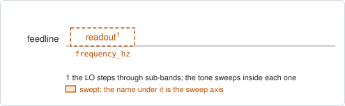
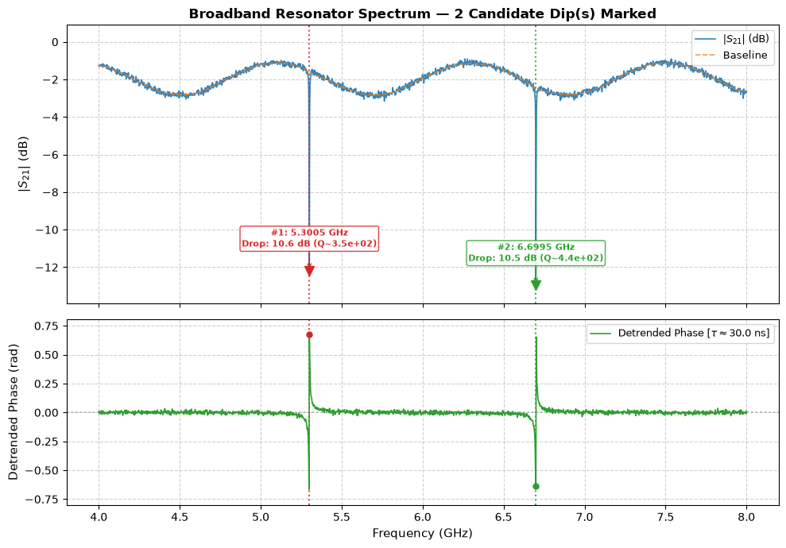

# broadband_resonator_spectroscopy

## Purpose

Finds the resonators on a feedline before anything is known about them: sweeps
the readout tone across several GHz and lists the transmission dips it sees.
Run it on a new chip, or after a cooldown, to learn where the resonators are and
which frequency to give each target as its first `readout_freq_hz`.

It is a survey and changes nothing. The dips it reports are candidates; assigning
one to a target is the operator's decision, made with `scqo set`.

```
scqo run broadband_resonator_spectroscopy --targets q1
scqo run broadband_resonator_spectroscopy --targets q1 --set start_freq_hz=5e9 --set stop_freq_hz=7e9
```

## Before running it

<!-- BEGIN generated: requires -->
GENERATED from `BroadbandResonatorSpectroscopy.requires` and its Parameters mixins - edit
the declaration, then run `python scripts/update_docs.py`.

The target is a `transmon` / `flux_transmon` / `fluxonium` carrying the operations `readout`.

With the default parameters it needs no device value beyond what its target kind guarantees.

A backend may need more than this - a knob only it consumes. `scqo run broadband_resonator_spectroscopy --help` lists those where that driver is installed.
<!-- END generated: requires -->

## Pulse sequence



A readout tone swept in frequency. The instrument cannot cover the whole range
in one sweep, so the range is cut into sub-bands of `bandwidth_per_lo_hz`: the
local oscillator is stepped to each one and the tone is swept inside it. A gap
of `lo_gap_hz` around each oscillator frequency is skipped, because the mixer
leaks there.

Every target on the same feedline sees the same trace, so one target is enough.

## Theory

*To be written.*

## Outputs

<!-- BEGIN generated: outputs -->
GENERATED from `BroadbandResonatorSpectroscopy.writes` and `.extracts` - edit the
declaration, then run `python scripts/update_docs.py`.

Record-only: `update()` proposes nothing.

Reported in `result.fit` and never written:

| fit key | meaning |
|---|---|
| `dips` | every candidate dip: rank, frequency, width, loaded Q, depth and whether its fit succeeded |
| `resonator_frequencies_hz` | the candidate frequencies, in ascending order |
| `num_dips_found` | how many dips met the prominence and noise criteria |
| `num_dips_requested` | how many were asked for (num_dips, else one per resonator the roster declares) |
<!-- END generated: outputs -->

A run is `SUCCESSFUL` when the dip search succeeded. Read `num_dips_found`
against `num_dips_requested`: fewer found than requested means a resonator is
outside the range, too shallow at this power, or hidden in an oscillator gap.

## Expected result



The upper panel is the transmitted magnitude over the whole range with its
slowly varying baseline, and each detected dip marked with its frequency, depth
and quality factor. The lower panel is the phase with the cable delay removed.
Check that:

- the number of marked dips matches the number of resonators on the feedline;
- each marked dip is clearly deeper than the ripple around it, and the phase
  jumps at the same frequency. A dip with no phase feature is not a resonance;
- no dip sits at the edge of a sub-band, where the skipped gap could have cut it.

## Traps

- **A dip inside an oscillator gap.** A resonator that falls in the skipped
  `lo_gap_hz` is not seen. If one is missing, run again with a different
  `bandwidth_per_lo_hz` so the gaps fall elsewhere.
- **Ripple taken for a resonator.** Cable and amplifier ripple can pass the
  prominence test. Raise `min_prominence_db` or `min_snr`, or confirm a
  candidate with `resonator_spectroscopy` before using it.
- **The power is too high.** Above the punchout power every dip is the bare
  resonator. That is fine for finding them, but the frequency it gives is not the
  one to read the qubit at.

## References

- Related experiments: `resonator_spectroscopy` (the next step: one resonator,
  fitted), `resonator_spectroscopy_power_amp` (choose the readout power).
- Code: `scqo/experiments/broadband_resonator_spectroscopy.py`,
  `scqat/estimators/broadband_resonator_spectroscopy/`.
