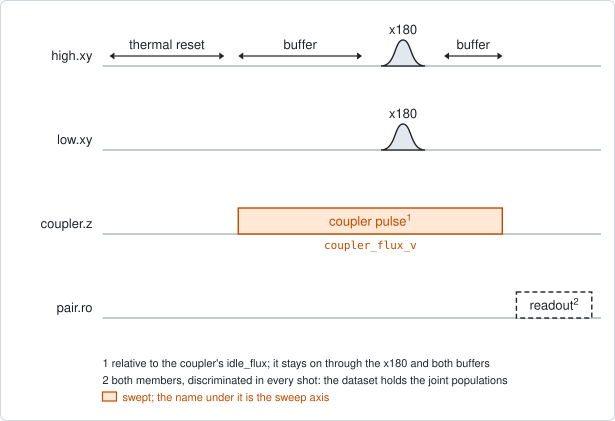
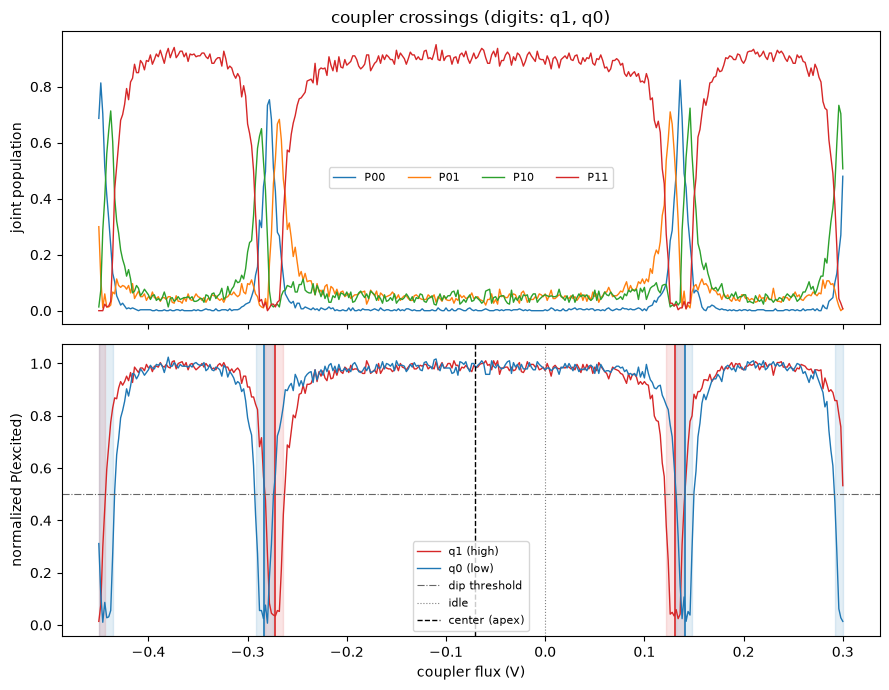

# pair_coupler_crossing_pulse

## Purpose

Finds where a pair's coupler crosses its two neighbours in frequency, and from
that the coupler's flux period and its highest frequency. The coupler has no
drive line and no readout, so it is seen through the pair's members.

The coupler plays a flux pulse, and during that pulse each member plays its
`x180`. Where the pulse brings the coupler onto a member, the two mix and the
member moves away from its drive frequency. Its `x180` then misses, and the
member's excited population dips. Sweeping the pulse amplitude gives, for each
member, a dip on either side of the coupler's symmetry point.

The symmetry point is half-way between the two dips of a member. With both
members measured, the order of the dips says whether the coupler sits above the
members or below them, and the two distances solve the coupler's frequency
curve for its period and its highest frequency.

It proposes `flux_offset` and `flux_per_phi0` for the coupler's flux channel
and `f_q_max_hz` for the coupler. It never proposes the coupler's `idle_flux`:
where the coupler should idle is another experiment's question.

```
scqo run pair_coupler_crossing_pulse --targets q1_q2
scqo run pair_coupler_crossing_pulse --targets q1_q2 --set start_coupler_flux_v=-0.3 --set end_coupler_flux_v=0.3 --set num_coupler_flux_points=301
```

## Before running it

<!-- BEGIN generated: requires -->
GENERATED from `PairCouplerCrossingPulse.requires` and its Parameters mixins - edit
the declaration, then run `python scripts/update_docs.py`.

The target is a `qubit_pair`.

These device values must already be right:

| value | held by | used for | provided by |
|---|---|---|---|
| `drive_freq_hz` | drive channel | each measured member's x180 has to be on resonance while the coupler is far away: a miss is read as a crossing | `qubit_ramsey`, `qubit_ramsey_flux_pulse`, `qubit_ramsey_phasor`, `qubit_spectroscopy` |
| `pi_amp` | drive channel | each measured member's x180 has to be a full pi pulse: the dips are measured against its plateau | `qubit_deterministic_benchmarking`, `qubit_pi_pulse_error`, `qubit_power_rabi` |
| `idle_flux` | flux line | the coupler window is an excursion from the coupler's standing bias, and every position found is re-referenced to it | `pair_zz_coupler`, `qubit_ramsey_flux_pulse`, `qubit_spectroscopy_flux_pulse`, `resonator_spectroscopy_flux` |
| `readout_freq_hz` | readout channel | each member's readout tone has to sit on its resonator | `readout_frequency`, `resonator_spectroscopy`, `resonator_spectroscopy_flux`, `resonator_spectroscopy_power_amp`, `resonator_spectroscopy_power_chain` |
| `readout_power_dbm` | readout channel | each member's readout has to be at its working power | `resonator_spectroscopy_power_amp`, `resonator_spectroscopy_power_chain` |
| `readout_rotation_rad` | readout channel | both members are discriminated in every shot: the axis each is projected on | no shared experiment; set it by hand (`scqo set`) or by a backend's own writeback |
| `readout_threshold` | readout channel | both members are discriminated in every shot: what splits \|0> from \|1> on that axis | no shared experiment; set it by hand (`scqo set`) or by a backend's own writeback |
| `thermalization_time_s` | drive channel | how long the thermal reset waits (a per-run thermalization_time_ns replaces it) (with the default `reset_method=thermal`) | `qubit_relaxation` |

Needed only with a non-default setting:

| setting | value | held by | used for | provided by |
|---|---|---|---|---|
| `reset_method=active` | `readout_depletion_s` | readout channel | the settle between the reset measurement and the first pulse | `resonator_spectroscopy` |

A backend may need more than this - a knob only it consumes. `scqo run pair_coupler_crossing_pulse --help` lists those where that driver is installed.
<!-- END generated: requires -->

The target is one pair. The values in the table belong to its members and to
the coupler's flux line, not to the pair.

The coupler's charging energy is used when it is known (the fact `ec_hz` of the
coupler, or `coupler_ec_hz` for one run). Without either, 0.2 GHz is used.

The run is refused before any instrument time when more than one pair is given,
the pair has no coupler, the coupler has no flux line, or a member has no drive
or no readout.

## Pulse sequence



Both members are reset. The coupler line plays a square pulse of amplitude
`coupler_flux_v`, measured from the coupler's `idle_flux`. After
`flux_buffer_ns` each measured member plays its `x180` at its own drive
frequency. After another `flux_buffer_ns` the coupler returns to its idle, and
both members are read out together.

The buffer lets the coupler line settle before the `x180`, and keeps the `x180`
away from the edges of the pulse. With `flux_buffer_ns=0` the coupler pulse
lasts as long as the `x180`.

`measure` selects which members play the `x180`. Both members are read out in
every case.

## Theory

*To be written.*

## Outputs

<!-- BEGIN generated: outputs -->
GENERATED from `PairCouplerCrossingPulse.writes` and `.extracts` - edit the
declaration, then run `python scripts/update_docs.py`.

Proposed by `update()`; each stays pending until it is accepted:

| field | held by | role | unit | meaning |
|---|---|---|---|---|
| `f_q_max_hz` | qubit mode | fact | Hz | Qubit 0->1 frequency at the sweet spot (arch top). |
| `flux_offset` | flux channel | fact | source-native | Sweet-spot offset of the transfer function flux/Phi0 = (x - flux_offset)/flux_per_phi0, where x is the ABSOLUTE set-point on the same plane as the line's idle_flux. An experiment whose sweep axis is relative to idle_flux re-references (absolute = idle_flux_at_run + fitted) before writing here. |
| `flux_per_phi0` | flux channel | fact | source-native | Source units of this line per flux quantum in the target's SQUID. |

Reported in `result.fit` and never written:

| fit key | meaning |
|---|---|
| `center_from_idle_v` | the symmetry point of the crossings, as a pulse amplitude from the coupler's idle |
| `center_from_idle_stderr_v` | its standard error |
| `center_kind` | what that point is: apex (the coupler sits above the members), anti_apex (below) or unknown |
| `crossing_high_lower_v` | the lower crossing of the high member, as a pulse amplitude from idle |
| `crossing_high_lower_stderr_v` | the standard error of that position |
| `crossing_high_lower_width_v` | the width of that dip |
| `crossing_high_lower_min_s` | the smallest normalized population inside that dip |
| `crossing_high_upper_v` | the upper crossing of the high member, as a pulse amplitude from idle |
| `crossing_high_upper_stderr_v` | the standard error of that position |
| `crossing_high_upper_width_v` | the width of that dip |
| `crossing_high_upper_min_s` | the smallest normalized population inside that dip |
| `crossing_low_lower_v` | the lower crossing of the low member, as a pulse amplitude from idle |
| `crossing_low_lower_stderr_v` | the standard error of that position |
| `crossing_low_lower_width_v` | the width of that dip |
| `crossing_low_lower_min_s` | the smallest normalized population inside that dip |
| `crossing_low_upper_v` | the upper crossing of the low member, as a pulse amplitude from idle |
| `crossing_low_upper_stderr_v` | the standard error of that position |
| `crossing_low_upper_width_v` | the width of that dip |
| `crossing_low_upper_min_s` | the smallest normalized population inside that dip |
| `flux_offset_stderr` | the standard error of the proposed flux_offset |
| `flux_per_phi0_stderr` | the standard error of the proposed flux_per_phi0 |
| `f_q_max_stderr_hz` | the standard error of the proposed f_q_max_hz |
| `f_c_at_idle_hz` | the coupler frequency at its idle, read off the solved arch |
| `f_c_at_idle_stderr_hz` | its standard error |
| `ec_hz_used` | the coupler charging energy the arch was solved with |
| `old_coupler_idle_flux` | the coupler's idle_flux the window was measured from |
| `crossings_not_bracketed_high` | 1 when the high member's two crossings around idle are not both inside the window |
| `crossings_not_bracketed_low` | the same for the low member |
| `center_mismatch` | 1 when the two members' symmetry points disagree |
| `side_conflict` | 1 when coupler_side names a side the data contradicts |
| `arch_unsolved` | 1 when the period and the maximum frequency could not be solved; the run can still succeed without them |
<!-- END generated: outputs -->

The crossings and the centre are in the frame of the pulse: volts from the
coupler's `idle_flux`. `flux_offset` is absolute. It is the old `idle_flux`
plus the centre, and it is only proposed when the centre is known to be the
apex.

`flux_per_phi0` and `f_q_max_hz` come from solving the transmon frequency curve
through the two members' crossings. They are estimates that depend on that
model and on the charging energy used. `f_c_at_idle_hz` is the same curve read
at the idle: use it to centre a coupler spectroscopy.

A run is `SUCCESSFUL` when every measured member has a crossing on each side of
idle inside the window, the members' centres agree, and the data does not
contradict `coupler_side`. When only the curve cannot be solved
(`arch_unsolved`), the run still succeeds and proposes the apex alone.

With one member measured there is one centre and nothing to compare it with.
Its kind stays `unknown` unless `coupler_side` names the side, and an unknown
centre is not proposed as the apex.

## Expected result



Top, the four joint populations against the coupler amplitude. Bottom, each
member's excited population, normalized to its plateau, with the fitted
crossings as shaded bands, the idle as a dotted line and the centre as a dashed
line. Check that:

- each member has a plateau near 1 with narrow dips in it;
- each member has one dip on either side of the centre, inside the window;
- the two members' dips sit close together but not on top of each other. Here
  the high member's dips are the inner pair, which is what a coupler above both
  members gives;
- the centre lies between the dips, and the dashed line is labelled with its
  kind.

The dips at the two ends of the window in this figure are crossings on the next
arch of the coupler's curve, beyond the point where its frequency goes to zero.
Only the pair nearest idle is used.

A second figure in the run folder draws the solved frequency curve of the
coupler with the members' frequencies and the crossings on it.

The figure is from a simulated pair whose coupler sits above both members.

## Traps

- **One pair per run.** The coupler line also shifts qubits that are not its
  neighbours, so two couplers pulsed together move each other's members. More
  than one target is refused.
- **Past a crossing the plateau can sit lower.** The coupler's fast return to
  idle passes the crossing again and can leave part of the excitation in the
  coupler. The estimator normalizes by a high percentile and does not assume
  that the two sides of a dip agree.
- **The proposals carry the error of the pulse frame.** The line's response to
  a pulse can differ from its response to a standing bias. A centre far from
  idle carries that difference into `flux_offset` and into the period.
- **`f_q_max_hz` is a rough number.** Two crossings a few hundred MHz apart pin
  the top of the curve only to a few hundred MHz. Measure the coupler frequency
  itself with `pair_coupler_spectroscopy_zz` or
  `pair_coupler_spectroscopy_swap`.
- **The step limits the result.** The curve is solved from the small difference
  between two distances, so its error grows with the step of the sweep. The
  default step is 2 mV.
- **A stale `x180` looks like a crossing everywhere.** The dips are measured
  against the plateau of each member's `x180`. A member whose drive frequency
  or amplitude is off has no plateau to dip from.

## References

- `docs/coupler-readout-plan.md`, the design of the three coupler experiments.
- Related experiments: `pair_coupler_spectroscopy_zz` and
  `pair_coupler_spectroscopy_swap` (the coupler frequency at its idle, which
  take their window from `f_c_at_idle_hz` here), `pair_zz_coupler` and
  `pair_swap_flux_map` (where the coupler should idle).
- Code: `scqo/experiments/pair_coupler_crossing_pulse.py`,
  `scqo/experiments/_capabilities/coupler_flux.py`,
  `scqat/estimators/pair_coupler_crossing/`.
