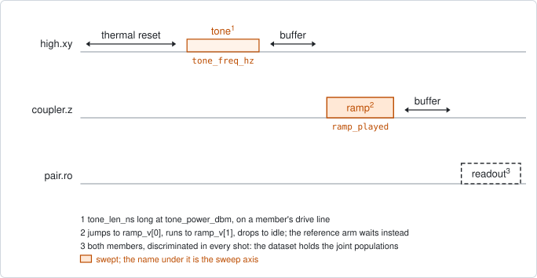
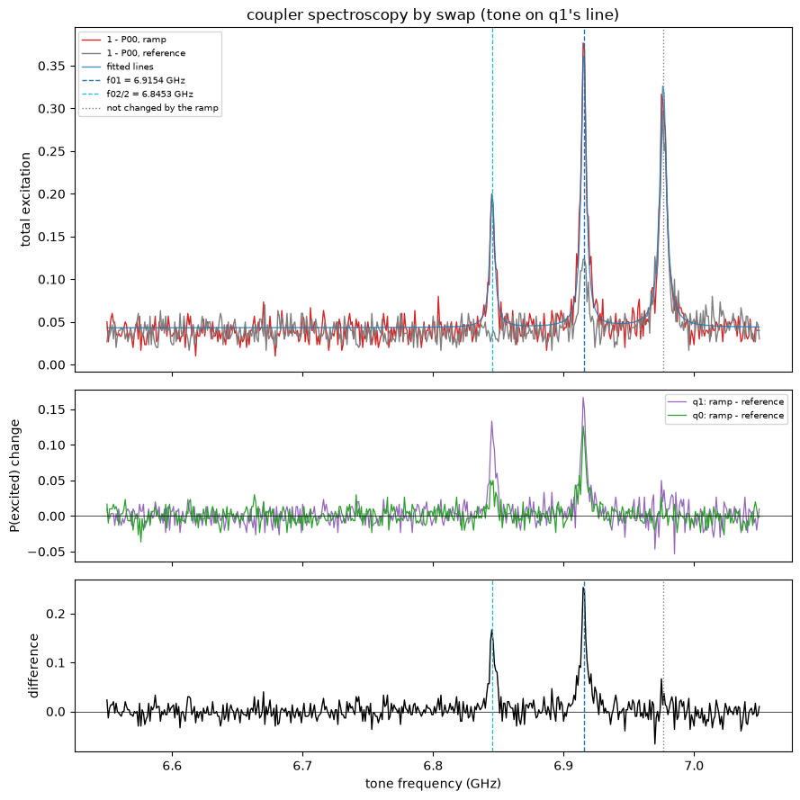

# pair_coupler_spectroscopy_swap

## Purpose

Measures the frequency of a pair's coupler at its idle point, by moving the
coupler's excitation into a member that can be read out. The coupler has no
drive line and no readout.

A long tone on one member's drive line reaches the coupler through the coupling
between the two. When the tone hits a transition of the coupler, the coupler is
left excited. A flux ramp then carries the coupler slowly across a member. A
slow crossing hands the excitation over to that member, and a sudden return
leaves it there. The pair's total excitation then peaks at the coupler's
transitions.

Every frequency is also taken without the ramp. The lines that the ramp changes
are the coupler's. The highest of them is the 0-1 frequency, and the next one
below it gives the anharmonicity.

It proposes the facts `f_01_hz` and `anharmonicity_hz` of the coupler. No knob
is moved.

```
scqo run pair_coupler_spectroscopy_swap --targets q1_q2 --set ramp_v=[0.14,0] --set tone_on=low
```

## Before running it

<!-- BEGIN generated: requires -->
GENERATED from `PairCouplerSpectroscopySwap.requires` and its Parameters mixins - edit
the declaration, then run `python scripts/update_docs.py`.

The target is a `qubit_pair`.

These device values must already be right:

| value | held by | used for | provided by |
|---|---|---|---|
| `drive_power_dbm` | drive channel | the run moves the tone member's drive chain to tone_power_dbm and restores this value afterwards, so one has to be set | no shared experiment; set it by hand (`scqo set`) or by a backend's own writeback |
| `idle_flux` | flux line | the ramp is a pulse on top of the ramped line's standing bias, and the frequency found is the coupler's at its own | `pair_zz_coupler`, `qubit_ramsey_flux_pulse`, `qubit_spectroscopy_flux_pulse`, `resonator_spectroscopy_flux` |
| `readout_freq_hz` | readout channel | each member's readout tone has to sit on its resonator | `readout_frequency`, `resonator_spectroscopy`, `resonator_spectroscopy_flux`, `resonator_spectroscopy_power_amp`, `resonator_spectroscopy_power_chain` |
| `readout_power_dbm` | readout channel | each member's readout has to be at its working power | `resonator_spectroscopy_power_amp`, `resonator_spectroscopy_power_chain` |
| `readout_rotation_rad` | readout channel | both members are discriminated in every shot: the axis each is projected on | no shared experiment; set it by hand (`scqo set`) or by a backend's own writeback |
| `readout_threshold` | readout channel | both members are discriminated in every shot: what splits \|0> from \|1> on that axis | no shared experiment; set it by hand (`scqo set`) or by a backend's own writeback |
| `thermalization_time_s` | drive channel | how long the thermal reset waits (a per-run thermalization_time_ns replaces it) (with the default `reset_method=thermal`) | `qubit_relaxation` |

Needed only with a non-default setting:

| setting | value | held by | used for | provided by |
|---|---|---|---|---|
| `reset_method=active` | `readout_depletion_s` | readout channel | the settle between the reset measurement and the first pulse | `resonator_spectroscopy` |

A backend may need more than this - a knob only it consumes. `scqo run pair_coupler_spectroscopy_swap --help` lists those where that driver is installed.
<!-- END generated: requires -->

The target is one pair. The values in the table belong to its members and to
its flux lines, not to the pair. `drive_power_dbm` is the tone member's.

`ramp_v` has no default and the run is refused without it. Take its far end
from `pair_coupler_crossing_pulse`: the crossing on the side the ramp goes to,
plus about 30 mV.

The tone window is in absolute frequency. Centre it on `f_c_at_idle_hz` from
the same experiment.

The run is also refused before any instrument time when more than one pair is
given, the pair has no coupler, a member has no drive or no readout, or
`ramp_on=tone_member` names a member with no flux line.

## Pulse sequence



Both members are reset. The member named by `tone_on` plays the tone: its
saturation operation, `tone_len_ns` long, at the frequency `tone_freq_hz` and
the power `tone_power_dbm`. After `flux_buffer_ns` the ramped line plays the
ramp, and after another `flux_buffer_ns` both members are read out together.

The ramp is `ramp_v = (first, last)`, in the order it is played. The line jumps
to `first` at once, runs in a straight line to `last` at `ramp_rate_v_per_us`,
and drops back to idle at once. Both voltages are pulse amplitudes, measured
from the standing bias of the ramped line. `ramp_on` selects that line: the
coupler's, or the tone member's own.

Every frequency is taken twice, back to back: once with the ramp and once with
a wait of the same length in its place. The axis `ramp_played` is 1 for the
first and 0 for the second, the reference arm.

The tone power is set through the tone member's drive chain for the run and
restored afterwards. The whole window is played around one local oscillator at
its centre, so it is at most 500 MHz wide.

## Theory

*To be written.*

## Outputs

<!-- BEGIN generated: outputs -->
GENERATED from `PairCouplerSpectroscopySwap.writes` and `.extracts` - edit the
declaration, then run `python scripts/update_docs.py`.

Proposed by `update()`; each stays pending until it is accepted:

| field | held by | role | unit | meaning |
|---|---|---|---|---|
| `f_01_hz` | qubit mode | fact | Hz | Qubit 0->1 frequency at the idle point (the drive_freq_hz knob is its instrument twin; one fit writes both). |
| `anharmonicity_hz` | qubit mode | fact | Hz | Anharmonicity f_12 - f_01. |

Reported in `result.fit` and never written:

| fit key | meaning |
|---|---|
| `f_c_hz` | the coupler's 0-1 frequency: the highest of its lines. Proposed as f_01_hz |
| `f_c_stderr_hz` | the standard error of that frequency |
| `fwhm_hz` | the width of that line |
| `snr` | the height of that line over the noise of the trace |
| `alpha_hz` | the coupler's anharmonicity, from the f02/2 line; NaN when that line was not found. Proposed as anharmonicity_hz |
| `alpha_stderr_hz` | the standard error of the anharmonicity |
| `n_ladder_lines` | how many of the coupler's lines sit on the multi-photon ladder of f01, f01 included |
| `lo_hz` | the local oscillator the window was played around: its centre |
| `no_line` | 1 when no coupler line was found |
| `unexplained_lines` | 1 when a coupler line sits off the ladder; the run fails |
| `peak_at_edge` | 1 when f01 is at the edge of the window; the run fails |
| `peak_height` | the height of the f01 line in the total excitation |
| `n_coupler_lines` | the number of lines the ramp changes |
| `landing_high` | how much of the f01 line arrived on the high member |
| `landing_low` | how much of the f01 line arrived on the low member |
| `ramp_duration_ns` | the length of the slow segment that was played |
| `old_ramp_idle_flux` | the standing bias of the ramped line, which the ramp voltages are measured from |
<!-- END generated: outputs -->

The signal is the total excitation of the pair, 1 minus the population of both
members in the ground state. Which member receives the excitation differs from
pair to pair, so the two are counted together. `landing_high` and `landing_low`
report the split.

A run is `SUCCESSFUL` when a 0-1 line was found away from the edge of the
window and every other line that the ramp changes sits on its multi-photon
ladder: the second line at the 0-1 frequency plus half the anharmonicity, the
third near the 0-1 frequency plus the anharmonicity.

The frequency holds at the coupler's present `idle_flux`.

## Expected result



Top, the total excitation in the ramp arm and in the reference arm, with the
fitted lines. Middle, each member's change between the two arms. Bottom, the
difference of the two arms in the total excitation. Check that:

- the ramp arm has narrow peaks on a flat floor;
- the peaks marked as the coupler's are the ones that stand out in the bottom
  panel. The highest in frequency is the 0-1 line and the next is half of the
  0-2 line;
- a peak that is the same in both arms is marked as not changed by the ramp. It
  belongs to the tone member, not to the coupler;
- each line is several points wide. A line one or two points wide is ignored:
  measure it again with a finer step.

A smaller peak in the reference arm at a coupler line is a readout seeing the
excited coupler directly. It does not rule the line out.

The figure is from a simulated pair, drawn with `ramp_v=[0.14, 0]`.

## Traps

- **Only the slow segment swaps.** A crossing inside a jump is passed too fast
  to hand anything over. The member that the slow segment crosses first
  receives the excitation. So `[0, 0.14]` swaps on the way out, and `[0.14, 0]`
  jumps out and swaps on the way back.
- **What lies between the coupler and the members matters.** On the chip this
  was developed on, the readout resonators sit between the coupler and the
  qubits, and only the second order works: the coupler crosses the resonators
  again only after its excitation has gone to a qubit.
- **Use the weakly coupled member's line for the tone.** Through the strongly
  coupled member's line the 0-1 line broadens and half of the 0-2 line becomes
  the strongest.
- **A missing 0-1 line is not noticed.** The 0-1 line is taken to be the
  highest line that the ramp changes. When the real one is absent from the ramp
  arm, the next line down is reported in its place, as a `SUCCESSFUL` run
  (`BACKLOG.md` F24). Cross-check with `pair_coupler_spectroscopy_zz`.
- **The slope sets how well the swap works.** A steeper ramp passes the
  crossing faster and hands over less. The played ramp is never steeper than
  `ramp_rate_v_per_us`: its length is rounded up to the 4 ns grid.
- **One pair per run**, and at most 500 MHz per run.

## References

- `docs/coupler-readout-plan.md` section 4, the design.
- Related experiments: `pair_coupler_crossing_pulse` (the crossing that sets
  `ramp_v`, and the window centre), `pair_coupler_spectroscopy_zz` (the same
  frequency with the coupler at rest; the cross-check).
- Code: `scqo/experiments/pair_coupler_spectroscopy_swap.py`,
  `scqo/experiments/_coupler_tone.py`,
  `scqat/estimators/pair_coupler_spectroscopy_swap/`,
  `scqat/tools/coupler_ladder.py`.
