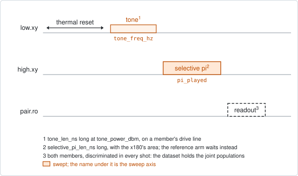
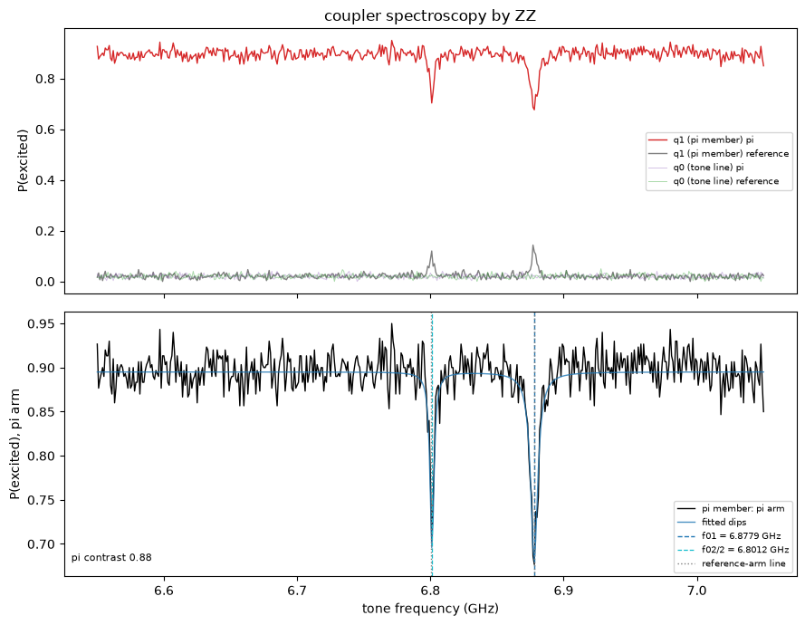

# pair_coupler_spectroscopy_zz

## Purpose

Measures the frequency of a pair's coupler at its idle point, without moving
the coupler. The coupler has no drive line and no readout. It is driven through
one member of the pair and detected on the other.

A long tone on one member's drive line reaches the coupler through the coupling
between the two. When the tone hits a transition of the coupler, the coupler is
left excited. An excited coupler shifts the other member's frequency slightly,
through their ZZ interaction. That member then plays a pi pulse that is long
and therefore narrow in frequency. When the coupler is excited the pulse
misses, and the member's excited population dips.

The highest dip is the coupler's 0-1 frequency. The lower ones are its
multi-photon lines, and the first of them gives the anharmonicity.

It proposes the facts `f_01_hz` and `anharmonicity_hz` of the coupler. No knob
is moved.

```
scqo run pair_coupler_spectroscopy_zz --targets q1_q2 --set start_tone_freq_hz=6.8e9 --set end_tone_freq_hz=7.3e9
```

## Before running it

<!-- BEGIN generated: requires -->
GENERATED from `PairCouplerSpectroscopyZZ.requires` and its Parameters mixins - edit
the declaration, then run `python scripts/update_docs.py`.

The target is a `qubit_pair`.

These device values must already be right:

| value | held by | used for | provided by |
|---|---|---|---|
| `drive_power_dbm` | drive channel | the run moves the tone member's drive chain to tone_power_dbm and restores this value afterwards, so one has to be set | no shared experiment; set it by hand (`scqo set`) or by a backend's own writeback |
| `drive_freq_hz` | drive channel | the selective pi is played at the pi member's drive frequency, and it is narrow: a stale frequency makes it miss everywhere | `qubit_ramsey`, `qubit_ramsey_flux_pulse`, `qubit_ramsey_phasor`, `qubit_spectroscopy` |
| `pi_amp` | drive channel | the selective pi takes its area from the pi member's x180 | `qubit_deterministic_benchmarking`, `qubit_pi_pulse_error`, `qubit_power_rabi` |
| `idle_flux` | flux line | the frequency found is the coupler's at its standing bias, which is recorded with the result | `pair_zz_coupler`, `qubit_ramsey_flux_pulse`, `qubit_spectroscopy_flux_pulse`, `resonator_spectroscopy_flux` |
| `readout_freq_hz` | readout channel | each member's readout tone has to sit on its resonator | `readout_frequency`, `resonator_spectroscopy`, `resonator_spectroscopy_flux`, `resonator_spectroscopy_power_amp`, `resonator_spectroscopy_power_chain` |
| `readout_power_dbm` | readout channel | each member's readout has to be at its working power | `resonator_spectroscopy_power_amp`, `resonator_spectroscopy_power_chain` |
| `readout_rotation_rad` | readout channel | both members are discriminated in every shot: the axis each is projected on | no shared experiment; set it by hand (`scqo set`) or by a backend's own writeback |
| `readout_threshold` | readout channel | both members are discriminated in every shot: what splits \|0> from \|1> on that axis | no shared experiment; set it by hand (`scqo set`) or by a backend's own writeback |
| `thermalization_time_s` | drive channel | how long the thermal reset waits (a per-run thermalization_time_ns replaces it) (with the default `reset_method=thermal`) | `qubit_relaxation` |

Needed only with a non-default setting:

| setting | value | held by | used for | provided by |
|---|---|---|---|---|
| `reset_method=active` | `readout_depletion_s` | readout channel | the settle between the reset measurement and the first pulse | `resonator_spectroscopy` |

A backend may need more than this - a knob only it consumes. `scqo run pair_coupler_spectroscopy_zz --help` lists those where that driver is installed.
<!-- END generated: requires -->

The target is one pair. The values in the table belong to its members and to
the coupler's flux line, not to the pair. `drive_power_dbm` is the tone
member's, and `drive_freq_hz` and `pi_amp` are the pi member's.

The tone window is in absolute frequency. Centre it on `f_c_at_idle_hz` from
`pair_coupler_crossing_pulse`, or on a coupler frequency measured before.

The run is refused before any instrument time when more than one pair is given,
the pair has no coupler, or a member has no drive or no readout.

## Pulse sequence



Both members are reset. The member named by `tone_on` plays the tone: its
saturation operation, `tone_len_ns` long, at the frequency `tone_freq_hz` and
the power `tone_power_dbm`. After the tone, the other member plays the
selective pi, and both members are read out together.

Every frequency is taken twice, back to back: once with the selective pi and
once with a wait of the same length in its place. The axis `pi_played` is 1 for
the first and 0 for the second, the reference arm.

The selective pi is a square pulse `selective_pi_len_ns` long. Its area is that
of the member's calibrated `x180`, so it needs no calibration of its own.

The tone power is set through the tone member's drive chain for the run and
restored afterwards. The whole window is played around one local oscillator at
its centre, so it is at most 500 MHz wide.

## Theory

*To be written.*

## Outputs

<!-- BEGIN generated: outputs -->
GENERATED from `PairCouplerSpectroscopyZZ.writes` and `.extracts` - edit the
declaration, then run `python scripts/update_docs.py`.

Proposed by `update()`; each stays pending until it is accepted:

| field | held by | role | unit | meaning |
|---|---|---|---|---|
| `f_01_hz` | qubit mode | fact | Hz | Qubit 0->1 frequency at the idle point (the drive_freq_hz knob is its instrument twin; one fit writes both). |
| `anharmonicity_hz` | qubit mode | fact | Hz | Anharmonicity f_12 - f_01. |

Reported in `result.fit` and never written:

| fit key | meaning |
|---|---|
| `f_c_hz` | the coupler's 0-1 frequency: the highest of its lines. Proposed as f_01_hz |
| `f_c_stderr_hz` | the standard error of that frequency |
| `fwhm_hz` | the width of that line |
| `snr` | the height of that line over the noise of the trace |
| `alpha_hz` | the coupler's anharmonicity, from the f02/2 line; NaN when that line was not found. Proposed as anharmonicity_hz |
| `alpha_stderr_hz` | the standard error of the anharmonicity |
| `n_ladder_lines` | how many of the coupler's lines sit on the multi-photon ladder of f01, f01 included |
| `lo_hz` | the local oscillator the window was played around: its centre |
| `no_line` | 1 when no coupler line was found |
| `unexplained_lines` | 1 when a coupler line sits off the ladder; the run fails |
| `peak_at_edge` | 1 when f01 is at the edge of the window; the run fails |
| `dip_depth` | the depth of the f01 dip in the pi member's population |
| `n_lines` | the number of dips found in the pi arm |
| `pi_contrast` | the median of the pi arm minus the median of the reference arm: how well the selective pi works away from every line |
| `old_coupler_idle_flux` | the coupler's standing bias during the run |
<!-- END generated: outputs -->

The dips are searched in the pi arm alone. The reference arm is not subtracted
from it: it is reported as a diagnostic, and its own lines are listed in the
estimator's metadata file in the run folder.

A run is `SUCCESSFUL` when a 0-1 line was found away from the edge of the
window and every other dip sits on its multi-photon ladder: the second line at
the 0-1 frequency plus half the anharmonicity, the third near the 0-1 frequency
plus the anharmonicity.

The frequency holds at the coupler's present `idle_flux`, which is recorded as
`old_coupler_idle_flux`.

## Expected result



Top, the excited population of both members in both arms. Bottom, the pi
member in the pi arm, with the fitted dips and the two lines that were
identified. Check that:

- away from every line the pi arm is high and the reference arm is low. Their
  distance is `pi_contrast`, printed in the lower panel;
- the pi arm has narrow dips. The highest in frequency is marked as the 0-1
  line and the next as half of the 0-2 line;
- each dip is several points wide. A dip one or two points wide is ignored:
  measure it again with a finer step;
- the tone member stays near zero in both arms.

Small peaks in the reference arm at the same frequencies are the pi member's
readout seeing the excited coupler directly.

The figure is from a simulated pair.

## Traps

- **A short pi pulse sees nothing.** The shift is small, well below 1 MHz on
  the chip this was developed on. The pi pulse has to be narrower than the
  shift, which is why the default is 2000 ns. The ordinary `x180` gave no dip
  on hardware.
- **The coupler decays during the pi.** A longer pi is narrower, but less of
  the coupler's excitation is left by its end. A square pulse is used because a
  smooth one needs about twice the length for the same width.
- **Use the weakly coupled member's line for the tone.** Through the strongly
  coupled member's line the 0-1 line broadens and half of the 0-2 line becomes
  the strongest. `tone_on` picks the line; the pi goes to the other member.
- **Do not subtract the reference arm.** The pi member's readout sees the
  excited coupler only while the member is in its ground state. Subtracting the
  reference would add false dips at the coupler's lines.
- **One pair per run**, and at most 500 MHz per run. A wider search is several
  runs.

## References

- `docs/coupler-readout-plan.md` section 5, the design and the pulse-shape
  comparison.
- Related experiments: `pair_coupler_spectroscopy_swap` (the same frequency by
  moving the excitation into a member; use it as a cross-check),
  `pair_coupler_crossing_pulse` (where to centre the window), `qubit_power_rabi`
  (calibrates the `x180` whose area the selective pi takes).
- Code: `scqo/experiments/pair_coupler_spectroscopy_zz.py`,
  `scqo/experiments/_coupler_tone.py`,
  `scqat/estimators/pair_coupler_spectroscopy_zz/`,
  `scqat/tools/coupler_ladder.py`.
