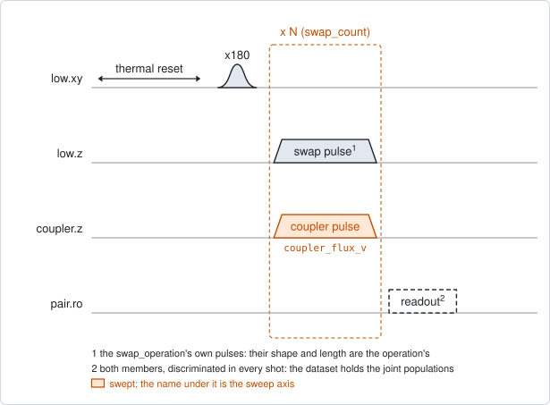
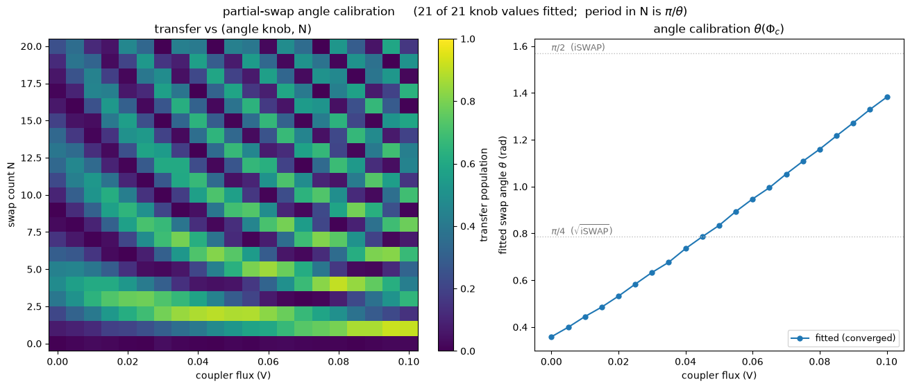

# pair_swap_angle

## Purpose

Measures the exchange angle of a swap operation against the coupler amplitude.
One member of the pair is excited, the swap operation is applied N times in a
row, and both members are read out. At one coupler amplitude the transfer
oscillates with N, and the angle of one swap follows from the period: a full
back-and-forth takes pi / angle swaps. Repeating the scan over the coupler
amplitude gives the calibration curve, angle against coupler amplitude.

The coupler amplitude is the knob that sets the angle. The member's own flux
amplitude sets the resonance and is left at the value stored with the
operation. So run `qc_n_swap_amp` or `pair_swap_chevron` first, for the
resonance, and this experiment after it, for the angle.

With `target_theta_rad` the curve is also solved for the coupler amplitude that
gives that angle.

The fitted angle is the angle of one whole round, not of the exchange alone.
Between two swaps the members pick up a relative phase, and that phase can only
make the fitted angle larger. `compensation_amps` plays an off-resonant tone
after every swap to cancel it. See Traps.

Nothing is written to the device. The result is a record.

```
scqo run pair_swap_angle --targets q1_q2
scqo run pair_swap_angle --targets q1_q2 --set target_theta_rad=0.785
```

## Before running it

<!-- BEGIN generated: requires -->
GENERATED from `PairSwapAngle.requires` and its Parameters mixins - edit
the declaration, then run `python scripts/update_docs.py`.

The target is a `qubit_pair`.

These device values must already be right:

| value | held by | used for | provided by |
|---|---|---|---|
| `drive_freq_hz` | drive channel | the x180 on the excited member has to be on resonance | `qubit_ramsey`, `qubit_ramsey_flux_pulse`, `qubit_ramsey_phasor`, `qubit_spectroscopy` |
| `pi_amp` | drive channel | the x180 on the excited member has to be a full pi pulse | `qubit_deterministic_benchmarking`, `qubit_pi_pulse_error`, `qubit_power_rabi` |
| `idle_flux` | flux line | the standing bias of the member's flux line and of the coupler's: every flux amplitude here is a pulse on top of it | `pair_zz_coupler`, `qubit_ramsey_flux_pulse`, `qubit_spectroscopy_flux_pulse`, `resonator_spectroscopy_flux` |
| `readout_freq_hz` | readout channel | each member's readout tone has to sit on its resonator | `readout_frequency`, `resonator_spectroscopy`, `resonator_spectroscopy_flux`, `resonator_spectroscopy_power_amp`, `resonator_spectroscopy_power_chain` |
| `readout_power_dbm` | readout channel | each member's readout has to be at its working power | `resonator_spectroscopy_power_amp`, `resonator_spectroscopy_power_chain` |
| `readout_rotation_rad` | readout channel | both members are discriminated in every shot: the axis each is projected on | no shared experiment; set it by hand (`scqo set`) or by a backend's own writeback |
| `readout_threshold` | readout channel | both members are discriminated in every shot: what splits \|0> from \|1> on that axis | no shared experiment; set it by hand (`scqo set`) or by a backend's own writeback |
| `thermalization_time_s` | drive channel | how long the thermal reset waits (a per-run thermalization_time_ns replaces it) (with the default `reset_method=thermal`) | `qubit_relaxation` |

Needed only with a non-default setting:

| setting | value | held by | used for | provided by |
|---|---|---|---|---|
| `reset_method=active` | `readout_depletion_s` | readout channel | the settle between the reset measurement and the first pulse | `resonator_spectroscopy` |

A backend may need more than this - a knob only it consumes. `scqo run pair_swap_angle --help` lists those where that driver is installed.
<!-- END generated: requires -->

The target is a pair. The values in the table belong to its members and to its
flux lines, not to the pair.

The operation named by `swap_operation` has to exist on the pair, with a member
pulse at its resonance amplitude and a coupler pulse whose stored amplitude is
not zero. These two amplitudes are not in the table: they are stored with the
operation, in the backend's own configuration.

With `compensation_amps`, each named member also needs the operation named by
`stark_operation` on its drive line.

The run is refused before any instrument time when the pair has no coupler, the
coupler has no flux line, neither member has one, or `compensation_amps` names
a qubit that is not a member of the pair.

## Pulse sequence



Both members are reset. The member named by `drive_side` plays an `x180`. Then
the swap is applied `swap_count` times. One swap is the operation's own two
pulses, played together: the member's pulse at its stored amplitude, and the
coupler's pulse at the swept amplitude `coupler_flux_v`. Both members are read
out together.

`swap_count` 0 plays no swap: it is the baseline after the `x180` alone.

Two optional steps follow every swap, inside the repetition:

- with `operation_gap_ns` above 0, a wait of that length on the pair's flux
  lines;
- with `compensation_amps`, the tone of `stark_operation` on each named member,
  `stark_detuning_hz` away from that member's drive frequency. Its amplitude is
  the stored amplitude of that operation times the given factor.

The coupler amplitude is a pulse amplitude in volts, on top of the coupler's
standing bias.

## Theory

*To be written.*

## Outputs

<!-- BEGIN generated: outputs -->
GENERATED from `PairSwapAngle.writes` and `.extracts` - edit the
declaration, then run `python scripts/update_docs.py`.

Record-only: `update()` proposes nothing.

Reported in `result.fit` and never written:

| fit key | meaning |
|---|---|
| `best_transfer` | the largest population found on the member that was not excited, over the whole map |
| `best_coupler_flux_v` | the coupler amplitude that delivers target_theta_rad on the fitted curve; NaN without a target or when the curve does not reach it |
| `best_swap_count` | the number of swaps at that point |
| `p_high_min` | the smallest excited population of the high member over the map |
| `p_high_max` | the largest excited population of the high member over the map |
| `p_low_min` | the smallest excited population of the low member over the map |
| `p_low_max` | the largest excited population of the low member over the map |
| `p_ee_max` | the largest population of both members excited at once; with one excitation in the pair it stays near zero |
| `n_coupler_flux_v` | the number of points along coupler_flux_v |
| `n_swap_count` | the number of points along swap_count |
| `best_theta_rad` | the angle at that amplitude |
| `best_is_interpolated` | 1 when that amplitude lies between two measured points, 0 when it is one of them |
| `theta_min_rad` | the smallest fitted angle over the coupler axis |
| `theta_max_rad` | the largest fitted angle over the coupler axis |
| `n_theta_ok` | the number of coupler amplitudes whose oscillation was fitted; 0 fails the run |
| `target_theta_rad` | the angle that was asked for; NaN when none was |
<!-- END generated: outputs -->

With `readout_mode=average` the dataset holds `joint_population` over the
states `00`, `01`, `10`, `11`, high member first. With `readout_mode=shot` it
holds `state`: the level of each member in every shot. Both give the same
angles.

The angle of every coupler amplitude is in the estimator's metadata file in the
run folder. `result.fit` holds the range of the curve and the answer for
`target_theta_rad`.

A run is `SUCCESSFUL` when both of these hold:

- `best_transfer` is at least `min_transfer`. A swap that exchanges at all
  reaches a large transfer at some N, whatever its angle;
- at least one coupler amplitude gave a fitted angle (`n_theta_ok` above 0).

## Expected result



Left, the transfer against the coupler amplitude and the swap count. Right, the
fitted angle against the coupler amplitude, with a full swap (pi/2) and half of
one (pi/4) marked. Check that:

- every column of the left panel oscillates with N, and the oscillation gets
  faster as the angle grows;
- the curve on the right is smooth. A jump means that the fit of one column
  failed or took a wrong period;
- the title counts the coupler amplitudes that were fitted.

A second figure in the run folder shows the four joint populations.

The figure is from a simulated pair whose angle rises from 0.36 to 1.38 rad
over the default window. The simulation includes the phase between swaps.

## Traps

- **The fitted angle is an upper bound.** One round is an exchange followed by
  a relative phase. With a phase phi per round and an exchange angle theta, the
  fitted angle theta_eff obeys cos(theta_eff) = cos(phi/2) cos(theta). It is
  never smaller than theta. On a real chip, changing only `operation_gap_ns`
  from 0 to 20 moved the fitted angle from 0.99 to 1.56 rad at a coupler
  amplitude of zero, where the swap itself cannot have changed.
- **Cancel the phase, then take the smallest angle.** Scan `compensation_amps`
  across runs. The smallest fitted angle is the exchange angle. Decay does not
  move it, because decay changes the size of the oscillation and not its
  period. `qc_n_stark_amp` finds the same tone amplitude in one map.
- **One compensation does not hold over the whole sweep.** The phase depends on
  the coupler amplitude. A tone that cancels it at one amplitude leaves a rest
  at the others.
- **`{}` and a factor of 0 are different runs.** A member left out of
  `compensation_amps` plays no tone. A member with factor 0 plays a tone of
  zero amplitude, which keeps the round as long as a compensated one. Use the
  factor 0 as the baseline of a scan.
- **The count axis has to span a period.** The default counts 0 to 20 resolve
  angles down to about 0.3 rad. A smaller angle needs more counts. The largest
  angle the integer count can follow is a full swap, pi/2.
- **A coupler pulse stored at zero cannot be swept.** The swept volts are
  divided by the stored amplitude of the operation's coupler pulse. The run is
  refused by name in that state.
- **A member whose readout has drifted** passes as a result (`BACKLOG.md` I21).

## References

- `TUTORIAL.md` section 12, and `procedures/pair-partial-swap/PROCEDURE.md`,
  which calibrates a partial swap with `qc_n_swap_tomography` and
  `qc_n_stark_amp`.
- Related experiments: `qc_n_swap_amp` (the resonance knob, the same sequence
  with the member's amplitude swept), `qc_n_stark_amp` (the compensating tone),
  `qc_n_swap_tomography` (the angle and the phase per round from tomography),
  `pair_swap_chevron` (the swap time of a single pulse, free of the phase).
- Code: `scqo/experiments/pair_swap_angle.py`,
  `scqat/estimators/pair_swap_angle/`.
