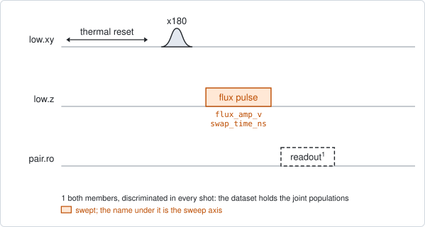
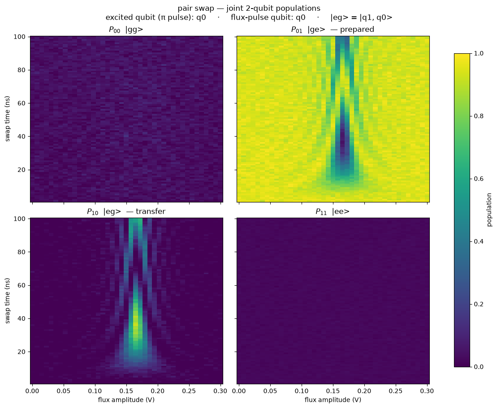

# pair_swap_chevron

## Purpose

Finds where two coupled qubits exchange an excitation, and how long a full
exchange takes. One member of the pair is excited. A flux pulse on one member's
line then moves that member in frequency, and both members are read out. Where
the pulse brings the two members to the same frequency, the excitation moves
back and forth between them. Sweeping the pulse amplitude against its duration
draws an arch: the amplitude at its centre is the resonance, and the time of the
first maximum is a full swap.

This is the first step of bringing up a swap, before any two-qubit operation is
defined. It needs none.

On a pair with a tunable coupler, `coupler_flux_v` also plays the coupler pulse
of a named operation at one fixed amplitude for the same window. The arch then
gives the resonance and the swap time that hold at that coupler setting. A
single pulse has no idle between swaps, so these two numbers are free of the
phase that the repeated-swap experiments (`qc_n_swap_amp`, `pair_swap_angle`)
pick up between swaps.

Nothing is written to the device. The result is a record.

```
scqo run pair_swap_chevron --targets q1_q2
scqo run pair_swap_chevron --targets q1_q2 --set coupler_flux_v=0.05 --set min_swap_time_ns=16 --set num_time_points=22
```

## Before running it

<!-- BEGIN generated: requires -->
GENERATED from `PairSwapChevron.requires` and its Parameters mixins - edit
the declaration, then run `python scripts/update_docs.py`.

The target is a `qubit_pair`.

These device values must already be right:

| value | held by | used for | provided by |
|---|---|---|---|
| `drive_freq_hz` | drive channel | the x180 on the excited member has to be on resonance | `qubit_ramsey`, `qubit_ramsey_flux_pulse`, `qubit_ramsey_phasor`, `qubit_spectroscopy` |
| `pi_amp` | drive channel | the x180 on the excited member has to be a full pi pulse | `qubit_deterministic_benchmarking`, `qubit_pi_pulse_error`, `qubit_power_rabi` |
| `idle_flux` | flux line | the standing bias of the member's flux line and of the coupler's: every flux amplitude here is a pulse on top of it | `pair_zz_coupler`, `qubit_ramsey_flux_pulse`, `qubit_spectroscopy_flux_pulse`, `resonator_spectroscopy_flux` |
| `readout_freq_hz` | readout channel | each member's readout tone has to sit on its resonator | `readout_frequency`, `resonator_spectroscopy`, `resonator_spectroscopy_flux`, `resonator_spectroscopy_power_amp`, `resonator_spectroscopy_power_chain` |
| `readout_power_dbm` | readout channel | each member's readout has to be at its working power | `resonator_spectroscopy_power_amp`, `resonator_spectroscopy_power_chain` |
| `readout_rotation_rad` | readout channel | both members are discriminated in every shot: the axis each is projected on | no shared experiment; set it by hand (`scqo set`) or by a backend's own writeback |
| `readout_threshold` | readout channel | both members are discriminated in every shot: what splits \|0> from \|1> on that axis | no shared experiment; set it by hand (`scqo set`) or by a backend's own writeback |
| `thermalization_time_s` | drive channel | how long the thermal reset waits (a per-run thermalization_time_ns replaces it) (with the default `reset_method=thermal`) | `qubit_relaxation` |

Needed only with a non-default setting:

| setting | value | held by | used for | provided by |
|---|---|---|---|---|
| `reset_method=active` | `readout_depletion_s` | readout channel | the settle between the reset measurement and the first pulse | `resonator_spectroscopy` |

A backend may need more than this - a knob only it consumes. `scqo run pair_swap_chevron --help` lists those where that driver is installed.
<!-- END generated: requires -->

The target is a pair. The values in the table belong to its members and to its
flux lines, not to the pair: the drive and readout values to each member's
channels, `idle_flux` to each flux line.

No operation has to exist on the pair, unless `coupler_flux_v` is set. Then the
operation named by `swap_operation` has to exist and carry a coupler pulse.

The run is refused before any instrument time when neither member has a flux
line, and, with `coupler_flux_v` set, when the pair has no coupler or the
coupler has no flux line.

## Pulse sequence



Both members are reset. The member named by `drive_side` plays an `x180`. The
flux line of the member named by `flux_side` then plays one square pulse of
amplitude `flux_amp_v` and length `swap_time_ns`. Both members are read out
together.

The amplitude is the pulse's own, in volts. The standing bias of the line stays
underneath it.

By default the duration axis has 1 ns steps from 1 ns up, and the coupler is not
addressed at all.

With `coupler_flux_v` set, the coupler line plays the coupler pulse of
`swap_operation` at that amplitude, starting together with the member's pulse
and lasting as long. The duration axis then starts at 16 ns and has 4 ns steps,
so `num_time_points` has to fit that grid.

## Theory

*To be written.*

## Outputs

<!-- BEGIN generated: outputs -->
GENERATED from `PairSwapChevron.writes` and `.extracts` - edit the
declaration, then run `python scripts/update_docs.py`.

Record-only: `update()` proposes nothing.

Reported in `result.fit` and never written:

| fit key | meaning |
|---|---|
| `best_transfer` | the largest population found on the member that was not excited, over the whole map |
| `best_flux_amp_v` | the flux-pulse amplitude at that point |
| `best_swap_time_ns` | the pulse duration at that point |
| `p_high_min` | the smallest excited population of the high member over the map |
| `p_high_max` | the largest excited population of the high member over the map |
| `p_low_min` | the smallest excited population of the low member over the map |
| `p_low_max` | the largest excited population of the low member over the map |
| `p_ee_max` | the largest population of both members excited at once; with one excitation in the pair it stays near zero |
| `n_flux_amp_v` | the number of points along flux_amp_v |
| `n_swap_time_ns` | the number of points along swap_time_ns |
| `coupler_flux_v` | the coupler amplitude the map was taken at; None when the coupler was left alone |
<!-- END generated: outputs -->

The dataset holds the joint populations of the pair: `joint_population` over
the states `00`, `01`, `10`, `11`. The first digit is the high member, the
second the low member.

The transfer is the excited population of the member that was not excited.
`best_transfer` is its largest value over the map, and `best_flux_amp_v` and
`best_swap_time_ns` are the coordinates of that one point. Nothing is fitted.

A run is `SUCCESSFUL` when `best_transfer` is at least `min_transfer` (0.3 by
default). A failed run means no swap was found anywhere in the window.

## Expected result



The four joint populations over the map. The title names the excited member and
the member that carries the flux pulse, and says which digit is which member.
The panel marked *prepared* is the state after the `x180`, and the panel marked
*transfer* is the state after a full swap. Check that:

- the transfer panel shows a column of bright spots at one amplitude, which
  repeat along the time axis. That amplitude is the resonance, and the first
  spot is a full swap;
- away from that amplitude the spots get weaker and come faster. This is the
  arch;
- the prepared panel shows the same pattern inverted;
- the panel for both members excited stays dark. Population there comes from a
  thermal excitation or from readout errors;
- the panel for no member excited stays dark at short times. It brightens with
  time as the excitation decays.

The figure is from a simulated pair, with a full swap at 37 ns.

## Traps

- **The best point is one pixel, not a fit.** `best_swap_time_ns` moves by a
  step with noise. With the coupler engaged the step is 4 ns.
- **An arch narrower than the amplitude step is missed.** The arch is narrow in
  amplitude when the coupling is weak or the qubit moves fast with flux. A
  coarse amplitude axis can step over it, and the run then reports that there is
  no swap. Narrow the window until the arch is several points wide.
- **`swap_operation` does nothing without `coupler_flux_v`.** With
  `coupler_flux_v` unset the coupler stays at its standing bias and the named
  operation is never read. Changing that operation's coupler amplitude cannot
  move such a run.
- **A standing bias that does not decouple.** A run that plays no coupler pulse
  leaves the coupler where it idles. When that point is not a decouple point,
  the members swap as soon as they are on resonance, with or without a gate.
  This was seen on a real chip (`BACKLOG.md`, the `decouple_offset` entry).
- **A coupler amplitude is a pulse amplitude.** `coupler_flux_v` is added to the
  coupler's standing bias. It is not the voltage of the line.
- **A member whose readout has drifted.** When a member's threshold lies outside
  both of its clouds, that member reads 0 or 1 in every pixel. The map then has
  no arch, or the run still passes on the other member's errors (`BACKLOG.md`
  I21). Check `single_shot_readout` on both members first.

## References

- `TUTORIAL.md` section 12, the worked partial-swap workflow.
- Related experiments: `pair_swap_flux_map` (the same exchange at a fixed
  duration, against the coupler amplitude), `pair_swap_angle` (the angle of a
  registered swap, from repeated swaps), `qc_n_swap_amp` (the resonance, from
  repeated swaps), `single_shot_readout` (the discriminators).
- Code: `scqo/experiments/pair_swap_chevron.py`,
  `scqat/estimators/pair_swap_chevron/`.
