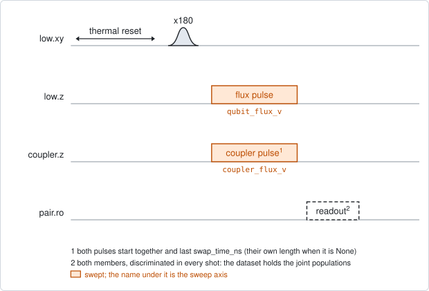
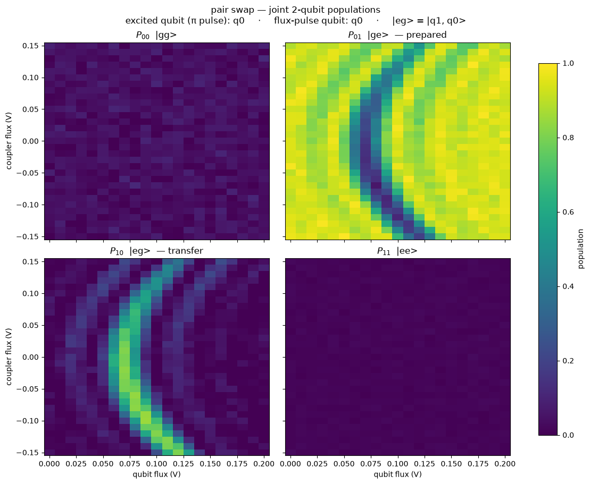

# pair_swap_flux_map

## Purpose

Shows how the coupler changes the exchange between two qubits. One member of
the pair is excited. Two flux pulses of one fixed duration then play together:
one on the coupler and one on a member. Both amplitudes are swept, and both
members are read out.

Each coupler amplitude is one column of the map. Along a column the member's
pulse moves the two qubits through resonance, so the transfer has one peak.
The position of the peak is the resonance at that coupler amplitude. Its height
says how far the exchange went in the fixed duration, which is the exchange
angle. The estimator fits the peak of every column and gives two curves against
the coupler amplitude: the coupling strength and the resonance position. The
first curve also locates the coupler amplitude where the coupling is weakest.

Use it after `pair_swap_chevron` has found a swap, to choose the coupler
amplitude of a swap operation. Nothing is written to the device.

```
scqo run pair_swap_flux_map --targets q1_q2 --set swap_time_ns=40
```

## Before running it

<!-- BEGIN generated: requires -->
GENERATED from `PairSwapFluxMap.requires` and its Parameters mixins - edit
the declaration, then run `python scripts/update_docs.py`.

The target is a `qubit_pair`.

These device values must already be right:

| value | held by | used for | provided by |
|---|---|---|---|
| `drive_freq_hz` | drive channel | the x180 on the excited member has to be on resonance | `qubit_ramsey`, `qubit_ramsey_flux_pulse`, `qubit_ramsey_phasor`, `qubit_spectroscopy` |
| `pi_amp` | drive channel | the x180 on the excited member has to be a full pi pulse | `qubit_deterministic_benchmarking`, `qubit_pi_pulse_error`, `qubit_power_rabi` |
| `idle_flux` | flux line | the standing bias of the member's flux line and of the coupler's: every flux amplitude here is a pulse on top of it | `pair_zz_coupler`, `qubit_ramsey_flux_pulse`, `qubit_spectroscopy_flux_pulse`, `resonator_spectroscopy_flux` |
| `readout_freq_hz` | readout channel | each member's readout tone has to sit on its resonator | `readout_frequency`, `resonator_spectroscopy`, `resonator_spectroscopy_flux`, `resonator_spectroscopy_power_amp`, `resonator_spectroscopy_power_chain` |
| `readout_power_dbm` | readout channel | each member's readout has to be at its working power | `resonator_spectroscopy_power_amp`, `resonator_spectroscopy_power_chain` |
| `readout_rotation_rad` | readout channel | both members are discriminated in every shot: the axis each is projected on | no shared experiment; set it by hand (`scqo set`) or by a backend's own writeback |
| `readout_threshold` | readout channel | both members are discriminated in every shot: what splits \|0> from \|1> on that axis | no shared experiment; set it by hand (`scqo set`) or by a backend's own writeback |
| `thermalization_time_s` | drive channel | how long the thermal reset waits (a per-run thermalization_time_ns replaces it) (with the default `reset_method=thermal`) | `qubit_relaxation` |

Needed only with a non-default setting:

| setting | value | held by | used for | provided by |
|---|---|---|---|---|
| `reset_method=active` | `readout_depletion_s` | readout channel | the settle between the reset measurement and the first pulse | `resonator_spectroscopy` |

A backend may need more than this - a knob only it consumes. `scqo run pair_swap_flux_map --help` lists those where that driver is installed.
<!-- END generated: requires -->

The target is a pair. The values in the table belong to its members and to its
flux lines, not to the pair.

The run is refused before any instrument time when the pair has no coupler, the
coupler has no flux line, or neither member has one.

## Pulse sequence



Both members are reset. The member named by `drive_side` plays an `x180`. Then
the flux line of the member named by `flux_side` and the coupler line play one
pulse each, starting together: amplitude `qubit_flux_v` on the member and
`coupler_flux_v` on the coupler. Both members are read out together.

Both amplitudes are pulse amplitudes in volts, on top of each line's standing
bias.

With `flux_pulse_shape=square` both pulses last `swap_time_ns`. With
`swap_time_ns` left unset, each pulse plays the length stored with it. A shaped
pulse (`flattop_cosine`) only plays its stored length, and setting
`swap_time_ns` with it is refused.

## Theory

*To be written.*

## Outputs

<!-- BEGIN generated: outputs -->
GENERATED from `PairSwapFluxMap.writes` and `.extracts` - edit the
declaration, then run `python scripts/update_docs.py`.

Record-only: `update()` proposes nothing.

Reported in `result.fit` and never written:

| fit key | meaning |
|---|---|
| `best_transfer` | the largest population found on the member that was not excited, over the whole map |
| `best_qubit_flux_v` | the member's flux-pulse amplitude at that point |
| `best_coupler_flux_v` | the coupler's flux-pulse amplitude at that point |
| `p_high_min` | the smallest excited population of the high member over the map |
| `p_high_max` | the largest excited population of the high member over the map |
| `p_low_min` | the smallest excited population of the low member over the map |
| `p_low_max` | the largest excited population of the low member over the map |
| `p_ee_max` | the largest population of both members excited at once; with one excitation in the pair it stays near zero |
| `n_qubit_flux_v` | the number of points along qubit_flux_v |
| `n_coupler_flux_v` | the number of points along coupler_flux_v |
| `swap_time_ns` | the pulse duration the instrument played; None when each pulse played its own length |
| `coupler_off_v` | the coupler amplitude where the fitted coupling is smallest: the decouple point of this map |
| `j_at_off_hz` | the fitted coupling at that point |
| `off_is_interpolated` | 1 when the polynomial through the coupling curve located that point, 0 when it is the smallest measured column |
| `j_max_hz` | the strongest coupling among the columns that are not flagged as folded |
| `j_max_coupler_flux_v` | the coupler amplitude of that column |
| `theta_max_rad` | the exchange angle of that column, 2 pi J times the duration |
| `n_j_ok` | the number of coupler columns whose swap peak was fitted |
| `n_branch_warn` | how many of those may lie past a full swap, where the angle is under-reported; they are left out of the polynomial |
| `n_poly_rows` | the number of columns the polynomial was fitted through |
<!-- END generated: outputs -->

`best_transfer` and its two coordinates are the one point of the map with the
largest transfer, as in `pair_swap_chevron`. A run is `SUCCESSFUL` when
`best_transfer` is at least `min_transfer`.

The coupling keys come from the fit of each column. The coupling in Hz needs
the duration that was played. When `swap_time_ns` is unset, the coupling keys
in Hz and the decouple point are NaN, and only the angle and the counts are
reported.

The two curves themselves are not in `result.fit`. They are in the estimator's
metadata file in the run folder, as values per coupler amplitude and as
polynomial coefficients with the window they hold in.

The fitted coupling is not proposed as the pair's `j_hz`. It holds at the
pulsed working point, not at the standing bias that field describes.

## Expected result



The four joint populations over the map, drawn as in `pair_swap_chevron`. The
horizontal axis is the member's amplitude and the vertical axis is the
coupler's. Check that:

- the transfer panel shows one bright band. At each coupler amplitude it sits
  at the member amplitude that puts the pair on resonance, so the band bends as
  the coupler moves the resonance;
- the brightness of the band changes along it. It is brightest where the fixed
  duration is closest to a full swap, and it fades toward the coupler amplitude
  that decouples the pair;
- weaker bands run beside the main one. They are the side lobes of a pulse of
  fixed length;
- the panel for both members excited stays dark.

Two more figures are in the run folder. One draws the coupling, the resonance
position and the peak height against the coupler amplitude, with the columns
that may be past a full swap marked. The other draws the fit of every column.

The figure is from a simulated pair at the default settings. The simulated
coupling is close to a full swap over most of the coupler axis, so most of its
columns are marked.

## Traps

- **Past a full swap the angle is under-reported.** The peak height rises to 1
  at a full swap and comes back down beyond it. A column beyond it looks like a
  weaker one. The estimator marks every column from the first near-full swap
  onward (`n_branch_warn`) and leaves them out of the polynomial. It does not
  correct them. Run again with a shorter `swap_time_ns`, so that the whole
  coupler axis stays below a full swap.
- **The width of a peak is not a coupling.** At a fixed duration the width is
  set by the duration. Only the height carries the coupling.
- **A coupler amplitude is half of a setting.** The resonance moves with the
  coupler amplitude. A swap operation needs the member amplitude from the
  resonance curve at the coupler amplitude it uses.
- **Every reachable angle has two coupler amplitudes.** The coupling has a
  minimum, so one amplitude on each side of it gives the same angle.
- **The curves hold inside their window only.** The polynomial is fitted
  through the columns that passed. Outside them it is not a measurement.
- **An edge is not an optimum.** `best_coupler_flux_v` is the pixel with the
  largest transfer. At the first or last coupler value it only says that the
  window ends there.
- **Coupler amplitudes are pulse amplitudes.** The column at 0 V is the
  coupler's standing bias, whatever that bias is.
- **A member whose readout has drifted** passes as a result (`BACKLOG.md` I21).

## References

- `TUTORIAL.md` section 12, and `procedures/pair-partial-swap/PROCEDURE.md`,
  whose first step reads this map.
- Related experiments: `pair_swap_chevron` (amplitude against duration, the
  step before this one), `pair_swap_angle` and `qc_n_swap_tomography` (the angle
  of the registered operation), `pair_zz_coupler` (the decouple point from the
  residual ZZ).
- Code: `scqo/experiments/pair_swap_flux_map.py`,
  `scqat/estimators/pair_swap_flux_map/`, `scqat/tools/swap_lineshape.py`.
