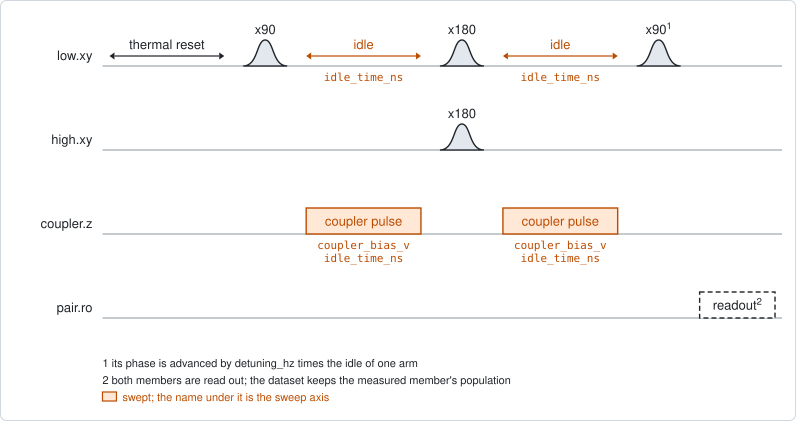
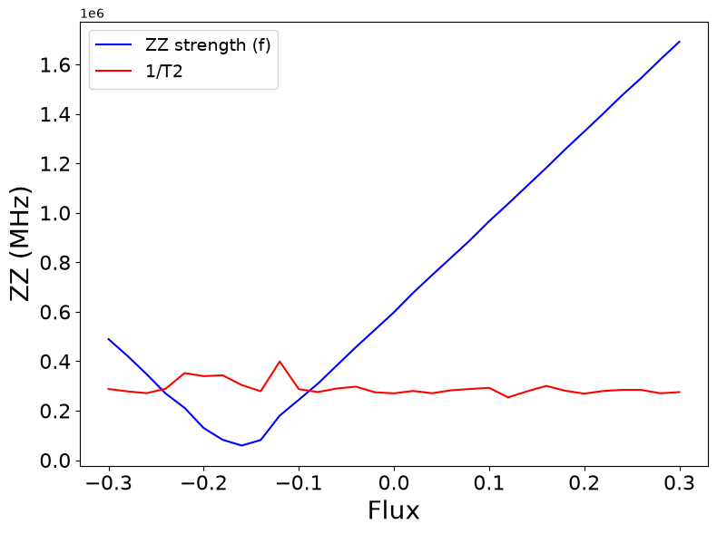

# pair_zz_coupler

## Purpose

Finds the coupler bias at which two qubits stop shifting each other. With a
residual ZZ interaction, the frequency of one member depends on the state of
the other. The experiment measures that shift with an echo on one member, at a
range of coupler biases, and looks for the bias where the shift changes sign.
That bias is the decouple point of the pair.

It proposes the decouple point as the `idle_flux` of the coupler's flux line,
and the residual ZZ at that point as the fact `zz_hz` of the pair.

```
scqo run pair_zz_coupler --targets q1_q2
scqo run pair_zz_coupler --targets q1_q2 --set min_coupler_v=-0.1 --set max_coupler_v=0.1 --set measure=high
```

## Before running it

<!-- BEGIN generated: requires -->
GENERATED from `PairZZCoupler.requires` and its Parameters mixins - edit
the declaration, then run `python scripts/update_docs.py`.

The target is a `qubit_pair`.

These device values must already be right:

| value | held by | used for | provided by |
|---|---|---|---|
| `drive_freq_hz` | drive channel | the echo pulses on the measured member, and the x180 on its partner, have to be on resonance | `qubit_ramsey`, `qubit_ramsey_flux_pulse`, `qubit_ramsey_phasor`, `qubit_spectroscopy` |
| `pi_amp` | drive channel | the x180 that both members play at the middle of the echo has to be a full pi pulse | `qubit_deterministic_benchmarking`, `qubit_pi_pulse_error`, `qubit_power_rabi` |
| `idle_flux` | flux line | the members stay at their standing bias, where their pulses and readout are calibrated; the coupler's is what the run proposes | `pair_zz_coupler`, `qubit_ramsey_flux_pulse`, `qubit_spectroscopy_flux_pulse`, `resonator_spectroscopy_flux` |
| `readout_freq_hz` | readout channel | each member's readout tone has to sit on its resonator | `readout_frequency`, `resonator_spectroscopy`, `resonator_spectroscopy_flux`, `resonator_spectroscopy_power_amp`, `resonator_spectroscopy_power_chain` |
| `readout_power_dbm` | readout channel | each member's readout has to be at its working power | `resonator_spectroscopy_power_amp`, `resonator_spectroscopy_power_chain` |
| `readout_rotation_rad` | readout channel | both members are discriminated in every shot: the axis each is projected on | no shared experiment; set it by hand (`scqo set`) or by a backend's own writeback |
| `readout_threshold` | readout channel | both members are discriminated in every shot: what splits \|0> from \|1> on that axis | no shared experiment; set it by hand (`scqo set`) or by a backend's own writeback |
| `thermalization_time_s` | drive channel | how long the thermal reset waits (a per-run thermalization_time_ns replaces it) (with the default `reset_method=thermal`) | `qubit_relaxation` |

Needed only with a non-default setting:

| setting | value | held by | used for | provided by |
|---|---|---|---|---|
| `reset_method=active` | `readout_depletion_s` | readout channel | the settle between the reset measurement and the first pulse | `resonator_spectroscopy` |

A backend may need more than this - a knob only it consumes. `scqo run pair_zz_coupler --help` lists those where that driver is installed.
<!-- END generated: requires -->

The target is a pair. The values in the table belong to its members and to its
flux lines, not to the pair.

The run is refused before any instrument time when the pair has no coupler, or
the coupler has no flux line.

## Pulse sequence



Both members are reset. The member named by `measure` plays an echo: `x90`, an
idle, `x180`, a second idle of the same length, `x90`. Its partner plays an
`x180` together with the echo's `x180`. During each idle the coupler line plays
a square pulse of amplitude `coupler_bias_v`. Both members are read out, and
the dataset keeps the excited population of the measured member as `signal`.

The echo removes every shift of the measured member that stays the same in both
idles. The partner is in its ground state during the first idle and excited
during the second, so the part of the frequency that depends on the partner
does not cancel. It is the ZZ.

`idle_time_ns` is the length of one idle. The phase of the last `x90` advances
by `detuning_hz` times that length, so the fringe along the time axis has the
frequency `detuning_hz` plus the ZZ. The detuning makes the sign of the ZZ
readable: a fringe faster than `detuning_hz` is a positive ZZ, and a slower one
a negative ZZ.

The time axis starts at 16 ns.

## Theory

*To be written.*

## Outputs

<!-- BEGIN generated: outputs -->
GENERATED from `PairZZCoupler.writes` and `.extracts` - edit the
declaration, then run `python scripts/update_docs.py`.

Proposed by `update()`; each stays pending until it is accepted:

| field | held by | role | unit | meaning |
|---|---|---|---|---|
| `zz_hz` | qubit_pair | fact | Hz | Signed residual ZZ at the standing idle point. |
| `idle_flux` | flux line | knob | source-native | Standing bias set-point of this line in the flux source's native unit (volts for an AWG line, amperes for a coil). A coupler's decouple point IS this knob on its own flux line. It is also the ORIGIN a '_pulse' flux experiment's swept window is measured from (its probe plays on top of this bias). |

Reported in `result.fit` and never written:

| fit key | meaning |
|---|---|
| `coupler_zero_v` | the coupler bias where the fitted ZZ changes sign, interpolated between the two points around it |
| `zz_min_hz` | the smallest fitted ZZ over the bias axis |
| `zz_max_hz` | the largest fitted ZZ over the bias axis |
| `n_flux` | the number of bias points |
| `old_coupler_idle_flux` | the coupler's idle_flux before the run |
<!-- END generated: outputs -->

The estimator fits a decaying fringe at every coupler bias. The ZZ at that bias
is the fitted frequency minus `detuning_hz`.

`coupler_zero_v` is the first place along the bias axis where that ZZ changes
sign, interpolated between the two points around it. `zz_hz` is the ZZ at the
interpolated point, which is close to zero by construction.

A run is `SUCCESSFUL` when the ZZ changes sign inside the window. Without a sign
change the run fails, nothing is proposed, and `result.fit` reports
`closest_bias_v` instead of `coupler_zero_v`: the bias with the smallest ZZ in
size, and the ZZ there as `zz_hz`.

## Expected result



The fitted fringe frequency (blue) and the fitted decay rate (red) against the
coupler bias. The figure draws the fringe frequency itself, in Hz, although its
axis is labelled as the ZZ. Read it like this:

- the ZZ is the distance of the blue curve from `detuning_hz`, 1 MHz by
  default;
- the decouple point is where the blue curve crosses `detuning_hz`. In the
  figure that is at about +0.11 V;
- the minimum of the blue curve is not the decouple point. There the fringe
  frequency is zero, which means a ZZ of minus `detuning_hz`;
- the red curve should be smooth. A jump in it marks a bias whose fit is not to
  be trusted.

A second figure in the run folder draws the measured fringes as a map over bias
and time.

## Traps

- **The proposed `idle_flux` is a pulse amplitude.** The coupler bias is played
  as a pulse on top of the coupler's standing bias, but the zero crossing is
  proposed as the new standing bias as it is. The proposal is off by the
  standing bias the run was taken at. It is right only when that bias was 0 V
  (`BACKLOG.md` I26). Otherwise reject it and set `old_coupler_idle_flux` plus
  `coupler_zero_v` by hand.
- **A ZZ below minus `detuning_hz` folds.** The fitted frequency is never
  negative. Where the true ZZ is below minus `detuning_hz`, the reported ZZ
  turns back up, and where it reaches minus twice `detuning_hz` it crosses zero
  again. A window that reaches that far on its low-bias side reports the false
  crossing, as a `SUCCESSFUL` run (`BACKLOG.md` I41). Raise `detuning_hz` above
  the largest ZZ in the window, or narrow the window.
- **The fringe has to fit in the window.** Near the decouple point the fringe
  frequency is `detuning_hz`, so `max_idle_time_ns` should hold a few periods
  of it, and the time step has to resolve the fastest fringe in the window.
- **The first sign change wins.** With more than one crossing in the window,
  only the one at the lowest bias is reported.
- **A member whose readout has drifted** gives a flat signal or a wrong fringe
  size. Check `single_shot_readout` on the measured member first.

## References

- Related experiments: `pair_swap_flux_map` (the decouple point from the
  exchange instead of the ZZ), `pair_coupler_crossing_pulse` (where the coupler
  crosses the members), `qubit_echo` (the echo on one qubit).
- Code: `scqo/experiments/pair_zz_coupler.py`,
  `scqat/estimators/zz_interaction/`.
