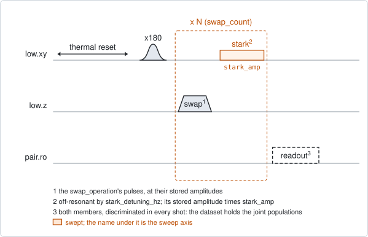
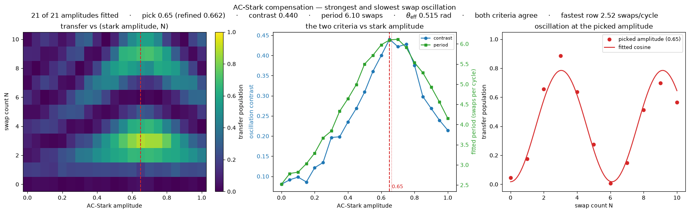

# qc_n_stark_amp

## Purpose

Finds the tone that cancels the phase two qubits pick up between swaps, and
reads the angle of one swap. A repeated swap is an exchange followed by a
relative phase, every round. The phase makes the excitation move faster between
the members than the exchange alone would, and with less contrast.

After every swap, an off-resonant tone on the excited member shifts its
frequency for a moment. This adds a phase that grows with the tone's amplitude.
The experiment sweeps that amplitude against the number of swaps. At the
amplitude that cancels the phase, the oscillation along the swap count is the
strongest and the slowest. That amplitude is the compensation, and the period
there gives the angle of one swap: pi divided by the period.

It proposes that angle as the monitor `theta_rad` of the swap operation.
Nothing is pushed to the instrument.

```
scqo run qc_n_stark_amp --targets q1_q2 --set swap_operation=partial_swap --set operation_gap_ns=260
scqo run qc_n_stark_amp --targets q1_q2 --set swap_operation=partial_swap --set swap_counts=[0,1,2,3,4,5,6,7,8,9,10,11,12,13,14,15,16]
```

## Before running it

<!-- BEGIN generated: requires -->
GENERATED from `QcNStarkAmp.requires` and its Parameters mixins - edit
the declaration, then run `python scripts/update_docs.py`.

The target is a `qubit_pair`.

These device values must already be right:

| value | held by | used for | provided by |
|---|---|---|---|
| `drive_freq_hz` | drive channel | the x180 on the excited member has to be on resonance | `qubit_ramsey`, `qubit_ramsey_flux_pulse`, `qubit_ramsey_phasor`, `qubit_spectroscopy` |
| `pi_amp` | drive channel | the x180 on the excited member has to be a full pi pulse | `qubit_deterministic_benchmarking`, `qubit_pi_pulse_error`, `qubit_power_rabi` |
| `idle_flux` | flux line | the standing bias of the member's flux line and of the coupler's: every flux amplitude here is a pulse on top of it | `pair_zz_coupler`, `qubit_ramsey_flux_pulse`, `qubit_spectroscopy_flux_pulse`, `resonator_spectroscopy_flux` |
| `readout_freq_hz` | readout channel | each member's readout tone has to sit on its resonator | `readout_frequency`, `resonator_spectroscopy`, `resonator_spectroscopy_flux`, `resonator_spectroscopy_power_amp`, `resonator_spectroscopy_power_chain` |
| `readout_power_dbm` | readout channel | each member's readout has to be at its working power | `resonator_spectroscopy_power_amp`, `resonator_spectroscopy_power_chain` |
| `readout_rotation_rad` | readout channel | both members are discriminated in every shot: the axis each is projected on | no shared experiment; set it by hand (`scqo set`) or by a backend's own writeback |
| `readout_threshold` | readout channel | both members are discriminated in every shot: what splits \|0> from \|1> on that axis | no shared experiment; set it by hand (`scqo set`) or by a backend's own writeback |
| `thermalization_time_s` | drive channel | how long the thermal reset waits (a per-run thermalization_time_ns replaces it) (with the default `reset_method=thermal`) | `qubit_relaxation` |

Needed only with a non-default setting:

| setting | value | held by | used for | provided by |
|---|---|---|---|---|
| `reset_method=active` | `readout_depletion_s` | readout channel | the settle between the reset measurement and the first pulse | `resonator_spectroscopy` |

A backend may need more than this - a knob only it consumes. `scqo run qc_n_stark_amp --help` lists those where that driver is installed.
<!-- END generated: requires -->

The target is a pair. The values in the table belong to its members and to its
flux lines, not to the pair.

Two operations have to exist in the backend's configuration: the swap named by
`swap_operation`, at its calibrated amplitudes, and the tone named by
`stark_operation` on the excited member's drive line. Their amplitudes are
stored with the operations and are not in the table.

The angle can only be kept when the roster declares the swap operation on the
pair. Without that the run prints where to add it and proposes nothing.

The run is refused before any instrument time when neither member has a flux
line.

## Pulse sequence



Both members are reset. The member named by `drive_side` plays an `x180`. Then
one round is played `swap_count` times: the swap operation at its stored
amplitudes, a wait of `operation_gap_ns` when that is above 0, and the stark
tone on the excited member. Both members are read out together.

The tone is `stark_detuning_hz` away from the member's drive frequency, so it
shifts the qubit and does not rotate it. Its amplitude is the stored amplitude
of `stark_operation` times the swept factor `stark_amp`.

The swap and the tone do not overlap. The gap lets the flux pulse settle before
the tone plays.

`swap_count` 0 plays no round: it is the baseline after the `x180` alone.

## Theory

*To be written.*

## Outputs

<!-- BEGIN generated: outputs -->
GENERATED from `QcNStarkAmp.writes` and `.extracts` - edit the
declaration, then run `python scripts/update_docs.py`.

Proposed by `update()`; each stays pending until it is accepted:

| field | held by | role | unit | meaning |
|---|---|---|---|---|
| `theta_rad` | operation | monitor | rad | Per-application exchange angle of a swap-type operation, read off the N-swap oscillation period at the compensating stark amplitude (qc_n_stark_amp). Consulted by the chain analysis for its ideal curves; never pushed. |

Reported in `result.fit` and never written:

| fit key | meaning |
|---|---|
| `best_transfer` | the largest population found on the member that was not excited, over the whole map |
| `best_stark_amp` | the stark amplitude factor at that point |
| `best_swap_count` | the number of swaps at that point |
| `p_high_min` | the smallest excited population of the high member over the map |
| `p_high_max` | the largest excited population of the high member over the map |
| `p_low_min` | the smallest excited population of the low member over the map |
| `p_low_max` | the largest excited population of the low member over the map |
| `p_ee_max` | the largest population of both members excited at once; with one excitation in the pair it stays near zero |
| `n_stark_amp` | the number of points along stark_amp |
| `n_swap_count` | the number of points along swap_count |
| `compensating_stark_amp` | the swept stark amplitude whose oscillation along the swap count is the strongest and the slowest: the compensation point |
| `compensating_stark_amp_refined` | the same point interpolated between the swept amplitudes |
| `compensating_is_refined` | 1 when that interpolation was possible |
| `compensation_score` | the score of the picked amplitude: the geometric mean of its contrast and its period, each as a fraction of the largest in the map |
| `compensating_osc_contrast` | the oscillation contrast at the picked amplitude: half the observed swing of the transfer |
| `compensating_osc_period` | the oscillation period at the picked amplitude, in swaps per cycle |
| `compensating_theta_rad` | the angle of one round at the picked amplitude, pi over that period. Proposed as theta_rad |
| `max_osc_contrast_stark_amp` | the amplitude with the largest contrast |
| `max_osc_contrast` | that contrast |
| `max_osc_period_stark_amp` | the amplitude with the longest period |
| `max_osc_period` | that period |
| `min_osc_period` | the shortest period in the map; at 2 swaps per cycle the reading is at its limit |
| `n_osc_ok` | the number of stark amplitudes whose oscillation was fitted |
| `osc_criteria_agree` | 1 when the two criteria pick the same amplitude or neighbouring ones |
<!-- END generated: outputs -->

At every stark amplitude the estimator measures the oscillation of the transfer
along the swap count: its contrast, taken as half the observed swing, and its
period, from a cosine fit. The two criteria are combined into one pick. The
curves over the amplitude are in the estimator's metadata file in the run
folder.

A run is `SUCCESSFUL` when `best_transfer` is at least `min_transfer`. This
says that the swap exchanges, not that the compensation was read. A map that
transfers without oscillating succeeds with NaN in the compensation keys.

`theta_rad` is proposed only when all of these hold:

- the run succeeded and `compensating_theta_rad` is a number;
- the two criteria agree (`osc_criteria_agree` is 1);
- `min_osc_period` is at least 2;
- the roster declares the swap operation on the pair.

## Expected result



Left, the transfer over the stark amplitude and the swap count, with the picked
amplitude as a dashed line. Middle, the two criteria against the stark
amplitude. Right, the transfer at the picked amplitude with its fitted cosine.
The line under the title gives the pick, its contrast, its period, the angle,
whether the criteria agree, and the fastest row. Check that:

- the two curves in the middle panel peak at the same amplitude;
- the oscillation in the right panel covers at least one full cycle, and the
  cosine follows the points;
- the fastest row is well above 2 swaps per cycle;
- in the left panel the pattern is slowest and strongest along the dashed line,
  and gets faster and weaker away from it.

A second figure in the run folder shows the four joint populations.

The figure is from a simulated pair with a partial swap of about 0.5 rad.

## Traps

- **Use a partial swap.** The reading assumes that no row swaps by more than
  pi/2 per round, which is a period of 2 counts. Beyond it the oscillation is
  under-sampled and reads slower the faster it really is, which turns the
  slowest-period criterion upside down. Nothing in the data shows this. A full
  swap sits exactly on that limit, and the default `swap_operation` is `iswap`:
  name the partial operation. Watch `min_osc_period`.
- **A compensation belongs to one round length.** The phase is collected over
  the whole round: the swap, the gap, the tone and the instrument's own
  overhead. Change any of them and the compensating amplitude moves. Keep the
  gap with the value. The real length of a round is not recorded
  (`BACKLOG.md` F16).
- **Keep the tone below one turn of phase.** A window wider than one turn holds
  two compensation points, and the two criteria can then disagree. A strong
  tone also costs population: on a real chip one qubit lost three to four times
  what its T1 predicts per round under a tone of about 0.9 of a turn
  (`BACKLOG.md` I36). No code checks the window (`BACKLOG.md` F18).
- **The angle has no error bar.** On a real chip it scattered by about
  0.007 rad from run to run (`BACKLOG.md` F15).
- **The angle is the round's.** It equals the exchange angle only at the
  compensating amplitude. Away from it the round's angle is larger.
- **A member whose readout has drifted** passes as a result (`BACKLOG.md` I21).

## References

- `procedures/pair-partial-swap/PROCEDURE.md`, where this map is the
  alternative reading of the angle in step 4.
- Related experiments: `qc_n_swap_tomography` (the angle and the phase from
  tomography, at any stark amplitude), `qc_swap_flux_stark` (the resonance and
  the compensation in one map at a fixed count), `qubit_stark_phase_echo` (the
  phase of the tone against its amplitude), `pair_swap_angle` (the angle
  against the coupler amplitude).
- Code: `scqo/experiments/qc_n_stark_amp.py`,
  `scqat/estimators/qc_n_stark_amp/`.
