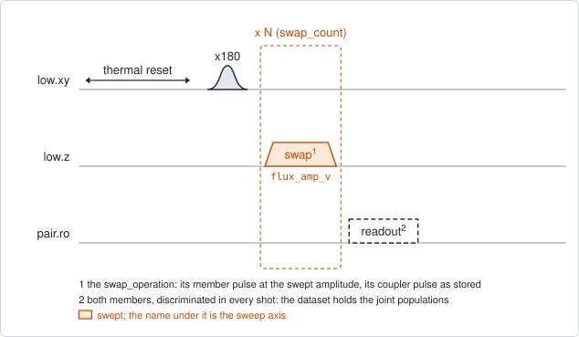
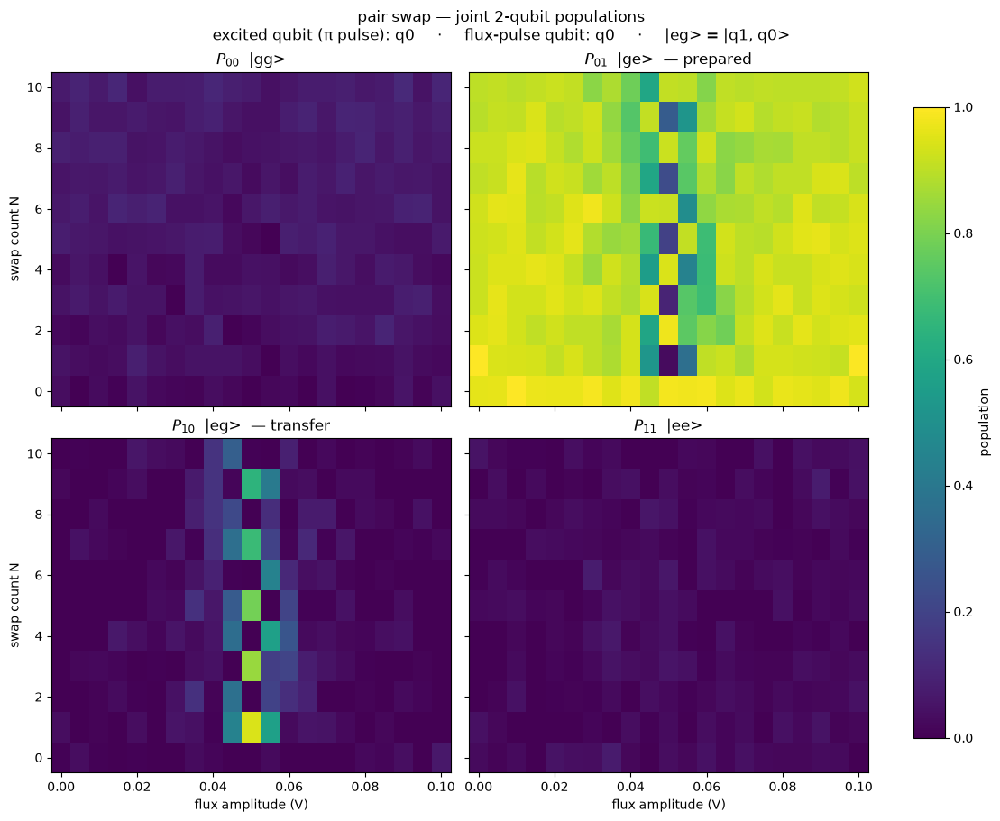

# qc_n_swap_amp

## Purpose

Shows how a swap operation behaves when it is repeated, against the flux
amplitude of its member pulse. One member of the pair is excited, the swap is
applied N times in a row, and both members are read out. The map is the joint
populations over the flux amplitude and N.

Repeating the swap makes a small error visible. On a good amplitude the
excitation moves between the two members in a clean pattern as N grows. Off it
the pattern loses contrast and drifts, and the drift grows with N. One swap
cannot show this.

It is the repeated version of `pair_swap_chevron`: that experiment stretches
one pulse, this one repeats a fixed pulse.

Nothing is fitted and nothing is written to the device. The result is a record.

```
scqo run qc_n_swap_amp --targets q1_q2 --set min_flux_amp_v=0.14 --set max_flux_amp_v=0.16
scqo run qc_n_swap_amp --targets q1_q2 --set swap_operation=partial_swap --set swap_counts=[0,1,2,4,8,16]
```

## Before running it

<!-- BEGIN generated: requires -->
GENERATED from `QcNSwapAmp.requires` and its Parameters mixins - edit
the declaration, then run `python scripts/update_docs.py`.

The target is a `qubit_pair`.

These device values must already be right:

| value | held by | used for | provided by |
|---|---|---|---|
| `drive_freq_hz` | drive channel | the x180 on the excited member has to be on resonance | `qubit_ramsey`, `qubit_ramsey_flux_pulse`, `qubit_ramsey_phasor`, `qubit_spectroscopy` |
| `pi_amp` | drive channel | the x180 on the excited member has to be a full pi pulse | `qubit_deterministic_benchmarking`, `qubit_pi_pulse_error`, `qubit_power_rabi` |
| `idle_flux` | flux line | the standing bias of the member's flux line and of the coupler's: every flux amplitude here is a pulse on top of it | `pair_zz_coupler`, `qubit_ramsey_flux_pulse`, `qubit_spectroscopy_flux_pulse`, `resonator_spectroscopy_flux` |
| `readout_freq_hz` | readout channel | each member's readout tone has to sit on its resonator | `readout_frequency`, `resonator_spectroscopy`, `resonator_spectroscopy_flux`, `resonator_spectroscopy_power_amp`, `resonator_spectroscopy_power_chain` |
| `readout_power_dbm` | readout channel | each member's readout has to be at its working power | `resonator_spectroscopy_power_amp`, `resonator_spectroscopy_power_chain` |
| `readout_rotation_rad` | readout channel | both members are discriminated in every shot: the axis each is projected on | no shared experiment; set it by hand (`scqo set`) or by a backend's own writeback |
| `readout_threshold` | readout channel | both members are discriminated in every shot: what splits \|0> from \|1> on that axis | no shared experiment; set it by hand (`scqo set`) or by a backend's own writeback |
| `thermalization_time_s` | drive channel | how long the thermal reset waits (a per-run thermalization_time_ns replaces it) (with the default `reset_method=thermal`) | `qubit_relaxation` |

Needed only with a non-default setting:

| setting | value | held by | used for | provided by |
|---|---|---|---|---|
| `reset_method=active` | `readout_depletion_s` | readout channel | the settle between the reset measurement and the first pulse | `resonator_spectroscopy` |

A backend may need more than this - a knob only it consumes. `scqo run qc_n_swap_amp --help` lists those where that driver is installed.
<!-- END generated: requires -->

The target is a pair. The values in the table belong to its members and to its
flux lines, not to the pair.

The operation named by `swap_operation` has to exist in the backend's
configuration, with a member flux pulse whose amplitude can be swept. It does
not have to be declared in the roster.

The run is refused before any instrument time when neither member has a flux
line.

## Pulse sequence



Both members are reset. The member named by `drive_side` plays an `x180`. Then
the swap is applied `swap_count` times. Each swap is the operation's own pulses:
the member's flux pulse at the swept amplitude `flux_amp_v`, and the coupler's
pulse, when the operation has one, at its stored amplitude. Both members are
read out together.

`swap_count` 0 plays no swap: it is the baseline after the `x180` alone.

With `operation_gap_ns` above 0, a wait of that length follows every swap.

The amplitude is the pulse's own, in volts. The standing bias of the line stays
underneath it.

## Theory

*To be written.*

## Outputs

<!-- BEGIN generated: outputs -->
GENERATED from `QcNSwapAmp.writes` and `.extracts` - edit the
declaration, then run `python scripts/update_docs.py`.

Record-only: `update()` proposes nothing.

Reported in `result.fit` and never written:

| fit key | meaning |
|---|---|
| `best_transfer` | the largest population found on the member that was not excited, over the whole map |
| `best_flux_amp_v` | the flux amplitude at that point |
| `best_swap_count` | the number of swaps at that point |
| `p_high_min` | the smallest excited population of the high member over the map |
| `p_high_max` | the largest excited population of the high member over the map |
| `p_low_min` | the smallest excited population of the low member over the map |
| `p_low_max` | the largest excited population of the low member over the map |
| `p_ee_max` | the largest population of both members excited at once; with one excitation in the pair it stays near zero |
| `n_flux_amp_v` | the number of points along flux_amp_v |
| `n_swap_count` | the number of points along swap_count |
<!-- END generated: outputs -->

With `readout_mode=average` the dataset holds `joint_population` over the
states `00`, `01`, `10`, `11`, high member first. With `readout_mode=shot` it
holds `state`: the level of each member in every shot. Both give the same map.

The transfer is the excited population of the member that was not excited.
`best_transfer` is its largest value over the map, and `best_flux_amp_v` and
`best_swap_count` are the coordinates of that one point.

A run is `SUCCESSFUL` when `best_transfer` is at least `min_transfer`.

## Expected result



The four joint populations over the flux amplitude and the swap count, drawn as
in `pair_swap_chevron`. Check that:

- the transfer panel shows a pattern at one amplitude that repeats with N, and
  nothing far from it;
- at that amplitude the excitation is on one member after an odd number of
  swaps and back on the other after an even number, when the operation is a
  full swap. A partial swap takes several counts to move it across;
- beside that amplitude the pattern is weaker and shifts with N;
- the panel for both members excited stays dark.

The figure is from a simulated pair whose operation is a full swap.

## Traps

- **The brightest amplitude is not the resonance.** Between two swaps the
  members pick up a relative phase. It tilts the rotation that one round makes,
  so the transfer peaks where the pulse's own phase cancels it, not where the
  members are on resonance. For a 40 ns swap and a phase of one radian the
  offset is as large as the width of the resonance. Take the resonance from
  `qc_swap_flux_stark`, which sweeps the compensation together with the flux, or
  from `pair_swap_chevron`, where a single pulse has no such phase.
- **The gap is part of the round.** Changing `operation_gap_ns` changes the
  phase per round and moves the pattern.
- **The best point is one pixel.** `best_flux_amp_v` is the amplitude of the
  largest transfer in the map. Nothing is fitted.
- **A member whose readout has drifted** passes as a result (`BACKLOG.md` I21).

## References

- `TUTORIAL.md` section 12, the worked partial-swap workflow.
- Related experiments: `pair_swap_chevron` (one pulse, amplitude against
  duration), `qc_swap_flux_stark` (the resonance with the phase compensated),
  `qc_n_stark_amp` and `qc_n_swap_tomography` (the angle of one swap),
  `pair_swap_angle` (the same sequence with the coupler amplitude swept).
- Code: `scqo/experiments/qc_n_swap_amp.py`, `scqat/estimators/qc_n_swap_amp/`.
