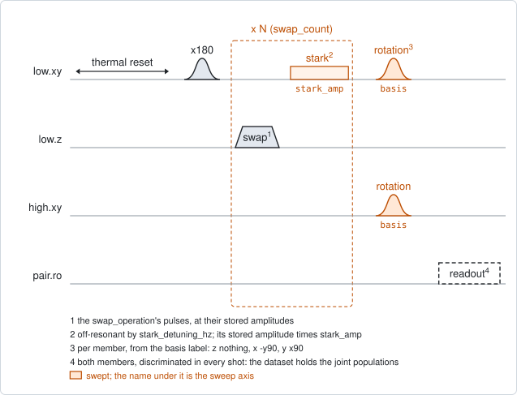
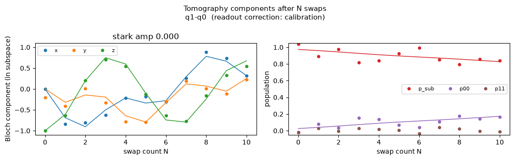

# qc_n_swap_tomography

## Purpose

Measures one round of a repeated swap completely: the exchange angle, the
relative phase, and the errors that are not coherent. One member of the pair is
excited, the round of `qc_n_stark_amp` is played N times (the swap, then an
off-resonant tone on the excited member), and both members are measured in the
nine two-qubit Pauli bases.

With one excitation shared between two qubits, the state is a point on a
sphere, and one round turns it: an exchange followed by a phase. Populations
alone only show the combined angle, which is why `qc_n_stark_amp` has to scan
the tone amplitude. The tomography follows the point in three dimensions, so it
separates the exchange angle from the phase at any tone amplitude. One sweep of
N gives:

- the exchange angle per round, proposed as the monitor `theta_rad` of the swap
  operation;
- the phase per round. With two or more tone amplitudes it also gives the
  amplitude where that phase is zero, the compensation;
- the loss per round: what each member loses, how fast the coherence between
  them fades, the error of the prepared state, and the growth of the state with
  both members excited.

It does not measure a detuning between the members. See Traps.

```
scqo run qc_n_swap_tomography --targets q1_q2 --set swap_operation=partial_swap --set operation_gap_ns=260
scqo run qc_n_swap_tomography --targets q1_q2 --set swap_operation=partial_swap --set stark_amps=[0.45,0.55] --set round_duration_ns=368
```

## Before running it

<!-- BEGIN generated: requires -->
GENERATED from `QcNSwapTomography.requires` and its Parameters mixins - edit
the declaration, then run `python scripts/update_docs.py`.

The target is a `qubit_pair`.

These device values must already be right:

| value | held by | used for | provided by |
|---|---|---|---|
| `drive_freq_hz` | drive channel | both members play pulses: the x180 that excites one, and the rotations in front of the readout on both | `qubit_ramsey`, `qubit_ramsey_flux_pulse`, `qubit_ramsey_phasor`, `qubit_spectroscopy` |
| `pi_amp` | drive channel | the x180 on the excited member, and on both members in the readout calibration, has to be a full pi pulse | `qubit_deterministic_benchmarking`, `qubit_pi_pulse_error`, `qubit_power_rabi` |
| `idle_flux` | flux line | the standing bias of the member's flux line and of the coupler's: every flux amplitude here is a pulse on top of it | `pair_zz_coupler`, `qubit_ramsey_flux_pulse`, `qubit_spectroscopy_flux_pulse`, `resonator_spectroscopy_flux` |
| `readout_freq_hz` | readout channel | each member's readout tone has to sit on its resonator | `readout_frequency`, `resonator_spectroscopy`, `resonator_spectroscopy_flux`, `resonator_spectroscopy_power_amp`, `resonator_spectroscopy_power_chain` |
| `readout_power_dbm` | readout channel | each member's readout has to be at its working power | `resonator_spectroscopy_power_amp`, `resonator_spectroscopy_power_chain` |
| `readout_rotation_rad` | readout channel | both members are discriminated in every shot: the axis each is projected on | no shared experiment; set it by hand (`scqo set`) or by a backend's own writeback |
| `readout_threshold` | readout channel | both members are discriminated in every shot: what splits \|0> from \|1> on that axis | no shared experiment; set it by hand (`scqo set`) or by a backend's own writeback |
| `thermalization_time_s` | drive channel | how long the thermal reset waits (a per-run thermalization_time_ns replaces it) (with the default `reset_method=thermal`) | `qubit_relaxation` |

Needed only with a non-default setting:

| setting | value | held by | used for | provided by |
|---|---|---|---|---|
| `readout_calibration_shots=0` | `fidelity_g` | readout channel | without the in-run calibration the readout is corrected with the members' stored fidelities | `single_shot_readout` |
| `readout_calibration_shots=0` | `fidelity_e` | readout channel | without the in-run calibration the readout is corrected with the members' stored fidelities | `single_shot_readout` |
| `reset_method=active` | `readout_depletion_s` | readout channel | the settle between the reset measurement and the first pulse | `resonator_spectroscopy` |

A backend may need more than this - a knob only it consumes. `scqo run qc_n_swap_tomography --help` lists those where that driver is installed.
<!-- END generated: requires -->

The target is a pair. The values in the table belong to its members and to its
flux lines, not to the pair.

Two operations have to exist in the backend's configuration: the swap named by
`swap_operation`, at its calibrated amplitudes, and the tone named by
`stark_operation` on the excited member's drive line. That tone has to carry
its detuning in its own waveform.

The angle can only be kept when the roster declares the swap operation on the
pair. Without that the run prints where to add it and proposes nothing.

Three more values are used when they are there. With `round_duration_ns`, each
member's measured `t1_s` and `t2_star_s` give what T1 and T2\* alone predict
for the loss per round, and the two drive frequencies give a prediction for the
frame step.

The run is refused before any instrument time when neither member has a flux
line, and when `swap_counts` has fewer than four counts or does not include 0.

## Pulse sequence



Both members are reset. The member named by `drive_side` plays an `x180`. Then
one round is played `swap_count` times: the swap operation at its stored
amplitudes, a wait of `operation_gap_ns` when that is above 0, and the stark
tone at the amplitude factor `stark_amp`. This is the round of
`qc_n_stark_amp`, unchanged.

After the last round each member plays the rotation that brings its measured
axis onto the readout axis, and both are read out together. The axis `basis`
has nine labels of two letters, the high member first. `z` plays nothing, `x`
plays `-y90`, and `y` plays `x90`.

Before the sweep, a readout calibration block prepares each of the states 00,
01, 10 and 11 and reads it in the same way, `readout_calibration_shots` times.
It is stored beside the sweep as `calibration_population`.

`stark_amps` is a short list, not a window: one value measures the angle and
the phase there, and two or more also locate the compensation.

## Theory

*To be written.*

## Outputs

<!-- BEGIN generated: outputs -->
GENERATED from `QcNSwapTomography.writes` and `.extracts` - edit the
declaration, then run `python scripts/update_docs.py`.

Proposed by `update()`; each stays pending until it is accepted:

| field | held by | role | unit | meaning |
|---|---|---|---|---|
| `theta_rad` | operation | monitor | rad | Per-application exchange angle of a swap-type operation, read off the N-swap oscillation period at the compensating stark amplitude (qc_n_stark_amp). Consulted by the chain analysis for its ideal curves; never pushed. |

Reported in `result.fit` and never written:

| fit key | meaning |
|---|---|
| `theta_rad_err` | the standard error of the proposed angle |
| `theta_stark_amp` | the stark amplitude the angle was taken at: the one with the smallest phase per round |
| `theta_spread_rad` | the spread of the fitted angle across the stark amplitudes; 0 with one amplitude |
| `theta_consistency_sigma` | the largest distance of one amplitude's angle from the reported one, in combined standard errors; above 3 nothing is proposed |
| `phase_at_theta_amp_rad` | the relative phase per round at that amplitude |
| `compensating_stark_amp` | the stark amplitude where the phase per round crosses zero; NaN with one amplitude |
| `compensation_extrapolated` | 1 when that amplitude lies outside the measured ones |
| `t1_loss_per_step_high` | the excitation the high member loses per round |
| `t1_loss_per_step_low` | the excitation the low member loses per round |
| `dephasing_per_step` | the loss of the coherence between the two members per round |
| `prep_error` | the part of the prepared state that is not the one excitation |
| `leak_to_11_per_step` | the growth per round of the population with both members excited |
| `predicted_t1_loss_high` | the loss per round that the high member's T1 alone predicts; NaN without round_duration_ns and a measured T1 |
| `predicted_t1_loss_low` | the same for the low member |
| `predicted_dephasing` | the dephasing per round that T1 and T2* alone predict; NaN without round_duration_ns and measured values |
| `excess_dephasing_per_step` | the fitted dephasing minus that prediction |
| `frame_step_rad` | how far the two members' drive frames turn against each other per round, as fitted |
| `predicted_frame_step_rad` | the same from the two drive frequencies and round_duration_ns; NaN without the round length |
| `fit_rms` | the rms residual of the fit; above 0.08 nothing is proposed |
| `n_fit_ok` | the number of stark amplitudes whose fit converged |
| `readout_calibrated` | 1 when the in-run readout calibration was used |
| `readout_corrected` | 1 when any readout correction was used |
<!-- END generated: outputs -->

The readout is corrected before the fit. With the calibration block, the fit
inverts the measured 4 x 4 table of read against prepared states, which
includes the crosstalk between the two readouts. Without it
(`readout_calibration_shots=0`), the members' stored fidelities are used, each
member on its own.

The reported angle is the one fitted at the tone amplitude with the smallest
phase per round (`theta_stark_amp`). The values for every amplitude are in the
estimator's metadata file in the run folder.

`frame_step_rad` is a property of the measurement, not of the swap: the two
members are driven at different frequencies, so their reference frames turn
against each other by the frequency difference times the round length, every
round. The fit carries this turn and reports the phase per round with it
removed.

A run is `SUCCESSFUL` when the fit converged and gave an angle. `theta_rad` is
proposed only when all of these also hold:

- `fit_rms` is at most 0.08;
- the angle does not move with the tone amplitude: `theta_consistency_sigma` is
  at most 3;
- the roster declares the swap operation on the pair.

## Expected result



Left, the three components of the state inside the one-excitation subspace
against the swap count, with the fit as lines. Right, the populations: inside
that subspace, with no excitation, and with two. The title says which readout
correction was used. Check that:

- `z` starts at -1 or +1 and oscillates. Its period is the round's combined
  angle;
- `x` and `y` are not flat. They carry the coherence, and they are what
  separates the phase from the exchange. Flat at zero means that the coherence
  did not survive the measurement;
- the lines follow the points;
- the population in the subspace falls slowly and the population with no
  excitation rises by the same amount. The population with two excitations
  stays near zero.

Three more figures in the run folder draw the same trajectory on the sphere, in
the drive frames and with the frame step removed, and the phase and the angle
against the tone amplitude.

The figure is from a simulated pair with one tone amplitude, 0.

## Traps

- **The tone has to carry its own detuning.** The sequence sets the phase
  reference of both members' drive frames at the start of every shot, and
  changes no frequency afterwards. A tone that is made off-resonant by
  switching the drive frequency breaks that reference. `stark_operation`
  therefore names an operation with the detuning in its waveform, and the run
  is refused when its detuning is not `stark_detuning_hz`.
- **A detuning is not seen.** A detuned exchange looks like a resonant one of a
  slightly smaller angle between two phases. The angle loses only in second
  order, and the rest hides in the phase per round together with every other
  phase. Take the resonance from `qc_swap_flux_stark`.
- **A compensation belongs to one round length.** As in `qc_n_stark_amp`: the
  phase is collected over the whole round. Keep the gap with the value
  (`BACKLOG.md` F16).
- **Bracket the compensation.** With the zero crossing outside the measured
  amplitudes, `compensation_extrapolated` is 1 and the value is a guess along a
  line. The phase is not linear in the amplitude.
- **A strong tone costs population.** On a real chip one qubit lost three to
  four times what its T1 predicts per round under a tone of about 0.9 of a turn
  (`BACKLOG.md` I36).
- **The predictions need the round length.** Without `round_duration_ns`, and
  without measured T1 and T2\*, the predicted losses and the excess are NaN.
  The round length is the swap, the gap, the tone and the instrument's own
  overhead.
- **Nine bases cost time.** Every count is measured nine times. About half an
  oscillation of counts is enough, because the trajectory fixes the angle.
- **A member whose readout has drifted.** The calibration block corrects
  assignment errors. It cannot help when a member reads the same value in every
  shot. Check `single_shot_readout` on both members first.

## References

- `docs/qc-n-swap-tomography-plan.md`, the design and the hardware validation.
- `procedures/pair-partial-swap/PROCEDURE.md`, where this experiment is the
  default reading of the angle in step 4.
- Related experiments: `qc_n_stark_amp` (the same round read by populations),
  `qc_swap_flux_stark` (the resonance), `qubit_tomography` (one qubit, the same
  rotations), `single_shot_readout` (the discriminators and the fidelities).
- Code: `scqo/experiments/qc_n_swap_tomography.py`,
  `scqat/estimators/qc_n_swap_tomography/`, `scqat/tools/swap_channel.py`,
  `scqat/tools/two_qubit_tomography.py`.
