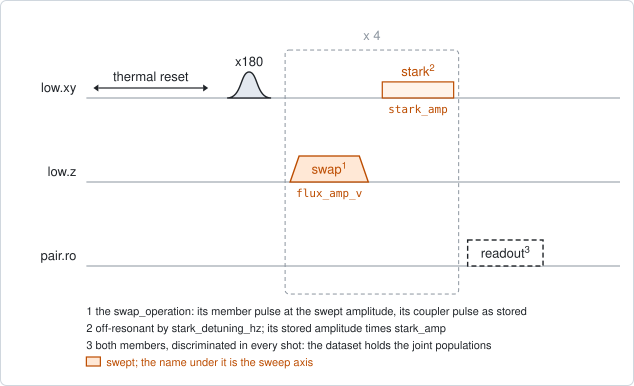
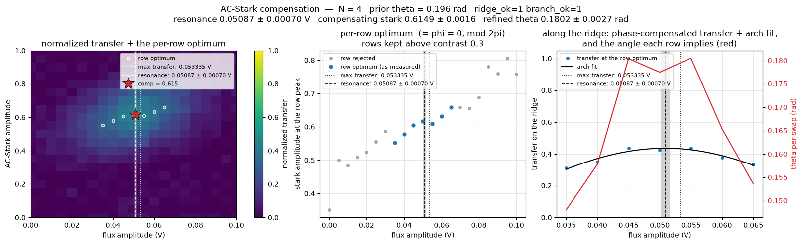

# qc_swap_flux_stark

## Purpose

Finds the two settings of a repeated swap together: the flux amplitude that
puts the members on resonance, and the tone amplitude that cancels the phase
they pick up between swaps. One member of the pair is excited, a fixed number
of rounds is played (the swap, then an off-resonant tone on the excited
member), and both members are read out. The swap's flux amplitude and the
tone's amplitude are both swept. The number of rounds is not.

The two settings cannot be found one at a time. A detuned swap adds a phase of
its own between rounds, on top of the phase the tone is there to cancel. So the
tone amplitude that compensates depends on the flux amplitude, and the flux
amplitude that transfers best depends on the tone. `qc_n_swap_amp` and
`qc_n_stark_amp` each scan one of the two at a fixed value of the other. This
map scans both.

The estimator reads the map row by row. In every flux row, the transfer is
largest at the tone amplitude that cancels the phase. Those largest transfers,
followed along the flux, form an arch. Its centre is the resonance, and the
tone amplitude at the centre is the compensation.

Nothing is written to the device. The result is a record.

```
scqo run qc_swap_flux_stark --targets q1_q2 --set swap_operation=partial_swap --set swap_count=4 --set swap_angle_rad=0.3 --set min_flux_amp_v=0.146 --set max_flux_amp_v=0.153
```

## Before running it

<!-- BEGIN generated: requires -->
GENERATED from `QcSwapFluxStark.requires` and its Parameters mixins - edit
the declaration, then run `python scripts/update_docs.py`.

The target is a `qubit_pair`.

These device values must already be right:

| value | held by | used for | provided by |
|---|---|---|---|
| `drive_freq_hz` | drive channel | the x180 on the excited member has to be on resonance | `qubit_ramsey`, `qubit_ramsey_flux_pulse`, `qubit_ramsey_phasor`, `qubit_spectroscopy` |
| `pi_amp` | drive channel | the x180 on the excited member has to be a full pi pulse | `qubit_deterministic_benchmarking`, `qubit_pi_pulse_error`, `qubit_power_rabi` |
| `idle_flux` | flux line | the standing bias of the member's flux line and of the coupler's: every flux amplitude here is a pulse on top of it | `pair_zz_coupler`, `qubit_ramsey_flux_pulse`, `qubit_spectroscopy_flux_pulse`, `resonator_spectroscopy_flux` |
| `readout_freq_hz` | readout channel | each member's readout tone has to sit on its resonator | `readout_frequency`, `resonator_spectroscopy`, `resonator_spectroscopy_flux`, `resonator_spectroscopy_power_amp`, `resonator_spectroscopy_power_chain` |
| `readout_power_dbm` | readout channel | each member's readout has to be at its working power | `resonator_spectroscopy_power_amp`, `resonator_spectroscopy_power_chain` |
| `readout_rotation_rad` | readout channel | both members are discriminated in every shot: the axis each is projected on | no shared experiment; set it by hand (`scqo set`) or by a backend's own writeback |
| `readout_threshold` | readout channel | both members are discriminated in every shot: what splits \|0> from \|1> on that axis | no shared experiment; set it by hand (`scqo set`) or by a backend's own writeback |
| `thermalization_time_s` | drive channel | how long the thermal reset waits (a per-run thermalization_time_ns replaces it) (with the default `reset_method=thermal`) | `qubit_relaxation` |

Needed only with a non-default setting:

| setting | value | held by | used for | provided by |
|---|---|---|---|---|
| `reset_method=active` | `readout_depletion_s` | readout channel | the settle between the reset measurement and the first pulse | `resonator_spectroscopy` |

A backend may need more than this - a knob only it consumes. `scqo run qc_swap_flux_stark --help` lists those where that driver is installed.
<!-- END generated: requires -->

The target is a pair. The values in the table belong to its members and to its
flux lines, not to the pair.

Two operations have to exist in the backend's configuration: the swap named by
`swap_operation`, with a member flux pulse whose amplitude can be swept, and
the tone named by `stark_operation` on the excited member's drive line.

Two parameters carry what earlier experiments measured:

- `swap_angle_rad`, the angle of one swap, from `pair_swap_flux_map` at the
  coupler amplitude the operation uses. It is not fitted here. It tells the
  estimator on which side of a full transfer the map lies, and only has to be
  right to about pi / (2 x `swap_count`). Without it the resonance, the
  compensation and the angle are not reported.
- `stark_amp_2pi`, the tone amplitude of one full turn of phase, from
  `qubit_stark_phase_echo`. It is optional.

The run is refused before any instrument time when neither member has a flux
line.

## Pulse sequence



Both members are reset. The member named by `drive_side` plays an `x180`. Then
one round is played `swap_count` times: the swap operation with its member
flux pulse at the swept amplitude `flux_amp_v`, a wait of `operation_gap_ns`
when that is above 0, and the stark tone at the swept factor `stark_amp`. Both
members are read out together.

The round is the one of `qc_n_stark_amp`, with the member's flux amplitude
swept as well. The coupler pulse of the operation, when it has one, plays at
its stored amplitude.

The flux amplitude is the pulse's own, in volts, on top of the line's standing
bias. The tone amplitude is a factor of the stored amplitude of
`stark_operation`.

## Theory

*To be written.*

## Outputs

<!-- BEGIN generated: outputs -->
GENERATED from `QcSwapFluxStark.writes` and `.extracts` - edit the
declaration, then run `python scripts/update_docs.py`.

Record-only: `update()` proposes nothing.

Reported in `result.fit` and never written:

| fit key | meaning |
|---|---|
| `best_transfer` | the largest population found on the member that was not excited, over the whole map |
| `best_flux_amp_v` | the flux amplitude at that point |
| `best_stark_amp` | the stark amplitude factor at that point |
| `p_high_min` | the smallest excited population of the high member over the map |
| `p_high_max` | the largest excited population of the high member over the map |
| `p_low_min` | the smallest excited population of the low member over the map |
| `p_low_max` | the largest excited population of the low member over the map |
| `p_ee_max` | the largest population of both members excited at once; with one excitation in the pair it stays near zero |
| `n_flux_amp_v` | the number of points along flux_amp_v |
| `n_stark_amp` | the number of points along stark_amp |
| `resonance_flux_amp_v` | the flux amplitude of the resonance: the centre of the arch fitted through the compensated transfer |
| `resonance_flux_err_v` | its one-sigma error |
| `compensating_stark_amp` | the compensating stark amplitude at that flux, interpolated between the two rows around it |
| `compensating_stark_err` | its one-sigma error |
| `swap_angle_rad_refined` | the exchange angle of one swap, from the height of the arch |
| `swap_angle_err_rad` | its one-sigma error |
| `swap_angle_rad_prior` | the swap_angle_rad that was given; NaN when none was |
| `swap_angle_consistent` | 1 when the refined angle agrees with that prior |
| `arch_r_squared` | the R squared of the arch fit |
| `ridge_ok` | 1 when the prior allows the resonance and the compensation to be read (swap_count times the angle up to pi) |
| `branch_ok` | 1 when it also allows the angle to be read (up to pi/2) |
| `resonance_at_edge` | 1 when the fitted centre lies outside the rows that carry signal; the numbers are withheld |
| `resonance_unresolved` | 1 when the centre's error is too large or the fit failed; the numbers are withheld |
| `compensation_in_gap` | 1 when the resonance lies among rows with no stark signal; only the compensation is withheld |
| `ridge_peak_flux_amp_v` | the flux amplitude of the row whose compensated transfer is the largest; needs no prior |
| `ridge_peak_transfer` | that transfer |
| `ridge_slope_per_v` | how fast the compensating amplitude moves with the flux |
| `ridge_local_rms` | the scatter of the rows' compensating amplitudes around that line |
| `ridge_wrap_amp` | the stark amplitude of one full turn of phase, as the map measured it; NaN when the ridge does not wrap |
| `stark_amp_2pi_prior` | the stark_amp_2pi that was given; NaN when none was |
| `wrap_consistent` | 1 when the measured turn agrees with that prior |
| `n_ridge_rows` | the number of flux rows whose transfer swings by at least min_row_contrast along the stark axis |
| `n_fold_rows` | the number of rows read on the far side of a full transfer |
| `max_row_contrast` | the largest swing of one row along the stark axis |
<!-- END generated: outputs -->

The answer is `resonance_flux_amp_v` and `compensating_stark_amp`, each with
its error. They are read only when the prior angle allows it:

- `ridge_ok`: `swap_count` times the angle is at most pi. The resonance and the
  compensation are reported.
- `branch_ok`: it is at most pi/2. The angle is reported as well.

With a gate open, three flags can still withhold a number, and each says what
to do:

- `resonance_at_edge`: the centre lies outside the rows that carry signal. Move
  the flux window onto it.
- `resonance_unresolved`: the error of the centre is too large, or the fit
  failed. Widen the window or average more.
- `compensation_in_gap`: the rows around the resonance carry no signal along
  the tone axis. Only the compensation is withheld.

`ridge_peak_flux_amp_v` needs no prior: it is the flux row with the largest
compensated transfer. Use it from a run that had no prior. With a prior, prefer
the fitted centre, because the top of the arch is flat and noise decides which
row is the largest.

A run is `SUCCESSFUL` when `best_transfer` is at least `min_transfer`. A run
whose resonance was withheld still succeeds.

## Expected result



Left, the transfer over the two amplitudes, with the best tone amplitude of
every kept row as a circle, the fitted resonance as a dashed line and the
compensation as a star. Middle, those row optima against the flux amplitude:
the kept rows in blue, the rejected ones in grey. Right, the transfer at the
row optima with the fitted arch, and in red the angle each row implies. The
lines under the title give the count, the prior, the two gates and the three
results. Check that:

- the bright region in the left panel is tilted. The tilt is the reason for
  sweeping both amplitudes;
- the kept rows in the middle panel lie on a line. Rows far from resonance
  scatter and are rejected: their transfer hardly depends on the tone;
- the arch in the right panel has its top inside the kept rows, and the dashed
  line sits at the top;
- the title shows both gates as 1, and no flag.

A second figure in the run folder shows the four joint populations.

The figure is from a simulated pair, drawn with `swap_angle_rad=0.196`. That is
the simulated angle of one swap at the default `swap_count` of 4. With the
default, no prior, the resonance and the compensation are not reported.

## Traps

- **The best pixel is not the calibration.** After N rounds the transfer is
  largest where N times the round's angle is pi/2. For two or more rounds that
  is beside the resonance, not on it. `best_flux_amp_v` and `best_stark_amp`
  are only the largest pixel. Read `resonance_flux_amp_v` and
  `compensating_stark_amp`.
- **One round has no compensation.** With `swap_count=1` the only tone plays
  after the only swap. It changes a phase and no population, so the map is flat
  along the tone axis.
- **Choose the count from the angle.** `swap_count` times the angle near pi/4
  is where the transfer changes fastest with the angle. Near pi/2 the transfer
  is at its top and says nothing about the angle. Beyond pi/2 the arch folds
  into a dip between two tops.
- **The angle from the arch is not a reference.** On a real chip it read up to
  18 % below the angle from the tomography, and 10 % above it at one round
  (`procedures/pair-partial-swap/PROCEDURE.md`, trap 3). Take the angle from
  `qc_n_swap_tomography` or `qc_n_stark_amp`.
- **The same phase at both ends of the window.** A compensation of about one
  full turn can be picked near 0 in one run and near the top of the window in
  another. Both are the same phase (the same procedure, trap 4).
- **A compensation belongs to one round length.** It holds for the swap, the
  gap and the tone it was measured with (`BACKLOG.md` F16).
- **Set the tone window to one turn.** A shorter window leaves rows with no
  compensation point inside it, and a longer one adds part of a second branch.
  No code checks the window (`BACKLOG.md` F18).
- **A member whose readout has drifted.** A member that reads 0 in every pixel
  leaves a map with only `resonance_unresolved` set, in a run that can still
  succeed (`BACKLOG.md` I21). Check `single_shot_readout` on both members
  first.

## References

- `procedures/pair-partial-swap/PROCEDURE.md`, where this map is step 3.
- Related experiments: `pair_swap_flux_map` (the prior angle),
  `qubit_stark_phase_echo` (the tone amplitude of one turn), `qc_n_swap_amp`
  and `qc_n_stark_amp` (one amplitude each, against the count),
  `qc_n_swap_tomography` (the angle).
- Code: `scqo/experiments/qc_swap_flux_stark.py`,
  `scqat/estimators/qc_swap_flux_stark/`.
