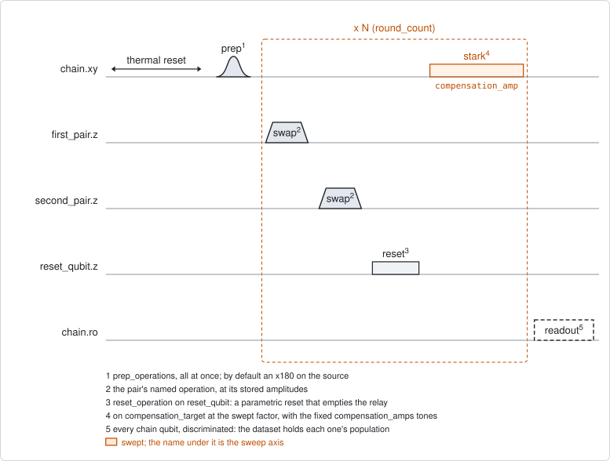
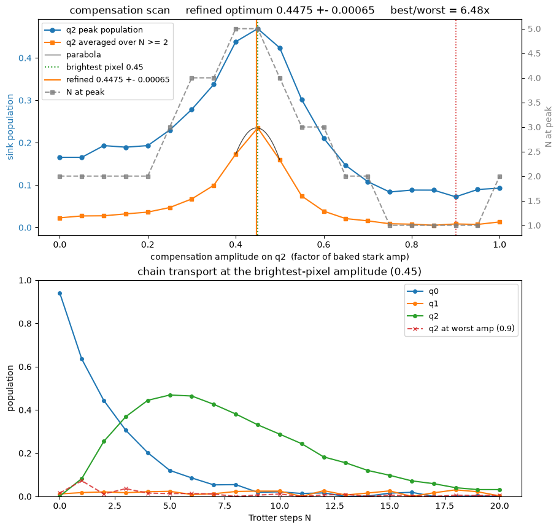

# qc_trotter_compensation

## Purpose

Finds the compensation of the chain that `qc_unidirectional_trotter` runs. It
belongs to the project `MpembaEP_trotter`.

In every round of that chain, the source and the sink pick up a phase relative
to each other. What reaches the sink in different rounds adds up only when that
phase is cancelled. An off-resonant tone on one qubit, played at the end of
every round, adds a phase that grows with the tone's amplitude. This experiment
runs the same chain while sweeping that amplitude, and also the number of
rounds.

Only the phase difference between source and sink matters, so one amplitude on
one qubit is enough. The tone goes on the source or on the sink. A tone on the
relay does nothing, because it plays after the relay was emptied, and the
experiment refuses it.

The number of rounds is swept as well because it shows the phase directly. When
the rounds cancel, only the last one arrives and the sink peaks at the first
round. When they add up, the peak moves out to several rounds. The round at
which the sink peaks is therefore a second reading of the same condition,
beside the height of the peak. The slice at the best amplitude is also the
transport curve itself.

Nothing is written to the device. The compensation is a setting of the next
run: pass `best_compensation_amp_refined` back as `compensation_amps`.

```
scqo run qc_trotter_compensation --params chain.json --set compensation_target=q3 --set max_compensation_amp=0.9 --set num_amp_points=31
scqo run qc_trotter_compensation --params chain.json --set compensation_target=q3 --set min_compensation_amp=0.25 --set max_compensation_amp=0.45
```

`chain.json` is the file `qc_unidirectional_trotter` runs from. Its document
shows one.

## Before running it

<!-- BEGIN generated: requires -->
GENERATED from `QcTrotterCompensation.requires` and its Parameters mixins - edit
the declaration, then run `python scripts/update_docs.py`.

The target is a `transmon` / `flux_transmon` / `fluxonium`.

These device values must already be right:

| value | held by | used for | provided by |
|---|---|---|---|
| `drive_freq_hz` | drive channel | the prep pulses have to be on resonance, and each compensation tone is set off from its qubit's drive frequency | `qubit_ramsey`, `qubit_ramsey_flux_pulse`, `qubit_ramsey_phasor`, `qubit_spectroscopy` |
| `pi_amp` | drive channel | the default prep is an x180 on the chain source | `qubit_deterministic_benchmarking`, `qubit_pi_pulse_error`, `qubit_power_rabi` |
| `idle_flux` | flux line | the swaps and the relay's reset are flux pulses on top of each line's standing bias | `pair_zz_coupler`, `qubit_ramsey_flux_pulse`, `qubit_spectroscopy_flux_pulse`, `resonator_spectroscopy_flux` |
| `readout_freq_hz` | readout channel | each chain qubit's readout tone has to sit on its resonator | `readout_frequency`, `resonator_spectroscopy`, `resonator_spectroscopy_flux`, `resonator_spectroscopy_power_amp`, `resonator_spectroscopy_power_chain` |
| `readout_power_dbm` | readout channel | each chain qubit's readout has to be at its working power | `resonator_spectroscopy_power_amp`, `resonator_spectroscopy_power_chain` |
| `readout_rotation_rad` | readout channel | every chain qubit is discriminated in every shot: the axis each is projected on | no shared experiment; set it by hand (`scqo set`) or by a backend's own writeback |
| `readout_threshold` | readout channel | every chain qubit is discriminated in every shot: what splits \|0> from \|1> on that axis | no shared experiment; set it by hand (`scqo set`) or by a backend's own writeback |
| `thermalization_time_s` | drive channel | how long the thermal reset waits (a per-run thermalization_time_ns replaces it) (with the default `reset_method=thermal`) | `qubit_relaxation` |

Needed only with a non-default setting:

| setting | value | held by | used for | provided by |
|---|---|---|---|---|
| `reset_method=active` | `readout_depletion_s` | readout channel | the settle between the reset measurement and the first pulse | `resonator_spectroscopy` |

A backend may need more than this - a knob only it consumes. `scqo run qc_trotter_compensation --help` lists those where that driver is installed.
<!-- END generated: requires -->

The targets are the chain's qubits, in chain order. The values in the table
belong to those qubits and to the flux lines the round plays on.

The operations of the round have to exist in the backend's configuration, as
for `qc_unidirectional_trotter`: the two swaps, the reset of the relay, and the
stark operation on the swept qubit and on every qubit with a fixed tone.

The run is refused before any instrument time, beside the chain's own checks,
when:

- `compensation_target` is not the source or the sink;
- `compensation_target` also appears in `compensation_amps`. One amplitude
  cannot be both swept and held;
- `prep_operations` prepares anything but one qubit. The scan reads the
  transport of a single excitation.

## Pulse sequence



The sequence is the one of `qc_unidirectional_trotter`: reset, preparation, the
round repeated `round_count` times, and the readout of every chain qubit. One
round is the first pair's operation, the second pair's operation, the reset of
the relay, and the stark tones.

The tone on `compensation_target` is played at the swept factor
`compensation_amp`. The tones in `compensation_amps` are played with it, at
their fixed factors. Every factor multiplies the stored amplitude of
`stark_operation`.

The chain parameters are the same class as the chain experiment's, so an idle
step, a gap and `swap_coupler_flux` mean the same here. A scan with one step
idle is the background: what the tone does with no transport.

## Theory

*To be written.*

## Outputs

<!-- BEGIN generated: outputs -->
GENERATED from `QcTrotterCompensation.writes` and `.extracts` - edit the
declaration, then run `python scripts/update_docs.py`.

Record-only: `update()` proposes nothing.

Reported in `result.fit` and never written:

| fit key | meaning |
|---|---|
| `best_compensation_amp_refined` | the compensation: the vertex of the sink population averaged over the rounds from 2 on, against the swept amplitude |
| `best_compensation_amp_err` | its spread when the rounds are resampled |
| `compensation_unresolved` | 1 when that curve has no peak inside the window; the refined value is then NaN |
| `best_compensation_amp` | the amplitude of the single brightest pixel of the sink map |
| `best_sink_p_max` | the sink's peak population at that amplitude |
| `best_n_at_max` | the round count of that peak |
| `worst_compensation_amp` | the amplitude with the lowest sink peak |
| `worst_sink_p_max` | that sink peak |
| `contrast` | the best sink peak over the worst; near 1 the tone does nothing on this chain |
| `n_compensation_amp` | the number of swept amplitudes |
| `n_round_count` | the number of points on the round axis |
| `p_initial` | this qubit's population before the first round, at the amplitude of the brightest pixel |
| `p_final` | its population after the last round, at that amplitude |
| `p_max` | its largest population over the rounds, at that amplitude |
| `p_min` | its smallest population over the rounds, at that amplitude |
| `n_at_max` | the round count at which it peaks, at that amplitude |
<!-- END generated: outputs -->

`result.fit` has one row per chain qubit. The last five keys are that qubit's
own curve at the amplitude of the brightest pixel. The others describe the scan
and are the same on every row.

The compensation is `best_compensation_amp_refined`. The estimator averages the
sink's population over the rounds from 2 on, and fits a parabola through the
top of that curve against the amplitude. Rounds 0 and 1 are left out: the sink
then holds one contribution at most, which carries no phase.

`best_compensation_amp` is only the brightest pixel of the map, and one noisy
pixel moves it.

A run is `SUCCESSFUL` when the scan located an optimum with a finite sink peak.
There is no threshold on how much transport that optimum shows. When the
round-averaged curve has no peak inside the window, `compensation_unresolved`
is 1 and the refined value is NaN, in a run that can still succeed.

With `readout_mode=shot` every shot is kept, and the analysis is the same.

## Expected result



Top, against the swept amplitude: the sink's peak population (blue), the sink
averaged over the rounds from 2 on (orange) with the fitted parabola, and the
round at which the sink peaks (grey, right axis). The vertical lines mark the
refined optimum, the brightest pixel and the worst amplitude. Bottom, the
populations of the three qubits against the number of rounds at the best
amplitude, with the sink at the worst amplitude as a dashed line. Check that:

- the orange curve has one peak well inside the window, and the parabola sits
  on its top;
- the grey curve peaks at the same amplitude. Away from it the sink peaks at
  round 1 or 2;
- the refined optimum and the brightest pixel are close;
- in the lower panel the sink rises over several rounds, far above the dashed
  curve;
- the title gives the optimum with its error, and the ratio of the best to the
  worst sink peak. A ratio near 1 means the tone does nothing on this chain.

A second figure in the run folder draws the sink's population as a map over
the amplitude and the round count.

The figure is from a simulated chain, with the tone swept on the sink.

## Traps

- **Take the refined value.** On a real chip the brightest pixel sat 0.02 to
  0.04 away from the centre of the ridge
  (`procedures/chain-trotter-compensation/PROCEDURE.md`, trap 4).
- **Stop the window below one turn of phase.** Near one turn the tone excites
  the qubit it plays on. The sink then brightens at the top of the window for
  the wrong reason, and the scan returns `compensation_unresolved` with the
  brightest pixel at the edge (the same procedure, trap 8;
  `BACKLOG.md` F18, I36). The procedure stops a coarse scan at 0.9.
- **The compensation belongs to one round.** It moves with the gap, with the
  length of any operation in the round, and with either swap operation. A value
  measured for another pair of operations does not carry over (traps 1 and 2).
- **It drifts.** On a real chip it moved from 0.23 to 0.33 within hours with an
  unchanged configuration, while repeats ten minutes apart agreed within 0.002
  (trap 3). Scan right before the chain run.
- **Scan with the reset method of the chain run.** The time between shots moves
  the working point (trap 7).
- **A sink that is already compensated.** When the chain file holds a fixed
  tone on the qubit to be swept, the run is refused. Add
  `--set "compensation_amps={}"` (trap 5).
- **Source or sink.** Sweeping the source and sweeping the sink reach opposite
  signs of the phase. When one shows no optimum inside the window, the other
  may. On a real chip the source's tone was close to the sink's frequency and
  would have driven it, so only the sink was swept (step 2 of the procedure).
- **A qubit whose readout has drifted** moves the map and still succeeds. Check
  `single_shot_readout` on all three qubits first.

## References

- `procedures/chain-trotter-compensation/PROCEDURE.md`, the calibration built
  on this scan: a coarse scan, a fine scan, then the chain run.
- Related experiments: `qc_unidirectional_trotter` (the chain this
  compensates), `qubit_stark_phase_echo` (the phase of the tone against its
  amplitude, which gives the window), `qc_n_stark_amp` and
  `qc_n_swap_tomography` (the compensation of one pair, which does not predict
  the chain's).
- Code: `scqo/experiments/qc_trotter_compensation.py`,
  `scqat/estimators/qc_trotter_compensation/`.
