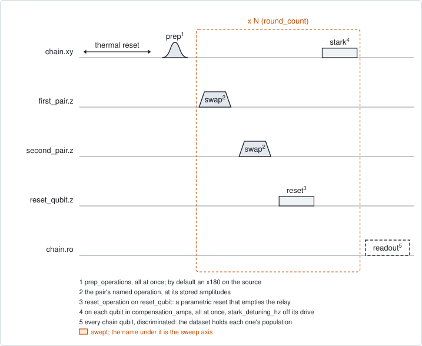
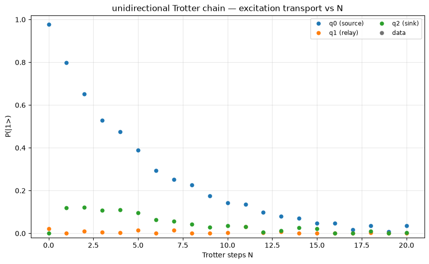

# qc_unidirectional_trotter

## Purpose

Builds a one-way coupling between two qubits out of repeated steps, and shows
an excitation moving along it. This is the circuit of the project
`MpembaEP_trotter`. It calibrates nothing: it runs on a chain of three qubits
whose swaps are already calibrated.

The chain is a source, a relay and a sink. One round is:

1. a partial swap between the source and the relay;
2. a partial swap between the relay and the sink;
3. a reset of the relay;
4. an off-resonant tone on some of the qubits, which cancels the phase they
   picked up during the round.

A swap alone goes both ways. Without the reset, the sink would send the
excitation back through the relay. Emptying the relay in every round removes
that way back, so what remains is a coupling from the source to the sink only.

The source is excited once, the round is repeated N times, and all three qubits
are read out. Their populations against N show the transport: the source
empties, the sink fills, and the relay stays near zero.

Nothing is written to the device. The result is a record.

```
scqo run qc_unidirectional_trotter --params chain.json
scqo run qc_unidirectional_trotter --params chain.json --set readout_mode=shot --set max_rounds=30
```

`chain.json` holds the chain: the targets, the two steps, the reset qubit and
the compensation. `qc_trotter_compensation` reads the same file, so the two
experiments always agree on what a round is.

```
{"targets": ["q1", "q2", "q3"],
 "first_pair": {"pair": "q1_q2", "operation": "partial_swap"},
 "second_pair": {"pair": "q2_q3", "operation": "partial_swap"},
 "reset_qubit": "q2",
 "compensation_amps": {"q3": 0.3},
 "operation_gap_ns": 20}
```

## Before running it

<!-- BEGIN generated: requires -->
GENERATED from `QcUnidirectionalTrotter.requires` and its Parameters mixins - edit
the declaration, then run `python scripts/update_docs.py`.

The target is a `transmon` / `flux_transmon` / `fluxonium`.

These device values must already be right:

| value | held by | used for | provided by |
|---|---|---|---|
| `drive_freq_hz` | drive channel | the prep pulses have to be on resonance, and each compensation tone is set off from its qubit's drive frequency | `qubit_ramsey`, `qubit_ramsey_flux_pulse`, `qubit_ramsey_phasor`, `qubit_spectroscopy` |
| `pi_amp` | drive channel | the default prep is an x180 on the chain source | `qubit_deterministic_benchmarking`, `qubit_pi_pulse_error`, `qubit_power_rabi` |
| `idle_flux` | flux line | the swaps and the relay's reset are flux pulses on top of each line's standing bias | `pair_zz_coupler`, `qubit_ramsey_flux_pulse`, `qubit_spectroscopy_flux_pulse`, `resonator_spectroscopy_flux` |
| `readout_freq_hz` | readout channel | each chain qubit's readout tone has to sit on its resonator | `readout_frequency`, `resonator_spectroscopy`, `resonator_spectroscopy_flux`, `resonator_spectroscopy_power_amp`, `resonator_spectroscopy_power_chain` |
| `readout_power_dbm` | readout channel | each chain qubit's readout has to be at its working power | `resonator_spectroscopy_power_amp`, `resonator_spectroscopy_power_chain` |
| `readout_rotation_rad` | readout channel | every chain qubit is discriminated in every shot: the axis each is projected on | no shared experiment; set it by hand (`scqo set`) or by a backend's own writeback |
| `readout_threshold` | readout channel | every chain qubit is discriminated in every shot: what splits \|0> from \|1> on that axis | no shared experiment; set it by hand (`scqo set`) or by a backend's own writeback |
| `thermalization_time_s` | drive channel | how long the thermal reset waits (a per-run thermalization_time_ns replaces it) (with the default `reset_method=thermal`) | `qubit_relaxation` |

Needed only with a non-default setting:

| setting | value | held by | used for | provided by |
|---|---|---|---|---|
| `reset_method=active` | `readout_depletion_s` | readout channel | the settle between the reset measurement and the first pulse | `resonator_spectroscopy` |

A backend may need more than this - a knob only it consumes. `scqo run qc_unidirectional_trotter --help` lists those where that driver is installed.
<!-- END generated: requires -->

The targets are the chain's qubits, in chain order: source, relay, sink. The
values in the table belong to those qubits and to the flux lines the round
plays on.

The round is built from operations that have to exist in the backend's
configuration: the swap operation of each pair, the reset operation on the
reset qubit, and the stark operation on every qubit that gets a tone. Their
amplitudes are stored with them and are not in the table. The swaps come from
`procedures/pair-partial-swap`, and the compensation from
`qc_trotter_compensation`.

Three more values are used when they are there, for the theory curves:

- the monitor `theta_rad` of each step's operation, which `qc_n_swap_tomography`
  and `qc_n_stark_amp` propose. It needs the roster to declare the operation;
- with `round_duration_ns`, the measured `t1_s` and `t2_star_s` of the source
  and of the sink.

The run is refused before any instrument time when the two pairs do not share
exactly one member, a pair or the reset qubit is not in the roster, the reset
qubit has no flux line, or a prepared or compensated qubit has no drive line.

## Pulse sequence



Every chain qubit is reset. The preparation is played once: by default an
`x180` on the source. Then one round is played `round_count` times, and all
chain qubits are read out together.

One round is, in this order: the first pair's operation, the second pair's
operation, the reset operation on `reset_qubit`, and the stark tone on each
qubit named in `compensation_amps`, all of them at the same time. With
`operation_gap_ns` above 0, a wait of that length follows each of the first
three.

`round_count` runs from 0 to `max_rounds`. Round 0 is the state after the
preparation alone.

The lanes of the figure are roles, not device names. The figure is drawn with a
tone on the sink. With `compensation_amps` empty, the default, no tone is
played.

Three settings change the round:

- a step whose operation is `idle` plays nothing and waits as long as that
  pair's swap would take (`idle_reference_operation`). The round keeps its
  length, so a run with an idle step is the control for the run with the swap;
- `swap_coupler_flux` plays a pair's swap with another coupler amplitude than
  the stored one, in volts. This is the angle of that swap;
- `prep_operations` prepares other qubits, or more than one. `{}` prepares
  nothing.

## Theory

*To be written.*

## Outputs

<!-- BEGIN generated: outputs -->
GENERATED from `QcUnidirectionalTrotter.writes` and `.extracts` - edit the
declaration, then run `python scripts/update_docs.py`.

Record-only: `update()` proposes nothing.

Reported in `result.fit` and never written:

| fit key | meaning |
|---|---|
| `p_initial` | this qubit's population before the first round |
| `p_final` | its population after the last round |
| `p_max` | its largest population over the rounds |
| `p_min` | its smallest population over the rounds |
| `n_at_max` | the round count at which it peaks |
| `sink_p_max` | the sink's largest population over the rounds; the same on every row |
| `n_round_count` | the number of points on the round axis |
| `theta_first_rad` | the angle of the first step, read from its operation's theta_rad; 0 for an idle step, NaN when unknown |
| `theta_second_rad` | the same for the second step |
| `ideal_sink_p_max` | the sink's peak for a perfect round with those angles; NaN when an angle is unknown |
| `ideal_sink_n_at_max` | the round count of that peak |
| `model_sink_p_max` | the sink's peak of the round model with T1 and T2* decay; NaN without round_duration_ns and both ends' measured T1 and T2* |
| `model_sink_n_at_max` | the round count of that peak |
<!-- END generated: outputs -->

`result.fit` has one row per chain qubit. The first five keys are that qubit's
own. The others describe the run and are the same on every row.

With `readout_mode=average` the dataset holds each qubit's `population` against
the round count. With `readout_mode=shot` it holds `state`, the level of every
qubit in every shot. Only the shot form keeps the joint distribution of the
three qubits, and the estimator then draws a second figure from it.

The estimator fits nothing. When the angles of the two steps are known, it
draws the populations of a perfect round with those angles beside the data.
With the round length and the measured T1 and T2\*, it also draws two models
with decay. The run prints which input is missing when a curve is left out.

There is no verdict on the transport. A qubit's outcome is `SUCCESSFUL` when it
came back with a usable trace, and nothing more. A run with an idle step breaks
the chain on purpose, so no threshold on the sink can be right for every run.
`sink_p_max` is a number to read, not a pass mark.

## Expected result



The population of each chain qubit against the number of rounds. Check that:

- the source starts near 1 and falls with every round;
- the relay stays near zero at every count. A relay that fills means that the
  reset is not emptying it;
- the sink rises within the first few rounds, to a fraction of an excitation,
  and then follows the source down.

The sink does not approach 1, and that is the sequence, not an error. The
second swap also lets the sink give the excitation back to the relay, and the
next reset removes it. A sink peak near 0.1 is a healthy run.

The figure is from a simulated chain with one excitation on the source. No
angle is stored on the simulated device, so no theory curve is drawn.

## Traps

- **Read the whole curve, not the sink's peak.** The peak depends on the two
  angles and on the compensation together. The fall of the source depends on
  the first angle alone and is the cleaner check. `qc_trotter_compensation`
  reads the round at which the sink peaks for the same reason.
- **The compensation decides whether the rounds add up.** What arrives at the
  sink in different rounds adds up only when the phase between source and sink
  is cancelled. With a wrong phase only the last round counts, and the sink
  peaks at the first round. Only that one phase matters: the tone on the relay
  does nothing, because it plays after the relay was emptied.
- **The compensation belongs to this round.** It changes with the gap, with the
  length of any operation in the round, and with either swap operation. It also
  drifts within hours. Scan it with `qc_trotter_compensation` right before the
  run (`procedures/chain-trotter-compensation/PROCEDURE.md`, traps 1 to 3).
- **Use the same reset method as the compensation scan.** A shorter time
  between shots moves the working point of the chain. On a real chip the sink
  fell from 0.30 to 0.25 with the faster repetition, whichever reset produced
  it (the same procedure, trap 7).
- **A tone near one turn of phase drives the qubit.** Keep every compensation
  below one turn (`BACKLOG.md` F18, I36).
- **`round_duration_ns` is the real round.** It is longer than the sum of the
  pulses, by the instrument's own overhead. It is an input of the analysis
  only, and nothing records the real length (`BACKLOG.md` F16).
- **With more than one qubit prepared, the summary means little.** `sink_p_max`
  then reports the prepared sink, not transport, and no theory curve is drawn
  (`BACKLOG.md` I34). Run such a preparation with `readout_mode=shot` and read
  the joint figure.
- **`swap_coupler_flux` switches the ideal curve of that step off.** The stored
  angle was measured at the stored coupler amplitude.
- **A qubit whose readout has drifted** gives a flat or shifted curve and still
  succeeds. Check `single_shot_readout` on all three qubits first.

## References

- `procedures/chain-trotter-compensation/PROCEDURE.md`, the calibration that
  ends with this run, and `procedures/pair-partial-swap/PROCEDURE.md` for the
  two swaps.
- Related experiments: `qc_trotter_compensation` (the compensation of this
  round), `qc_n_swap_tomography` and `qc_n_stark_amp` (the angle of each swap),
  `pair_swap_angle` (the coupler amplitude for a wanted angle),
  `qubit_stark_phase_echo` (the phase of the stark tone).
- Code: `scqo/experiments/qc_unidirectional_trotter.py`,
  `scqat/estimators/qc_unidirectional_trotter/`.
