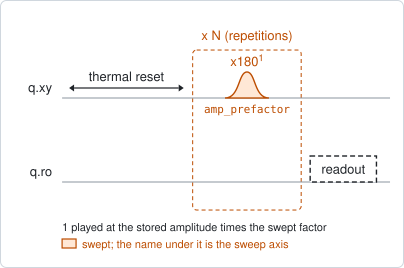
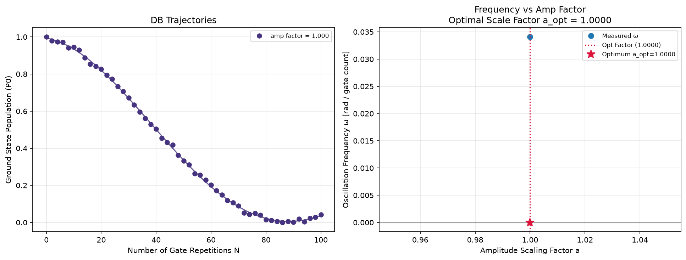
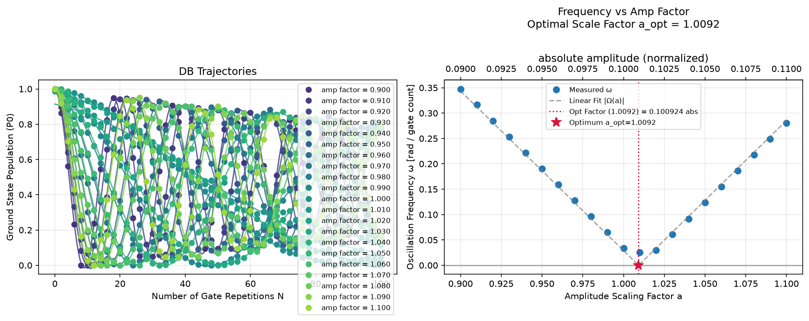

# qubit_deterministic_benchmarking

## Purpose

Measures how the error of one gate accumulates, and calibrates the gate's
amplitude from it. One gate is played N times in a row and N is swept. If the
gate rotates slightly too far or not far enough, the surplus adds up, and the
population oscillates slowly with N. The rate of that oscillation is the
rotation error per gate.

It has two uses.

- **Benchmark the gate as it is.** With the default single amplitude, the run
  shows the trajectory against N for the stored amplitude: how fast the error
  accumulates and how fast the contrast is lost.
- **Calibrate the amplitude.** With an amplitude sweep (`num_amp_points` above
  1), the rate is measured at each amplitude. It falls to zero at the correct
  amplitude and rises on both sides, and the zero is proposed.

Any of six gates can be benchmarked: `x180`, `y180`, `x90`, `y90`, `-x90`,
`-y90`. A pi gate calibrates `pi_amp`; a pi/2 gate calibrates `pi_amp_x90`, which
is how the pi/2 pulse gets an amplitude of its own instead of half the pi
pulse's.

It is far more sensitive than `qubit_power_rabi`, which sees the rotation error
once. Use it after power Rabi has the amplitude roughly right.

```
scqo run qubit_deterministic_benchmarking --targets q1
scqo run qubit_deterministic_benchmarking --targets q1 --set num_amp_points=21
scqo run qubit_deterministic_benchmarking --targets q1 --set target_gate=x90 --set num_amp_points=21
```

## Before running it

<!-- BEGIN generated: requires -->
GENERATED from `QubitDeterministicBenchmarking.requires` and its Parameters mixins - edit
the declaration, then run `python scripts/update_docs.py`.

The target is a `transmon` / `flux_transmon` / `fluxonium` carrying the operations `rx`, `readout`.

These device values must already be right:

| value | held by | used for | provided by |
|---|---|---|---|
| `pi_amp` | drive channel | the benchmarked gate is played at a factor of it, and it has to be close to right already (with the default `target_gate=x180 / y180`) | `qubit_deterministic_benchmarking`, `qubit_pi_pulse_error`, `qubit_power_rabi` |
| `drive_freq_hz` | drive channel | the gate has to be on resonance: a detuning accumulates with the repetitions as well | `qubit_ramsey`, `qubit_ramsey_flux_pulse`, `qubit_ramsey_phasor`, `qubit_spectroscopy` |
| `readout_freq_hz` | readout channel | the readout tone has to sit on the resonator | `readout_frequency`, `resonator_spectroscopy`, `resonator_spectroscopy_flux`, `resonator_spectroscopy_power_amp`, `resonator_spectroscopy_power_chain` |
| `readout_power_dbm` | readout channel | the readout has to be at its working power | `resonator_spectroscopy_power_amp`, `resonator_spectroscopy_power_chain` |
| `thermalization_time_s` | drive channel | how long the thermal reset waits (a per-run thermalization_time_ns replaces it) (with the default `reset_method=thermal`) | `qubit_relaxation` |

Needed only with a non-default setting:

| setting | value | held by | used for | provided by |
|---|---|---|---|---|
| `target_gate=x90 / y90 / -x90 / -y90` | `pi_amp_x90` | drive channel | the benchmarked gate is played at a factor of it, and it has to be close to right already | `qubit_deterministic_benchmarking` |
| `use_state_discrimination=true` | `readout_rotation_rad` | readout channel | the axis each shot is projected on before thresholding | no shared experiment; set it by hand (`scqo set`) or by a backend's own writeback |
| `use_state_discrimination=true` | `readout_threshold` | readout channel | splits \|0> from \|1> on that axis | no shared experiment; set it by hand (`scqo set`) or by a backend's own writeback |
| `reset_method=active` | `readout_rotation_rad` | readout channel | the reset measurement is discriminated on the rotated axis | no shared experiment; set it by hand (`scqo set`) or by a backend's own writeback |
| `reset_method=active` | `readout_threshold` | readout channel | decides whether the reset plays its pi pulse | no shared experiment; set it by hand (`scqo set`) or by a backend's own writeback |
| `reset_method=active` | `readout_depletion_s` | readout channel | the settle between the reset measurement and the first pulse | `resonator_spectroscopy` |

A backend may need more than this - a knob only it consumes. `scqo run qubit_deterministic_benchmarking --help` lists those where that driver is installed.
<!-- END generated: requires -->

## Pulse sequence



After the reset, the target gate is played N times at the stored amplitude times
the swept factor, and the qubit is read out. The amplitude factor is the outer
loop and N the inner one.

N runs from 0 to `max_repetitions` in steps of `step`. The default step is 2 for
a pi gate and 4 for a pi/2 gate, so that every N is a whole number of full
turns and a perfect gate would leave the qubit in its ground state at every
point. An explicit `repetitions` list replaces that grid, and an explicit
`amp_prefactors` list replaces the amplitude window and is played in the order
given.

## Theory

*To be written.*

## Outputs

<!-- BEGIN generated: outputs -->
GENERATED from `QubitDeterministicBenchmarking.writes` and `.extracts` - edit the
declaration, then run `python scripts/update_docs.py`.

Proposed by `update()`; each stays pending until it is accepted:

| field | held by | role | unit | meaning |
|---|---|---|---|---|
| `pi_amp` | drive channel | knob | - | Calibrated pi (x180) pulse amplitude. |
| `pi_amp_x90` | drive channel | knob | - | Calibrated pi/2 (x90) pulse amplitude. Independent of pi_amp: the pi/2 is calibrated in its own right, not derived as half the pi. |

Reported in `result.fit` and never written:

| fit key | meaning |
|---|---|
| `opt_amp_prefactor` | the factor of the stored amplitude at which the fitted error rate crosses zero; 1 when a single amplitude was measured |
| `old_pi_amp` | pi gates: the pi amplitude the run started from |
| `old_pi_amp_x90` | pi/2 gates: the pi/2 amplitude the run started from |
| `unit` | what the trajectories are plotted in: 'P0', the ground-state population on the run's own scale |
<!-- END generated: outputs -->

Which knob is written follows from the gate alone: a pi gate writes `pi_amp`, a
pi/2 gate writes `pi_amp_x90`, and the fit carries the matching `old_` value.

With a single amplitude nothing is fitted in amplitude: `opt_amp_prefactor` is
1 and the proposal is the stored value, unchanged.

A run is always `SUCCESSFUL`: there is no outcome test (BACKLOG I30). Read the
figure before accepting.

## Expected result



The default run, at the stored amplitude alone. The left panel is the
ground-state population against N with its fitted oscillation. The right panel
shows the one rate that was measured; the star at zero is only where the
analysis places an optimum when it has nothing to fit. Check that:

- the population starts at 1 and moves slowly. The slower the oscillation, the
  smaller the rotation error per gate;
- the fitted curve follows the points over the whole range of N.

With an amplitude sweep (`num_amp_points=21`):



The left panel now holds one trajectory per amplitude. The right panel is the
rate against the amplitude factor: a V whose tip is the correct amplitude. Check
that:

- the rate falls on one side of the tip and rises on the other, with points on
  both arms;
- the tip is inside the window and close to 1, and the star is on it;
- the two arms are straight lines.

## Traps

- **The analysis assumes the optimum is near the stored amplitude.** The sign of
  each rate is taken from whether its factor is above or below 1. A window whose
  optimum is somewhere else gives nearly one sign everywhere, the line fit goes
  flat, and the result is clipped to between 0.5 and 1.5 and still proposed as
  `SUCCESSFUL` (BACKLOG I30). Bring the stored amplitude close first, then use a
  window that straddles 1.
- **A rate above the fit's bound.** The fitted rate is bounded at 0.45 rad per
  gate, which is an amplitude error of about 14 % for a pi gate and 29 % for a
  pi/2 gate. A point further off than that is fitted at the bound, not at its
  real rate. Keep the amplitude window inside those limits.
- **Decay is not rotation error.** The contrast also falls with N through
  decoherence. That is fitted separately and does not move the tip, but a gate
  whose contrast is gone within a few repetitions leaves no oscillation to fit.

## References

- Related experiments: `qubit_power_rabi` (the coarse amplitude this starts
  from), `qubit_pi_pulse_error` (the same calibration for the pi pulse, sweeping
  the amplitude at a few fixed counts), `qubit_sqrb` (the average error over all
  gates).
- Code: `scqo/experiments/qubit_deterministic_benchmarking.py`,
  `scqo/experiments/_gate_target.py` (which knob a target gate writes),
  `scqat/estimators/qubit_deterministic_benchmarking/`.
