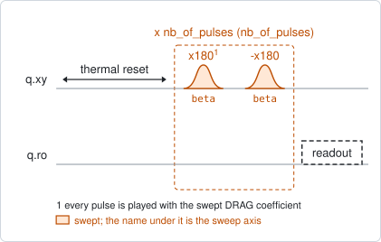
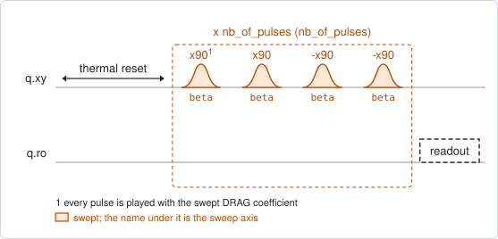
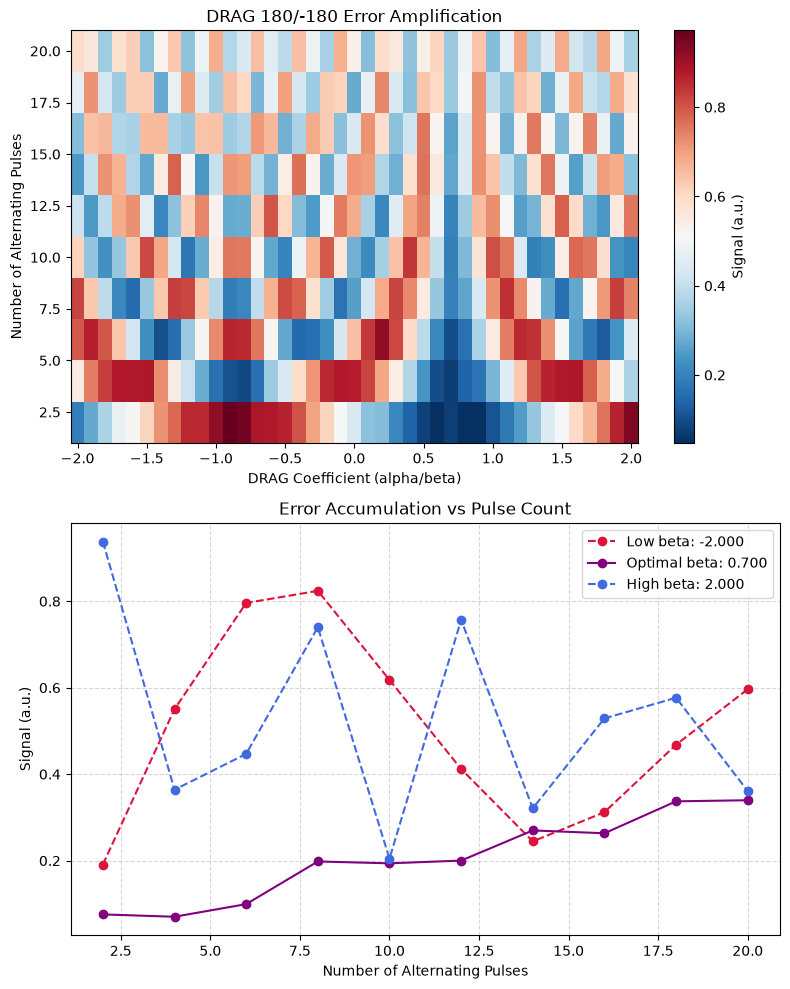

# qubit_drag_alternating

## Purpose

Calibrates the DRAG coefficient of a pulse by error amplification. A pulse
followed by the same pulse with the opposite sign should return the qubit to
where it started. With a wrong DRAG coefficient each pulse leaves a small phase
error, the opposite pulse does not undo it, and the error grows as the pair is
repeated. The coefficient is swept, the pair is repeated a varying number of
times, and the right coefficient is the one at which the signal does not move
with the number of repetitions.

`target_gate` chooses the pulse. `x180` tunes the pi pulse and proposes
`drag_beta`; `x90` tunes the pi/2 pulse and proposes `drag_beta_x90`. The two are
stored and calibrated separately.

`qubit_drag_equator` calibrates the same coefficient from two short sequences. It
is faster and less sensitive; this one amplifies the error and resolves it more
finely.

```
scqo run qubit_drag_alternating --targets q1
scqo run qubit_drag_alternating --targets q1 --set target_gate=x90 --set min_beta=-1 --set max_beta=1
```

## Before running it

<!-- BEGIN generated: requires -->
GENERATED from `QubitDragAlternating.requires` and its Parameters mixins - edit
the declaration, then run `python scripts/update_docs.py`.

The target is a `transmon` / `flux_transmon` / `fluxonium` carrying the operations `rx`, `readout`.

These device values must already be right:

| value | held by | used for | provided by |
|---|---|---|---|
| `drive_freq_hz` | drive channel | the pulses have to be on resonance: a detuning makes the pair leave the same kind of residue the DRAG term is tuned to remove | `qubit_ramsey`, `qubit_ramsey_flux_pulse`, `qubit_ramsey_phasor`, `qubit_spectroscopy` |
| `pi_amp` | drive channel | the rotation angle of the gate whose DRAG term is tuned (with the default `target_gate=x180`) | `qubit_deterministic_benchmarking`, `qubit_pi_pulse_error`, `qubit_power_rabi` |
| `readout_freq_hz` | readout channel | the readout tone has to sit on the resonator | `readout_frequency`, `resonator_spectroscopy`, `resonator_spectroscopy_flux`, `resonator_spectroscopy_power_amp`, `resonator_spectroscopy_power_chain` |
| `readout_power_dbm` | readout channel | the readout has to be at its working power | `resonator_spectroscopy_power_amp`, `resonator_spectroscopy_power_chain` |
| `thermalization_time_s` | drive channel | how long the thermal reset waits (a per-run thermalization_time_ns replaces it) (with the default `reset_method=thermal`) | `qubit_relaxation` |

Needed only with a non-default setting:

| setting | value | held by | used for | provided by |
|---|---|---|---|---|
| `target_gate=x90` | `pi_amp_x90` | drive channel | the rotation angle of the gate whose DRAG term is tuned | `qubit_deterministic_benchmarking` |
| `reset_method=active` | `readout_rotation_rad` | readout channel | the reset measurement is discriminated on the rotated axis | no shared experiment; set it by hand (`scqo set`) or by a backend's own writeback |
| `reset_method=active` | `readout_threshold` | readout channel | decides whether the reset plays its pi pulse | no shared experiment; set it by hand (`scqo set`) or by a backend's own writeback |
| `reset_method=active` | `readout_depletion_s` | readout channel | the settle between the reset measurement and the first pulse | `resonator_spectroscopy` |

A backend may need more than this - a knob only it consumes. `scqo run qubit_drag_alternating --help` lists those where that driver is installed.
<!-- END generated: requires -->

## Pulse sequence



After the reset, the pair `x180`, `-x180` is played `nb_of_pulses` times and the
qubit is read out. Both pulses carry the swept DRAG coefficient. The repetition
count runs from 2 to `max_pulses` in `num_pulse_points` steps, and for each count
the coefficient is swept from `min_beta` to `max_beta`.

With `target_gate=x90` one repetition is two `x90` followed by two `-x90`:



## Theory

*To be written.*

## Outputs

<!-- BEGIN generated: outputs -->
GENERATED from `QubitDragAlternating.writes` and `.extracts` - edit the
declaration, then run `python scripts/update_docs.py`.

Proposed by `update()`; each stays pending until it is accepted:

| field | held by | role | unit | meaning |
|---|---|---|---|---|
| `drag_beta` | drive channel | knob | - | DRAG coefficient for the pi gate (QM DragCosine coefficient, Qblox rxy.beta). |
| `drag_beta_x90` | drive channel | knob | - | DRAG coefficient for the pi/2 gate (QM DragCosine coefficient on the x90 storage node). |

Reported in `result.fit` and never written:

| fit key | meaning |
|---|---|
| `opt_beta` | the coefficient at which the signal varies least over the repetition count; proposed as drag_beta, or drag_beta_x90 for target_gate='x90' |
| `beta` | the DRAG coefficients that were swept |
| `nb_of_pulses` | the repetition counts that were swept |
<!-- END generated: outputs -->

For every coefficient the analysis takes the spread of the signal over the
repetition counts. It fits a parabola to that spread across the whole window and
takes its minimum; when the parabola has no minimum inside the window, it takes
the swept coefficient with the smallest spread instead.

A run is always `SUCCESSFUL`: the analysis has no test that can fail. Read the
figure before accepting the proposal.

## Expected result



The upper panel is the signal against the DRAG coefficient and the number of
repetitions. The lower panel shows three cuts through it: the lowest coefficient,
the chosen one, and the highest. Check that:

- one column of the map keeps the same colour from bottom to top. That column is
  the optimum; away from it the signal oscillates with the repetition count,
  faster the further away;
- the cut at the chosen coefficient is the flattest of the three;
- the chosen coefficient is inside the window, not on its edge.

The simulated data are schematic. They show the pattern to look for, with a slow
drift added to the chosen cut; they are not a model of a real pulse.

## Traps

- **Nothing fails this run.** A window that does not contain the optimum, a
  drive that is off resonance, a readout with no contrast: each still gives a
  coefficient and a `SUCCESSFUL` outcome.
- **The analysis reads the I quadrature as it comes.** The signal is not rotated
  onto the axis between the two states. A readout whose contrast lies in Q shows
  a flat map.
- **Other errors accumulate too.** A detuned drive or a wrong pulse amplitude
  also grows with the repetition count, and moves or blurs the flat column.
  Calibrate the frequency and the amplitude first.
- **The two gates have their own coefficients.** Tuning `x180` does not tune
  `x90`. Run it once for each.

## References

- Related experiments: `qubit_drag_equator` (the same coefficient from two short
  sequences), `qubit_power_rabi` and `qubit_pi_pulse_error` (the amplitude this
  needs), `qubit_sqrb` (shows whether the calibration improved the gates).
- Code: `scqo/experiments/qubit_drag_alternating.py`,
  `scqo/experiments/_gate_target.py` (which knob a target gate writes),
  `scqat/estimators/qubit_drag_alternating/`.
