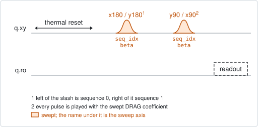
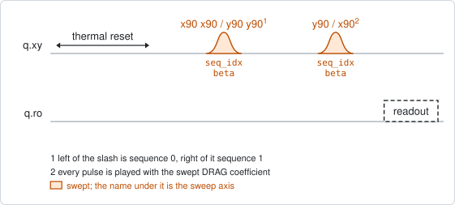
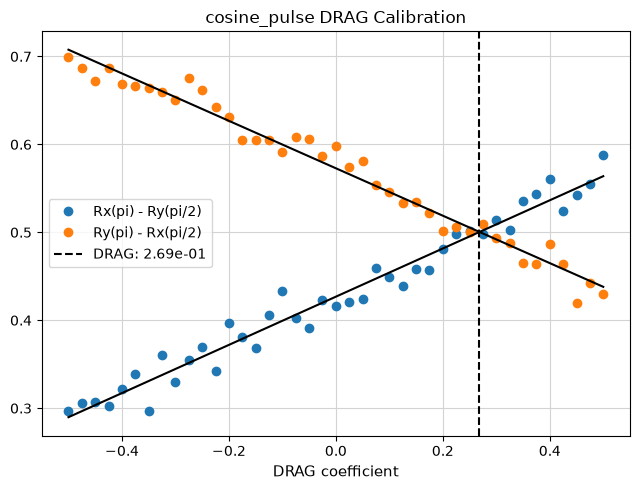

# qubit_drag_equator

## Purpose

Calibrates the DRAG coefficient of a pulse from two short sequences. Each
sequence is a pi pulse about one axis followed by a pi/2 pulse about the other:
`x180` then `y90`, and `y180` then `x90`. With clean pulses both leave the qubit
on the equator, and both read the same. A wrong DRAG coefficient tilts the two
final states in opposite directions, so the two signals move apart, linearly in
the coefficient. The coefficient is swept and the right one is where the two
lines cross.

`target_gate` chooses the pulse being tuned. `x180` proposes `drag_beta`; `x90`
replaces each pi pulse by two pi/2 pulses and proposes `drag_beta_x90`.

`qubit_drag_alternating` calibrates the same coefficient by repeating a pulse
pair many times. It is more sensitive and slower; this one is the quick
calibration.

```
scqo run qubit_drag_equator --targets q1
scqo run qubit_drag_equator --targets q1 --set target_gate=x90 --set min_beta=-1 --set max_beta=1
```

## Before running it

<!-- BEGIN generated: requires -->
GENERATED from `QubitDragEquator.requires` and its Parameters mixins - edit
the declaration, then run `python scripts/update_docs.py`.

The target is a `transmon` / `flux_transmon` / `fluxonium` carrying the operations `rx`, `readout`.

These device values must already be right:

| value | held by | used for | provided by |
|---|---|---|---|
| `drive_freq_hz` | drive channel | the pulses have to be on resonance: a detuning tilts the final state the same way a wrong DRAG coefficient does | `qubit_ramsey`, `qubit_ramsey_flux_pulse`, `qubit_ramsey_phasor`, `qubit_spectroscopy` |
| `pi_amp` | drive channel | the pi pulse that opens each sequence has to be a full rotation (with the default `target_gate=x180`) | `qubit_deterministic_benchmarking`, `qubit_pi_pulse_error`, `qubit_power_rabi` |
| `readout_freq_hz` | readout channel | the readout tone has to sit on the resonator | `readout_frequency`, `resonator_spectroscopy`, `resonator_spectroscopy_flux`, `resonator_spectroscopy_power_amp`, `resonator_spectroscopy_power_chain` |
| `readout_power_dbm` | readout channel | the readout has to be at its working power | `resonator_spectroscopy_power_amp`, `resonator_spectroscopy_power_chain` |
| `thermalization_time_s` | drive channel | how long the thermal reset waits (a per-run thermalization_time_ns replaces it) (with the default `reset_method=thermal`) | `qubit_relaxation` |

Needed only with a non-default setting:

| setting | value | held by | used for | provided by |
|---|---|---|---|---|
| `reset_method=active` | `readout_rotation_rad` | readout channel | the reset measurement is discriminated on the rotated axis | no shared experiment; set it by hand (`scqo set`) or by a backend's own writeback |
| `reset_method=active` | `readout_threshold` | readout channel | decides whether the reset plays its pi pulse | no shared experiment; set it by hand (`scqo set`) or by a backend's own writeback |
| `reset_method=active` | `readout_depletion_s` | readout channel | the settle between the reset measurement and the first pulse | `resonator_spectroscopy` |

A backend may need more than this - a knob only it consumes. `scqo run qubit_drag_equator --help` lists those where that driver is installed.
<!-- END generated: requires -->

Every sequence also ends in a pi/2 pulse, whose amplitude has to be right as
well. Which stored value that is depends on the backend, so it is listed with the
backend's own requirements.

## Pulse sequence



The diagram shows both sequences at once: left of each slash is sequence 0,
right of it sequence 1. After the reset, sequence 0 plays `x180` then `y90`, and
sequence 1 plays `y180` then `x90`; then the qubit is read out. Every pulse
carries the swept DRAG coefficient. The sequence index is the outer loop and the
coefficient the inner one.

With `target_gate=x90` the pi pulse is played as two pi/2 pulses:



## Theory

*To be written.*

## Outputs

<!-- BEGIN generated: outputs -->
GENERATED from `QubitDragEquator.writes` and `.extracts` - edit the
declaration, then run `python scripts/update_docs.py`.

Proposed by `update()`; each stays pending until it is accepted:

| field | held by | role | unit | meaning |
|---|---|---|---|---|
| `drag_beta` | drive channel | knob | - | DRAG coefficient for the pi gate (QM DragCosine coefficient, Qblox rxy.beta). |
| `drag_beta_x90` | drive channel | knob | - | DRAG coefficient for the pi/2 gate (QM DragCosine coefficient on the x90 storage node). |

Reported in `result.fit` and never written:

| fit key | meaning |
|---|---|
| `opt_beta` | the coefficient at which the two fitted lines cross; proposed as drag_beta, or drag_beta_x90 for target_gate='x90' |
| `beta` | the DRAG coefficients that were swept |
| `seq0` | the signal of sequence 0 (x180 then y90) at each coefficient |
| `seq1` | the signal of sequence 1 (y180 then x90) at each coefficient |
<!-- END generated: outputs -->

A straight line is fitted to each sequence's signal, and `opt_beta` is where the
two lines cross.

A run is `SUCCESSFUL` whenever the two lines are not parallel. That includes a
crossing outside the swept window, which is then an extrapolation (see the
traps).

## Expected result



The signal of the two sequences against the DRAG coefficient, each with its
fitted line, and a dashed line at the crossing. Check that:

- the two sets of points have slopes of opposite sign;
- they cross inside the window, with points on both sides of the crossing;
- each set follows its line. A curved set means the window is too wide for the
  straight-line model.

## Traps

- **A crossing outside the window is still proposed.** The lines are extended
  until they meet, wherever that is, and the run is `SUCCESSFUL`. If the dashed
  line is at or beyond an edge, move the window and run again.
- **`pulse_repetitions` does nothing.** The parameter is accepted and checked to
  be odd, but no probe reads it: each sequence plays one pi pulse (BACKLOG I19).
- **The analysis reads the I quadrature as it comes.** The signal is not rotated
  onto the axis between the two states. A readout whose contrast lies in Q gives
  two flat lines.
- **A detuned drive looks like a DRAG error.** It tilts the final states the same
  way. Calibrate the frequency first, with `qubit_ramsey`.
- **The two gates have their own coefficients.** Tuning `x180` does not tune
  `x90`. Run it once for each.

## References

- Related experiments: `qubit_drag_alternating` (the same coefficient by error
  amplification), `qubit_power_rabi` (the amplitude this needs), `qubit_sqrb`
  (shows whether the calibration improved the gates).
- Code: `scqo/experiments/qubit_drag_equator.py`,
  `scqo/experiments/_gate_target.py` (which knob a target gate writes),
  `scqat/estimators/qubit_drag_equator/`.
