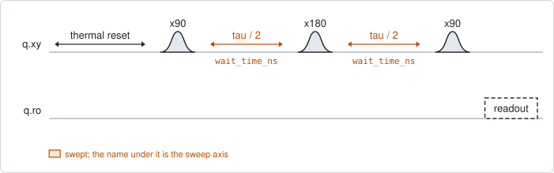
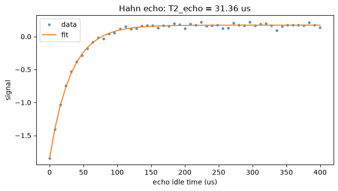

# qubit_echo

## Purpose

Measures the Hahn-echo coherence time, T2 echo. It is a Ramsey sequence with a
pi pulse in the middle of the idle. That pulse reverses the phase the qubit has
accumulated, so anything that stays the same over the two halves of the idle
cancels: a fixed detuning, and noise that is slow compared with the idle. What is
left decays with the total idle time, and the time constant is T2 echo.

T2 echo is therefore longer than the T2* of `qubit_ramsey`, and the gap between
them says how much of the dephasing is slow. Run it once the pi pulse is
calibrated.

```
scqo run qubit_echo --targets q1
scqo run qubit_echo --targets q1 --set max_wait_ns=800000 --set num_points=81
```

## Before running it

<!-- BEGIN generated: requires -->
GENERATED from `QubitEcho.requires` and its Parameters mixins - edit
the declaration, then run `python scripts/update_docs.py`.

The target is a `transmon` / `flux_transmon` / `fluxonium` carrying the operations `rx`, `readout`.

These device values must already be right:

| value | held by | used for | provided by |
|---|---|---|---|
| `drive_freq_hz` | drive channel | all three pulses have to be on resonance | `qubit_ramsey`, `qubit_ramsey_flux_pulse`, `qubit_ramsey_phasor`, `qubit_spectroscopy` |
| `pi_amp` | drive channel | the refocusing x180 has to be a full pi pulse | `qubit_deterministic_benchmarking`, `qubit_pi_pulse_error`, `qubit_power_rabi` |
| `readout_freq_hz` | readout channel | the readout tone has to sit on the resonator | `readout_frequency`, `resonator_spectroscopy`, `resonator_spectroscopy_flux`, `resonator_spectroscopy_power_amp`, `resonator_spectroscopy_power_chain` |
| `readout_power_dbm` | readout channel | the readout has to be at its working power | `resonator_spectroscopy_power_amp`, `resonator_spectroscopy_power_chain` |
| `thermalization_time_s` | drive channel | how long the thermal reset waits (a per-run thermalization_time_ns replaces it) (with the default `reset_method=thermal`) | `qubit_relaxation` |

Needed only with a non-default setting:

| setting | value | held by | used for | provided by |
|---|---|---|---|---|
| `use_state_discrimination=true` | `readout_rotation_rad` | readout channel | the axis each shot is projected on before thresholding | no shared experiment; set it by hand (`scqo set`) or by a backend's own writeback |
| `use_state_discrimination=true` | `readout_threshold` | readout channel | splits \|0> from \|1> on that axis | no shared experiment; set it by hand (`scqo set`) or by a backend's own writeback |
| `reset_method=active` | `readout_rotation_rad` | readout channel | the reset measurement is discriminated on the rotated axis | no shared experiment; set it by hand (`scqo set`) or by a backend's own writeback |
| `reset_method=active` | `readout_threshold` | readout channel | decides whether the reset plays its pi pulse | no shared experiment; set it by hand (`scqo set`) or by a backend's own writeback |
| `reset_method=active` | `readout_depletion_s` | readout channel | the settle between the reset measurement and the first pulse | `resonator_spectroscopy` |

A backend may need more than this - a knob only it consumes. `scqo run qubit_echo --help` lists those where that driver is installed.
<!-- END generated: requires -->

## Pulse sequence



After the reset: `x90`, half of the idle, `x180`, the other half, `x90`, and the
readout. The swept quantity is the total idle time; each arm is half of it. The
points are on a grid that keeps each arm a whole number of nanoseconds.

No artificial detuning is applied, so there is no fringe: the signal is a plain
decay.

## Theory

*To be written.*

## Outputs

<!-- BEGIN generated: outputs -->
GENERATED from `QubitEcho.writes` and `.extracts` - edit the
declaration, then run `python scripts/update_docs.py`.

Proposed by `update()`; each stays pending until it is accepted:

| field | held by | role | unit | meaning |
|---|---|---|---|---|
| `t2_echo_s` | qubit mode | fact | s | Hahn-echo coherence time T2_echo. |

Reported in `result.fit` and never written:

| fit key | meaning |
|---|---|
| `t2_echo_stderr_s` | the fit's standard error on T2 echo |
| `amplitude` | the fitted size of the decay, in the units of the reduced signal |
| `offset` | the level the decay settles to |
<!-- END generated: outputs -->

`t2_echo_s` is a fact about the sample; no instrument setting follows from it.

A run is `SUCCESSFUL` when the exponential fit succeeded.

## Expected result



The signal against the total idle time, with the fitted exponential. Check that:

- the curve has flattened by the end of the window;
- the first points are well away from the final level, so the decay has a clear
  amplitude.

Whether the curve rises or falls has no meaning: it depends on which state the
last pulse returns the qubit to and on the sign of the readout signal. Only the
time constant is read.

## Traps

- **A window shorter than the decay.** The default window is 400 us. If the curve
  is still moving at the last point the final level is extrapolated; lengthen
  `max_wait_ns`.
- **A pi pulse that is not a pi pulse.** The refocusing only works with a full
  rotation. An amplitude error leaves part of the phase unrefocused, and the
  result then depends on how far the drive is from the qubit. Calibrate `pi_amp`
  first.
- **The decay is not always exponential.** Slow noise gives an echo decay that
  starts flat and falls faster than an exponential. The fit here is a single
  exponential; when the points curve away from it systematically, the time
  constant is only a summary.

## References

- Related experiments: `qubit_ramsey` (T2*, the same sequence without the pi
  pulse), `qubit_relaxation` (T1, which bounds T2 echo at twice its value),
  `qubit_echo_flux_pulse` (this measurement against flux).
- Code: `scqo/experiments/qubit_echo.py`, `scqat/estimators/qubit_echo/`.
