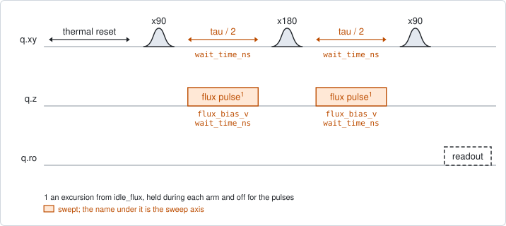
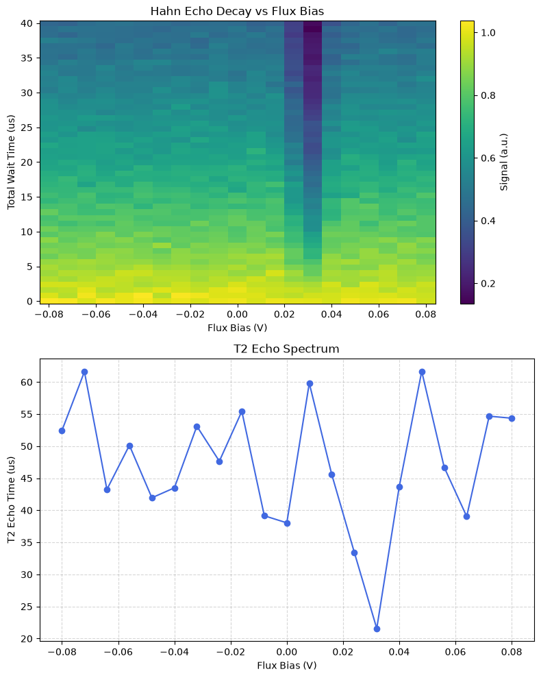

# qubit_echo_flux_pulse

## Purpose

Measures T2 echo against flux. It is `qubit_echo` repeated at a row of flux
values: the three pulses are played at the idle point, and during both halves of
the idle the qubit is moved by a flux pulse. Each flux value gives one decay and
one T2 echo, and together they are a T2 echo spectrum.

Away from its sweet spot a qubit's frequency depends on flux, so flux noise
dephases it; the spectrum shows how fast the coherence is lost with the distance
from the sweet spot, and where a defect makes it worse. Together with
`qubit_relaxation_flux_pulse` it tells relaxation from pure dephasing at each
flux.

The flux window is an excursion from `idle_flux`; 0 means "stay parked".

Nothing is written: the experiment records the spectrum.

```
scqo run qubit_echo_flux_pulse --targets q1
scqo run qubit_echo_flux_pulse --targets q1 --set max_wait_ns=200000 --set num_flux_points=41
```

## Before running it

<!-- BEGIN generated: requires -->
GENERATED from `QubitEchoFluxPulse.requires` and its Parameters mixins - edit
the declaration, then run `python scripts/update_docs.py`.

The target is a `transmon` / `flux_transmon` / `fluxonium` carrying the operations `rx`, `readout`, `flux_bias`.

These device values must already be right:

| value | held by | used for | provided by |
|---|---|---|---|
| `idle_flux` | flux line | the flux window is an excursion from this standing bias, where the pulses and the readout are played | `pair_zz_coupler`, `qubit_ramsey_flux_pulse`, `qubit_spectroscopy_flux_pulse`, `resonator_spectroscopy_flux` |
| `drive_freq_hz` | drive channel | all three pulses have to be on resonance at the idle flux, where they are played | `qubit_ramsey`, `qubit_ramsey_flux_pulse`, `qubit_ramsey_phasor`, `qubit_spectroscopy` |
| `pi_amp` | drive channel | the refocusing x180 has to be a full pi pulse | `qubit_deterministic_benchmarking`, `qubit_pi_pulse_error`, `qubit_power_rabi` |
| `readout_freq_hz` | readout channel | the readout tone has to sit on the resonator | `readout_frequency`, `resonator_spectroscopy`, `resonator_spectroscopy_flux`, `resonator_spectroscopy_power_amp`, `resonator_spectroscopy_power_chain` |
| `readout_power_dbm` | readout channel | the readout has to be at its working power | `resonator_spectroscopy_power_amp`, `resonator_spectroscopy_power_chain` |
| `thermalization_time_s` | drive channel | how long the thermal reset waits (a per-run thermalization_time_ns replaces it) (with the default `reset_method=thermal`) | `qubit_relaxation` |

Needed only with a non-default setting:

| setting | value | held by | used for | provided by |
|---|---|---|---|---|
| `use_state_discrimination=true` | `readout_rotation_rad` | readout channel | the axis each shot is projected on before thresholding | no shared experiment; set it by hand (`scqo set`) or by a backend's own writeback |
| `use_state_discrimination=true` | `readout_threshold` | readout channel | splits \|0> from \|1> on that axis | no shared experiment; set it by hand (`scqo set`) or by a backend's own writeback |
| `reset_method=active` | `readout_rotation_rad` | readout channel | the reset measurement is discriminated on the rotated axis | no shared experiment; set it by hand (`scqo set`) or by a backend's own writeback |
| `reset_method=active` | `readout_threshold` | readout channel | decides whether the reset plays its pi pulse | no shared experiment; set it by hand (`scqo set`) or by a backend's own writeback |
| `reset_method=active` | `readout_depletion_s` | readout channel | the settle between the reset measurement and the first pulse | `resonator_spectroscopy` |

A backend may need more than this - a knob only it consumes. `scqo run qubit_echo_flux_pulse --help` lists those where that driver is installed.
<!-- END generated: requires -->

## Pulse sequence



After the reset: `x90`, half of the idle, `x180`, the other half, `x90`, and the
readout. A flux pulse of the swept amplitude is held during each half and is off
while the three pulses play, so they are always played at the idle point. The
swept time is the total idle; each flux pulse lasts half of it. Flux is the outer
loop and the idle time the inner one.

## Theory

*To be written.*

## Outputs

<!-- BEGIN generated: outputs -->
GENERATED from `QubitEchoFluxPulse.writes` and `.extracts` - edit the
declaration, then run `python scripts/update_docs.py`.

Record-only: `update()` proposes nothing.

Reported in `result.fit` and never written:

| fit key | meaning |
|---|---|
| `flux_bias_v` | the flux excursions that were swept, in the order the fit holds them: the x axis of every list below |
| `t2_echo` | the fitted T2 echo at each excursion, in seconds |
| `t2_echo_stderr` | the fit's standard error on each T2 echo |
| `amplitude` | the fitted size of each decay |
| `offset` | the level each decay settles to |
| `old_idle_flux` | the idle flux the run started from: the origin of the excursions |
<!-- END generated: outputs -->

The fit holds one list per quantity, with one entry per flux value. The flux
values are excursions; add `old_idle_flux` to read them as absolute set-points.

A run is `SUCCESSFUL` when the decay fit succeeded at one flux value or more. It
does not say that every point of the spectrum is good.

## Expected result



The upper panel is the measured signal against the flux excursion and the total
idle time: each column is one decay. The lower panel is the T2 echo fitted from
each column. Check that:

- every column fades from bottom to top, so each decay is resolved;
- a dip is a dip in several neighbouring points and shows as a dark column above.
  The simulated device has one, 30 mV from the idle point.

The spectrum in this figure is rough away from the dip, and that is not physics.
The simulated T2 echo is about 50 us and the default window ends at 40 us, so no
column reaches its final level and each fit is poorly constrained. A real run
with the same mismatch looks the same.

## Traps

- **A window shorter than the decay.** The default longest idle is 40 us. Where
  T2 echo is longer than that, the fitted values scatter widely, as in the figure
  above. Set `max_wait_ns` to several times the longest T2 echo.
- **The excursion is in pulse volts.** A flux pulse moves the qubit somewhat less
  than the same DC step (BACKLOG I25), so the position of a feature is its
  position on this axis, not a DC set-point.

## References

- Related experiments: `qubit_echo` (one column of this map, and the experiment
  that writes `t2_echo_s`), `qubit_relaxation_flux_pulse` (the same map for T1),
  `qubit_spectroscopy_flux_pulse` (turns a flux into a qubit frequency).
- Code: `scqo/experiments/qubit_echo_flux_pulse.py`,
  `scqo/experiments/_capabilities/flux.py` (the two flux frames),
  `scqat/estimators/qubit_echo_flux/`.
