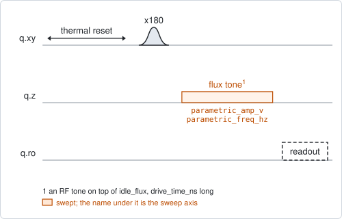
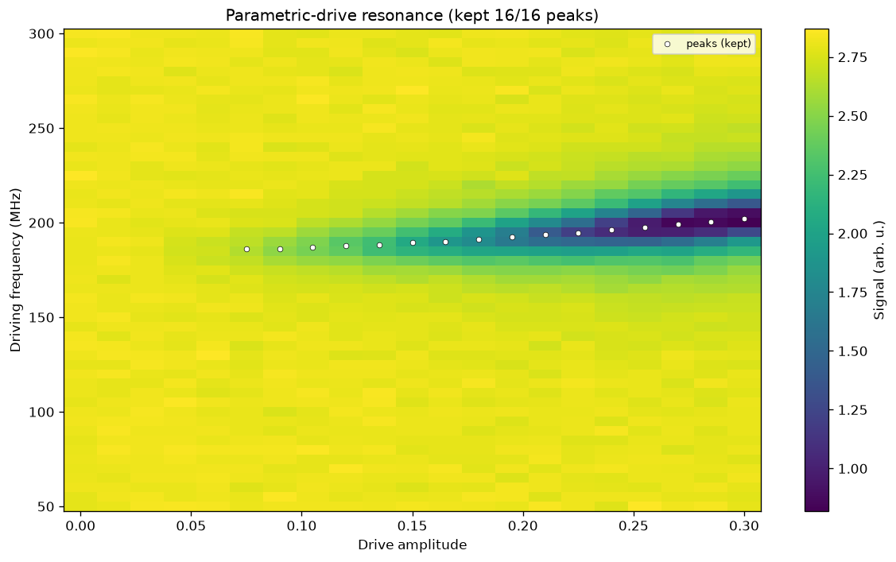

# qubit_parametric_drive_amp

## Purpose

Finds the frequencies at which shaking the qubit's flux empties the qubit into
something it is coupled to: its readout resonator, a coupler or a neighbouring
qubit.

An RF tone on the flux line modulates the qubit frequency. When the modulation
frequency matches the distance between the qubit and the other component, or a
fraction of it, the excitation moves across. The qubit is prepared in |e>, the
tone is played for a fixed time, and the qubit is read out. A map over the
tone's amplitude and frequency shows each such resonance as a line of lost
population.

The map answers two questions: at which frequency the resonance is, and how its
position and depth change with the amplitude. It is the first of two
experiments. `qubit_parametric_drive_time` then fixes the amplitude and sweeps
the time, to measure the coupling this map located.

Nothing is written back.

```
scqo run qubit_parametric_drive_amp --targets q1
scqo run qubit_parametric_drive_amp --targets q1 --set start_parametric_freq_hz=300e6 --set end_parametric_freq_hz=450e6 --set drive_time_ns=400
```

## Before running it

<!-- BEGIN generated: requires -->
GENERATED from `QubitParametricDriveAmp.requires` and its Parameters mixins - edit
the declaration, then run `python scripts/update_docs.py`.

The target is a `transmon` / `flux_transmon` / `fluxonium` carrying the operations `rx`, `readout`, `flux_bias`.

These device values must already be right:

| value | held by | used for | provided by |
|---|---|---|---|
| `drive_freq_hz` | drive channel | the x180 that prepares \|e> has to be on resonance | `qubit_ramsey`, `qubit_ramsey_flux_pulse`, `qubit_ramsey_phasor`, `qubit_spectroscopy` |
| `pi_amp` | drive channel | the x180 that prepares \|e> has to be a full pi pulse | `qubit_deterministic_benchmarking`, `qubit_pi_pulse_error`, `qubit_power_rabi` |
| `idle_flux` | flux line | the tone modulates the flux around this standing bias, which sets the qubit frequency being modulated | `pair_zz_coupler`, `qubit_ramsey_flux_pulse`, `qubit_spectroscopy_flux_pulse`, `resonator_spectroscopy_flux` |
| `readout_freq_hz` | readout channel | the readout tone has to sit on the resonator | `readout_frequency`, `resonator_spectroscopy`, `resonator_spectroscopy_flux`, `resonator_spectroscopy_power_amp`, `resonator_spectroscopy_power_chain` |
| `readout_power_dbm` | readout channel | the readout has to be at its working power | `resonator_spectroscopy_power_amp`, `resonator_spectroscopy_power_chain` |
| `thermalization_time_s` | drive channel | how long the thermal reset waits (a per-run thermalization_time_ns replaces it) (with the default `reset_method=thermal`) | `qubit_relaxation` |

Needed only with a non-default setting:

| setting | value | held by | used for | provided by |
|---|---|---|---|---|
| `use_state_discrimination=true` | `readout_rotation_rad` | readout channel | the axis each shot is projected on before thresholding | no shared experiment; set it by hand (`scqo set`) or by a backend's own writeback |
| `use_state_discrimination=true` | `readout_threshold` | readout channel | splits \|0> from \|1> on that axis | no shared experiment; set it by hand (`scqo set`) or by a backend's own writeback |
| `reset_method=active` | `readout_rotation_rad` | readout channel | the reset measurement is discriminated on the rotated axis | no shared experiment; set it by hand (`scqo set`) or by a backend's own writeback |
| `reset_method=active` | `readout_threshold` | readout channel | decides whether the reset plays its pi pulse | no shared experiment; set it by hand (`scqo set`) or by a backend's own writeback |
| `reset_method=active` | `readout_depletion_s` | readout channel | the settle between the reset measurement and the first pulse | `resonator_spectroscopy` |

A backend may need more than this - a knob only it consumes. `scqo run qubit_parametric_drive_amp --help` lists those where that driver is installed.
<!-- END generated: requires -->

## Pulse sequence



After the reset: an `x180` to prepare |e>, the tone on the flux line for
`drive_time_ns`, and the readout.

The tone rides on the idle flux. Its amplitude is in volts and its frequency in
Hz, both absolute: there is no stored value they could be relative to. The two
edges of each window may be given in either order; the axis always runs upward.
The amplitude is the outer loop and the frequency the inner one, so each row of
the map is a spectrum at one amplitude.

The row at amplitude 0 plays no tone. It is the baseline the others are compared
with.

## Theory

*To be written.*

## Outputs

<!-- BEGIN generated: outputs -->
GENERATED from `QubitParametricDriveAmp.writes` and `.extracts` - edit the
declaration, then run `python scripts/update_docs.py`.

Record-only: `update()` proposes nothing.

Reported in `result.fit` and never written:

| fit key | meaning |
|---|---|
| `n_peaks` | how many lines the row-by-row fits found over the whole map |
| `n_good` | how many of those lines were kept; at least one makes the run SUCCESSFUL |
| `n_outlier` | how many were dropped as outliers |
| `best_parametric_freq_hz` | the frequency of the strongest kept line; absent when no line was kept |
| `best_parametric_amp_v` | the amplitude row that line was found in |
| `best_fwhm_hz` | that line's fitted width; a real line is a small fraction of the swept window |
| `best_peak_amplitude` | that line's fitted height, always positive: a dip is inverted before the fit |
<!-- END generated: outputs -->

Each amplitude row is searched for a line, whether it is a dip or a peak. The
lines of all rows are then compared, and those that do not fit the others are
dropped as outliers. The `best_` keys describe the strongest line that was kept.

A run is `SUCCESSFUL` when at least one line was kept.

## Expected result



The readout signal against the tone's amplitude and frequency. The white dots
are the lines that were kept, one per row. Check that:

- the rows at small amplitude are flat: with no tone nothing is lost;
- a line appears above some amplitude, gets deeper as the amplitude grows, and
  moves smoothly in frequency;
- the dots follow the line and do not jump between rows.

In the figure the signal is the raw readout, in arbitrary units; with
`use_state_discrimination` the colour is the population of |e>.

## Traps

- **`best_peak_amplitude` is always positive.** A dip is inverted before it is
  fitted, so the sign does not tell a dip from a peak (`BACKLOG.md` F12). Judge
  a line by `best_fwhm_hz`: a real line is narrow compared with the window.
- **The strongest line is not an operating point.** The `best_` keys name the
  row where the line is deepest. The line deepens with the amplitude, so that is
  usually the top row. Choose the amplitude from the map.
- **A time that is too short or too long.** A longer `drive_time_ns` makes the
  lines narrower and deepens weak ones. But the excitation moves across and
  back, so a line can also be shallow because the time is a full period of that
  exchange. `qubit_parametric_drive_time` shows the exchange itself.
- **Too large an amplitude.** The tone adds to the idle flux, and the backend
  refuses a sum beyond the range of the flux output.

## References

- Related experiments: `qubit_parametric_drive_time` (the same tone against
  time, at a fixed amplitude), `qubit_spectroscopy_flux_pulse` (how the qubit
  frequency depends on the flux).
- Code: `scqo/experiments/qubit_parametric_drive_amp.py`,
  `scqat/estimators/parametric_drive_resonance/`, `scqat/tools/peak_map.py`.
