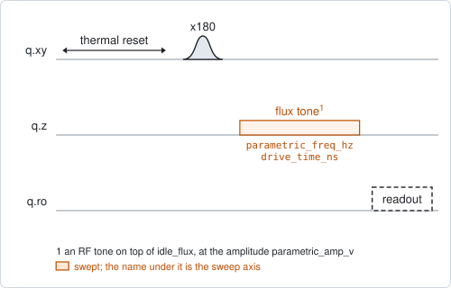
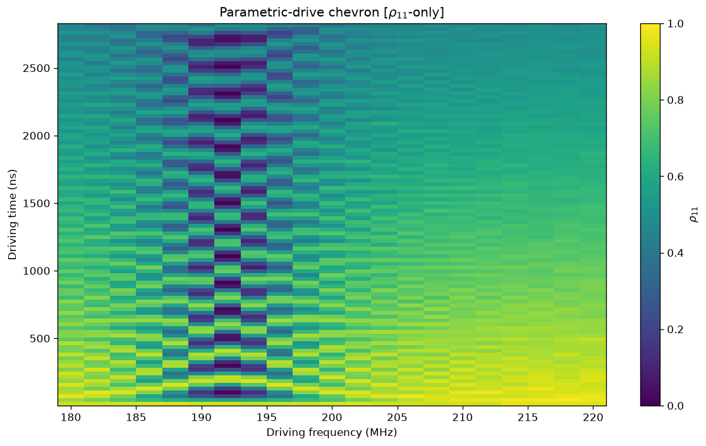

# qubit_parametric_drive_time

## Purpose

Measures how the qubit's excitation moves to a coupled component and back while
an RF tone on the flux line holds the two in resonance, and from that how strong
the coupling is and how fast the excitation is lost on the way.

`qubit_parametric_drive_amp` finds the frequency of such a resonance and a
usable amplitude. This experiment takes that amplitude, sweeps the frequency in
a narrow window around the resonance, and sweeps the time the tone is on. At
each frequency the population of |e> oscillates in time: on resonance slowly and
with full depth, away from it faster and shallower. The map over frequency and
time is called a chevron.

For each frequency the oscillation is fitted with a model of an exchange with a
lossy partner. The fit gives the coupling rate, the loss rate and the remaining
detuning.

Nothing is written back.

```
scqo run qubit_parametric_drive_time --targets q1 --set use_state_discrimination=true
scqo run qubit_parametric_drive_time --targets q1 --set use_state_discrimination=true --set parametric_amp_v=0.2 --set start_parametric_freq_hz=365e6 --set end_parametric_freq_hz=380e6 --set end_drive_time_ns=600
```

## Before running it

<!-- BEGIN generated: requires -->
GENERATED from `QubitParametricDriveTime.requires` and its Parameters mixins - edit
the declaration, then run `python scripts/update_docs.py`.

The target is a `transmon` / `flux_transmon` / `fluxonium` carrying the operations `rx`, `readout`, `flux_bias`.

These device values must already be right:

| value | held by | used for | provided by |
|---|---|---|---|
| `drive_freq_hz` | drive channel | the x180 that prepares \|e> has to be on resonance | `qubit_ramsey`, `qubit_ramsey_flux_pulse`, `qubit_ramsey_phasor`, `qubit_spectroscopy` |
| `pi_amp` | drive channel | the x180 that prepares \|e> has to be a full pi pulse | `qubit_deterministic_benchmarking`, `qubit_pi_pulse_error`, `qubit_power_rabi` |
| `idle_flux` | flux line | the tone modulates the flux around this standing bias, which sets the qubit frequency being modulated | `pair_zz_coupler`, `qubit_ramsey_flux_pulse`, `qubit_spectroscopy_flux_pulse`, `resonator_spectroscopy_flux` |
| `readout_freq_hz` | readout channel | the readout tone has to sit on the resonator | `readout_frequency`, `resonator_spectroscopy`, `resonator_spectroscopy_flux`, `resonator_spectroscopy_power_amp`, `resonator_spectroscopy_power_chain` |
| `readout_power_dbm` | readout channel | the readout has to be at its working power | `resonator_spectroscopy_power_amp`, `resonator_spectroscopy_power_chain` |
| `thermalization_time_s` | drive channel | how long the thermal reset waits (a per-run thermalization_time_ns replaces it) (with the default `reset_method=thermal`) | `qubit_relaxation` |

Needed only with a non-default setting:

| setting | value | held by | used for | provided by |
|---|---|---|---|---|
| `use_state_discrimination=true` | `readout_rotation_rad` | readout channel | the axis each shot is projected on before thresholding | no shared experiment; set it by hand (`scqo set`) or by a backend's own writeback |
| `use_state_discrimination=true` | `readout_threshold` | readout channel | splits \|0> from \|1> on that axis | no shared experiment; set it by hand (`scqo set`) or by a backend's own writeback |
| `reset_method=active` | `readout_rotation_rad` | readout channel | the reset measurement is discriminated on the rotated axis | no shared experiment; set it by hand (`scqo set`) or by a backend's own writeback |
| `reset_method=active` | `readout_threshold` | readout channel | decides whether the reset plays its pi pulse | no shared experiment; set it by hand (`scqo set`) or by a backend's own writeback |
| `reset_method=active` | `readout_depletion_s` | readout channel | the settle between the reset measurement and the first pulse | `resonator_spectroscopy` |

A backend may need more than this - a knob only it consumes. `scqo run qubit_parametric_drive_time --help` lists those where that driver is installed.
<!-- END generated: requires -->

Run it with `use_state_discrimination=true`. The fit works on the population of
|e>. On raw I/Q it still runs, and reports rates that are not physical.

Take the frequency window and the amplitude from a `qubit_parametric_drive_amp`
map. The default window is a narrow example, not a search.

## Pulse sequence



After the reset: an `x180` to prepare |e>, the tone on the flux line, and the
readout.

The tone rides on the idle flux at the fixed amplitude `parametric_amp_v`. Its
frequency and the time it is on are swept. The time axis is on a 4 ns grid. The
frequency is the outer loop and the time the inner one, so each row of data is
one oscillation in time.

## Theory

*To be written.*

## Outputs

<!-- BEGIN generated: outputs -->
GENERATED from `QubitParametricDriveTime.writes` and `.extracts` - edit the
declaration, then run `python scripts/update_docs.py`.

Record-only: `update()` proposes nothing.

Reported in `result.fit` and never written:

| fit key | meaning |
|---|---|
| `n_freq` | how many drive frequencies were measured |
| `n_decoh_ok` | at how many of them the fit converged; at least one makes the run SUCCESSFUL |
| `n_underdamped` | at how many the fitted exchange oscillates instead of only decaying |
| `best_parametric_freq_hz` | the frequency with the largest best_ep_metric; not the resonance (BACKLOG I32) |
| `best_ep_metric` | 8 lambda^2 / gamma^2 at that frequency: how coherent the exchange is there |
| `best_gamma_hz` | the fitted loss rate there; despite the name an angular rate in 1/s (BACKLOG I32) |
| `best_lambda_hz` | the fitted coupling rate there; an angular rate in 1/s |
| `best_delta_hz` | the fitted residual detuning there; an angular rate in 1/s |
<!-- END generated: outputs -->

The `best_` keys belong to the frequency with the largest `best_ep_metric`. That
number is 8 times the coupling rate squared over the loss rate squared; a large
value means the exchange oscillates many times before it decays.

A run is `SUCCESSFUL` when the fit converged at one frequency or more.

## Expected result



The population of |e> against the tone's frequency and the time it is on. Check
that:

- at time 0 every frequency starts near 1;
- one frequency shows the slowest and deepest oscillation: that is the
  resonance;
- on both sides of it the oscillation gets faster and shallower, which gives the
  pattern its V shape;
- several periods fit into the time window at the resonance.

Two more figures are in the run folder: the fitted oscillation at each
frequency, and the fitted rates against frequency.

The figure is from a run with `use_state_discrimination=true`. The simulated
resonance is near 192 MHz.

## Traps

- **Raw I/Q.** Without `use_state_discrimination` the rates come out in units of
  the readout signal per time. They look like numbers and mean nothing.
- **`best_parametric_freq_hz` is not the resonance.** It is the frequency with
  the largest `best_ep_metric`, which can sit beside the resonance, and a fit
  with a loss rate near 0 wins with an enormous value (`BACKLOG.md` I32). Read
  the resonance off the map.
- **The rates are not in Hz.** `best_gamma_hz`, `best_lambda_hz` and
  `best_delta_hz` are angular rates in 1/s, despite their names (`BACKLOG.md`
  I32). Divide by 2 pi for a frequency.
- **The reference line in the rates figure.** It is drawn at a metric of 1,
  while the model changes from oscillating to decaying at 1/2 (`BACKLOG.md`
  I32).
- **Windows that do not match.** The coupling rate sets both the period of the
  oscillation and the width of the chevron in frequency. A frequency window much
  wider than that width steps over the resonance, and every fit then converges
  on nothing. Keep several frequency steps inside the chevron and several
  periods inside the time window.
- **A window that is a search.** This experiment cannot find a resonance in a
  wide band. Use `qubit_parametric_drive_amp` for that.

## References

- Related experiments: `qubit_parametric_drive_amp` (finds the resonance and the
  amplitude this one needs).
- Code: `scqo/experiments/qubit_parametric_drive_time.py`,
  `scqat/estimators/parametric_drive_decoherence/`.
