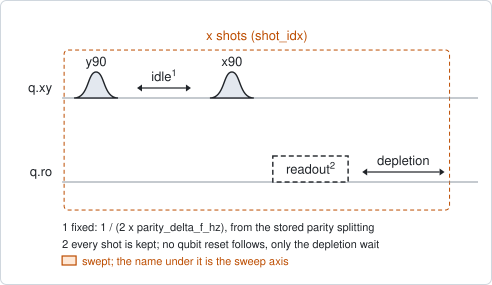
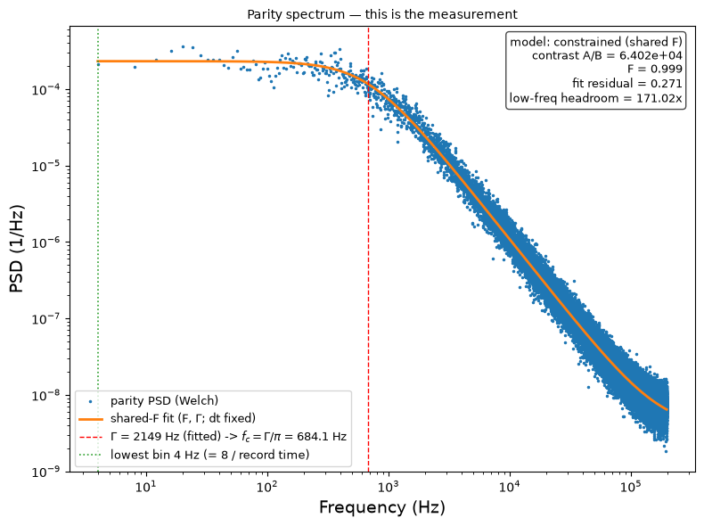

# qubit_parity_switch_continuous

## Purpose

Measures how often the charge parity of a transmon switches. A quasiparticle
that tunnels across the junction changes the parity, and the qubit frequency
jumps between two values a small splitting apart. The rate of those jumps is a
property of the chip and its environment, recorded as `parity_rate_hz`.

The splitting is too small to see in one readout, so the experiment maps the
parity onto the qubit state. With the drive midway between the two frequencies,
a Ramsey sequence whose idle is half a period of the splitting turns the two
parities into opposite phases of a quarter turn each. A second pulse about the
perpendicular axis turns those into opposite poles. Repeated without pause, this
gives one sample of the parity per shot, and the parity over time is a signal
that jumps at random between two levels.

The rate is read from the spectrum of that signal. A random two-level signal has
a flat spectrum up to a corner frequency and falls off above it; the switching
rate is pi times the corner.

This is the variant with the shortest shot. `qubit_parity_switch_discrete`
measures twice per cycle and can sample slowly without harm.

```
scqo run qubit_parity_switch_continuous --targets q1
scqo run qubit_parity_switch_continuous --targets q1 --set record_time_s=60 --set idle_multiple=3
```

## Before running it

<!-- BEGIN generated: requires -->
GENERATED from `QubitParitySwitchContinuous.requires` and its Parameters mixins - edit
the declaration, then run `python scripts/update_docs.py`.

The target is a `transmon` / `flux_transmon` carrying the operations `rx`, `readout`.

These device values must already be right:

| value | held by | used for | provided by |
|---|---|---|---|
| `parity_delta_f_hz` | drive channel | the fixed idle is half a period of this splitting (a per-run idle_time_ns replaces it) | `qubit_ramsey` |
| `drive_freq_hz` | drive channel | the drive has to sit midway between the two parity branches, where an accepted beat-model qubit_ramsey puts it | `qubit_ramsey`, `qubit_ramsey_flux_pulse`, `qubit_ramsey_phasor`, `qubit_spectroscopy` |
| `pos_g_i` | readout channel | the stored centre of the \|g> cloud: each shot is assigned to the nearer centre (with the default `use_state_discrimination=false`) | `single_shot_readout` |
| `pos_g_q` | readout channel | the stored centre of the \|g> cloud: each shot is assigned to the nearer centre (with the default `use_state_discrimination=false`) | `single_shot_readout` |
| `pos_e_i` | readout channel | the stored centre of the \|e> cloud: each shot is assigned to the nearer centre (with the default `use_state_discrimination=false`) | `single_shot_readout` |
| `pos_e_q` | readout channel | the stored centre of the \|e> cloud: each shot is assigned to the nearer centre (with the default `use_state_discrimination=false`) | `single_shot_readout` |
| `readout_freq_hz` | readout channel | the readout tone has to sit on the resonator | `readout_frequency`, `resonator_spectroscopy`, `resonator_spectroscopy_flux`, `resonator_spectroscopy_power_amp`, `resonator_spectroscopy_power_chain` |
| `readout_power_dbm` | readout channel | the readout has to be at its working power | `resonator_spectroscopy_power_amp`, `resonator_spectroscopy_power_chain` |
| `readout_depletion_s` | readout channel | the only wait between two shots, so it is part of the shot period the rate is counted in (a per-run readout_depletion_ns replaces it) | `resonator_spectroscopy` |

Needed only with a non-default setting:

| setting | value | held by | used for | provided by |
|---|---|---|---|---|
| `use_state_discrimination=true` | `readout_rotation_rad` | readout channel | the axis each shot is projected on before thresholding | no shared experiment; set it by hand (`scqo set`) or by a backend's own writeback |
| `use_state_discrimination=true` | `readout_threshold` | readout channel | splits \|0> from \|1> on that axis | no shared experiment; set it by hand (`scqo set`) or by a backend's own writeback |

A backend may need more than this - a knob only it consumes. `scqo run qubit_parity_switch_continuous --help` lists those where that driver is installed.
<!-- END generated: requires -->

The splitting and the drive frequency both come from one run: `qubit_ramsey`
with `ramsey_model=beat`. Accepting it stores `parity_delta_f_hz` and moves the
drive to the middle of the two branches.

The target has to be a transmon. The run is refused before any instrument time
when the splitting, the depletion wait or, on the I/Q path, the stored centres
are missing.

## Pulse sequence



One shot is `y90`, the idle, `x90`, the readout, and the depletion wait. The
shots follow each other with nothing in between.

There is no qubit reset, and that is required. The sequence flips the qubit when
the parity is odd and leaves it when the parity is even, starting from wherever
the previous readout left it. Each readout therefore differs from the previous
one exactly when the parity is odd. A reset between shots would remove what the
next shot is compared with.

The idle is 1 / (2 x `parity_delta_f_hz`), on a 4 ns grid. With `idle_multiple`
it is that many times longer; only odd values carry a signal.

The number of shots follows from `record_time_s` and the length of one shot.

## Theory

*To be written.*

## Outputs

<!-- BEGIN generated: outputs -->
GENERATED from `QubitParitySwitchContinuous.writes` and `.extracts` - edit the
declaration, then run `python scripts/update_docs.py`.

Proposed by `update()`; each stays pending until it is accepted:

| field | held by | role | unit | meaning |
|---|---|---|---|---|
| `parity_rate_hz` | qubit mode | fact | Hz | Charge-parity (quasiparticle-tunneling) switching rate, per direction: pi x the Lorentzian corner of the parity-telegraph PSD measured by qubit_parity_switch_continuous or qubit_parity_switch_discrete. |

Reported in `result.fit` and never written:

| fit key | meaning |
|---|---|
| `psd_corner_hz` | the corner frequency of the fitted spectrum; the rate is pi times this |
| `psd_amplitude` | the fitted low-frequency plateau of the spectrum |
| `psd_white_floor` | the fitted flat floor of the spectrum |
| `n_parity_switches` | how many times the parity series changes value |
| `p_switch` | the fraction of consecutive parity samples that differ; 0.5 means they are independent and no rate can be read |
| `p_parity_odd` | the fraction of samples in the odd parity; about 0.5 is healthy and says nothing about the rate |
| `psd_freq_min_hz` | the lowest frequency of the spectrum, 8 / the record time: the slowest rate the run can see |
| `psd_contrast` | the plateau over the floor; below 3 there is no knee and the run fails |
| `corner_margin_low` | the corner frequency over the lowest frequency; below about 5 a longer record is needed |
| `psd_fit_residual` | the rms residual of the spectrum fit, in the logarithm |
| `mapping_fidelity` | how faithfully the sequence maps the parity onto the readout, 1 being perfect |
| `mapping_fidelity_floor` | the same from the floor alone; only with psd_model=independent, else NaN |
| `mapping_fidelity_ratio` | the plateau estimate over the floor estimate; only with psd_model=independent, else NaN |
| `shot_period_s` | the time from one parity sample to the next: the time base the rate is counted in |
| `record_time_s` | the length of the record that was taken: the number of samples times shot_period_s |
| `requested_record_time_s` | the record_time_s that was asked for |
| `idle_time_ns` | the idle that was played |
| `parity_delta_f_hz` | the stored splitting the idle was derived from; NaN when idle_time_ns was given |
| `outlier_probability` | the fraction of shots far from both stored centres; reported on the I/Q path only |
| `idle_multiple` | the idle_multiple the run was taken with |
<!-- END generated: outputs -->

The readout trace is not the parity. The parity series is the difference between
each shot and the one before it, and the spectrum of that series is what is
fitted.

With the default `psd_model=constrained` the fit has two parameters: the rate,
and the fidelity with which the sequence maps the parity onto the readout. With
`psd_model=independent` the floor of the spectrum is fitted freely as well.

`parity_rate_hz` is the rate of switching in one direction.

A run is `SUCCESSFUL` when all of these hold:

- the fitted corner is inside the measured spectrum, and the plateau is at
  least 3 times the floor;
- the rate is below half the sampling rate;
- the odd parity is seen in between 2 % and 98 % of the samples.

## Expected result



The spectrum of the parity series, with the fit. The dashed line is the corner
and the dotted line the lowest frequency the record reaches. Check that:

- the spectrum is flat at low frequency and falls off above the corner;
- the corner is well above the dotted line. The box gives the ratio as the
  low-frequency headroom; below about 5 the record is too short;
- the contrast in the box is large. A value near 1 means there is no knee, only
  noise.

Other figures in the run folder show the first shots as a time trace, the shots
in the I/Q plane, and the spectrum of the raw readout, which is not fitted.

The figure is from a run with `record_time_s=2`. The simulated device has a shot
of 2.5 us, so the default 30 s would be more shots than `max_num_shots` allows.
The simulated rate is about 2 kHz, far faster than on a real chip.

## Traps

- **The readout has to be very good.** One wrong readout spoils two parity
  samples, the one before and the one after. The rate then comes out too high
  by the factor 1 + 2 x error / (rate x shot period).
- **A record that is too short.** The lowest frequency of the spectrum is
  8 / `record_time_s`. A corner near it is fitted from a few points. Aim for a
  record longer than 130 / rate.
- **An even `idle_multiple`.** The two parities then end on the same pole and
  the run carries no signal. It is allowed, with a warning, and the fit fails.
- **A long idle against T2\*.** The contrast falls as the idle approaches T2\*.
  This is not checked.
- **`p_parity_odd` near 0.5 is healthy.** The chip spends about half its time in
  each parity. It says nothing about the rate.
- **A stale splitting.** A derived idle beyond `max_derived_idle_ns` is refused:
  the stored splitting is then too small to be real. Run the beat-model Ramsey
  again.
- **Slowing down the cadence.** A longer wait between shots lets the qubit decay
  between two readouts, which breaks the comparison between them. Use
  `qubit_parity_switch_discrete` to sample slowly.

## References

- Related experiments: `qubit_ramsey` with `ramsey_model=beat` (measures the
  splitting and centres the drive), `qubit_parity_switch_discrete` (two
  measurements per cycle, for slow sampling), `single_shot_readout` (the stored
  centres), `resonator_spectroscopy` (the depletion wait).
- Code: `scqo/experiments/qubit_parity_switch_continuous.py`,
  `scqat/estimators/parity_switch_continuous/`,
  `scqat/tools/telegraph_psd.py`.
