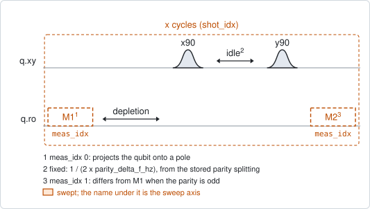
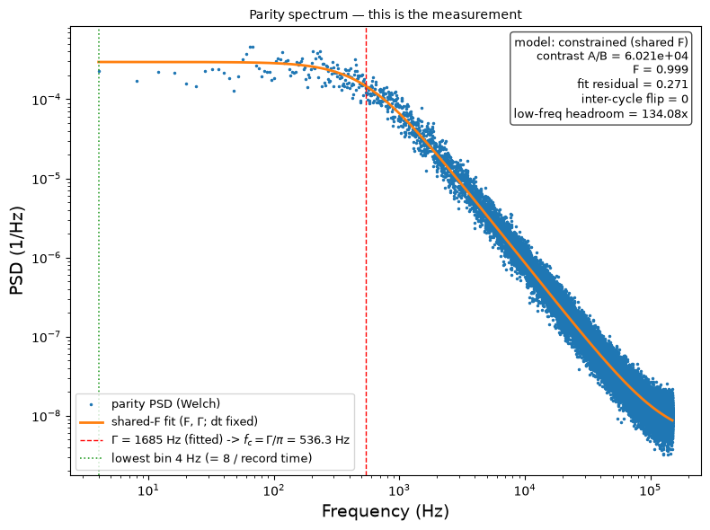

# qubit_parity_switch_discrete

## Purpose

Measures how often the charge parity of a transmon switches, like
`qubit_parity_switch_continuous`, but with two measurements in every cycle. The
first measurement fixes the state the cycle starts from, and the second reads
what the parity did to it. The parity of a cycle is the difference between its
own two measurements.

That makes each cycle complete in itself, and it is the reason for this variant:
the cycles may be far apart. A long wait between cycles lets the qubit decay,
but the next cycle starts with a fresh measurement, so no parity sample is
spoiled. Sampling slowly reaches low switching rates with fewer samples.

The price is two readouts per parity sample.

The rate is read from the spectrum of the parity series, as in the continuous
variant: the spectrum of a signal that jumps at random between two levels is
flat up to a corner frequency, and the switching rate is pi times the corner.

```
scqo run qubit_parity_switch_discrete --targets q1
scqo run qubit_parity_switch_discrete --targets q1 --set cycle_period_ns=200000 --set record_time_s=120
```

## Before running it

<!-- BEGIN generated: requires -->
GENERATED from `QubitParitySwitchDiscrete.requires` and its Parameters mixins - edit
the declaration, then run `python scripts/update_docs.py`.

The target is a `transmon` / `flux_transmon` carrying the operations `rx`, `readout`.

These device values must already be right:

| value | held by | used for | provided by |
|---|---|---|---|
| `parity_delta_f_hz` | drive channel | the fixed idle is half a period of this splitting (a per-run idle_time_ns replaces it) | `qubit_ramsey` |
| `drive_freq_hz` | drive channel | the drive has to sit midway between the two parity branches, where an accepted beat-model qubit_ramsey puts it | `qubit_ramsey`, `qubit_ramsey_flux_pulse`, `qubit_ramsey_phasor`, `qubit_spectroscopy` |
| `pos_g_i` | readout channel | the stored centre of the \|g> cloud: each shot is assigned to the nearer centre (with the default `use_state_discrimination=false`) | `single_shot_readout` |
| `pos_g_q` | readout channel | the stored centre of the \|g> cloud: each shot is assigned to the nearer centre (with the default `use_state_discrimination=false`) | `single_shot_readout` |
| `pos_e_i` | readout channel | the stored centre of the \|e> cloud: each shot is assigned to the nearer centre (with the default `use_state_discrimination=false`) | `single_shot_readout` |
| `pos_e_q` | readout channel | the stored centre of the \|e> cloud: each shot is assigned to the nearer centre (with the default `use_state_discrimination=false`) | `single_shot_readout` |
| `readout_freq_hz` | readout channel | the readout tone has to sit on the resonator | `readout_frequency`, `resonator_spectroscopy`, `resonator_spectroscopy_flux`, `resonator_spectroscopy_power_amp`, `resonator_spectroscopy_power_chain` |
| `readout_power_dbm` | readout channel | the readout has to be at its working power | `resonator_spectroscopy_power_amp`, `resonator_spectroscopy_power_chain` |
| `readout_depletion_s` | readout channel | the wait after the first measurement, for its photons to leave before the pulses, and part of the cycle period (a per-run readout_depletion_ns replaces it) | `resonator_spectroscopy` |

Needed only with a non-default setting:

| setting | value | held by | used for | provided by |
|---|---|---|---|---|
| `use_state_discrimination=true` | `readout_rotation_rad` | readout channel | the axis each shot is projected on before thresholding | no shared experiment; set it by hand (`scqo set`) or by a backend's own writeback |
| `use_state_discrimination=true` | `readout_threshold` | readout channel | splits \|0> from \|1> on that axis | no shared experiment; set it by hand (`scqo set`) or by a backend's own writeback |

A backend may need more than this - a knob only it consumes. `scqo run qubit_parity_switch_discrete --help` lists those where that driver is installed.
<!-- END generated: requires -->

The splitting and the drive frequency both come from one run: `qubit_ramsey`
with `ramsey_model=beat`. Accepting it stores `parity_delta_f_hz` and moves the
drive to the middle of the two branches.

The target has to be a transmon. The run is refused before any instrument time
when the splitting, the depletion wait or, on the I/Q path, the stored centres
are missing.

## Pulse sequence



One cycle is: the first measurement, the depletion wait, `x90`, the idle, `y90`,
and the second measurement. With `cycle_period_ns` a wait follows that fills the
cycle to exactly that period.

There is no qubit reset: the first measurement takes its place. The idle is
1 / (2 x `parity_delta_f_hz`), on a 4 ns grid, as in the continuous variant.
The order of the two pi/2 pulses is the reverse of that variant's, which only
swaps the names of the two parities.

Both measurements of every cycle are kept. `shot_idx` counts the cycles and
`meas_idx` is 0 for the first measurement and 1 for the second. `record_time_s`,
`num_shots` and `max_num_shots` all count cycles.

## Theory

*To be written.*

## Outputs

<!-- BEGIN generated: outputs -->
GENERATED from `QubitParitySwitchDiscrete.writes` and `.extracts` - edit the
declaration, then run `python scripts/update_docs.py`.

Proposed by `update()`; each stays pending until it is accepted:

| field | held by | role | unit | meaning |
|---|---|---|---|---|
| `parity_rate_hz` | qubit mode | fact | Hz | Charge-parity (quasiparticle-tunneling) switching rate, per direction: pi x the Lorentzian corner of the parity-telegraph PSD measured by qubit_parity_switch_continuous or qubit_parity_switch_discrete. |

Reported in `result.fit` and never written:

| fit key | meaning |
|---|---|
| `psd_corner_hz` | the corner frequency of the fitted spectrum; the rate is pi times this |
| `psd_amplitude` | the fitted low-frequency plateau of the spectrum |
| `psd_white_floor` | the fitted flat floor of the spectrum |
| `n_parity_switches` | how many times the parity series changes value |
| `p_switch` | the fraction of consecutive parity samples that differ; 0.5 means they are independent and no rate can be read |
| `p_parity_odd` | the fraction of samples in the odd parity; about 0.5 is healthy and says nothing about the rate |
| `psd_freq_min_hz` | the lowest frequency of the spectrum, 8 / the record time: the slowest rate the run can see |
| `psd_contrast` | the plateau over the floor; below 3 there is no knee and the run fails |
| `corner_margin_low` | the corner frequency over the lowest frequency; below about 5 a longer record is needed |
| `psd_fit_residual` | the rms residual of the spectrum fit, in the logarithm |
| `mapping_fidelity` | how faithfully the sequence maps the parity onto the readout, 1 being perfect |
| `mapping_fidelity_floor` | the same from the floor alone; only with psd_model=independent, else NaN |
| `mapping_fidelity_ratio` | the plateau estimate over the floor estimate; only with psd_model=independent, else NaN |
| `shot_period_s` | the time from one parity sample to the next: the time base the rate is counted in |
| `record_time_s` | the length of the record that was taken: the number of samples times shot_period_s |
| `requested_record_time_s` | the record_time_s that was asked for |
| `idle_time_ns` | the idle that was played |
| `parity_delta_f_hz` | the stored splitting the idle was derived from; NaN when idle_time_ns was given |
| `outlier_probability` | the fraction of shots far from both stored centres; reported on the I/Q path only |
| `p_intercycle_flip` | how often a cycle's first measurement differs from the previous cycle's second; 0 is clean, and it spoils no parity sample |
| `p_m1_high` | the fraction of first measurements that read \|1> |
| `p_m2_high` | the fraction of second measurements that read \|1> |
| `cycle_period_ns` | the cycle_period_ns that was asked for; NaN when unset |
<!-- END generated: outputs -->

The parity series has one sample per cycle: whether the two measurements of that
cycle differ. Its spectrum is fitted as in the continuous variant, with the same
two models (`psd_model`).

`p_intercycle_flip` checks the wait between cycles: it counts how often the
first measurement of a cycle differs from the second of the cycle before. Decay
during the wait and readout errors raise it. It is only reported, because it
spoils no parity sample.

`parity_rate_hz` is the rate of switching in one direction.

A run is `SUCCESSFUL` when all of these hold:

- the fitted corner is inside the measured spectrum, and the plateau is at
  least 3 times the floor;
- the rate is below half the sampling rate;
- the odd parity is seen in between 2 % and 98 % of the cycles.

## Expected result



The spectrum of the parity series, with the fit. The dashed line is the corner
and the dotted line the lowest frequency the record reaches. Check that:

- the spectrum is flat at low frequency and falls off above the corner;
- the corner is well above the dotted line. The box gives the ratio as the
  low-frequency headroom; below about 5 the record is too short;
- the contrast in the box is large. A value near 1 means there is no knee, only
  noise.

Other figures in the run folder show the first cycles as a time trace (both
measurements and their difference), the shots in the I/Q plane, and the spectrum
of the raw readout, which is not fitted.

The figure is from a run with `record_time_s=2` and no `cycle_period_ns`. The
simulated device has a cycle of 3.3 us, so the default 30 s would be more cycles
than `max_num_shots` allows. The simulated rate is about 1.7 kHz, far faster than
on a real chip.

## Traps

- **A cycle period shorter than the sequence.** `cycle_period_ns` has to cover
  both readouts, the depletion wait, the two pulses and the idle. A shorter
  value is refused, with the length of the sequence in the message.
- **A record that is too short.** The lowest frequency of the spectrum is
  8 / `record_time_s`. A corner near it is fitted from a few points. Aim for a
  record longer than 130 / rate. To reach a slow rate, raise `cycle_period_ns`
  before raising the number of cycles.
- **One wrong readout spoils one sample.** That is half of what it costs in the
  continuous variant, but the rate still comes out too high when the readout is
  poor.
- **A long idle against T2\*.** The contrast falls as the idle approaches T2\*.
  This is not checked. This variant has no `idle_multiple`: lengthen the cycle,
  not the idle.
- **`p_parity_odd` near 0.5 is healthy.** The chip spends about half its time in
  each parity. It says nothing about the rate.
- **A stale splitting.** A derived idle beyond `max_derived_idle_ns` is refused:
  the stored splitting is then too small to be real. Run the beat-model Ramsey
  again.

## References

- Related experiments: `qubit_parity_switch_continuous` (one measurement per
  shot, the fastest sampling), `qubit_ramsey` with `ramsey_model=beat` (measures
  the splitting and centres the drive), `single_shot_readout` (the stored
  centres), `resonator_spectroscopy` (the depletion wait).
- Code: `scqo/experiments/qubit_parity_switch_discrete.py`,
  `scqat/estimators/parity_switch_discrete/`, `scqat/tools/telegraph_psd.py`.
