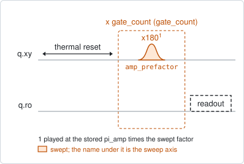
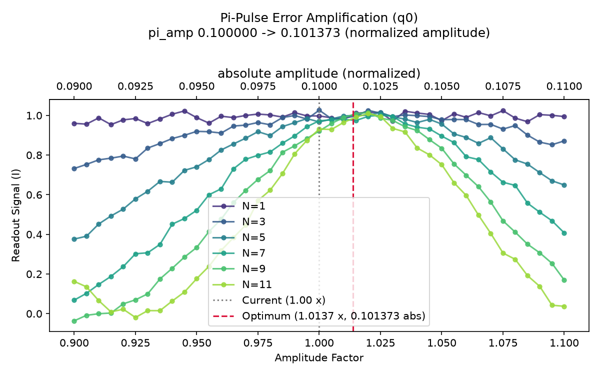

# qubit_pi_pulse_error

## Purpose

Calibrates the amplitude of the pi pulse finely, by error amplification. One pi
pulse turns a small amplitude error into a signal change too small to see; an
odd number of them in a row turns the same error into a rotation that many times
larger. The pulse is repeated 1, 3, 5, ... times, the amplitude is swept in a
narrow window around the stored value, and every curve has its extremum at the
amplitude where the pulse is exactly a pi pulse. The curves for more repetitions
are sharper, and they dominate the answer.

Run it after `qubit_power_rabi`, which finds the amplitude to a few per cent.
`qubit_deterministic_benchmarking` is the other fine calibration: it sweeps the
number of repetitions instead and also handles the pi/2 pulse.

```
scqo run qubit_pi_pulse_error --targets q1
scqo run qubit_pi_pulse_error --targets q1 --set start_amp_factor=0.95 --set end_amp_factor=1.05
```

## Before running it

<!-- BEGIN generated: requires -->
GENERATED from `QubitPiPulseError.requires` and its Parameters mixins - edit
the declaration, then run `python scripts/update_docs.py`.

The target is a `transmon` / `flux_transmon` / `fluxonium` carrying the operations `rx`, `readout`.

These device values must already be right:

| value | held by | used for | provided by |
|---|---|---|---|
| `pi_amp` | drive channel | the swept amplitude is a factor of it, in a narrow window: it has to be within a few per cent already | `qubit_deterministic_benchmarking`, `qubit_pi_pulse_error`, `qubit_power_rabi` |
| `drive_freq_hz` | drive channel | the pulses have to be on resonance: a detuning accumulates over the repeated pulses as well | `qubit_ramsey`, `qubit_ramsey_flux_pulse`, `qubit_ramsey_phasor`, `qubit_spectroscopy` |
| `readout_freq_hz` | readout channel | the readout tone has to sit on the resonator | `readout_frequency`, `resonator_spectroscopy`, `resonator_spectroscopy_flux`, `resonator_spectroscopy_power_amp`, `resonator_spectroscopy_power_chain` |
| `readout_power_dbm` | readout channel | the readout has to be at its working power | `resonator_spectroscopy_power_amp`, `resonator_spectroscopy_power_chain` |
| `thermalization_time_s` | drive channel | how long the thermal reset waits (a per-run thermalization_time_ns replaces it) (with the default `reset_method=thermal`) | `qubit_relaxation` |

Needed only with a non-default setting:

| setting | value | held by | used for | provided by |
|---|---|---|---|---|
| `reset_method=active` | `readout_rotation_rad` | readout channel | the reset measurement is discriminated on the rotated axis | no shared experiment; set it by hand (`scqo set`) or by a backend's own writeback |
| `reset_method=active` | `readout_threshold` | readout channel | decides whether the reset plays its pi pulse | no shared experiment; set it by hand (`scqo set`) or by a backend's own writeback |
| `reset_method=active` | `readout_depletion_s` | readout channel | the settle between the reset measurement and the first pulse | `resonator_spectroscopy` |

A backend may need more than this - a knob only it consumes. `scqo run qubit_pi_pulse_error --help` lists those where that driver is installed.
<!-- END generated: requires -->

## Pulse sequence



After the reset, `x180` is played `gate_count` times in a row at the stored
amplitude times the swept factor, and the qubit is read out. The counts are the
odd numbers in `gate_counts` (1 to 11 by default), and for each count the factor
is swept from `start_amp_factor` to `end_amp_factor`.

## Theory

*To be written.*

## Outputs

<!-- BEGIN generated: outputs -->
GENERATED from `QubitPiPulseError.writes` and `.extracts` - edit the
declaration, then run `python scripts/update_docs.py`.

Proposed by `update()`; each stays pending until it is accepted:

| field | held by | role | unit | meaning |
|---|---|---|---|---|
| `pi_amp` | drive channel | knob | - | Calibrated pi (x180) pulse amplitude. |

Reported in `result.fit` and never written:

| fit key | meaning |
|---|---|
| `opt_amp_prefactor` | the factor of the stored amplitude at the vertex of the parabola fitted to the weighted curves, clipped to the swept window |
| `old_pi_amp` | the pi amplitude the run started from |
<!-- END generated: outputs -->

The curves are added with weights proportional to the square of their count, a
parabola is fitted to the sum over the whole window, and its vertex is the
chosen factor. `pi_amp` is the stored amplitude times that factor.

A run is `SUCCESSFUL` unless the analysis itself raises. A vertex outside the
window is moved to the nearest edge and proposed all the same (see the traps).

## Expected result



One curve per repetition count against the amplitude factor, with the absolute
amplitude on the upper axis. The dotted line is the stored amplitude and the
dashed line the chosen one. Check that:

- all curves have their extremum at the same factor, and the dashed line is on
  it;
- the curves get narrower as the count goes up, and the highest count still
  shows one clear lobe inside the window;
- the dashed line is not on an edge of the window.

## Traps

- **A window wider than one lobe.** A single parabola is fitted across the whole
  window. With the defaults the curve for 11 repetitions already reaches its
  first zero at the edges, as the figure shows. A wider window or higher counts
  put more than one lobe inside, and the vertex is then not the optimum. Narrow
  the window before raising the counts.
- **An optimum outside the window.** The result is clipped to the window and
  still reported as `SUCCESSFUL` (the failure class of BACKLOG I17). A dashed
  line on the edge means the stored amplitude was too far off: run
  `qubit_power_rabi` first.
- **The analysis reads the I quadrature as it comes.** The signal is not rotated
  onto the axis between the two states. A readout whose contrast lies in Q gives
  flat curves.
- **Keep the counts odd.** An even count has a minimum where the odd counts have
  their maximum, and adding the two flattens the sum the parabola is fitted to.

## References

- Related experiments: `qubit_power_rabi` (the coarse amplitude this starts
  from), `qubit_deterministic_benchmarking` (the same calibration by sweeping the
  repetition count; also for the pi/2 pulse).
- Code: `scqo/experiments/qubit_pi_pulse_error.py` (the analysis is in the
  experiment itself; it binds no scqat estimator).
