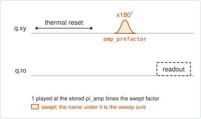
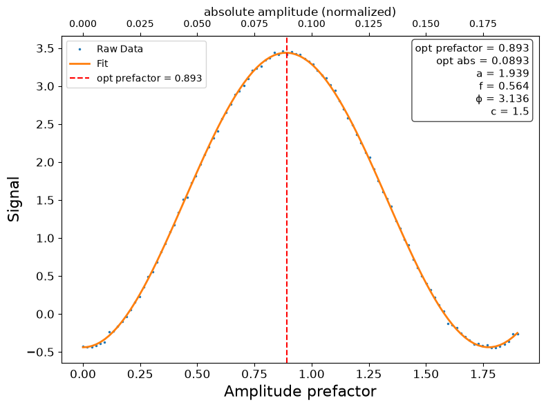

# qubit_power_rabi

## Purpose

Calibrates the amplitude of the pi pulse. A drive pulse of fixed length is played
at a row of amplitudes and the qubit is read out after each; the population
oscillates with the amplitude, and the first extremum is where the pulse is
exactly a pi pulse.

The amplitude is swept as a factor of the pi amplitude already stored, from 0 to
1.9 by default, so the answer is the factor the stored value has to be multiplied
by. Run it after the drive frequency is known (`qubit_spectroscopy`, then
`qubit_ramsey`), and again after anything that changes the power reaching the
qubit.

The target may also be a tunable coupler, which has no drive line and no readout
of its own. `drive_line` names the line whose channel drives it, and the pi
amplitude of that channel is the one calibrated; `readout_member` reads the
coupler through a qubit of its pair.

```
scqo run qubit_power_rabi --targets q1
scqo run qubit_power_rabi --targets q1 --set end_amp_factor=1.5 --set num_amp_points=61
```

## Before running it

<!-- BEGIN generated: requires -->
GENERATED from `QubitPowerRabi.requires` and its Parameters mixins - edit
the declaration, then run `python scripts/update_docs.py`.

The target is a `transmon` / `flux_transmon` / `fluxonium` carrying the operations `rx`, `readout`.

These device values must already be right:

| value | held by | used for | provided by |
|---|---|---|---|
| `pi_amp` | drive channel | the swept amplitude is a factor of it, so the true pi pulse has to fall inside the window; a starting value is enough (the design value will do) | `qubit_deterministic_benchmarking`, `qubit_pi_pulse_error`, `qubit_power_rabi` |
| `drive_freq_hz` | drive channel | the pulse has to be on resonance: off it the oscillation is faster and shallower, and its first extremum is not a pi pulse | `qubit_ramsey`, `qubit_ramsey_flux_pulse`, `qubit_ramsey_phasor`, `qubit_spectroscopy` |
| `readout_freq_hz` | readout channel | the readout tone has to sit on the resonator | `readout_frequency`, `resonator_spectroscopy`, `resonator_spectroscopy_flux`, `resonator_spectroscopy_power_amp`, `resonator_spectroscopy_power_chain` |
| `readout_power_dbm` | readout channel | the readout has to be at its working power | `resonator_spectroscopy_power_amp`, `resonator_spectroscopy_power_chain` |
| `thermalization_time_s` | drive channel | how long the thermal reset waits (a per-run thermalization_time_ns replaces it) (with the default `reset_method=thermal`) | `qubit_relaxation` |

Needed only with a non-default setting:

| setting | value | held by | used for | provided by |
|---|---|---|---|---|
| `use_state_discrimination=true` | `readout_rotation_rad` | readout channel | the axis each shot is projected on before thresholding | no shared experiment; set it by hand (`scqo set`) or by a backend's own writeback |
| `use_state_discrimination=true` | `readout_threshold` | readout channel | splits \|0> from \|1> on that axis | no shared experiment; set it by hand (`scqo set`) or by a backend's own writeback |
| `reset_method=active` | `readout_rotation_rad` | readout channel | the reset measurement is discriminated on the rotated axis | no shared experiment; set it by hand (`scqo set`) or by a backend's own writeback |
| `reset_method=active` | `readout_threshold` | readout channel | decides whether the reset plays its pi pulse | no shared experiment; set it by hand (`scqo set`) or by a backend's own writeback |
| `reset_method=active` | `readout_depletion_s` | readout channel | the settle between the reset measurement and the first pulse | `resonator_spectroscopy` |

A backend may need more than this - a knob only it consumes. `scqo run qubit_power_rabi --help` lists those where that driver is installed.
<!-- END generated: requires -->

With `drive_line`, the two drive values are the ones on that line's channel to
the target, not the target's own. With `readout_member`, the member's own pi
pulse, readout and discriminator have to be calibrated, and the run must use
`use_state_discrimination=true` and the thermal reset.

## Pulse sequence



After the reset, one `x180` pulse is played at the stored amplitude times the
swept factor, and the qubit is read out. The pulse is played once: there is no
error amplification, so this is the coarse calibration of the amplitude.

With `readout_member` the readout is replaced by three steps on the member: a
long, frequency-selective pi pulse that flips the member only while the coupler
is in its ground state, the member's ordinary `x180`, and the member's readout.
The member then reads excited exactly when the coupler was excited.

## Theory

*To be written.*

## Outputs

<!-- BEGIN generated: outputs -->
GENERATED from `QubitPowerRabi.writes` and `.extracts` - edit the
declaration, then run `python scripts/update_docs.py`.

Proposed by `update()`; each stays pending until it is accepted:

| field | held by | role | unit | meaning |
|---|---|---|---|---|
| `pi_amp` | drive channel | knob | - | Calibrated pi (x180) pulse amplitude. |

Reported in `result.fit` and never written:

| fit key | meaning |
|---|---|
| `opt_amp_prefactor` | the factor of the stored amplitude at which the fitted oscillation reaches its first extremum |
| `old_pi_amp` | the pi amplitude the run started from |
<!-- END generated: outputs -->

`pi_amp` is the stored amplitude times `opt_amp_prefactor`. With `drive_line` it
is written to that line's channel.

A run is `SUCCESSFUL` when the oscillation fit succeeded.

## Expected result



The signal against the amplitude factor, with the absolute amplitude on the upper
axis. The orange curve is the fitted oscillation and the dashed line the chosen
factor. Check that:

- the data show at least half an oscillation, from the value at zero amplitude to
  the first extremum;
- the dashed line is on the first extremum, counted from zero amplitude;
- the factor is near 1. A factor far from 1 means the stored amplitude was far
  off; accept and run again, so that the next window is centred.

Whether the curve goes up or down has no meaning: it depends on the sign of the
readout signal.

## Traps

- **No extremum inside the window.** If the stored amplitude is much too small,
  even 1.9 times it is not a pi pulse, and the curve only rises. Raise the stored
  `pi_amp` by hand, or the drive power through the chain, and run again.
- **More than full scale.** The factor times the stored amplitude has to stay
  within what the instrument can play, and the factor itself below 2. The guard
  on the product is not the same on every backend (BACKLOG I19), so check the
  largest amplitude of the window yourself.
- **A drive that is off resonance.** The oscillation then never reaches full
  contrast and its period is shorter, so the first extremum is not a pi pulse.
  Set the frequency first.
- **This is the coarse step.** One pulse cannot resolve a per-cent error in the
  amplitude. `qubit_pi_pulse_error` and `qubit_deterministic_benchmarking`
  repeat the pulse to amplify it.

## References

- Related experiments: `qubit_spectroscopy` and `qubit_ramsey` (the drive
  frequency this needs), `qubit_pi_pulse_error` and
  `qubit_deterministic_benchmarking` (the fine calibration of the same
  amplitude), `single_shot_readout` (needs the pi pulse this gives).
- Code: `scqo/experiments/qubit_power_rabi.py`,
  `scqo/experiments/_capabilities/amplitude.py` (the amplitude window),
  `scqo/experiments/_capabilities/mapped_readout.py` (reading a coupler through a
  pair member), `scqat/estimators/power_rabi/`.
