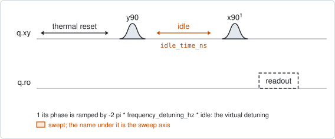
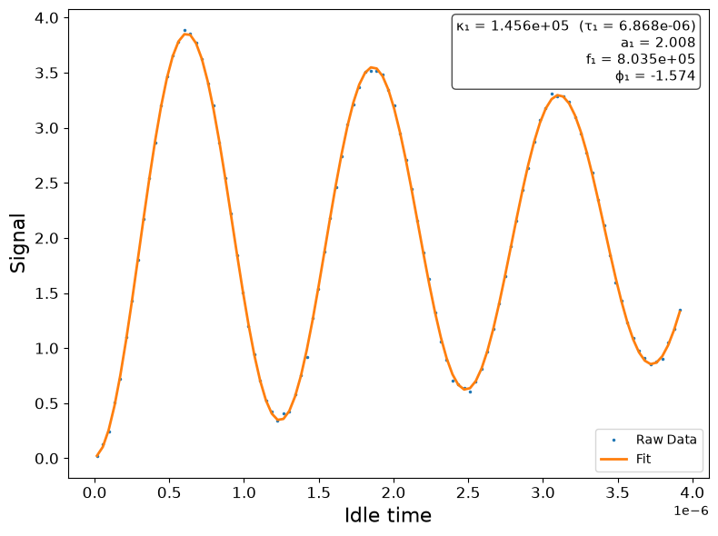
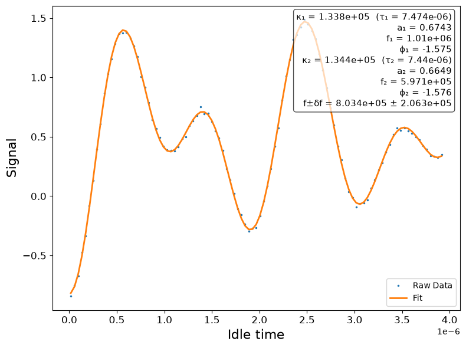

# qubit_ramsey

## Purpose

Measures how far the drive is from the qubit, typically to a few kHz, and the
dephasing time $T_2^{\ast}$. It is the fine frequency calibration:
`qubit_spectroscopy` finds the line to within its width, and this experiment
closes the remaining gap.

Run it, accept the suggestion, and run it again: the second run should report a
`detuning_error_hz` inside the fit error.

```
scqo run qubit_ramsey --targets q1
scqo run qubit_ramsey --targets q1 --set frequency_detuning_hz=2e6 --set max_idle_time_ns=8000
```

## Before running it

<!-- BEGIN generated: requires -->
GENERATED from `QubitRamsey.requires` and its Parameters mixins - edit
the declaration, then run `python scripts/update_docs.py`.

The target is a `transmon` / `flux_transmon` / `fluxonium` carrying the operations `rx`, `readout`.

These device values must already be right:

| value | held by | used for | provided by |
|---|---|---|---|
| `drive_freq_hz` | drive channel | the fringe is measured against it, and it must already be within frequency_detuning_hz of the qubit | `qubit_ramsey`, `qubit_ramsey_flux_pulse`, `qubit_ramsey_phasor`, `qubit_spectroscopy` |
| `readout_freq_hz` | readout channel | the readout tone has to sit on the resonator | `readout_frequency`, `resonator_spectroscopy`, `resonator_spectroscopy_flux`, `resonator_spectroscopy_power_amp`, `resonator_spectroscopy_power_chain` |
| `readout_power_dbm` | readout channel | the readout has to be at its working power | `resonator_spectroscopy_power_amp`, `resonator_spectroscopy_power_chain` |
| `thermalization_time_s` | drive channel | how long the thermal reset waits (a per-run thermalization_time_ns replaces it) (with the default `reset_method=thermal`) | `qubit_relaxation` |

Needed only with a non-default setting:

| setting | value | held by | used for | provided by |
|---|---|---|---|---|
| `use_state_discrimination=true` | `readout_rotation_rad` | readout channel | the axis each shot is projected on before thresholding | no shared experiment; set it by hand (`scqo set`) or by a backend's own writeback |
| `use_state_discrimination=true` | `readout_threshold` | readout channel | splits \|0> from \|1> on that axis | no shared experiment; set it by hand (`scqo set`) or by a backend's own writeback |
| `reset_method=active` | `readout_rotation_rad` | readout channel | the reset measurement is discriminated on the rotated axis | no shared experiment; set it by hand (`scqo set`) or by a backend's own writeback |
| `reset_method=active` | `readout_threshold` | readout channel | decides whether the reset plays its pi pulse | no shared experiment; set it by hand (`scqo set`) or by a backend's own writeback |
| `reset_method=active` | `readout_depletion_s` | readout channel | the settle between the reset measurement and the first pulse | `resonator_spectroscopy` |

A backend may need more than this - a knob only it consumes. `scqo run qubit_ramsey --help` lists those where that driver is installed.
<!-- END generated: requires -->

## Pulse sequence



Each shot starts from the reset (a thermal wait by default, or an active reset
with `reset_method=active`), plays `y90`, waits the swept idle time, plays `x90`
and reads the qubit out. The idle time is the only swept quantity; the
shot-averaging loop is the outer loop and the idle sweep the inner one.

The second pulse is not detuned in frequency. Its phase is advanced by
$-2\pi \Delta \tau$, where $\Delta$ is `frequency_detuning_hz` and $\tau$ the idle
time, which is equivalent to a drive detuned by $\Delta$ during the idle. This is
the virtual detuning; the drive frequency itself never moves during the run.

## Theory

*Draft. The form and depth of this section are not settled yet.*

Work in the frame rotating at the drive frequency $f_d$ (`drive_freq_hz`). A qubit
at $f_{01}$ has residual detuning

```math
\delta = f_{01} - f_d
```

and between the pulses its Bloch vector precesses about $z$ at $\delta$. The first
pi/2 pulse puts the qubit on the equator, the idle lets it precess, and the
second pi/2 pulse converts the accumulated phase into population. With the
virtual detuning the excited-state population is

```math
P_e(\tau) = \tfrac{1}{2} + \tfrac{1}{2} e^{-\tau / T_2^{\ast}}
\sin\big(2\pi(\Delta + \delta)\tau + \varphi_0\big)
```

where $\varphi_0$ is zero for two pulses on perpendicular axes and carries no
information.

**Why the artificial detuning.** With $\Delta = 0$ the fringe oscillates at
$|\delta|$, which near resonance is too slow to separate from the decay and has
no sign. With $\Delta > |\delta|$ the fringe frequency $\Delta + \delta$ is
positive, well resolved, and its offset from $\Delta$ is the signed error. The
correction is therefore

```math
f_d^{\text{new}} = f_d + (f_{\text{fit}} - \Delta)
```

The sign of the phase ramp is what makes the fringe $\Delta + \delta$ rather
than $|\Delta - \delta|$. It is negative on every backend; with the opposite
sign every accepted update doubles the error instead of removing it, and the
fit still looks clean.

**The decay.** The estimator fits a damped sine,
$a e^{-\kappa\tau} \sin(2\pi f \tau + \varphi) + c$, and reports
$T_2^{\ast} = 1/\kappa$. The exponential envelope is the white-noise case. A qubit
dominated by low-frequency noise decays as a Gaussian, and the envelope shape is
then better measured by `qubit_ramsey_phasor`, which reports the stretch exponent.

**Model selection** (`scqat.tools.ramsey_fit.fit_ramsey`):

1. If the dominant component of the spectrum spans less than one oscillation
   over the idle window, no fringe is resolvable. A pure exponential is fitted,
   the frequency is reported as 0, and the run is `FAILED`.
2. Otherwise a single damped sine and a two-frequency beat are both fitted, and
   the beat is kept only if it improves the Bayesian information criterion by
   at least 6.
3. An oscillating fit that explains less than 5 % of the variance has collapsed
   onto the mean and is marked unsuccessful.

**The beat.** In a transmon with visible charge dispersion, quasiparticle
tunnelling flips the charge parity many times during the averaging, and the
qubit frequency takes two values. The averaged fringe is the sum of two
oscillations at $\Delta + \delta \pm \epsilon/2$. The drive is retuned to the
mean of the two and the splitting $\epsilon = |f_1 - f_2|$ is reported as
`parity_delta_f_hz`.

## Outputs

<!-- BEGIN generated: outputs -->
GENERATED from `QubitRamsey.writes` and `.extracts` - edit the
declaration, then run `python scripts/update_docs.py`.

Proposed by `update()`; each stays pending until it is accepted:

| field | held by | role | unit | meaning |
|---|---|---|---|---|
| `drive_freq_hz` | drive channel | knob | Hz | Drive frequency (operating CHOICE; the fact is the target's f_01_hz). |
| `f_01_hz` | qubit mode | fact | Hz | Qubit 0->1 frequency at the idle point (the drive_freq_hz knob is its instrument twin; one fit writes both). |
| `t2_star_s` | qubit mode | fact | s | Ramsey dephasing time T2*. |
| `parity_delta_f_hz` | drive channel | monitor | Hz | Charge-parity beat splitting \|f_1 - f_2\| of the Ramsey fringe at the idle point (qubit_ramsey's beat model); the parity-switch monitors (continuous and discrete) derive their fixed idle 1 / (2 x parity_delta_f_hz) from it. Drifts with the offset charge, so it is a monitor, not a fact. |

Reported in `result.fit` and never written:

| fit key | meaning |
|---|---|
| `detuning_error_hz` | fitted fringe frequency minus frequency_detuning_hz: the signed distance of the qubit from the drive |
| `old_drive_freq_hz` | the drive frequency the run started from |
| `fringe_f_1_hz` | beat model: the first fringe frequency, in the detuned frame |
| `fringe_f_2_hz` | beat model: the second fringe frequency, in the detuned frame |
<!-- END generated: outputs -->

A run is `SUCCESSFUL` when the fit converged, the selected model is `single` or
`beat`, and $T_2^{\ast}$ is finite and positive. `parity_delta_f_hz` and the two
`fringe_f_*_hz` keys appear only when the beat model was selected.

## Expected result



The simulated run above uses the default window: 101 idle points from 16 ns to
about 3.9 us, with $\Delta$ = 1 MHz. The points are the measured signal after the
IQ reduction and the line is the fitted model; the box lists the fitted decay
rate $\kappa_1$ (and $\tau_1 = T_2^{\ast}$), amplitude, fringe frequency $f_1$ and
phase.

How to read it:

- **The fringe frequency is the result.** Here $f_1$ = 0.80 MHz against the
  1 MHz that was applied, so the drive is 0.2 MHz above the qubit and
  `detuning_error_hz` is -0.2 MHz. Counting fringes gives the same answer
  without the fit: about three in the window instead of four.
- **The envelope gives $T_2^{\ast}$.** In this example it has fallen by less than
  half, because the simulated $T_2^{\ast}$ (6.9 us) is longer than the window. That
  is enough for the frequency but leaves $T_2^{\ast}$ loosely constrained; on a real
  chip widen `max_idle_time_ns` until the last fringe is clearly smaller than
  the first.
- **The fit should follow the first and the last fringe equally well.** A fit
  that matches the start and drifts out of phase at the end has the wrong
  frequency.

With a charge-parity beat (`ramsey_model=beat`, or selected automatically) the
fringe is the sum of two close frequencies and its envelope rises and falls.
The box then lists both components and their mean and half-difference:



## Traps

- **The drive is further off than `frequency_detuning_hz`.** A fitted frequency
  has no sign, so for $\delta < -\Delta$ the fringe folds and the correction has
  the wrong size. Symptom: `detuning_error_hz` does not shrink when the run is
  repeated after accepting. Raise `frequency_detuning_hz` above the largest
  error you expect, or run `qubit_spectroscopy` first.
- **Less than one fringe in the window.** The frequency gate selects the pure
  decay and the run fails. Raise `frequency_detuning_hz` or `max_idle_time_ns`.
- **Aliasing.** The fringe must stay below $1/(2 \times \text{step})$. The default
  window has a 39 ns step, which puts the limit at 12.8 MHz; a longer window
  with the same `num_points` lowers it.
- **A fit that leaves the fringe at a large detuning.** On 5Q4C a run at 4 MHz
  over 4 us with 201 points returned a frequency more than 1 MHz off while the
  trace itself was clean (BACKLOG I24). The run also saves the spectrum of the
  trace: check that the fitted frequency sits on its peak.
- **A window that does not match $T_2^{\ast}$.** Much shorter than $T_2^{\ast}$ and the
  envelope barely decays, so $T_2^{\ast}$ comes back with a large error. Much longer
  and most points are noise. Aim for a window of two to three $T_2^{\ast}$.
- **A beat that is not resolved.** The automatic selection keeps the beat only
  on strong evidence. To measure the splitting deliberately, set
  `ramsey_model=beat` and widen `max_idle_time_ns` to at least one period of the
  splitting.
- **Active reset with leftover readout photons.** Photons still in the resonator
  after the reset measurement Stark-shift the qubit during the first pulse and
  appear as a frequency error. If an active-reset run disagrees with a thermal
  one, the settle time `readout_depletion_s` is the first thing to check.

## References

- N. F. Ramsey, "A molecular beam resonance method with separated oscillating
  fields", Phys. Rev. 78, 695 (1950).
- P. Krantz et al., "A quantum engineer's guide to superconducting qubits",
  Appl. Phys. Rev. 6, 021318 (2019).
- D. Riste et al., "Millisecond charge-parity fluctuations and induced
  decoherence in a superconducting transmon qubit", Nat. Commun. 4, 1913 (2013).
- Related experiments: `qubit_spectroscopy` (coarse frequency),
  `qubit_ramsey_phasor` (envelope shape), `qubit_echo` (refocused coherence),
  `qubit_ramsey_flux_pulse` (frequency against flux),
  `qubit_parity_switch_continuous` and `qubit_parity_switch_discrete` (use the
  splitting measured here).
- Code: `scqo/experiments/qubit_ramsey.py`, `scqat/estimators/ramsey/`,
  `scqat/tools/ramsey_fit.py`.
