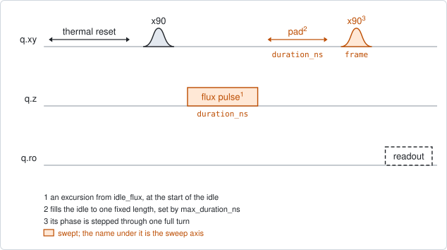
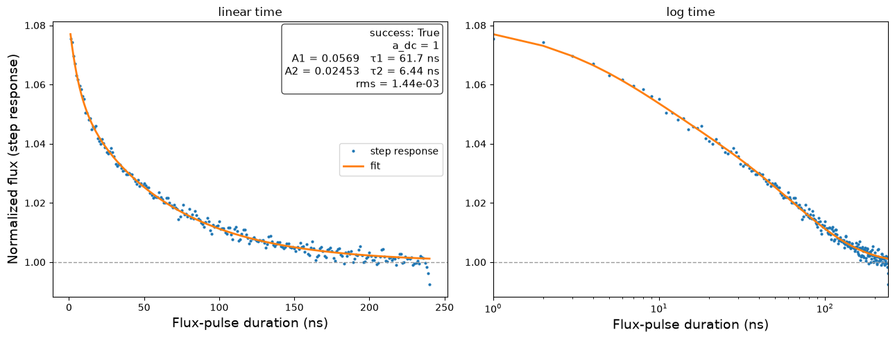

# qubit_ramsey_cryoscope

## Purpose

Measures the shape a square flux pulse really has when it reaches the qubit,
over its first nanoseconds to a few hundred nanoseconds. The wiring between the
instrument and the chip distorts a step: the flux overshoots or undershoots and
then settles. The experiment reconstructs that step response and fits it with a
sum of exponentials. The fitted amplitudes and time constants are the numbers a
predistortion filter needs.

The qubit is the probe. Its frequency depends on the flux, so during a flux
pulse it runs at a shifted frequency and collects phase against its drive. A
Ramsey sequence reads that phase. Repeating it for pulses of every length from
1 ns up gives the phase against time; its slope is the frequency shift at each
moment, and the shift gives the flux.

The result is relative. The response is divided by the level it settles to, so
neither the size of the flux pulse nor the curvature of the qubit's arch has to
be known. The amplitude `flux_pulse_amp_v` only decides how strong the signal
is.

This experiment covers the short times. `qubit_spectroscopy_cryoscope` covers
the slow tails, up to microseconds.

```
scqo run qubit_ramsey_cryoscope --targets q1
scqo run qubit_ramsey_cryoscope --targets q1 --set flux_pulse_amp_v=0.05 --set max_duration_ns=400
```

## Before running it

<!-- BEGIN generated: requires -->
GENERATED from `QubitRamseyCryoscope.requires` and its Parameters mixins - edit
the declaration, then run `python scripts/update_docs.py`.

The target is a `transmon` / `flux_transmon` / `fluxonium` carrying the operations `rx`, `readout`, `flux_bias`.

These device values must already be right:

| value | held by | used for | provided by |
|---|---|---|---|
| `idle_flux` | flux line | the flux pulse is an excursion from this standing bias, where both pi/2 pulses and the readout are played | `pair_zz_coupler`, `qubit_ramsey_flux_pulse`, `qubit_spectroscopy_flux_pulse`, `resonator_spectroscopy_flux` |
| `drive_freq_hz` | drive channel | both pi/2 pulses have to be on resonance at the idle flux | `qubit_ramsey`, `qubit_ramsey_flux_pulse`, `qubit_ramsey_phasor`, `qubit_spectroscopy` |
| `readout_freq_hz` | readout channel | the readout tone has to sit on the resonator | `readout_frequency`, `resonator_spectroscopy`, `resonator_spectroscopy_flux`, `resonator_spectroscopy_power_amp`, `resonator_spectroscopy_power_chain` |
| `readout_power_dbm` | readout channel | the readout has to be at its working power | `resonator_spectroscopy_power_amp`, `resonator_spectroscopy_power_chain` |
| `thermalization_time_s` | drive channel | how long the thermal reset waits (a per-run thermalization_time_ns replaces it) (with the default `reset_method=thermal`) | `qubit_relaxation` |

Needed only with a non-default setting:

| setting | value | held by | used for | provided by |
|---|---|---|---|---|
| `use_state_discrimination=true` | `readout_rotation_rad` | readout channel | the axis each shot is projected on before thresholding | no shared experiment; set it by hand (`scqo set`) or by a backend's own writeback |
| `use_state_discrimination=true` | `readout_threshold` | readout channel | splits \|0> from \|1> on that axis | no shared experiment; set it by hand (`scqo set`) or by a backend's own writeback |
| `reset_method=active` | `readout_rotation_rad` | readout channel | the reset measurement is discriminated on the rotated axis | no shared experiment; set it by hand (`scqo set`) or by a backend's own writeback |
| `reset_method=active` | `readout_threshold` | readout channel | decides whether the reset plays its pi pulse | no shared experiment; set it by hand (`scqo set`) or by a backend's own writeback |
| `reset_method=active` | `readout_depletion_s` | readout channel | the settle between the reset measurement and the first pulse | `resonator_spectroscopy` |

A backend may need more than this - a knob only it consumes. `scqo run qubit_ramsey_cryoscope --help` lists those where that driver is installed.
<!-- END generated: requires -->

Run it with one target at a time. Every driver builds this sequence for a single
qubit and refuses more.

## Pulse sequence



After the reset: `x90`, the flux pulse, a wait, a second `x90`, and the readout.

The flux pulse starts at the beginning of the idle and lasts `duration_ns`,
which takes every whole nanosecond from 1 to `max_duration_ns`. The wait fills
the rest, so the time between the two `x90` pulses is the same for every point
and every point loses the same contrast to dephasing.

The phase of the second `x90` is stepped through one full turn in `num_frames`
points. For each duration that gives one period of a fringe, and the position of
the fringe is the phase the qubit collected.

The duration is the outer loop and the frame the inner one.

## Theory

*To be written.*

## Outputs

<!-- BEGIN generated: outputs -->
GENERATED from `QubitRamseyCryoscope.writes` and `.extracts` - edit the
declaration, then run `python scripts/update_docs.py`.

Proposed by `update()`; each stays pending until it is accepted:

| field | held by | role | unit | meaning |
|---|---|---|---|---|
| `distortion_amp` | flux line | fact | - | Flux-transient predistortion tap amplitudes of this line (measured cryo-wiring physics, per cooldown). |
| `distortion_tau_s` | flux line | fact | s | Flux-transient tap time constants (equal length with distortion_amp). |

Reported in `result.fit` and never written:

| fit key | meaning |
|---|---|
| `a_dc` | the level the fitted step response settles to; 1 by construction, since the response is divided by its own tail |
| `rms_residual` | the rms distance between the step response and the fit |
| `n_components` | how many exponential components the fit kept; not always as many as fit_start_fractions lists |
| `old_idle_flux` | the standing bias the flux pulse rode on |
| `flux_pulse_amp_v` | the amplitude of the flux pulse that was played |
<!-- END generated: outputs -->

The two written values are lists of equal length, one entry per exponential
component, slowest first. `distortion_amp` is relative to the settled level: a
component of 0.05 is a 5 % overshoot that decays with its time constant.

Accepting them replaces the whole lists. `qubit_spectroscopy_cryoscope` writes
the same two fields, so the run accepted last is the one on record; the two are
not merged.

The values are facts about the wiring. Accepting them records the measurement
and changes nothing on the instrument. Putting them into the instrument's output
filter is a separate step of the backend; after a successful run the command for
it is printed, where the backend has one.

The fit is made twice and the one with the smaller residual is kept. One fit
starts each component at one of `fit_start_fractions`. The other takes the
number of components and their time constants from the data or, when
`fit_tau_seeds` is given, starts from those time constants.

A run is `SUCCESSFUL` when the fit converged, kept at least one component, and
every component has a positive time constant and an amplitude of at most 2. Two
components whose time constants are close and whose amplitudes cancel are
treated as one.

## Expected result



The step response against the length of the flux pulse, on a linear and on a
logarithmic time axis, with the fit. 1 is the settled level. The box lists each
component as an amplitude and a time constant. Check that:

- the points settle onto the dashed line at 1 before the end of the record;
- the fit follows the points at short times, which the logarithmic panel shows;
- every amplitude in the box is small compared with 1.

A second figure in the run folder shows the two steps before this one: the
collected phase and the frequency shift against the pulse length.

In the figure the simulated response has two components, 5.7 % at 62 ns and
2.5 % at 6.4 ns.

## Traps

- **A record that ends before the response has settled.** The response is
  divided by its last 20 ns, which are taken as the settled level. A component
  still decaying there becomes part of that level and is not reported. Raise
  `max_duration_ns`, and leave the times this experiment cannot reach to
  `qubit_spectroscopy_cryoscope`.
- **An idle point away from the top of the arch.** The flux is computed as the
  square root of the frequency shift. That is the relation at the top of the
  arch, where the shift grows with the square of the flux.
- **The last run accepted wins.** The two cryoscopes write the same fields and
  each replaces the other's values. Accepting the short-time result removes a
  long-time result from the record.
- **Accepted is not applied.** After accepting, the flux line is as distorted as
  before. The filter is changed by the backend's own command.
- **Measured with a filter already in place.** With a filter applied, a run
  measures what is left over. Those values describe the remainder, not the line.
- **One fast component under a slow one.** When the automatic fit covers two
  time scales with one component, give the time constants you expect in
  `fit_tau_seeds`.

## References

- Related experiments: `qubit_spectroscopy_cryoscope` (the same response at long
  times), `qubit_xyz_delay` (the timing of the flux line, to be set first),
  `qubit_ramsey` (the sequence without the flux pulse).
- Code: `scqo/experiments/qubit_ramsey_cryoscope.py`,
  `scqat/estimators/ramsey_cryoscope/`, `scqat/tools/step_response_fit.py`,
  `scqo/experiments/_distortion_hint.py` (the printed command).
