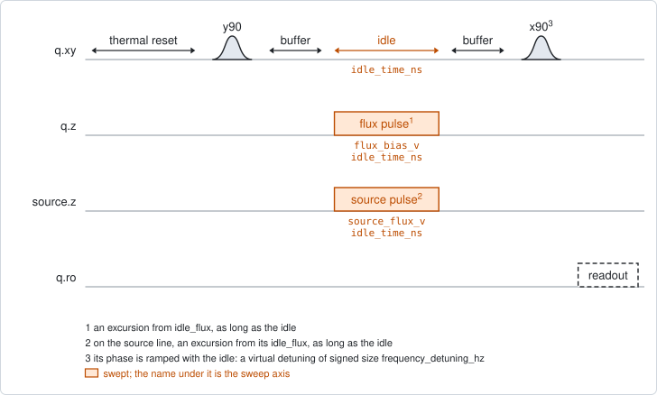
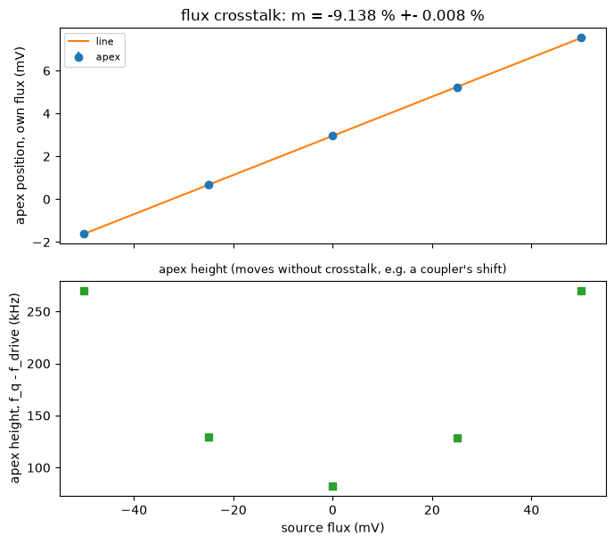

# qubit_ramsey_flux_crosstalk_pulse

## Purpose

Measures how much a flux line that is not a qubit's own acts on that qubit.
Another qubit's flux line, or a coupler's, still sends a little flux through the
qubit. For the qubit, a move of that line by 1 V is like a move of its own line
by m volts. This experiment measures the signed m. The measured qubit is the
target, and the other line is the source line.

The target's own line is the ruler. A Ramsey fringe is taken while the target's
own line and the source line both play a pulse. For each source amplitude, the
fringes over the own-line amplitude locate the flux at which the target's
frequency is highest, the apex. A source move of b volts slides the apex by
-m x b. So the apex positions lie on a straight line against the source
amplitude, and its slope gives m.

No model of the qubit and no stored fact enters the result. A shift of the
qubit that moves the height of the apex but not its position, as a coupler
causes on its neighbour, is reported separately and not counted as crosstalk.

Nothing is written to the device. The result is a record.

```
scqo run qubit_ramsey_flux_crosstalk_pulse --targets q1 --set source_line=z2
scqo run qubit_ramsey_flux_crosstalk_pulse --targets q1 --set source_line=zc12 --set source_lead_time_ns=2000
```

## Before running it

<!-- BEGIN generated: requires -->
GENERATED from `QubitRamseyFluxCrosstalkPulse.requires` and its Parameters mixins - edit
the declaration, then run `python scripts/update_docs.py`.

The target is a `transmon` / `flux_transmon` / `fluxonium` carrying the operations `rx`, `readout`, `flux_bias`.

These device values must already be right:

| value | held by | used for | provided by |
|---|---|---|---|
| `idle_flux` | flux line | both flux windows are excursions from a standing bias, the target line's and the source line's; the pi/2 pulses and the readout are played at the target's | `pair_zz_coupler`, `qubit_ramsey_flux_pulse`, `qubit_spectroscopy_flux_pulse`, `resonator_spectroscopy_flux` |
| `drive_freq_hz` | drive channel | every fringe is measured against it; at the idle point the qubit has to sit on it | `qubit_ramsey`, `qubit_ramsey_flux_pulse`, `qubit_ramsey_phasor`, `qubit_spectroscopy` |
| `readout_freq_hz` | readout channel | the readout tone has to sit on the resonator | `readout_frequency`, `resonator_spectroscopy`, `resonator_spectroscopy_flux`, `resonator_spectroscopy_power_amp`, `resonator_spectroscopy_power_chain` |
| `readout_power_dbm` | readout channel | the readout has to be at its working power | `resonator_spectroscopy_power_amp`, `resonator_spectroscopy_power_chain` |
| `thermalization_time_s` | drive channel | how long the thermal reset waits (a per-run thermalization_time_ns replaces it) (with the default `reset_method=thermal`) | `qubit_relaxation` |

Needed only with a non-default setting:

| setting | value | held by | used for | provided by |
|---|---|---|---|---|
| `use_state_discrimination=true` | `readout_rotation_rad` | readout channel | the axis each shot is projected on before thresholding | no shared experiment; set it by hand (`scqo set`) or by a backend's own writeback |
| `use_state_discrimination=true` | `readout_threshold` | readout channel | splits \|0> from \|1> on that axis | no shared experiment; set it by hand (`scqo set`) or by a backend's own writeback |
| `reset_method=active` | `readout_rotation_rad` | readout channel | the reset measurement is discriminated on the rotated axis | no shared experiment; set it by hand (`scqo set`) or by a backend's own writeback |
| `reset_method=active` | `readout_threshold` | readout channel | decides whether the reset plays its pi pulse | no shared experiment; set it by hand (`scqo set`) or by a backend's own writeback |
| `reset_method=active` | `readout_depletion_s` | readout channel | the settle between the reset measurement and the first pulse | `resonator_spectroscopy` |

A backend may need more than this - a knob only it consumes. `scqo run qubit_ramsey_flux_crosstalk_pulse --help` lists those where that driver is installed.
<!-- END generated: requires -->

`source_line` has no default. It names a flux line of the roster, not a qubit:
another qubit's line or a coupler's. The target's own line is refused.

The target has to sit at the top of its frequency curve, or close to it: the
own-line window has to hold the apex at every source amplitude. Park the qubit
with `qubit_ramsey_flux_pulse` first.

The facts of the target's frequency curve (`f_q_max_hz`, `flux_offset`,
`flux_per_phi0`) are used when they are there, to choose the sign of the
virtual detuning. Without them the default sign is used.

The run is refused before any instrument time when the source line is missing,
is not a flux line of the roster, or is the target's own, when more than one
target is given, and when the windows would make a fringe fold through zero or
run faster than the time step can follow.

## Pulse sequence



The target is reset and plays a `y90`. After `flux_buffer_ns`, two square pulses
play for the whole idle: one on the target's own flux line, of amplitude
`flux_bias_v`, and one on the source line, of amplitude `source_flux_v`. After
another `flux_buffer_ns` the target plays an `x90` and is read out.

Both amplitudes are excursions from the standing bias of their own line. The
pi/2 pulses and the readout are played at the target's idle point.

The phase of the `x90` is ramped with the idle time, which adds a virtual
detuning of `frequency_detuning_hz`. Its sign is chosen so that the qubit's
move pushes the fringe away from zero frequency.

With `source_lead_time_ns` above 0, the source pulse starts that long before the
own-line pulse and the two still end together. The fringe then reads the
crosstalk that long after the source line stepped.

This is the sequence of `qubit_ramsey_flux_pulse` with one more line pulsed.

## Theory

*To be written.*

## Outputs

<!-- BEGIN generated: outputs -->
GENERATED from `QubitRamseyFluxCrosstalkPulse.writes` and `.extracts` - edit the
declaration, then run `python scripts/update_docs.py`.

Record-only: `update()` proposes nothing.

Reported in `result.fit` and never written:

| fit key | meaning |
|---|---|
| `flux_crosstalk` | the signed coefficient m: one volt on the source line acts on the target like m volts on its own line |
| `flux_crosstalk_stderr` | the fit's standard error on m |
| `flux_offset_from_idle` | the target's apex at zero source amplitude, as an excursion from its idle flux |
| `flux_offset_from_idle_stderr` | the fit's standard error on that apex |
| `curvature_hz_per_v2` | the curvature of the target's local arch |
| `apex_height_span_hz` | how far the HEIGHT of the apex moved over the source window: a shift of the qubit that is not crosstalk |
| `line_residual_rms_v` | the rms distance of the apex positions from the fitted straight line |
| `line_max_residual_v` | the largest such distance |
| `n_source_points` | the number of source amplitudes |
| `n_valid_source_points` | how many of them gave an apex; the line needs 3 |
| `n_apex_not_bracketed` | how many had their apex outside the own-line window |
| `nonlinear_suspected` | 1 when the apex positions do not follow a straight line; the run fails |
| `fold_suspected` | 1 when a fringe may have folded through zero frequency; the run fails |
| `source_line` | the flux line that was pulsed as the source |
| `source_lead_time_ns` | how long the source pulse was already on when the own-line pulse started |
| `old_idle_flux` | the target line's idle flux: the origin of its window |
| `old_source_idle_flux` | the source line's idle flux: the origin of its window |
| `old_drive_freq_hz` | the drive frequency every fringe was measured against |
| `ramp_detuning_hz` | the SIGNED virtual detuning that was applied |
| `ramp_sign_from` | where that sign came from: 'facts' (predicted from the arch facts) or 'default' |
<!-- END generated: outputs -->

The estimator reads a fringe frequency at every pair of amplitudes, fits the
local curve over the own-line amplitude at every source amplitude, and fits a
straight line through the apex positions. `flux_crosstalk` is minus its slope.

A run is `SUCCESSFUL` when the line goes through at least three source
amplitudes and neither `nonlinear_suspected` nor `fold_suspected` is set.
`flux_crosstalk`, the apex at zero source amplitude and their errors are
reported only when the line was fitted.

The coefficient is not proposed, because no catalog field holds a value that
belongs to a source line and a target together.

## Expected result



Top, the apex position on the target's own line against the source amplitude,
with the fitted line. The title gives m in percent. Bottom, the height of the
apex against the source amplitude. Check that:

- the apex positions lie on a straight line, with error bars smaller than the
  distance between neighbouring points;
- every source amplitude has a point. A missing one had its apex outside the
  own-line window;
- the height in the lower panel may change. It is not part of the result. A
  large change says that the source moves the qubit by something other than
  flux.

Two more figures in the run folder show the local curve at every source
amplitude with its apex, and the measured fringes.

The figure is from a simulated qubit, with the other qubit's flux line as the
source.

## Traps

- **The value is not the DC coefficient.** It is the ratio of two pulses as long
  as the idle. On a real chip, a DC move of a coupler line read 6 to 9
  percentage points above the value from a 1.6 us pulse, on every target.
  `source_lead_time_ns` reads the same crosstalk later after the step.
- **A long lead mixes two things.** The lead lengthens every shot, and the
  source is then on for a large part of the time. A response slower than the
  shot period follows that fraction, not the step. Lengthen
  `thermalization_time_ns` to tell them apart.
- **Keep the source away from what moves the target without flux.** A source
  qubit pulsed far enough reaches the target's frequency. A coupler pulsed
  toward its neighbours switches their exchange on. The default source window is
  small for this reason.
- **The apex has to stay inside the own-line window.** A source amplitude whose
  apex slides out of it is counted in `n_apex_not_bracketed` and left out of
  the line.
- **The apex height is not crosstalk.** `apex_height_span_hz` reports how far
  it moved. A reading from one own-line amplitude cannot tell a move of the
  apex from a change of its height, which is why the own line is swept.
- **One target per run.** Two targets in superposition shift each other's
  fringes, and the source moves that shift.

## References

- Related experiments: `qubit_ramsey_flux_pulse` (the same fringe with the own
  line alone; it parks the target, and its `flux_component` sweeps another line
  instead of the own one, which gives the size of m without its sign),
  `qubit_spectroscopy_flux_pulse` and `resonator_spectroscopy_flux` (the facts
  of the frequency curve).
- `procedures/qubit-frequency-park/PROCEDURE.md`, which uses crosstalk values
  when parking.
- Code: `scqo/experiments/qubit_ramsey_flux_crosstalk_pulse.py`,
  `scqo/experiments/_capabilities/flux_source.py`,
  `scqat/estimators/qubit_ramsey_flux_crosstalk/`.
