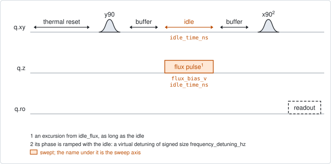
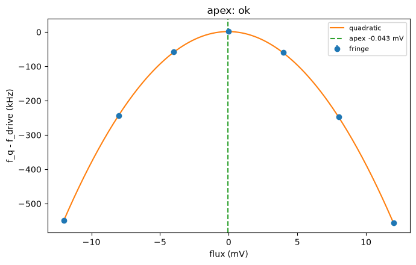

# qubit_ramsey_flux_pulse

## Purpose

Measures the qubit frequency against flux near the idle point, to a few kHz. At
each flux value a Ramsey fringe is taken with a flux pulse held during the idle;
the fringe frequency is the qubit frequency at that flux. A parabola through
those frequencies answers one of two questions:

- where the top of the arch is (`park_frequency_hz` unset), or
- which flux puts the qubit at a chosen frequency (`park_frequency_hz` set).

Either way it proposes the new idle flux together with the drive frequency the
qubit will have there.

It is one of three ways to place a qubit on its arch, and the precise, local one.
`resonator_spectroscopy_flux` and `qubit_spectroscopy_flux_pulse` see the whole
arch and supply the facts this one uses to set itself up. This one needs a fringe
that survives several periods, so it needs a qubit that is already driven and
read out well.

The flux window is an excursion from `idle_flux`; 0 means "stay parked". Both
pi/2 pulses and the readout are played at the idle point, where they were
calibrated. Only the free evolution happens at the swept flux.

```
scqo run qubit_ramsey_flux_pulse --targets q1
scqo run qubit_ramsey_flux_pulse --targets q1 --set park_frequency_hz=4.85e9 --set flux_side=lower
```

## Before running it

<!-- BEGIN generated: requires -->
GENERATED from `QubitRamseyFluxPulse.requires` and its Parameters mixins - edit
the declaration, then run `python scripts/update_docs.py`.

The target is a `transmon` / `flux_transmon` / `fluxonium` carrying the operations `rx`, `readout`, `flux_bias`.

These device values must already be right:

| value | held by | used for | provided by |
|---|---|---|---|
| `idle_flux` | flux line | the flux window is an excursion from it, and both pi/2 pulses and the readout are played there | `pair_zz_coupler`, `qubit_ramsey_flux_pulse`, `qubit_spectroscopy_flux_pulse`, `resonator_spectroscopy_flux` |
| `drive_freq_hz` | drive channel | every fringe is measured against it; at the idle point the qubit has to sit on it | `qubit_ramsey`, `qubit_ramsey_flux_pulse`, `qubit_ramsey_phasor`, `qubit_spectroscopy` |
| `readout_freq_hz` | readout channel | the readout tone has to sit on the resonator | `readout_frequency`, `resonator_spectroscopy`, `resonator_spectroscopy_flux`, `resonator_spectroscopy_power_amp`, `resonator_spectroscopy_power_chain` |
| `readout_power_dbm` | readout channel | the readout has to be at its working power | `resonator_spectroscopy_power_amp`, `resonator_spectroscopy_power_chain` |
| `thermalization_time_s` | drive channel | how long the thermal reset waits (a per-run thermalization_time_ns replaces it) (with the default `reset_method=thermal`) | `qubit_relaxation` |

Needed only with a non-default setting:

| setting | value | held by | used for | provided by |
|---|---|---|---|---|
| `use_state_discrimination=true` | `readout_rotation_rad` | readout channel | the axis each shot is projected on before thresholding | no shared experiment; set it by hand (`scqo set`) or by a backend's own writeback |
| `use_state_discrimination=true` | `readout_threshold` | readout channel | splits \|0> from \|1> on that axis | no shared experiment; set it by hand (`scqo set`) or by a backend's own writeback |
| `reset_method=active` | `readout_rotation_rad` | readout channel | the reset measurement is discriminated on the rotated axis | no shared experiment; set it by hand (`scqo set`) or by a backend's own writeback |
| `reset_method=active` | `readout_threshold` | readout channel | decides whether the reset plays its pi pulse | no shared experiment; set it by hand (`scqo set`) or by a backend's own writeback |
| `reset_method=active` | `readout_depletion_s` | readout channel | the settle between the reset measurement and the first pulse | `resonator_spectroscopy` |

A backend may need more than this - a knob only it consumes. `scqo run qubit_ramsey_flux_pulse --help` lists those where that driver is installed.
<!-- END generated: requires -->

Three stored facts are used when they exist, and the run works without them:
`f_q_max_hz`, `flux_offset` and `flux_per_phi0`. From them the experiment
predicts how far the qubit moves over the window and chooses the sign of its
virtual detuning accordingly (see the traps). With any of them missing the sign
is a default, chosen as if the qubit sat at the top of its arch, and
`ramp_sign_from` says so.

## Pulse sequence



After the reset: `y90` at the idle point, a short buffer, the flux pulse for the
whole idle time, the same buffer, `x90`, and the readout. The pulse is as long as
the idle, so it varies with both swept axes. The buffers (`flux_buffer_ns`) keep
the edges of the flux pulse away from the two pi/2 pulses. Flux is the outer loop
and the idle time the inner one.

As in `qubit_ramsey`, the fringe is produced by a virtual detuning: the phase of
the second pulse is ramped in proportion to the idle time. Here its sign is
chosen per target, before the run.

With `flux_component` the pulse is played on another entity's flux line.

## Theory

*To be written.*

## Outputs

<!-- BEGIN generated: outputs -->
GENERATED from `QubitRamseyFluxPulse.writes` and `.extracts` - edit the
declaration, then run `python scripts/update_docs.py`.

Proposed by `update()`; each stays pending until it is accepted:

| field | held by | role | unit | meaning |
|---|---|---|---|---|
| `drive_freq_hz` | drive channel | knob | Hz | Drive frequency (operating CHOICE; the fact is the target's f_01_hz). |
| `f_01_hz` | qubit mode | fact | Hz | Qubit 0->1 frequency at the idle point (the drive_freq_hz knob is its instrument twin; one fit writes both). |
| `f_q_max_hz` | qubit mode | fact | Hz | Qubit 0->1 frequency at the sweet spot (arch top). |
| `flux_offset` | flux channel | fact | source-native | Sweet-spot offset of the transfer function flux/Phi0 = (x - flux_offset)/flux_per_phi0, where x is the ABSOLUTE set-point on the same plane as the line's idle_flux. An experiment whose sweep axis is relative to idle_flux re-references (absolute = idle_flux_at_run + fitted) before writing here. |
| `idle_flux` | flux line | knob | source-native | Standing bias set-point of this line in the flux source's native unit (volts for an AWG line, amperes for a coil). A coupler's decouple point IS this knob on its own flux line. It is also the ORIGIN a '_pulse' flux experiment's swept window is measured from (its probe plays on top of this bias). |

Reported in `result.fit` and never written:

| fit key | meaning |
|---|---|
| `question` | which reading was asked for: 'apex' (park_frequency_hz unset) or 'park' |
| `flux_offset_from_idle` | the apex as an excursion from the idle flux the run started from; absent when the window did not hold the apex |
| `flux_offset_stderr` | the fit's standard error on the apex flux |
| `f_q_max_stderr_hz` | the fit's standard error on the apex frequency |
| `idle_flux_stderr` | the fit's standard error on the proposed idle flux |
| `df_dflux_hz_per_v` | the slope of f01 against flux at the proposed idle point: 0 at the apex |
| `curvature_hz_per_v2` | the curvature of the local quadratic |
| `n_valid_points` | how many flux points gave a usable fringe frequency |
| `old_idle_flux` | the idle flux the run started from: the origin of the swept axis |
| `old_drive_freq_hz` | the drive frequency every fringe was measured against |
| `ramp_detuning_hz` | the SIGNED virtual detuning that was applied |
| `ramp_sign_from` | where that sign came from: 'facts' (predicted from the stored arch) or 'default' (no arch facts: the apex case) |
| `apex_not_bracketed` | 1 when the window did not hold the apex |
| `park_out_of_window` | 1 when no flux inside the window gives park_frequency_hz |
| `fold_suspected` | 1 when the fringe frequencies look folded about zero; the run is then FAILED |
| `multi_target_context` | 1 when several targets ran together, which makes the run record-only |
<!-- END generated: outputs -->

Every written flux value is absolute: the fitted excursion added to
`old_idle_flux`.

What is proposed depends on the question:

- **apex**: `idle_flux` is set to the top of the arch, `drive_freq_hz` and
  `f_01_hz` to the frequency there, and the top itself is recorded as
  `flux_offset` and `f_q_max_hz`. All of it requires the window to hold the top
  (`apex_not_bracketed` is 0).
- **park**: `idle_flux` is set to the flux that gives `park_frequency_hz`, and
  `drive_freq_hz` and `f_01_hz` to that frequency. The fit then also carries
  `park_excursion_v`, the same flux as an excursion. `flux_offset` and
  `f_q_max_hz` are recorded only if the window also held the top. The flux is
  never extrapolated: with no solution inside the window
  (`park_out_of_window` is 1) nothing is proposed. `flux_side` picks the solution
  when the window holds one on each side of the top.

Nothing is proposed when several targets ran together, or when the swept line
belongs to another entity.

A run is `SUCCESSFUL` when the fit succeeded and the fringe frequencies do not
look folded.

## Expected result



The qubit frequency, as a distance from the drive frequency, against the flux
excursion. The points are the fringe frequencies, the curve is the parabola and
the dashed line the top it found. Check that:

- the points lie on the curve to within a few kHz;
- the top is inside the window, with points on both sides of it;
- the frequencies do not bounce off a floor. A row of points that turns back
  where it should keep falling is a folded fringe.

A second figure in the run folder shows the fringes themselves, one row per flux.

## Traps

- **Folding.** A fringe has no sign: what is measured is the size of the virtual
  detuning plus the qubit's distance from the drive. If the qubit moves far
  enough to cancel the detuning, the fringe frequency passes through zero and
  comes back, and the parabola is wrong. The experiment predicts the movement
  from the stored arch facts and refuses a window that would fold before any
  instrument time; without those facts only `fold_suspected` guards the result.
  Raise `frequency_detuning_hz` or narrow the window.
- **Undersampling.** The fringe at the edge of the window is faster than at the
  centre. A window whose fastest fringe the idle grid cannot resolve is refused;
  shorten the idle step.
- **A pulse is not a DC step.** A flux pulse moves the qubit about 4 % less than
  the same DC step. A park found from far away lands within that fraction of the
  move; run again to converge.
- **Couplers move the arch.** On a chip with tunable couplers the top this
  reports holds at the current coupler biases. Park the couplers first.
- **One target at a time.** With several targets every line is swept together,
  and crosstalk then follows the sweep. Such a run is record-only, and
  `park_frequency_hz` refuses it outright.

## References

- Related experiments: `resonator_spectroscopy_flux` and
  `qubit_spectroscopy_flux_pulse` (the other two ways to place the qubit on its
  arch, and the source of the arch facts used here), `qubit_ramsey` (one row of
  this map, at the idle point).
- Code: `scqo/experiments/qubit_ramsey_flux_pulse.py`,
  `scqo/experiments/_capabilities/flux.py` (the two flux frames),
  `scqat/estimators/qubit_ramsey_flux_pulse/`.
