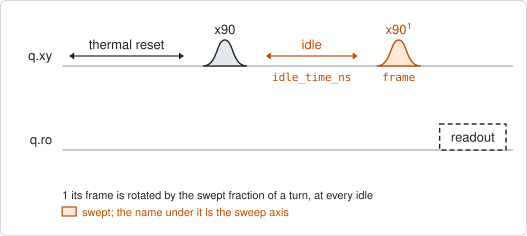
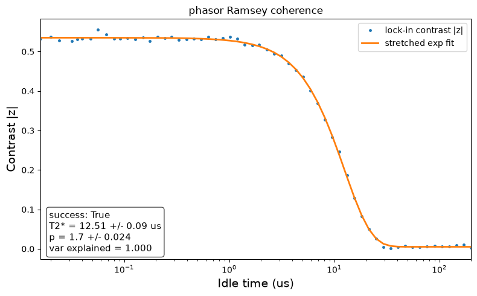

# qubit_ramsey_phasor

## Purpose

Measures T2* and the shape of the dephasing decay. It is a Ramsey experiment in
which the fringe is not laid out along the idle time: at every idle time the
phase of the second pi/2 pulse is swept through one full turn instead. The fringe
over that turn is reduced to one complex number per idle time. Its magnitude is
how much coherence is left, and its angle is the phase the qubit accumulated.

Because the idle axis no longer has to resolve an oscillation, it can be
logarithmic and span several decades. That is what makes the stretch exponent of
the decay measurable: 1 for an exponential decay, 2 for a Gaussian one. Plain
`qubit_ramsey` spends its linear axis on the fringe and cannot tell them apart.

It costs `num_frames` times as many points as `qubit_ramsey`. Use `qubit_ramsey`
for a quick frequency correction, and this one when the shape of the decay
matters.

```
scqo run qubit_ramsey_phasor --targets q1
scqo run qubit_ramsey_phasor --targets q1 --set max_idle_time_ns=500000 --set num_frames=8
```

## Before running it

<!-- BEGIN generated: requires -->
GENERATED from `QubitRamseyPhasor.requires` and its Parameters mixins - edit
the declaration, then run `python scripts/update_docs.py`.

The target is a `transmon` / `flux_transmon` / `fluxonium` carrying the operations `rx`, `readout`.

These device values must already be right:

| value | held by | used for | provided by |
|---|---|---|---|
| `drive_freq_hz` | drive channel | the accumulated phase is measured against it, with no artificial detuning: it has to be close enough that the phase can be followed from one idle point to the next | `qubit_ramsey`, `qubit_ramsey_flux_pulse`, `qubit_ramsey_phasor`, `qubit_spectroscopy` |
| `readout_freq_hz` | readout channel | the readout tone has to sit on the resonator | `readout_frequency`, `resonator_spectroscopy`, `resonator_spectroscopy_flux`, `resonator_spectroscopy_power_amp`, `resonator_spectroscopy_power_chain` |
| `readout_power_dbm` | readout channel | the readout has to be at its working power | `resonator_spectroscopy_power_amp`, `resonator_spectroscopy_power_chain` |
| `thermalization_time_s` | drive channel | how long the thermal reset waits (a per-run thermalization_time_ns replaces it) (with the default `reset_method=thermal`) | `qubit_relaxation` |

Needed only with a non-default setting:

| setting | value | held by | used for | provided by |
|---|---|---|---|---|
| `use_state_discrimination=true` | `readout_rotation_rad` | readout channel | the axis each shot is projected on before thresholding | no shared experiment; set it by hand (`scqo set`) or by a backend's own writeback |
| `use_state_discrimination=true` | `readout_threshold` | readout channel | splits \|0> from \|1> on that axis | no shared experiment; set it by hand (`scqo set`) or by a backend's own writeback |
| `reset_method=active` | `readout_rotation_rad` | readout channel | the reset measurement is discriminated on the rotated axis | no shared experiment; set it by hand (`scqo set`) or by a backend's own writeback |
| `reset_method=active` | `readout_threshold` | readout channel | decides whether the reset plays its pi pulse | no shared experiment; set it by hand (`scqo set`) or by a backend's own writeback |
| `reset_method=active` | `readout_depletion_s` | readout channel | the settle between the reset measurement and the first pulse | `resonator_spectroscopy` |

A backend may need more than this - a knob only it consumes. `scqo run qubit_ramsey_phasor --help` lists those where that driver is installed.
<!-- END generated: requires -->

## Pulse sequence



After the reset: `x90`, the swept idle, a second `x90` whose frame is rotated by
the swept fraction of a turn, then the readout. The idle time is the outer loop
and the frame the inner one, so every idle time gets a complete turn.

No artificial detuning is applied, unlike `qubit_ramsey`. The fringe is in the
frame axis, so a detuning would add nothing to the contrast; with none, the slope
of the accumulated phase against the idle time is the frequency error itself.

The idle points are spaced logarithmically from `min_idle_time_ns` to
`max_idle_time_ns`, then placed on the 4 ns grid and de-duplicated. At the short
end neighbouring points fall on the same grid value, so the run has fewer idle
points than `num_points` asks for.

## Theory

*To be written.*

## Outputs

<!-- BEGIN generated: outputs -->
GENERATED from `QubitRamseyPhasor.writes` and `.extracts` - edit the
declaration, then run `python scripts/update_docs.py`.

Proposed by `update()`; each stays pending until it is accepted:

| field | held by | role | unit | meaning |
|---|---|---|---|---|
| `drive_freq_hz` | drive channel | knob | Hz | Drive frequency (operating CHOICE; the fact is the target's f_01_hz). |
| `f_01_hz` | qubit mode | fact | Hz | Qubit 0->1 frequency at the idle point (the drive_freq_hz knob is its instrument twin; one fit writes both). |
| `t2_star_s` | qubit mode | fact | s | Ramsey dephasing time T2*. |

Reported in `result.fit` and never written:

| fit key | meaning |
|---|---|
| `stretch_p` | the stretch exponent of the decay: 1 is an exponential, 2 a Gaussian. Reported only - no device field holds it |
| `stretch_p_err` | the fit's standard error on the stretch exponent |
| `t2_star_err_s` | the fit's standard error on T2* |
| `var_explained` | the share of the envelope's variance the fitted decay accounts for |
| `n_phase_valid` | how many idle points kept a phase the unwrap could follow; the frequency is fitted on those |
| `detuning_error_hz` | the slope of the accumulated phase: the signed distance of the qubit from the drive. Absent when the phase could not be followed |
| `old_drive_freq_hz` | the drive frequency the run started from (reported with detuning_error_hz) |
<!-- END generated: outputs -->

The decay and the frequency are two fits, and the second can fail alone. The
phase is followed from one idle point to the next only while that is unambiguous;
past the point where the coherence is gone the angle is noise. When too few
points could be followed, the frequency keys are absent from the fit and only
`t2_star_s` is proposed.

The stretch exponent is reported and not written: no device field holds it.

A run is `SUCCESSFUL` when the decay fit succeeded with a positive, finite T2*.

## Expected result



The coherence against the idle time on a logarithmic axis: the points are the
magnitude of the reduced fringe at each idle time, the curve the fitted stretched
exponential. Check that:

- the curve is flat at short times, falls, and reaches the floor. All three parts
  have to be inside the window for the exponent to mean anything;
- the points follow the curve through the fall, which is where the exponent is
  decided.

A second figure in the run folder shows the raw fringe map and the accumulated
phase with its fitted slope.

## Traps

- **A window that does not cover the fall.** Inside a fraction of one decay time
  every exponent fits equally well. Set `max_idle_time_ns` to several times the
  expected T2*; if the window spans well under a decade, fix the exponent with
  `fix_p=1.0`.
- **Fewer than four frames.** Three points are enough to reduce a clean fringe,
  but not one distorted by an over-rotated pi/2 pulse: its second harmonic then
  leaks into the result. The floor of `num_frames` is 4 for that reason.
- **The drive is far off.** With no artificial detuning the phase advances at the
  real frequency error. If it advances too fast to be followed from one idle
  point to the next, no frequency is proposed. Run `qubit_ramsey` first.

## References

- Related experiments: `qubit_ramsey` (the same quantity from a fringe in time;
  faster, and it also resolves a charge-parity beat), `qubit_echo` (the decay
  with slow noise refocused).
- Code: `scqo/experiments/qubit_ramsey_phasor.py`,
  `scqat/estimators/ramsey_phasor/`.
