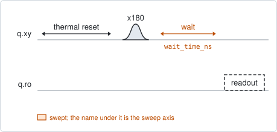
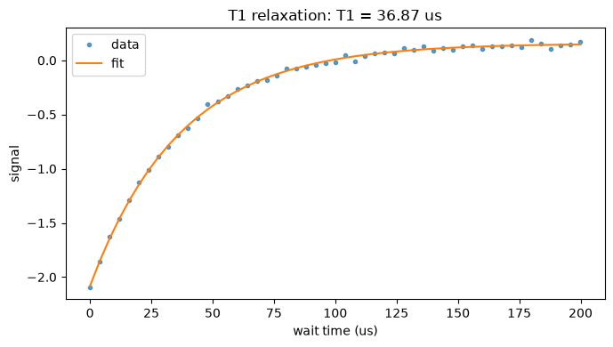

# qubit_relaxation

## Purpose

Measures the energy relaxation time T1. The qubit is excited with a pi pulse,
left alone for a swept delay, and read out; the excited-state population decays
exponentially with the delay, and the time constant of that decay is T1.

It also sets how long every other experiment waits between shots. The thermal
reset waits `thermalization_time_s`, and this experiment proposes that knob as
`thermalization_factor` times the T1 it measured (10 times by default). Run it
once the pi pulse is calibrated, and again when the coherence may have changed.

```
scqo run qubit_relaxation --targets q1
scqo run qubit_relaxation --targets q1 --set max_wait_ns=500000 --set num_points=81
```

## Before running it

<!-- BEGIN generated: requires -->
GENERATED from `QubitRelaxation.requires` and its Parameters mixins - edit
the declaration, then run `python scripts/update_docs.py`.

The target is a `transmon` / `flux_transmon` / `fluxonium` carrying the operations `rx`, `readout`.

These device values must already be right:

| value | held by | used for | provided by |
|---|---|---|---|
| `drive_freq_hz` | drive channel | the x180 that prepares \|e> has to be on resonance | `qubit_ramsey`, `qubit_ramsey_flux_pulse`, `qubit_ramsey_phasor`, `qubit_spectroscopy` |
| `pi_amp` | drive channel | the x180 that prepares \|e> has to be a full pi pulse | `qubit_deterministic_benchmarking`, `qubit_pi_pulse_error`, `qubit_power_rabi` |
| `readout_freq_hz` | readout channel | the readout tone has to sit on the resonator | `readout_frequency`, `resonator_spectroscopy`, `resonator_spectroscopy_flux`, `resonator_spectroscopy_power_amp`, `resonator_spectroscopy_power_chain` |
| `readout_power_dbm` | readout channel | the readout has to be at its working power | `resonator_spectroscopy_power_amp`, `resonator_spectroscopy_power_chain` |
| `thermalization_time_s` | drive channel | how long the thermal reset waits (a per-run thermalization_time_ns replaces it) (with the default `reset_method=thermal`) | `qubit_relaxation` |

Needed only with a non-default setting:

| setting | value | held by | used for | provided by |
|---|---|---|---|---|
| `use_state_discrimination=true` | `readout_rotation_rad` | readout channel | the axis each shot is projected on before thresholding | no shared experiment; set it by hand (`scqo set`) or by a backend's own writeback |
| `use_state_discrimination=true` | `readout_threshold` | readout channel | splits \|0> from \|1> on that axis | no shared experiment; set it by hand (`scqo set`) or by a backend's own writeback |
| `reset_method=active` | `readout_rotation_rad` | readout channel | the reset measurement is discriminated on the rotated axis | no shared experiment; set it by hand (`scqo set`) or by a backend's own writeback |
| `reset_method=active` | `readout_threshold` | readout channel | decides whether the reset plays its pi pulse | no shared experiment; set it by hand (`scqo set`) or by a backend's own writeback |
| `reset_method=active` | `readout_depletion_s` | readout channel | the settle between the reset measurement and the first pulse | `resonator_spectroscopy` |

A backend may need more than this - a knob only it consumes. `scqo run qubit_relaxation --help` lists those where that driver is installed.
<!-- END generated: requires -->

`thermalization_time_s` is both needed and proposed here. The run's own reset
uses the value that is stored when it starts; before any T1 has been measured,
set it by hand to a safe overestimate (`scqo set q1.thermalization_time_s=...`),
or pass `thermalization_time_ns` for the one run.

## Pulse sequence



After the reset, an `x180` pulse excites the qubit, the swept delay passes, and
the qubit is read out. The delay is the only swept quantity.

## Theory

*To be written.*

## Outputs

<!-- BEGIN generated: outputs -->
GENERATED from `QubitRelaxation.writes` and `.extracts` - edit the
declaration, then run `python scripts/update_docs.py`.

Proposed by `update()`; each stays pending until it is accepted:

| field | held by | role | unit | meaning |
|---|---|---|---|---|
| `t1_s` | qubit mode | fact | s | Energy-relaxation time T1. |
| `thermalization_time_s` | drive channel | knob | s | Passive-reset wait between shots (measurement end -> the next shot's first operation); the calibration loop proposes ~10 x T1 from qubit_relaxation. |

Reported in `result.fit` and never written:

| fit key | meaning |
|---|---|
| `t1_stderr_s` | the fit's standard error on T1 |
| `amplitude` | the fitted size of the decay, in the units of the reduced signal |
| `offset` | the level the decay settles to |
<!-- END generated: outputs -->

The one fit gives two proposals with different roles. `t1_s` is a fact about the
sample. `thermalization_time_s` is a knob, `thermalization_factor` times that
T1, and it takes effect for later runs once it is accepted.

A run is `SUCCESSFUL` when the exponential fit succeeded.

## Expected result



The signal against the delay, with the fitted exponential. Check that:

- the curve has flattened by the end of the window. The last third of the points
  should sit on the final level;
- the first points are well away from that level, so the decay has a clear
  amplitude.

Whether the curve falls or rises has no meaning: it depends on the sign of the
readout signal.

## Traps

- **A window shorter than the decay.** If the curve is still falling at the last
  point, the final level is extrapolated and T1 comes out wrong. Set
  `max_wait_ns` to several times the expected T1.
- **A reset shorter than T1.** If the stored thermalization time is too short,
  the qubit starts each shot partly excited. The decay keeps its time constant
  but loses amplitude. When T1 comes out much longer than the wait assumed,
  accept and run again.
- **T1 is not a constant.** It moves with time and with the qubit frequency. One
  run is one sample of it; `qubit_t1_ade` and `qubit_t1_bayesian` follow it in
  time and `qubit_relaxation_flux_pulse` across flux.

## References

- Related experiments: `qubit_power_rabi` (the pi pulse this needs),
  `qubit_echo` and `qubit_ramsey` (the two dephasing times),
  `qubit_relaxation_flux_pulse` (T1 against flux), `qubit_t1_ade` and
  `qubit_t1_bayesian` (T1 against time).
- Code: `scqo/experiments/qubit_relaxation.py`,
  `scqo/experiments/_capabilities/qubit_reset.py` (where the reset wait lives),
  `scqat/estimators/qubit_relaxation/`.
