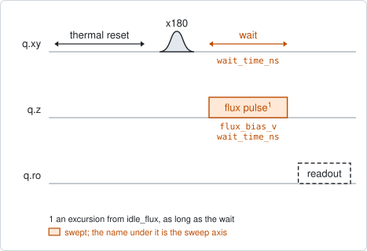
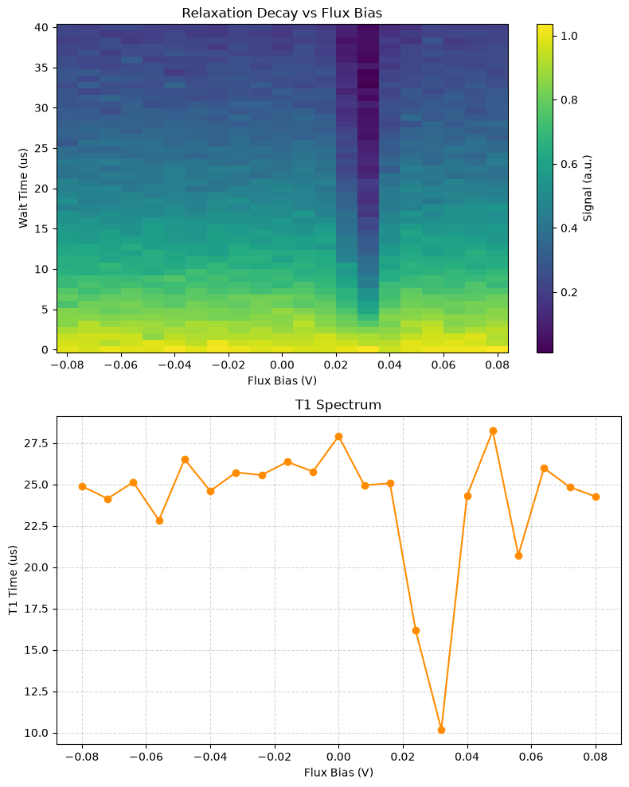

# qubit_relaxation_flux_pulse

## Purpose

Measures T1 against flux. It is `qubit_relaxation` repeated at a row of flux
values: the qubit is excited at its idle point, moved by a flux pulse for the
whole delay, and brought back to be read out. Each flux value gives one decay and
one T1, and together they are a T1 spectrum.

A dip in that spectrum marks a frequency at which something takes energy from the
qubit: a two-level defect, another mode, a resonance of the package. The map
shows where the qubit can be parked and which flux values a gate should not dwell
at.

The flux window is an excursion from `idle_flux`; 0 means "stay parked". The pi
pulse and the readout are played at the idle point, where they were calibrated.

Nothing is written: the experiment records the spectrum.

```
scqo run qubit_relaxation_flux_pulse --targets q1
scqo run qubit_relaxation_flux_pulse --targets q1 --set start_flux_v=-0.15 --set end_flux_v=0.15 --set num_flux_points=41
```

## Before running it

<!-- BEGIN generated: requires -->
GENERATED from `QubitRelaxationFluxPulse.requires` and its Parameters mixins - edit
the declaration, then run `python scripts/update_docs.py`.

The target is a `transmon` / `flux_transmon` / `fluxonium` carrying the operations `rx`, `readout`, `flux_bias`.

These device values must already be right:

| value | held by | used for | provided by |
|---|---|---|---|
| `idle_flux` | flux line | the flux window is an excursion from this standing bias, where the pulses and the readout are played | `pair_zz_coupler`, `qubit_ramsey_flux_pulse`, `qubit_spectroscopy_flux_pulse`, `resonator_spectroscopy_flux` |
| `drive_freq_hz` | drive channel | the x180 that prepares \|e> has to be on resonance | `qubit_ramsey`, `qubit_ramsey_flux_pulse`, `qubit_ramsey_phasor`, `qubit_spectroscopy` |
| `pi_amp` | drive channel | the x180 that prepares \|e> has to be a full pi pulse | `qubit_deterministic_benchmarking`, `qubit_pi_pulse_error`, `qubit_power_rabi` |
| `readout_freq_hz` | readout channel | the readout tone has to sit on the resonator | `readout_frequency`, `resonator_spectroscopy`, `resonator_spectroscopy_flux`, `resonator_spectroscopy_power_amp`, `resonator_spectroscopy_power_chain` |
| `readout_power_dbm` | readout channel | the readout has to be at its working power | `resonator_spectroscopy_power_amp`, `resonator_spectroscopy_power_chain` |
| `thermalization_time_s` | drive channel | how long the thermal reset waits (a per-run thermalization_time_ns replaces it) (with the default `reset_method=thermal`) | `qubit_relaxation` |

Needed only with a non-default setting:

| setting | value | held by | used for | provided by |
|---|---|---|---|---|
| `use_state_discrimination=true` | `readout_rotation_rad` | readout channel | the axis each shot is projected on before thresholding | no shared experiment; set it by hand (`scqo set`) or by a backend's own writeback |
| `use_state_discrimination=true` | `readout_threshold` | readout channel | splits \|0> from \|1> on that axis | no shared experiment; set it by hand (`scqo set`) or by a backend's own writeback |
| `reset_method=active` | `readout_rotation_rad` | readout channel | the reset measurement is discriminated on the rotated axis | no shared experiment; set it by hand (`scqo set`) or by a backend's own writeback |
| `reset_method=active` | `readout_threshold` | readout channel | decides whether the reset plays its pi pulse | no shared experiment; set it by hand (`scqo set`) or by a backend's own writeback |
| `reset_method=active` | `readout_depletion_s` | readout channel | the settle between the reset measurement and the first pulse | `resonator_spectroscopy` |

A backend may need more than this - a knob only it consumes. `scqo run qubit_relaxation_flux_pulse --help` lists those where that driver is installed.
<!-- END generated: requires -->

## Pulse sequence



After the reset, an `x180` pulse excites the qubit at the idle point. A flux
pulse of the swept amplitude is then held for the whole swept delay, and the
qubit is read out back at the idle point. The pulse is as long as the delay, so
it varies with both axes. Flux is the outer loop and the delay the inner one.

With `prepare_state=0` the `x180` is left out: the same map with the qubit in its
ground state, as a reference.

## Theory

*To be written.*

## Outputs

<!-- BEGIN generated: outputs -->
GENERATED from `QubitRelaxationFluxPulse.writes` and `.extracts` - edit the
declaration, then run `python scripts/update_docs.py`.

Record-only: `update()` proposes nothing.

Reported in `result.fit` and never written:

| fit key | meaning |
|---|---|
| `flux_bias_v` | the flux excursions that were swept, in the order the fit holds them: the x axis of every list below |
| `t1` | the fitted T1 at each excursion, in seconds |
| `t1_stderr` | the fit's standard error on each T1 |
| `amplitude` | the fitted size of each decay |
| `offset` | the level each decay settles to |
| `old_idle_flux` | the idle flux the run started from: the origin of the excursions |
<!-- END generated: outputs -->

The fit holds one list per quantity, with one entry per flux value. The flux
values are excursions; add `old_idle_flux` to read them as absolute set-points.

A run is `SUCCESSFUL` when the decay fit succeeded at one flux value or more. It
does not say that every point of the spectrum is good.

## Expected result



The upper panel is the measured signal against the flux excursion and the delay:
each column is one decay. The lower panel is the T1 fitted from each column.
Check that:

- every column starts bright and fades, so each decay is resolved;
- the spectrum is smooth away from its dips. The scatter between neighbouring
  points is the error bar of one fit;
- a dip is a dip in several neighbouring points and shows as a dark column above.
  The simulated device has one, 30 mV from the idle point.

## Traps

- **A window shorter than the decay.** The default longest delay is 40 us. Where
  T1 is longer than that, the decay is not finished, the fitted T1 scatters
  widely, and the spectrum looks rough for no physical reason. Set `max_wait_ns`
  to several times the longest T1.
- **The excursion is in pulse volts.** A flux pulse moves the qubit somewhat less
  than the same DC step (BACKLOG I25), so the position of a dip is its position
  on this axis, not a DC set-point.
- **The idle point is the reference.** If the qubit is not parked where you think
  it is, the whole spectrum is shifted along the axis. `old_idle_flux` records
  where the run started.

## References

- Related experiments: `qubit_relaxation` (one column of this map, and the
  experiment that writes `t1_s`), `qubit_echo_flux_pulse` (the same map for T2
  echo), `qubit_spectroscopy_flux_pulse` (turns a flux into a qubit frequency).
- Code: `scqo/experiments/qubit_relaxation_flux_pulse.py`,
  `scqo/experiments/_capabilities/flux.py` (the two flux frames),
  `scqat/estimators/qubit_relaxation_flux/`.
