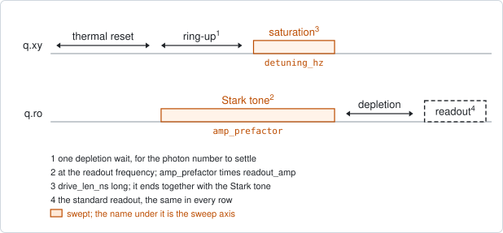
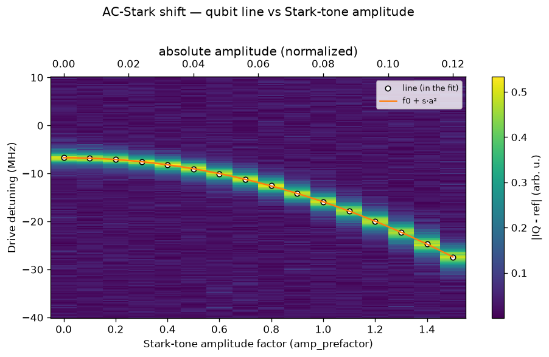

# qubit_resonator_stark

## Purpose

Measures how far photons in the readout resonator move the qubit frequency, and
how much they broaden its line. Each photon shifts the qubit by a fixed amount
(the AC-Stark shift) and dephases it, so the shift is a measure of how many
photons a tone puts into the resonator.

The experiment is qubit spectroscopy with one more axis. A tone at the readout
frequency fills the resonator while the saturation drive sweeps across the qubit
line. The amplitude of that tone is swept as a factor of the readout amplitude,
so factor 1 is the readout's own amplitude. The readout itself comes after the
photons have left and is the same in every row.

The fit gives the shift and the broadening per factor squared. The shift at
factor 1 is therefore the shift the calibrated readout causes. When the
resonator's `chi_hz` is stored, the same shift is also reported as a photon
number.

Nothing is written back. The line with no photons is reported, but
`qubit_spectroscopy` is the experiment that sets `drive_freq_hz`.

```
scqo run qubit_resonator_stark --targets q1
scqo run qubit_resonator_stark --targets q1 --set end_amp_factor=1.0 --set drive_power_dbm=-30
```

## Before running it

<!-- BEGIN generated: requires -->
GENERATED from `QubitResonatorStark.requires` and its Parameters mixins - edit
the declaration, then run `python scripts/update_docs.py`.

The target is a `transmon` / `flux_transmon` / `fluxonium` carrying the operations `rx`, `readout`.

These device values must already be right:

| value | held by | used for | provided by |
|---|---|---|---|
| `drive_freq_hz` | drive channel | the detuning window is counted from it, and the qubit line with no photons has to fall inside that window | `qubit_ramsey`, `qubit_ramsey_flux_pulse`, `qubit_ramsey_phasor`, `qubit_spectroscopy` |
| `readout_freq_hz` | readout channel | the Stark tone and the readout are both played at it | `readout_frequency`, `resonator_spectroscopy`, `resonator_spectroscopy_flux`, `resonator_spectroscopy_power_amp`, `resonator_spectroscopy_power_chain` |
| `readout_amp` | readout channel | the Stark tone's amplitude is amp_prefactor times this one, so factor 1 is the readout's own amplitude | `readout_power` |
| `readout_depletion_s` | readout channel | the wait before the drive, for the photons to build up, and before the readout, for them to leave (a per-run readout_depletion_ns replaces it) | `resonator_spectroscopy` |
| `drive_power_dbm` | drive channel | the run moves the drive chain to its own saturation power and restores this value afterwards, so one has to be set | no shared experiment; set it by hand (`scqo set`) or by a backend's own writeback |
| `readout_power_dbm` | readout channel | the readout has to be at its working power | `resonator_spectroscopy_power_amp`, `resonator_spectroscopy_power_chain` |
| `thermalization_time_s` | drive channel | how long the thermal reset waits (a per-run thermalization_time_ns replaces it) (with the default `reset_method=thermal`) | `qubit_relaxation` |

Needed only with a non-default setting:

| setting | value | held by | used for | provided by |
|---|---|---|---|---|
| `reset_method=active` | `readout_rotation_rad` | readout channel | the reset measurement is discriminated on the rotated axis | no shared experiment; set it by hand (`scqo set`) or by a backend's own writeback |
| `reset_method=active` | `readout_threshold` | readout channel | decides whether the reset plays its pi pulse | no shared experiment; set it by hand (`scqo set`) or by a backend's own writeback |

A backend may need more than this - a knob only it consumes. `scqo run qubit_resonator_stark --help` lists those where that driver is installed.
<!-- END generated: requires -->

`chi_hz` is used when it is stored, and the run works without it: the photon
numbers are then NaN. `readout_frequency` with a dip fit records it.

Run it with one target at a time. Every driver measures the targets one after
another: several Stark tones on one feedline would fill each other's resonators.

## Pulse sequence



After the reset the Stark tone starts on the readout line. The drive line waits
one depletion wait, so that the photon number has settled, and then plays the
saturation drive. The tone and the drive end together. One more depletion wait
later the standard readout measures.

The two waits are one number: the readout channel's depletion wait, or
`readout_depletion_ns` for this run. Filling the resonator and emptying it take
the same time.

The Stark tone is at the readout frequency, with amplitude `amp_prefactor` times
`readout_amp`. The drive is `drive_len_ns` long, at `drive_power_dbm`, and its
frequency is `drive_freq_hz` plus the swept detuning. The amplitude is the outer
loop and the detuning the inner one.

## Theory

*To be written.*

## Outputs

<!-- BEGIN generated: outputs -->
GENERATED from `QubitResonatorStark.writes` and `.extracts` - edit the
declaration, then run `python scripts/update_docs.py`.

Record-only: `update()` proposes nothing.

Reported in `result.fit` and never written:

| fit key | meaning |
|---|---|
| `stark_shift_at_readout_hz` | the fitted shift of the qubit line per amp_prefactor squared: the shift the readout's own amplitude causes |
| `stark_shift_at_readout_err_hz` | the fit's standard error on that shift |
| `stark_hz_per_amp2` | the same slope per absolute amplitude squared |
| `zero_photon_freq_hz` | the qubit line with no photons in the resonator: the fit's value at amplitude 0 |
| `zero_photon_detuning_hz` | the same line as a detuning from drive_freq_hz |
| `broadening_at_readout_hz` | the fitted growth of the linewidth per amp_prefactor squared |
| `fwhm_zero_photon_hz` | the fitted linewidth at amplitude 0 |
| `n_readout` | the photon number at amp_prefactor 1, from the shift and chi_hz; NaN when chi_hz is not stored |
| `photons_per_amp2` | the photon number per absolute amplitude squared; NaN when chi_hz is not stored |
| `chi_hz_used` | the chi_hz the photon numbers were computed with |
| `n_rows_fit` | how many amplitude rows entered the fit of the shift |
| `rms_residual_hz` | the rms distance of those rows' line centres from the fitted shift |
| `old_drive_freq_hz` | the drive frequency the detuning axis is counted from |
| `old_readout_amp` | the readout amplitude the factor multiplied |
<!-- END generated: outputs -->

How the numbers are obtained: each amplitude row is one spectroscopy trace, and
one line is fitted in it. The line centres are fitted with a straight line
against the factor squared, and so are the widths. A row enters those fits when
its line is inside the window and its fit converged. Rows that fall away from
the straight line are left out.

A run is `SUCCESSFUL` when at least three rows are in the fit.

## Expected result



The spectroscopy signal against the Stark-tone amplitude and the drive detuning.
The circles are the line found in each row and the curve is the fitted shift.
The top axis is the same amplitude in absolute units. Check that:

- the row at amplitude 0 shows the qubit line with no photons;
- the line moves smoothly one way as the amplitude grows, and the circles lie
  on the curve;
- the line stays inside the window up to the largest amplitude.

Two more figures are in the run folder: the line centre against the factor
squared, where the points should lie on a straight line, and the linewidth
against the same axis.

In the figure the simulated shift is -9.2 MHz at factor 1. The simulation places
the line with no photons somewhere inside the window; on a calibrated qubit it
is at detuning 0.

## Traps

- **A saturating drive.** Keep `drive_power_dbm` low. A drive strong enough to
  saturate the qubit makes the photon number depend on the qubit state.
- **A window on the wrong side.** The default window is mostly below the drive
  frequency, because photons pull a transmon that sits below its resonator
  down. For a qubit above its resonator, flip the window.
- **Rows that bend away from the straight line.** At a high photon number the
  shift saturates, and where one photon shifts the line by more than the
  resonator linewidth the line splits into several. Neither is in the fitted
  model. Such rows are left out of the fit and the slope is the low-power value;
  read the map itself there.
- **A negative photon number.** It means the stored `chi_hz` and the measured
  shift disagree in sign. The number is reported as it is.
- **A depletion wait nobody measured.** The run is refused when the readout
  channel has no depletion wait, because the photons must be gone before the
  readout. Accept the value `resonator_spectroscopy` proposes, or pass
  `readout_depletion_ns`.
- **Factor 1 is the readout amplitude of today.** The shift at factor 1 belongs
  to the current `readout_amp`. After the readout power is changed, it has to be
  measured again.

## References

- Related experiments: `qubit_spectroscopy` (one row of this map, at amplitude
  0), `readout_frequency` (records `chi_hz`), `resonator_spectroscopy` (proposes
  the depletion wait), `qubit_stark_phase_echo` (the shift caused by a tone on
  the drive line instead).
- Code: `scqo/experiments/qubit_resonator_stark.py`,
  `scqo/experiments/_stark_tone.py` (the timing),
  `scqat/estimators/ac_stark_shift/`.
