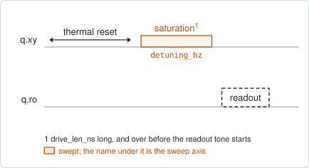
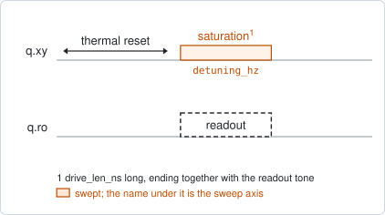
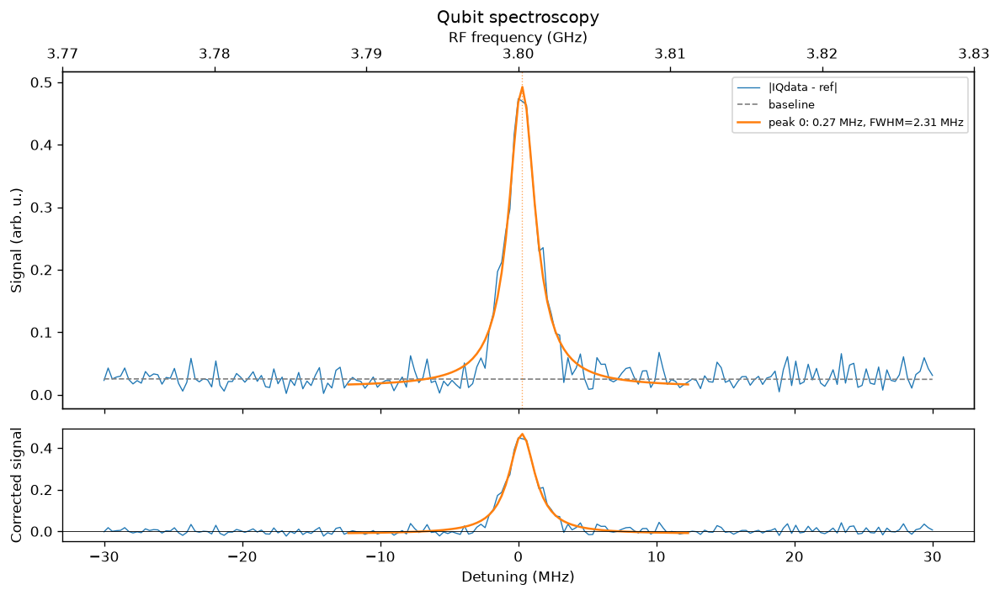

# qubit_spectroscopy

## Purpose

Finds the qubit's 0-1 transition frequency. A long, weak drive tone is stepped
across a frequency window; where it is resonant the qubit ends up partly excited
and the readout signal moves. The strongest peak of that response becomes the new
drive frequency.

It is the first experiment that sees the qubit itself, and it is coarse: the line
is as wide as the drive makes it, a few MHz. Run it after the resonator is found
and before `qubit_power_rabi` and `qubit_ramsey`, which both need a drive
frequency that is already close.

The window is a detuning from the drive frequency already stored, so one window
serves every target of a multiplexed run.

It has two modes. `readout_overlap=false`, the default, ends the drive before the
readout tone starts, so the qubit is measured with no readout photons present.
`readout_overlap=true` ends the drive together with the tone, so the signal is
integrated in a steady state under a live drive. That is faster, but the readout
photons shift the qubit and the proposed frequency carries the shift.

```
scqo run qubit_spectroscopy --targets q1
scqo run qubit_spectroscopy --targets q1 --set start_drive_detuning_hz=-100e6 --set end_drive_detuning_hz=100e6
```

## Before running it

<!-- BEGIN generated: requires -->
GENERATED from `QubitSpectroscopy.requires` and its Parameters mixins - edit
the declaration, then run `python scripts/update_docs.py`.

The target is a `transmon` / `flux_transmon` / `fluxonium` carrying the operations `rx`, `readout`.

These device values must already be right:

| value | held by | used for | provided by |
|---|---|---|---|
| `drive_freq_hz` | drive channel | the swept window is centred on it; a starting value is enough (the design value will do) | `qubit_ramsey`, `qubit_ramsey_flux_pulse`, `qubit_ramsey_phasor`, `qubit_spectroscopy` |
| `drive_power_dbm` | drive channel | the run moves the drive chain to its own saturation power and restores this value afterwards, so one has to be set | no shared experiment; set it by hand (`scqo set`) or by a backend's own writeback |
| `readout_freq_hz` | readout channel | the readout tone has to sit on the resonator | `readout_frequency`, `resonator_spectroscopy`, `resonator_spectroscopy_flux`, `resonator_spectroscopy_power_amp`, `resonator_spectroscopy_power_chain` |
| `readout_power_dbm` | readout channel | the readout has to be at its working power | `resonator_spectroscopy_power_amp`, `resonator_spectroscopy_power_chain` |
| `thermalization_time_s` | drive channel | how long the thermal reset waits (a per-run thermalization_time_ns replaces it) (with the default `reset_method=thermal`) | `qubit_relaxation` |

Needed only with a non-default setting:

| setting | value | held by | used for | provided by |
|---|---|---|---|---|
| `reset_method=active` | `readout_rotation_rad` | readout channel | the reset measurement is discriminated on the rotated axis | no shared experiment; set it by hand (`scqo set`) or by a backend's own writeback |
| `reset_method=active` | `readout_threshold` | readout channel | decides whether the reset plays its pi pulse | no shared experiment; set it by hand (`scqo set`) or by a backend's own writeback |
| `reset_method=active` | `readout_depletion_s` | readout channel | the settle between the reset measurement and the first pulse | `resonator_spectroscopy` |

A backend may need more than this - a knob only it consumes. `scqo run qubit_spectroscopy --help` lists those where that driver is installed.
<!-- END generated: requires -->

## Pulse sequence



After the reset, a saturation tone `drive_len_ns` long is played at the swept
frequency, at the power `drive_power_dbm`. It is over when the readout tone
starts. The drive frequency is the only swept quantity.

The saturation power is not a calibration. The run moves the drive chain to
`drive_power_dbm`, acquires, and puts the chain back exactly where it was; both
moves are recorded.

With `readout_overlap=true` the two tones overlap:



The drive ends where the readout tone ends and starts `drive_len_ns` earlier,
which may be before the tone. `acq_start_ns` delays the integration inside the
tone, to let the resonator and the driven qubit settle first; the readout pulse is
lengthened by the same amount for the run.

## Theory

*To be written.*

## Outputs

<!-- BEGIN generated: outputs -->
GENERATED from `QubitSpectroscopy.writes` and `.extracts` - edit the
declaration, then run `python scripts/update_docs.py`.

Proposed by `update()`; each stays pending until it is accepted:

| field | held by | role | unit | meaning |
|---|---|---|---|---|
| `drive_freq_hz` | drive channel | knob | Hz | Drive frequency (operating CHOICE; the fact is the target's f_01_hz). |
| `f_01_hz` | qubit mode | fact | Hz | Qubit 0->1 frequency at the idle point (the drive_freq_hz knob is its instrument twin; one fit writes both). |

Reported in `result.fit` and never written:

| fit key | meaning |
|---|---|
| `peak_detuning_hz` | where the chosen peak sits, measured from the drive frequency the run started from |
| `fwhm_hz` | the full width at half maximum of the chosen peak |
| `n_peaks` | how many peaks the fit found; the strongest one is chosen |
| `old_drive_freq_hz` | the drive frequency the run started from |
<!-- END generated: outputs -->

`drive_freq_hz` and `f_01_hz` take the same value: the knob the instrument plays
and the measured fact are written together from the one fit.

A run is `SUCCESSFUL` when at least one peak was found and the chosen one lies
inside the swept window. The chosen peak is the one with the largest area
(amplitude times width). With no peak the fit holds only `n_peaks` and
`old_drive_freq_hz`, and nothing is proposed.

## Expected result



The readout response against the drive detuning, with the absolute frequency on
the upper axis. The lower panel is the same with the baseline removed. The fitted
peak is drawn in orange. Check that:

- there is one clear peak, well above the noise and away from both edges of the
  window;
- the peak is narrow, a few MHz. A line tens of MHz wide is power broadened;
- the fitted curve sits on the peak that you would have picked by eye.

## Traps

- **Too much drive power.** The line broadens, and a second line appears below
  it: the two-photon 0-2 transition, half the anharmonicity down. The experiment
  takes the peak with the largest area, which may then be the wrong one. Lower
  `drive_power_dbm` until one narrow line is left.
- **Overlap mode writes a shifted frequency.** With `readout_overlap=true` the
  readout photons pull the qubit, and `drive_freq_hz` is written with that pull in
  it. If `peak_detuning_hz` moves when the readout power changes, the run is
  measuring photons. Use the default mode for the value that is kept.
- **The qubit is outside the window.** The default window is 30 MHz either side
  of the stored frequency. A first search needs a wider one, or
  `broadband_qubit_spectroscopy`.

## References

- Related experiments: `resonator_spectroscopy` (finds the readout this needs),
  `broadband_qubit_spectroscopy` (the search over GHz, when the qubit could be
  anywhere), `qubit_power_rabi` and `qubit_ramsey` (the next two steps; Ramsey
  refines this frequency to kHz), `qubit_spectroscopy_flux_pulse` (this
  measurement repeated against flux).
- Code: `scqo/experiments/qubit_spectroscopy.py`,
  `scqo/experiments/_overlap.py` (the timing of the two modes),
  `scqo/experiments/_drive_power.py`, `scqat/estimators/qubit_spectroscopy/`.
