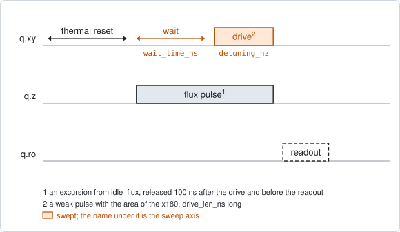
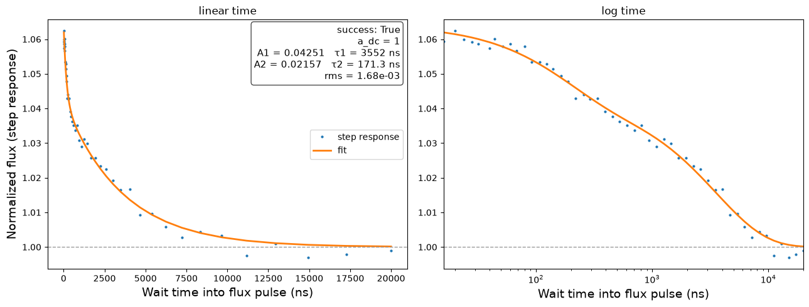

# qubit_spectroscopy_cryoscope

## Purpose

Measures the slow part of the shape a square flux pulse has when it reaches the
qubit: how the flux keeps drifting for hundreds of nanoseconds to microseconds
after the step. It fits that settling with a sum of exponentials, whose
amplitudes and time constants are the numbers a predistortion filter needs.

The qubit is the probe. A flux pulse is switched on and held. After a wait, a
spectroscopy pulse finds the qubit frequency at that moment. The frequency gives
the flux, so the frequency against the wait is the step response.

This is the long-time partner of `qubit_ramsey_cryoscope`. That experiment
reconstructs a phase and is limited to the first few hundred nanoseconds. This
one reads the frequency directly at each wait, so it reaches the slow tails. Its
time resolution is the length of the spectroscopy pulse.

The result is relative. The response is divided by the level it settles to, so
the size of the flux pulse does not have to be known.

```
scqo run qubit_spectroscopy_cryoscope --targets q1
scqo run qubit_spectroscopy_cryoscope --targets q1 --set flux_pulse_amp_v=0.05 --set start_drive_detuning_hz=-70e6 --set end_drive_detuning_hz=0 --set max_wait_ns=400000
```

## Before running it

<!-- BEGIN generated: requires -->
GENERATED from `QubitSpectroscopyCryoscope.requires` and its Parameters mixins - edit
the declaration, then run `python scripts/update_docs.py`.

The target is a `transmon` / `flux_transmon` / `fluxonium` carrying the operations `rx`, `readout`, `flux_bias`.

These device values must already be right:

| value | held by | used for | provided by |
|---|---|---|---|
| `idle_flux` | flux line | the parked flux is an excursion from this standing bias, where the reset and the readout happen | `pair_zz_coupler`, `qubit_ramsey_flux_pulse`, `qubit_spectroscopy_flux_pulse`, `resonator_spectroscopy_flux` |
| `drive_freq_hz` | drive channel | the drive is centred on the frequency predicted for the parked flux, counted from this one | `qubit_ramsey`, `qubit_ramsey_flux_pulse`, `qubit_ramsey_phasor`, `qubit_spectroscopy` |
| `pi_amp` | drive channel | the spectroscopy pulse is given the area of the x180: its amplitude | `qubit_deterministic_benchmarking`, `qubit_pi_pulse_error`, `qubit_power_rabi` |
| `pi_duration_s` | drive channel | the spectroscopy pulse is given the area of the x180: its length | no shared experiment; set it by hand (`scqo set`) or by a backend's own writeback |
| `readout_freq_hz` | readout channel | the readout tone has to sit on the resonator | `readout_frequency`, `resonator_spectroscopy`, `resonator_spectroscopy_flux`, `resonator_spectroscopy_power_amp`, `resonator_spectroscopy_power_chain` |
| `readout_power_dbm` | readout channel | the readout has to be at its working power | `resonator_spectroscopy_power_amp`, `resonator_spectroscopy_power_chain` |
| `thermalization_time_s` | drive channel | how long the thermal reset waits (a per-run thermalization_time_ns replaces it) (with the default `reset_method=thermal`) | `qubit_relaxation` |

Needed only with a non-default setting:

| setting | value | held by | used for | provided by |
|---|---|---|---|---|
| `use_state_discrimination=true` | `readout_rotation_rad` | readout channel | the axis each shot is projected on before thresholding | no shared experiment; set it by hand (`scqo set`) or by a backend's own writeback |
| `use_state_discrimination=true` | `readout_threshold` | readout channel | splits \|0> from \|1> on that axis | no shared experiment; set it by hand (`scqo set`) or by a backend's own writeback |
| `reset_method=active` | `readout_rotation_rad` | readout channel | the reset measurement is discriminated on the rotated axis | no shared experiment; set it by hand (`scqo set`) or by a backend's own writeback |
| `reset_method=active` | `readout_threshold` | readout channel | decides whether the reset plays its pi pulse | no shared experiment; set it by hand (`scqo set`) or by a backend's own writeback |
| `reset_method=active` | `readout_depletion_s` | readout channel | the settle between the reset measurement and the first pulse | `resonator_spectroscopy` |

A backend may need more than this - a knob only it consumes. `scqo run qubit_spectroscopy_cryoscope --help` lists those where that driver is installed.
<!-- END generated: requires -->

One stored fact is used when it exists, and the run works without it:
`flux_per_phi0`. With it the experiment predicts, from the arch, how far the
flux pulse moves the qubit, and centres the drive there. Without it the
prediction uses `fallback_curvature_hz_per_v2`, which is only a nominal number.
The detuning window is measured from that predicted frequency.

Run it with one target at a time. Every driver builds this sequence for a single
qubit and refuses more.

## Pulse sequence



After the reset the flux pulse is switched on, at `flux_pulse_amp_v` above the
idle flux, and held. The drive line waits `wait_time_ns` and then plays the
spectroscopy pulse. The flux pulse is released 100 ns after that pulse ends, and
the readout follows at the idle flux.

The spectroscopy pulse is `drive_len_ns` long and weak: its amplitude is chosen
so that it has the same area as the `x180`. On resonance it is a pi pulse, so
the line has full contrast, and a longer pulse is a proportionally weaker one.
Its frequency is the predicted frequency of the parked qubit plus the swept
detuning.

The wait takes `num_wait_points` values spaced logarithmically from
`min_wait_ns` to `max_wait_ns`, on a 4 ns grid; values that fall on the same
grid point are merged. The detuning is the outer loop and the wait the inner
one.

## Theory

*To be written.*

## Outputs

<!-- BEGIN generated: outputs -->
GENERATED from `QubitSpectroscopyCryoscope.writes` and `.extracts` - edit the
declaration, then run `python scripts/update_docs.py`.

Proposed by `update()`; each stays pending until it is accepted:

| field | held by | role | unit | meaning |
|---|---|---|---|---|
| `distortion_amp` | flux line | fact | - | Flux-transient predistortion tap amplitudes of this line (measured cryo-wiring physics, per cooldown). |
| `distortion_tau_s` | flux line | fact | s | Flux-transient tap time constants (equal length with distortion_amp). |

Reported in `result.fit` and never written:

| fit key | meaning |
|---|---|
| `a_dc` | the level the fitted step response settles to; 1 by construction, since the response is divided by its own tail |
| `rms_residual` | the rms distance between the step response and the fit |
| `n_components` | how many exponential components the fit kept; not always as many as fit_start_fractions lists |
| `center_offset_hz` | the detuning the drive was parked at, measured from drive_freq_hz: the predicted shift of the qubit under the flux pulse |
| `n_peaks_found` | at how many wait times a spectroscopy line was found |
| `old_idle_flux` | the standing bias the flux pulse rode on |
| `flux_pulse_amp_v` | the amplitude of the flux pulse that was played |
<!-- END generated: outputs -->

The two written values are lists of equal length, one entry per exponential
component, slowest first. `distortion_amp` is relative to the settled level: a
component of 0.05 is a 5 % overshoot that decays with its time constant.

Accepting them replaces the whole lists. `qubit_ramsey_cryoscope` writes the
same two fields, so the run accepted last is the one on record; the two are not
merged.

The values are facts about the wiring. Accepting them records the measurement
and changes nothing on the instrument. Putting them into the instrument's output
filter is a separate step of the backend; after a successful run the command for
it is printed, where the backend has one.

How the response is built: at each wait a single line is fitted and its centre
taken. The centre plus `center_offset_hz` is the shift of the qubit from its
idle frequency, and the flux is the square root of that shift. The response is
divided by its mean over the longest 15 % of the waits. Waits where no line was
found are left out.

The fit starts each component at one of `fit_start_fractions`. When
`fit_tau_seeds` is given, a second fit starts from those time constants and the
one with the smaller residual is kept.

A run is `SUCCESSFUL` when a line was found at 16 or more of the waits, the fit
converged and kept at least one component, and every component has a positive
time constant and an amplitude of at most 2.

## Expected result



The step response against the wait, on a linear and on a logarithmic time axis,
with the fit. 1 is the settled level. The box lists each component as an
amplitude and a time constant. Check that:

- the points settle onto the dashed line at 1 before the longest wait;
- the points are spread over the whole logarithmic panel, with no gap where the
  line was lost;
- every amplitude in the box is small compared with 1.

A second figure in the run folder shows the measured map, detuning against wait,
with the fitted centres drawn on it. Look at it first when a run fails: it shows
whether the line is inside the window and whether it is being followed.

In the figure the simulated response has two components, 4.3 % at 3.6 us and
2.2 % at 0.17 us.

## Traps

- **The line is not where the drive was centred.** With a nominal curvature the
  prediction is rough, and the line then sits to one side of the window or
  outside it. Measure the arch first (`qubit_spectroscopy_flux_pulse` or
  `resonator_spectroscopy_flux` record `flux_per_phi0`), or put the whole window
  on the side where the line is.
- **A pulse longer than the wait.** At waits shorter than `drive_len_ns` the
  spectroscopy pulse averages the settling over its own length. Choose
  `drive_len_ns` near the shortest time you need to resolve.
- **Length narrows the line, shape does not.** The width of the line is about
  0.8 divided by `drive_len_ns` for the square pulse, and the centre is found
  proportionally better for a narrower line. The smooth shapes give a wider
  line; use one only when the line itself looks wrong, split or lopsided.
- **A line as wide as the window.** Keep the line to about a third of the
  detuning window, so that every wait has baseline on both sides.
- **`drive_amp_factor` above 1 splits the line.** The pulse then rotates the
  qubit by more than pi on resonance, and the line loses its centre.
- **A large flux pulse leaves the band.** The drive is moved by retuning within
  its band, not by moving the local oscillator. Keep `flux_pulse_amp_v` small
  enough that the parked frequency stays in reach.
- **An idle point away from the top of the arch.** Both the centring and the
  conversion from frequency to flux use the relation that holds at the top of
  the arch, where the shift grows with the square of the flux.
- **A record that ends before the response has settled.** A component still
  decaying over the longest waits becomes part of the settled level and is not
  reported. Set `max_wait_ns` to a few times the slowest tail you expect.
- **The last run accepted wins.** The two cryoscopes write the same fields and
  each replaces the other's values.
- **Accepted is not applied.** After accepting, the flux line is as distorted as
  before. The filter is changed by the backend's own command.
- **Measured with a filter already in place.** With a filter applied, a run
  measures what is left over. Those values describe the remainder, not the line.

## References

- Related experiments: `qubit_ramsey_cryoscope` (the same response at short
  times), `qubit_spectroscopy_flux_pulse` (the arch, for the centring),
  `qubit_xyz_delay` (the timing of the flux line).
- Code: `scqo/experiments/qubit_spectroscopy_cryoscope.py`,
  `scqat/estimators/spectroscopy_cryoscope/`, `scqat/tools/peak_fit.py`,
  `scqat/tools/step_response_fit.py`,
  `scqo/experiments/_distortion_hint.py` (the printed command).
