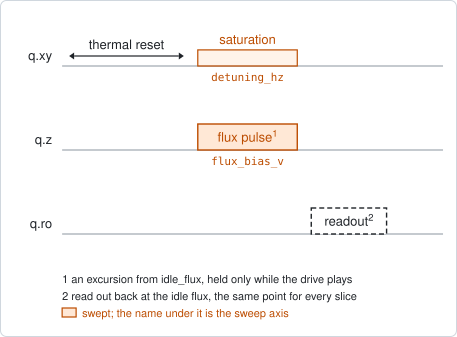
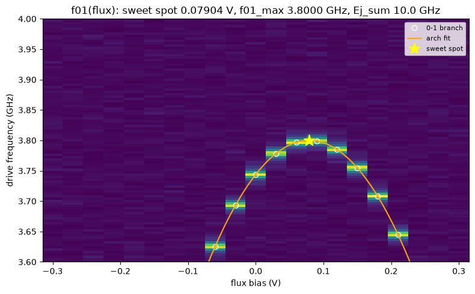

# qubit_spectroscopy_flux_pulse

## Purpose

Maps the qubit frequency against flux. It is qubit spectroscopy repeated at a row
of flux values: at each one the 0-1 peak is found, and the row of peaks is fitted
with the transmon arch. The fit gives the sweet spot, the flux period, the top of
the arch and the sum of the junction energies, and the qubit is then parked at
the sweet spot.

It is one of three ways to place a qubit on its arch. This one shows the whole
arch on the qubit itself and works when the coherence is short, but it is limited
by the spectroscopy linewidth. `resonator_spectroscopy_flux` reads the offset and
the period through the resonator, before the qubit is visible.
`qubit_ramsey_flux_pulse` resolves the arch near the idle point to kHz. All three
propose `idle_flux`.

The flux is a pulse, not a DC level: it is added to the standing bias only while
the drive plays, and the readout always happens at the idle point. The flux
window is therefore an excursion from `idle_flux`, and 0 means "stay parked". A
qubit that is already at its sweet spot gives an arch centred on 0.

```
scqo run qubit_spectroscopy_flux_pulse --targets q1
scqo run qubit_spectroscopy_flux_pulse --targets q1 --set start_flux_v=-0.1 --set end_flux_v=0.1
```

## Before running it

<!-- BEGIN generated: requires -->
GENERATED from `QubitSpectroscopyFluxPulse.requires` and its Parameters mixins - edit
the declaration, then run `python scripts/update_docs.py`.

The target is a `transmon` / `flux_transmon` / `fluxonium` carrying the operations `rx`, `readout`, `flux_bias`.

These device values must already be right:

| value | held by | used for | provided by |
|---|---|---|---|
| `drive_freq_hz` | drive channel | the swept window is centred on it; a starting value is enough (the design value will do) | `qubit_ramsey`, `qubit_ramsey_flux_pulse`, `qubit_ramsey_phasor`, `qubit_spectroscopy` |
| `idle_flux` | flux line | the flux window is an excursion from it; it only has to put the sweet spot inside that window; a starting value is enough (the design value will do) | `pair_zz_coupler`, `qubit_ramsey_flux_pulse`, `qubit_spectroscopy_flux_pulse`, `resonator_spectroscopy_flux` |
| `drive_power_dbm` | drive channel | the run moves the drive chain to its own saturation power and restores this value afterwards, so one has to be set | no shared experiment; set it by hand (`scqo set`) or by a backend's own writeback |
| `readout_freq_hz` | readout channel | the readout tone has to sit on the resonator | `readout_frequency`, `resonator_spectroscopy`, `resonator_spectroscopy_flux`, `resonator_spectroscopy_power_amp`, `resonator_spectroscopy_power_chain` |
| `readout_power_dbm` | readout channel | the readout has to be at its working power | `resonator_spectroscopy_power_amp`, `resonator_spectroscopy_power_chain` |
| `thermalization_time_s` | drive channel | how long the thermal reset before every point waits | `qubit_relaxation` |

A backend may need more than this - a knob only it consumes. `scqo run qubit_spectroscopy_flux_pulse --help` lists those where that driver is installed.
<!-- END generated: requires -->

The charging energy is not fitted. The arch model holds it at `ec_ghz`
(0.2 GHz by default); set it to the chip's value when it is known.

## Pulse sequence



After a thermal wait, the saturation tone and the flux pulse are played together:
the flux line is moved by the swept excursion for exactly as long as the drive is
on, and returns to the idle point before the readout. Every point of the map is
therefore read out at the same flux, which is what lets the whole map be reduced
against one reference point in the I/Q plane.

There is no reset choice here: the wait before each point is always thermal. As
in `qubit_spectroscopy`, the drive chain is moved to `drive_power_dbm` for the
run and put back afterwards.

With `flux_component` the pulse is played on another entity's flux line instead
of the target's own: another qubit's, or a coupler's.

## Theory

*To be written.*

## Outputs

<!-- BEGIN generated: outputs -->
GENERATED from `QubitSpectroscopyFluxPulse.writes` and `.extracts` - edit the
declaration, then run `python scripts/update_docs.py`.

Proposed by `update()`; each stays pending until it is accepted:

| field | held by | role | unit | meaning |
|---|---|---|---|---|
| `ej_sum_hz` | qubit mode | fact | Hz | Total Josephson energy EJ1+EJ2 (arch fit). |
| `f_q_max_hz` | qubit mode | fact | Hz | Qubit 0->1 frequency at the sweet spot (arch top). |
| `flux_offset` | flux channel | fact | source-native | Sweet-spot offset of the transfer function flux/Phi0 = (x - flux_offset)/flux_per_phi0, where x is the ABSOLUTE set-point on the same plane as the line's idle_flux. An experiment whose sweep axis is relative to idle_flux re-references (absolute = idle_flux_at_run + fitted) before writing here. |
| `flux_per_phi0` | flux channel | fact | source-native | Source units of this line per flux quantum in the target's SQUID. |
| `idle_flux` | flux line | knob | source-native | Standing bias set-point of this line in the flux source's native unit (volts for an AWG line, amperes for a coil). A coupler's decouple point IS this knob on its own flux line. It is also the ORIGIN a '_pulse' flux experiment's swept window is measured from (its probe plays on top of this bias). |

Reported in `result.fit` and never written:

| fit key | meaning |
|---|---|
| `f01_at_sweet_spot_hz` | the fitted top of the arch; proposed as f_q_max_hz |
| `flux_offset_from_idle` | the sweet spot as an excursion from the idle flux the run started from - the frame of the swept axis |
| `flux_offset_stderr` | the fit's standard error on the sweet spot |
| `ej_sum_stderr_hz` | the fit's standard error on ej_sum_hz |
| `ec_ghz_assumed` | the charging energy the arch model held fixed (ec_ghz) |
| `old_drive_freq_hz` | the drive frequency the detuning window was centred on |
| `old_idle_flux` | the idle flux the run started from: the origin of the swept axis |
<!-- END generated: outputs -->

The sweet spot is reported in two frames. `flux_offset_from_idle` is what the fit
found on the swept axis, an excursion. `flux_offset` is that excursion added to
`old_idle_flux`: an absolute set-point, which is what the fact stores and what
`idle_flux` is set to. The period and every frequency are the same in both
frames.

`drive_freq_hz` is not proposed. Accepting moves the qubit along the flux axis
only.

A run is `SUCCESSFUL` when the arch fit succeeded. When the swept line belongs to
another entity (`flux_component`) the fit describes crosstalk or a coupler's
pull, and nothing is proposed.

## Expected result



The map shows the readout response against the flux excursion and the drive
frequency. Each bright streak is the qubit line at one flux; the circles are the
peaks that were found, the curve is the fitted arch and the star is the sweet
spot. Check that:

- the circles follow one smooth curve;
- the arch turns over inside the window. A window that shows one flank only
  cannot place the top;
- the fitted curve passes through the circles on both flanks.

In the figure the sweet spot is 0.079 V away from the idle point: the simulated
qubit starts parked off its sweet spot, which is the condition this experiment
corrects. After accepting, a second run shows the arch centred on 0. Only about
half of the flux values carry a circle: further out, the line has left the
frequency window.

## Traps

- **Accepting leaves the drive frequency where it was.** The qubit is re-parked
  at the sweet spot, where its frequency is `f_q_max_hz`, but `drive_freq_hz`
  still holds the frequency of the old idle point. Run `qubit_spectroscopy` or
  `qubit_ramsey` afterwards to bring the drive back onto the qubit. Until then a
  repeat of this map has the same frequency window as before.
- **A pulse is not a DC step.** A flux pulse moves the qubit somewhat less than
  the same DC step, so a sweet spot found from far away is slightly off
  (BACKLOG I25). The error grows with the distance and vanishes at 0: accept and
  run the map again.
- **The line leaves the frequency window.** The arch spans hundreds of MHz, and
  the default window is 200 MHz either side of the drive frequency. Flux values
  whose peak is outside it contribute nothing, and the fit needs at least five
  good ones.
- **A map against another line is not the target's arch.** With `flux_component`
  the run is record-only on purpose.

## References

- Related experiments: `resonator_spectroscopy_flux` and
  `qubit_ramsey_flux_pulse` (the other two ways to place the qubit on its arch),
  `qubit_spectroscopy` (one row of this map, and the experiment that brings
  `drive_freq_hz` back after a re-park).
- Code: `scqo/experiments/qubit_spectroscopy_flux_pulse.py`,
  `scqo/experiments/_capabilities/flux.py` (the two flux frames),
  `scqat/estimators/qubit_flux_arch/`.
