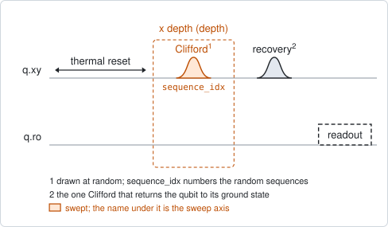
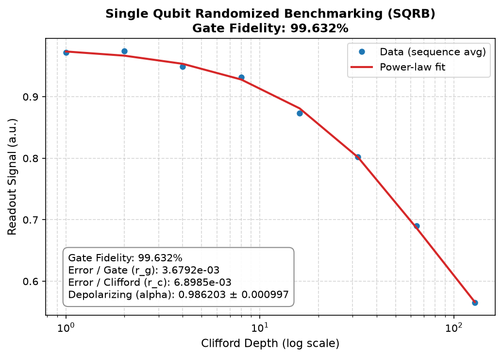

# qubit_sqrb

## Purpose

Measures the average fidelity of the single-qubit gates by randomized
benchmarking. A sequence of randomly chosen Clifford gates is played, followed by
the one gate that undoes the whole sequence, so that perfect gates would return
the qubit to its ground state. Real gates do not quite, and the chance of finding
the qubit in its ground state falls as the sequence gets longer. Averaged over
many random sequences that fall is an exponential in the sequence length, and its
rate gives the average error per gate.

The result does not depend on how good the state preparation and the readout
are: those set the height and the floor of the curve, not its rate. That is what
makes it the standard figure for comparing gate calibrations.

It writes nothing. Run it after the pulses are calibrated, and again after each
change to see whether the gates improved.

```
scqo run qubit_sqrb --targets q1
scqo run qubit_sqrb --targets q1 --set max_circuit_depth=1000 --set num_random_sequences=50 --set seed=7
```

## Before running it

<!-- BEGIN generated: requires -->
GENERATED from `QubitSQRB.requires` and its Parameters mixins - edit
the declaration, then run `python scripts/update_docs.py`.

The target is a `transmon` / `flux_transmon` / `fluxonium` carrying the operations `rx`, `readout`.

These device values must already be right:

| value | held by | used for | provided by |
|---|---|---|---|
| `drive_freq_hz` | drive channel | every Clifford is built from resonant pi and pi/2 pulses; their calibration is what the result measures | `qubit_ramsey`, `qubit_ramsey_flux_pulse`, `qubit_ramsey_phasor`, `qubit_spectroscopy` |
| `pi_amp` | drive channel | every Clifford is built from pi and pi/2 pulses; their calibration is what the result measures | `qubit_deterministic_benchmarking`, `qubit_pi_pulse_error`, `qubit_power_rabi` |
| `readout_freq_hz` | readout channel | the readout tone has to sit on the resonator | `readout_frequency`, `resonator_spectroscopy`, `resonator_spectroscopy_flux`, `resonator_spectroscopy_power_amp`, `resonator_spectroscopy_power_chain` |
| `readout_power_dbm` | readout channel | the readout has to be at its working power | `resonator_spectroscopy_power_amp`, `resonator_spectroscopy_power_chain` |
| `thermalization_time_s` | drive channel | how long the thermal reset waits (a per-run thermalization_time_ns replaces it) (with the default `reset_method=thermal`) | `qubit_relaxation` |

Needed only with a non-default setting:

| setting | value | held by | used for | provided by |
|---|---|---|---|---|
| `use_state_discrimination=true` | `readout_rotation_rad` | readout channel | the axis each shot is projected on before thresholding | no shared experiment; set it by hand (`scqo set`) or by a backend's own writeback |
| `use_state_discrimination=true` | `readout_threshold` | readout channel | splits \|0> from \|1> on that axis | no shared experiment; set it by hand (`scqo set`) or by a backend's own writeback |
| `reset_method=active` | `readout_rotation_rad` | readout channel | the reset measurement is discriminated on the rotated axis | no shared experiment; set it by hand (`scqo set`) or by a backend's own writeback |
| `reset_method=active` | `readout_threshold` | readout channel | decides whether the reset plays its pi pulse | no shared experiment; set it by hand (`scqo set`) or by a backend's own writeback |
| `reset_method=active` | `readout_depletion_s` | readout channel | the settle between the reset measurement and the first pulse | `resonator_spectroscopy` |

A backend may need more than this - a knob only it consumes. `scqo run qubit_sqrb --help` lists those where that driver is installed.
<!-- END generated: requires -->

A benchmark does not need these to be right in order to run: they are the gates
being measured. They do need to be close, or the curve falls to its floor within
a few gates and there is nothing to fit.

## Pulse sequence



After the reset, `depth` random Clifford gates are played, then the recovery
gate, and the qubit is read out. A Clifford is up to three pi or pi/2 pulses.

Each of the `num_random_sequences` sequences is one long random list of Cliffords.
A depth plays the first `depth` of them, followed by the recovery gate for that
part, so the depths of one sequence share their beginning. With `log_scale` the
depths are 1, 2, 4, ... up to `max_circuit_depth`; without it they are 1 and
then the multiples of `delta_clifford`.

## Theory

*To be written.*

## Outputs

<!-- BEGIN generated: outputs -->
GENERATED from `QubitSQRB.writes` and `.extracts` - edit the
declaration, then run `python scripts/update_docs.py`.

Record-only: `update()` proposes nothing.

Reported in `result.fit` and never written:

| fit key | meaning |
|---|---|
| `alpha` | the fitted depolarizing parameter: the signal decays as alpha to the power of the depth |
| `alpha_stderr` | the fit's standard error on alpha |
| `error_per_clifford` | (1 - alpha) / 2 |
| `error_per_gate` | the error per Clifford divided by 1.875, the mean number of pulses in a Clifford |
| `gate_fidelity` | 1 minus the error per gate |
<!-- END generated: outputs -->

The signal is averaged over the random sequences at each depth and fitted with a
constant times `alpha` to the power of the depth, plus an offset. The three error
figures are the same number in three forms: the error per Clifford is
`(1 - alpha) / 2`, and the error per gate divides it by 1.875, the average number
of pulses in a Clifford.

Nothing is proposed: no device field holds a benchmarking fidelity
(BACKLOG I13).

A run is `SUCCESSFUL` when the fit succeeded and `alpha` is between 0 and 1.

## Expected result



The sequence-averaged signal against the Clifford depth, on a logarithmic axis,
with the fitted decay. The box gives the fidelity and the three related numbers.
Check that:

- the points start near the ground-state level and fall monotonically;
- the fit passes through the points at every depth;
- the curve has come most of the way to its floor at the largest depth. If it
  has barely fallen, the floor is unknown and `alpha` is poorly determined;
  raise `max_circuit_depth`.

## Traps

- **The same sequences every run.** With `seed` unset the generator is seeded
  with a fixed number, so two runs play identical sequences. That suits a
  before-and-after comparison; pass a different `seed` to draw new ones.
- **Too few depths in the fall.** The logarithmic grid puts most of its points
  at short depths. With good gates the decay happens at the last two or three
  points; use `log_scale=false` with a suitable `delta_clifford` to put more
  points there.
- **The error per gate is an average.** It assumes every pulse has the same
  error and that a Clifford averages 1.875 of them. It says nothing about which
  gate is bad; `qubit_deterministic_benchmarking` looks at one gate at a time.

## References

- Related experiments: `qubit_deterministic_benchmarking` (the error of one
  chosen gate), `qubit_drag_equator` and `qubit_drag_alternating`,
  `qubit_power_rabi` and `qubit_pi_pulse_error` (the calibrations this
  measures the result of).
- Code: `scqo/experiments/qubit_sqrb.py`, `scqat/estimators/qubit_sqrb/`.
