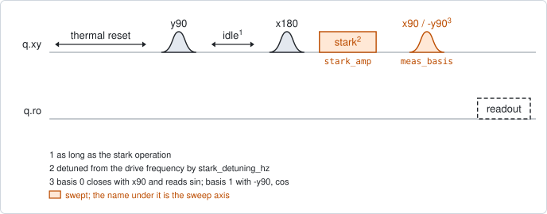
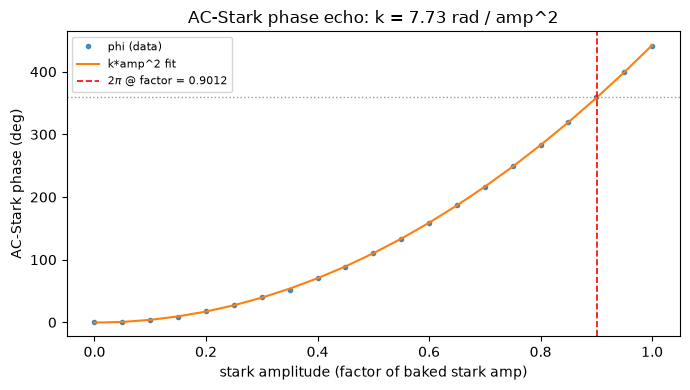

# qubit_stark_phase_echo

## Purpose

Measures the phase that an off-resonant tone on the drive line gives the qubit,
as a function of the tone's amplitude. A tone that is detuned from the qubit
does not rotate it; it shifts its frequency while it is on (the AC-Stark shift),
and the qubit collects a phase. Such a tone is used wherever a phase has to be
added on purpose, for instance to compensate the phase a swap leaves behind.

The answer to take away is the amplitude that gives one full turn of phase,
`amp_2pi_factor`. It is read off the measured curve, not computed from a fitted
coefficient.

The measurement is a Hahn echo with the tone in its second arm. The echo removes
the phase from the qubit's own detuning, which is the same in both arms, so what
remains is the phase from the tone alone. The phase is read in two bases, which
gives its sine and its cosine, so it is known over a full turn.

Nothing is written back.

```
scqo run qubit_stark_phase_echo --targets q1
scqo run qubit_stark_phase_echo --targets q1 --set max_stark_amp=1.5 --set stark_detuning_hz=80e6
```

## Before running it

<!-- BEGIN generated: requires -->
GENERATED from `QubitStarkPhaseEcho.requires` and its Parameters mixins - edit
the declaration, then run `python scripts/update_docs.py`.

The target is a `transmon` / `flux_transmon` / `fluxonium` carrying the operations `rx`, `readout`.

These device values must already be right:

| value | held by | used for | provided by |
|---|---|---|---|
| `drive_freq_hz` | drive channel | the echo pulses are played on resonance, and the stark tone stark_detuning_hz away from this frequency | `qubit_ramsey`, `qubit_ramsey_flux_pulse`, `qubit_ramsey_phasor`, `qubit_spectroscopy` |
| `pi_amp` | drive channel | the x180 in the middle has to be a full pi pulse, or the static detuning is not refocused | `qubit_deterministic_benchmarking`, `qubit_pi_pulse_error`, `qubit_power_rabi` |
| `readout_freq_hz` | readout channel | the readout tone has to sit on the resonator | `readout_frequency`, `resonator_spectroscopy`, `resonator_spectroscopy_flux`, `resonator_spectroscopy_power_amp`, `resonator_spectroscopy_power_chain` |
| `readout_power_dbm` | readout channel | the readout has to be at its working power | `resonator_spectroscopy_power_amp`, `resonator_spectroscopy_power_chain` |
| `thermalization_time_s` | drive channel | how long the thermal reset waits (a per-run thermalization_time_ns replaces it) (with the default `reset_method=thermal`) | `qubit_relaxation` |

Needed only with a non-default setting:

| setting | value | held by | used for | provided by |
|---|---|---|---|---|
| `use_state_discrimination=true` | `readout_rotation_rad` | readout channel | the axis each shot is projected on before thresholding | no shared experiment; set it by hand (`scqo set`) or by a backend's own writeback |
| `use_state_discrimination=true` | `readout_threshold` | readout channel | splits \|0> from \|1> on that axis | no shared experiment; set it by hand (`scqo set`) or by a backend's own writeback |
| `reset_method=active` | `readout_rotation_rad` | readout channel | the reset measurement is discriminated on the rotated axis | no shared experiment; set it by hand (`scqo set`) or by a backend's own writeback |
| `reset_method=active` | `readout_threshold` | readout channel | decides whether the reset plays its pi pulse | no shared experiment; set it by hand (`scqo set`) or by a backend's own writeback |
| `reset_method=active` | `readout_depletion_s` | readout channel | the settle between the reset measurement and the first pulse | `resonator_spectroscopy` |

A backend may need more than this - a knob only it consumes. `scqo run qubit_stark_phase_echo --help` lists those where that driver is installed.
<!-- END generated: requires -->

The backend must hold a drive operation named by `stark_operation` (`stark` by
default). It is not a field of the device record: it is registered in the
backend's own configuration, and the driver refuses the run by name when it is
missing. Its length is the length of both echo arms, and its stored amplitude is
what the swept factor multiplies.

## Pulse sequence



After the reset: `y90`, an idle, `x180`, the stark tone, a closing pi/2 pulse,
and the readout.

The idle is as long as the stark operation, so the two arms of the echo are
equal. The tone is played `stark_detuning_hz` away from the drive frequency, at
the swept factor of its stored amplitude; everything else is on resonance.

The closing pulse is `x90` for `meas_basis` 0, which reads the sine of the
phase, and `-y90` for `meas_basis` 1, which reads the cosine. Because the first
pulse is `y90`, the phase is 0 when the tone is off.

The amplitude is the outer loop and the basis the inner one. Only the amplitude
is swept: the detuning is one value per run, and the length belongs to the
operation.

## Theory

*To be written.*

## Outputs

<!-- BEGIN generated: outputs -->
GENERATED from `QubitStarkPhaseEcho.writes` and `.extracts` - edit the
declaration, then run `python scripts/update_docs.py`.

Record-only: `update()` proposes nothing.

Reported in `result.fit` and never written:

| fit key | meaning |
|---|---|
| `amp_2pi_factor` | the amplitude factor at which the measured phase first reaches a full turn; NaN when the swept window does not reach it |
| `amp_2pi_digital` | the same point as an absolute amplitude; NaN when the backend did not report the stark operation's amplitude |
| `stark_coeff_rad_per_amp2` | the slope of the phase against the amplitude factor squared: the small-drive coefficient |
| `intercept_rad` | that straight line's value at amplitude 0 |
<!-- END generated: outputs -->

The phase at each amplitude is the angle of the point (cosine, sine) about the
centre of the circle those points lie on, counted from the smallest amplitude.
`amp_2pi_factor` is where that curve first reaches a full turn, by interpolation
between the measured points.

`stark_coeff_rad_per_amp2` comes from a straight line through the phase against
the factor squared. That relation holds for a weak tone only, so use the
coefficient to compare runs, and `amp_2pi_factor` to convert an amplitude into a
phase.

The factor multiplies the amplitude stored in the stark operation, so the same
factor means a different tone after the operation is registered again.
`amp_2pi_digital` is the same point as an absolute amplitude, when the backend
reported the stored value.

A run is `SUCCESSFUL` when the points form a circle (their scatter about it is
below half its radius) and the straight-line fit is finite. `amp_2pi_factor` is
reported either way.

## Expected result



The phase against the amplitude factor, with the fitted parabola. The dotted
line marks one full turn and the dashed line the amplitude where the measured
curve reaches it. Check that:

- the phase starts at 0 and grows smoothly, with no jump of a full turn;
- the dashed line is inside the swept window;
- the points follow the parabola. Where they leave it at large amplitude, the
  tone is no longer weak, and only the measured curve is to be trusted.

Two more figures are in the run folder: the points in the (cosine, sine) plane,
which should lie on one circle, and the two measured quadratures.

In the figure the simulated phase is exactly quadratic, so the parabola and the
measured crossing agree; the full turn is at factor 0.90.

## Traps

- **The quadratic fit saturates.** The phase grows with the square of the
  amplitude only while the tone is weak compared with its detuning. Beyond that
  it grows more slowly, and a parabola through all the points puts the full turn
  at the wrong amplitude. On one chip it gave factor 0.97 where the measured
  curve gave 0.82.
- **A window that stops before the full turn.** `amp_2pi_factor` is NaN when the
  phase does not reach a full turn inside the window. It is never extrapolated.
  Raise `max_stark_amp`.
- **A tone above one turn.** The procedures keep a compensation tone below one
  full turn, because a stronger tone starts to drive the qubit (`BACKLOG.md`
  F18). No code enforces it.
- **A window that does not start near 0.** The phase is counted from the
  smallest amplitude, where it is taken to be 0. Keep `min_stark_amp` at 0.
- **A tone too close to the qubit.** `stark_detuning_hz` has to keep the tone
  off resonance, with the qubit and with its other transitions. A resonant tone
  rotates the qubit instead of shifting it.
- **The length is not a parameter.** To change the length of the tone, register
  the stark operation again at the new length. The idle of the first arm
  follows.

## References

- Related experiments: `qubit_echo` (the same sequence with both arms idle),
  `qubit_resonator_stark` (the shift caused by photons in the resonator
  instead), `qc_n_stark_amp` and `qc_trotter_compensation` (experiments that
  sweep this tone to compensate a phase).
- Code: `scqo/experiments/qubit_stark_phase_echo.py`,
  `scqat/estimators/qubit_stark_phase_echo/`.
