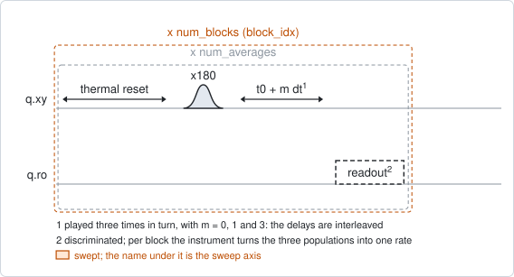
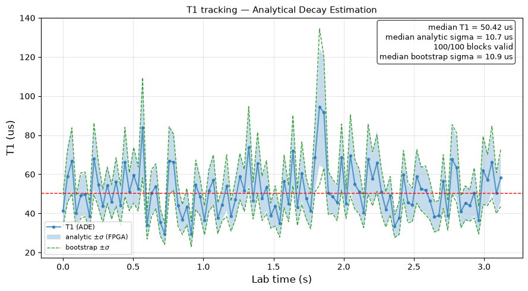

# qubit_t1_ade

## Purpose

Follows T1 in time. T1 is not a constant: it wanders over seconds and minutes,
and a full decay curve takes too long to see that. This experiment measures the
decay at only three delays, and from those three populations the instrument
computes the decay rate itself, in real time, with an error bar. Each block of
shots gives one T1 point; a run gives a trace of `num_blocks` points against
laboratory time.

The method is Analytical Decay Estimation (ADE, arXiv:2602.11912). Its three
delays are spaced so that the decay rate has a closed form, and the offset and
the contrast of the readout cancel in it, so no readout-error correction is
needed.

Nothing is written. The trace describes how stable T1 is; `qubit_relaxation`
remains the experiment that sets `t1_s`.

The rate is computed on the instrument, so the experiment needs a backend that
can do arithmetic in real time. Today only the QM driver supplies a probe.

```
scqo run qubit_t1_ade --targets q1 --set t1_guess_s=40e-6
scqo run qubit_t1_ade --targets q1 --set reset_method=active --set num_blocks=500
```

## Before running it

<!-- BEGIN generated: requires -->
GENERATED from `QubitT1Ade.requires` and its Parameters mixins - edit
the declaration, then run `python scripts/update_docs.py`.

The target is a `transmon` / `flux_transmon` / `fluxonium` carrying the operations `rx`, `readout`.

These device values must already be right:

| value | held by | used for | provided by |
|---|---|---|---|
| `drive_freq_hz` | drive channel | the x180 that prepares \|e> has to be on resonance | `qubit_ramsey`, `qubit_ramsey_flux_pulse`, `qubit_ramsey_phasor`, `qubit_spectroscopy` |
| `pi_amp` | drive channel | the x180 that prepares \|e> has to be a full pi pulse | `qubit_deterministic_benchmarking`, `qubit_pi_pulse_error`, `qubit_power_rabi` |
| `readout_freq_hz` | readout channel | the readout tone has to sit on the resonator | `readout_frequency`, `resonator_spectroscopy`, `resonator_spectroscopy_flux`, `resonator_spectroscopy_power_amp`, `resonator_spectroscopy_power_chain` |
| `readout_power_dbm` | readout channel | the readout has to be at its working power | `resonator_spectroscopy_power_amp`, `resonator_spectroscopy_power_chain` |
| `readout_rotation_rad` | readout channel | every shot is discriminated: the axis it is projected on | no shared experiment; set it by hand (`scqo set`) or by a backend's own writeback |
| `readout_threshold` | readout channel | every shot is discriminated: what splits \|0> from \|1> on that axis | no shared experiment; set it by hand (`scqo set`) or by a backend's own writeback |
| `thermalization_time_s` | drive channel | how long the thermal reset waits (a per-run thermalization_time_ns replaces it) (with the default `reset_method=thermal`) | `qubit_relaxation` |

Needed only with a non-default setting:

| setting | value | held by | used for | provided by |
|---|---|---|---|---|
| `reset_method=active` | `readout_depletion_s` | readout channel | the settle between the reset measurement and the first pulse | `resonator_spectroscopy` |

A backend may need more than this - a knob only it consumes. `scqo run qubit_t1_ade --help` lists those where that driver is installed.
<!-- END generated: requires -->

Also give the run a reasonable `t1_guess_s`: it sets the spacing of the three
delays, which should be close to T1 itself.

## Pulse sequence



One shot is: reset, `x180`, a wait, and a discriminated readout. The wait takes
three values in turn, `t0_ns`, `t0_ns + dt` and `t0_ns + 3 dt`, so the three
delays are interleaved shot by shot and all sample the same stretch of time. A
block is `num_averages` shots at each delay. At the end of a block the instrument
turns the three populations into a decay rate and its error bar, and the next
block starts.

The spacing `dt` is `dt_factor` times `t1_guess_s`. With `adaptive_dt` it is
recomputed after every block from the rate just measured, within
`min_dt_ns` and `max_dt_ns`.

## Theory

*To be written.*

## Outputs

<!-- BEGIN generated: outputs -->
GENERATED from `QubitT1Ade.writes` and `.extracts` - edit the
declaration, then run `python scripts/update_docs.py`.

Record-only: `update()` proposes nothing.

Reported in `result.fit` and never written:

| fit key | meaning |
|---|---|
| `t1_median_s` | the median T1 over the blocks that gave a valid estimate |
| `t1_sigma_median_s` | the median of the per-block error bars the instrument computed (the analytic shot-noise sigma), as a time |
| `t1_boot_sigma_median_s` | the same from the host's bootstrap over the recorded shots - the independent check |
| `n_blocks` | how many blocks were measured |
| `n_valid` | how many of them fell inside the closed form's validity range |
| `n_clipped` | how many did not: their streamed value is a floor, not an estimate |
<!-- END generated: outputs -->

The dataset holds the trace itself: the rate and its error bar per block, the
spacing used, the time of each block and every shot.

Two error bars are reported. The analytic one is computed on the instrument from
the three populations. The bootstrap one is computed afterwards from the recorded
shots (`n_bootstrap` resamples per block) and is independent of the first. They
should agree.

A block is valid when its three populations are in the range where the closed
form has a solution. For a block outside it the instrument still streams a
number, which is a floor and not an estimate; such blocks are counted in
`n_clipped` and left out of the median.

A run is `SUCCESSFUL` when at least two blocks are valid.

## Expected result



T1 against laboratory time, one point per block, with the two error bands and
the median as a dashed line. Check that:

- nearly every block is valid (the box gives the count);
- the two bands coincide;
- the scatter of the points is about as large as the bands. Scatter much larger
  than the bands is real movement of T1.

In the figure the simulated T1 is constant, so all the scatter is shot noise. The
error bar is about a fifth of T1 with the default 100 shots per delay; more shots
per block narrow it at the cost of time resolution.

## Traps

- **A spacing far from T1.** The closed form is most sensitive when `dt` is near
  T1. With `dt` much shorter, the three populations are almost equal and most
  blocks are invalid; with `dt` much longer, two of them are at the floor. Set
  `t1_guess_s` from a `qubit_relaxation` run, or use `adaptive_dt`.
- **The thermal reset sets the time resolution.** The time per block is the time
  per shot times three times `num_averages`. With a thermal reset that is many
  times T1 per shot; an active reset makes the trace much denser.
- **The median is not a calibration.** It is a summary of this trace. T1 for the
  device record comes from `qubit_relaxation`.

## References

- Related experiments: `qubit_relaxation` (the full decay, and the experiment
  that writes `t1_s`), `qubit_t1_bayesian` (the same trace by an adaptive
  method), `single_shot_readout` (the run a driver calibrates the discriminator
  from).
- Code: `scqo/experiments/qubit_t1_ade.py`, `scqat/estimators/qubit_t1_ade/`.
- Method: arXiv:2602.11912.
