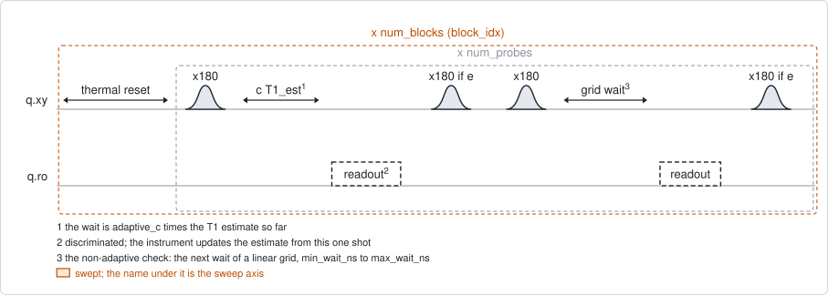
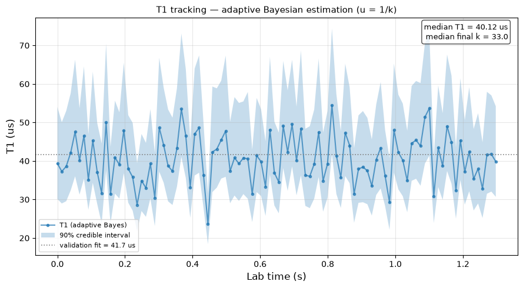

# qubit_t1_bayesian

## Purpose

Follows T1 in time, one shot at a time. The instrument keeps a probability
distribution for T1. For each shot it chooses the wait that is most informative
given what it currently believes, measures once, and updates the distribution
from that single outcome. After about a hundred shots it has a T1 estimate with
an interval around it, in milliseconds of laboratory time; that is one block.
The next block starts again from the prior, and a run gives a trace of
`num_blocks` such estimates.

The method is the adaptive Bayesian estimation of Berritta et al.
(arXiv:2506.09576). It is built to need as few shots per estimate as possible,
which makes it the one to use for fast fluctuations.

Each adaptive shot can be followed by one ordinary shot on a fixed grid of waits
(`interleaved_validation`, on by default). Together those give a plain decay
curve, measured in the same seconds, to check the adaptive result against.

Nothing is written. `qubit_relaxation` remains the experiment that sets `t1_s`.

The update is computed on the instrument after every shot, so the experiment
needs a backend that can do arithmetic in real time. Today only the QM driver
supplies a probe.

```
scqo run qubit_t1_bayesian --targets q1 --set t1_prior_s=40e-6
scqo run qubit_t1_bayesian --targets q1 --set t1_prior_s=40e-6 --set num_blocks=500 --set interleaved_validation=false
```

## Before running it

<!-- BEGIN generated: requires -->
GENERATED from `QubitT1Bayesian.requires` and its Parameters mixins - edit
the declaration, then run `python scripts/update_docs.py`.

The target is a `transmon` / `flux_transmon` / `fluxonium` carrying the operations `rx`, `readout`.

These device values must already be right:

| value | held by | used for | provided by |
|---|---|---|---|
| `drive_freq_hz` | drive channel | the x180 that prepares \|e> has to be on resonance | `qubit_ramsey`, `qubit_ramsey_flux_pulse`, `qubit_ramsey_phasor`, `qubit_spectroscopy` |
| `pi_amp` | drive channel | the x180 that prepares \|e> has to be a full pi pulse | `qubit_deterministic_benchmarking`, `qubit_pi_pulse_error`, `qubit_power_rabi` |
| `readout_freq_hz` | readout channel | the readout tone has to sit on the resonator | `readout_frequency`, `resonator_spectroscopy`, `resonator_spectroscopy_flux`, `resonator_spectroscopy_power_amp`, `resonator_spectroscopy_power_chain` |
| `readout_power_dbm` | readout channel | the readout has to be at its working power | `resonator_spectroscopy_power_amp`, `resonator_spectroscopy_power_chain` |
| `readout_rotation_rad` | readout channel | every shot is discriminated: the axis it is projected on | no shared experiment; set it by hand (`scqo set`) or by a backend's own writeback |
| `readout_threshold` | readout channel | every shot is discriminated: what splits \|0> from \|1> on that axis | no shared experiment; set it by hand (`scqo set`) or by a backend's own writeback |
| `fidelity_g` | readout channel | the update's readout-error model: 1 - fidelity_g is the chance of reading 1 after preparing 0 | `single_shot_readout` |
| `fidelity_e` | readout channel | the update's readout-error model: 1 - fidelity_e is the chance of reading 0 after preparing 1 | `single_shot_readout` |
| `thermalization_time_s` | drive channel | how long the thermal reset waits (a per-run thermalization_time_ns replaces it) (with the default `reset_method=thermal`) | `qubit_relaxation` |

Needed only with a non-default setting:

| setting | value | held by | used for | provided by |
|---|---|---|---|---|
| `t1_prior_s=None` | `t1_s` | qubit mode | the mean of the prior every block starts from; a starting value is enough (the design value will do) | `qubit_relaxation` |
| `reset_method=active` | `readout_depletion_s` | readout channel | the settle between the reset measurement and the first pulse | `resonator_spectroscopy` |

A backend may need more than this - a knob only it consumes. `scqo run qubit_t1_bayesian --help` lists those where that driver is installed.
<!-- END generated: requires -->

The two fidelities are stored by `single_shot_readout`. The update needs to know
how often the readout is wrong in each direction; a readout error that is not
accounted for reads as relaxation that did not happen.

Set the prior to a recent `qubit_relaxation` result, and widen `t1_min_s` and
`t1_max_s` to hold it: the estimate cannot leave that range.

## Pulse sequence



A block starts with one reset. Then, `num_probes` times:

- the adaptive shot: `x180`, a wait of `adaptive_c` times the current T1
  estimate, a discriminated readout, and a pi pulse that is played only if the
  qubit was read excited, which returns it to the ground state without waiting;
- the validation shot, when `interleaved_validation` is on: `x180`, the next wait
  of a linear grid from `min_wait_ns` to `max_wait_ns`, a readout, and the same
  conditional pi pulse.

Between the two the instrument updates its estimate. With
`active_reset_per_probe` a full reset is also played before each validation shot.

## Theory

*To be written.*

## Outputs

<!-- BEGIN generated: outputs -->
GENERATED from `QubitT1Bayesian.writes` and `.extracts` - edit the
declaration, then run `python scripts/update_docs.py`.

Record-only: `update()` proposes nothing.

Reported in `result.fit` and never written:

| fit key | meaning |
|---|---|
| `t1_median_s` | the median over the blocks of the final adaptive estimate |
| `k_final_median` | the median final shape of the posterior; its relative width is about 1 / sqrt(k) |
| `t1_prior_s` | the prior mean the blocks started from |
| `t1_lin_s` | T1 from the interleaved non-adaptive shots, fitted as an ordinary decay (interleaved_validation only) |
| `t1_lin_ratio` | the adaptive median over that fitted T1 (interleaved_validation only) |
| `validation_disagrees` | 1 when the two differ by more than the check allows (interleaved_validation only) |
<!-- END generated: outputs -->

The dataset holds the trace: the final estimate and the final width of the
distribution per block, every wait that was chosen and every outcome, and how the
estimate evolved within the last block.

`validation_disagrees` is 1 when the adaptive median and the fitted validation
decay differ by more than a factor of three. That is the signature of a prior far
from the truth, not of a change in the chip.

A run is `SUCCESSFUL` when at least two blocks gave a finite estimate.

## Expected result



The adaptive T1 estimate against laboratory time, one point per block, with its
credible interval as a band and the validation fit as a dotted line. Check that:

- the points scatter about the dotted line, not above or below it as a group;
- the band is about as wide as the scatter of the points. Its width is set by
  the number of shots per block;
- no point sits on `t1_min_s` or `t1_max_s`. An estimate on a rail is a clipped
  one.

In the figure the simulated T1 is constant, so the scatter is the statistical
error of one block. The run folder also holds the validation decay, the
evolution of the estimate inside a block, and the spectrum and Allan deviation of
the trace.

## Traps

- **A prior far from the truth.** Each block has only `num_probes` shots to move
  away from the prior. Starting far off, the estimate is still on its way when
  the block ends, or is pinned on a rail. `validation_disagrees` flags it; set
  `t1_prior_s` near the validation fit and run again.
- **Stale readout fidelities.** The update takes its readout-error model from
  `fidelity_g` and `fidelity_e`. If the readout has changed since they were
  measured, the estimate is biased and nothing warns of it. Run
  `single_shot_readout` first.
- **Turning the validation off.** It doubles the shots and is the only in-run
  check on the adaptive estimate. Turn it off for speed only after a run with it
  has agreed.
- **The median is not a calibration.** T1 for the device record comes from
  `qubit_relaxation`.

## References

- Related experiments: `qubit_relaxation` (the full decay, and the experiment
  that writes `t1_s`), `qubit_t1_ade` (the same trace from three fixed delays
  per block), `single_shot_readout` (stores the fidelities this needs).
- Code: `scqo/experiments/qubit_t1_bayesian.py`,
  `scqat/estimators/qubit_t1_bayesian/`.
- Method: Berritta et al., arXiv:2506.09576.
