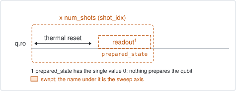
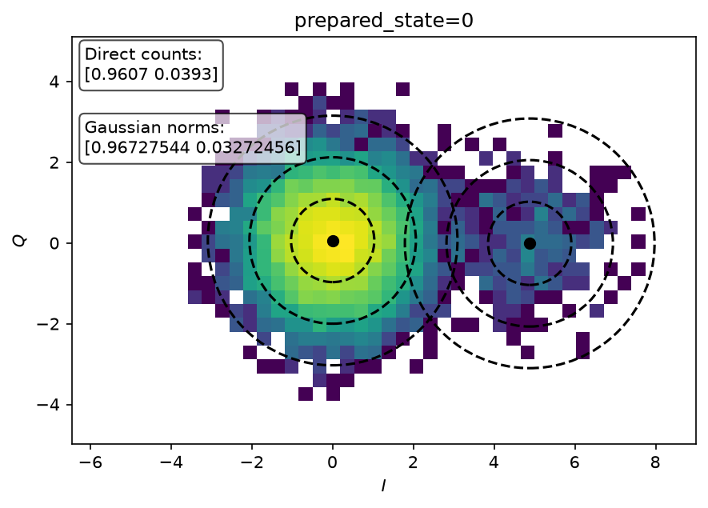

# qubit_thermal_population

## Purpose

Measures how much of the time the qubit is found excited when nothing has excited
it: the residual population of the excited state at idle. The qubit is left to
relax, read out, and every shot is recorded. Most shots fall in the cloud of the
ground state and a few per cent in the cloud of the excited state; the size of
that second cloud is the answer.

`single_shot_readout` reports the same number as a by-product, from half of its
shots. This experiment spends every shot on the ground-state preparation and
takes 10000 of them by default, because the quantity is a small part of the
sample and its error bar is counting noise.

The result is stored as `n_th`, a fact about the chip in its environment.

```
scqo run qubit_thermal_population --targets q1
scqo run qubit_thermal_population --targets q1 --set num_shots=50000
```

## Before running it

<!-- BEGIN generated: requires -->
GENERATED from `QubitThermalPopulation.requires` and its Parameters mixins - edit
the declaration, then run `python scripts/update_docs.py`.

The target is a `transmon` / `flux_transmon` / `fluxonium` carrying the operations `readout`.

These device values must already be right:

| value | held by | used for | provided by |
|---|---|---|---|
| `pos_g_i` | readout channel | the stored centre of the \|g> cloud, pinned in the fit | `single_shot_readout` |
| `pos_g_q` | readout channel | the stored centre of the \|g> cloud, pinned in the fit | `single_shot_readout` |
| `pos_e_i` | readout channel | the stored centre of the \|e> cloud: with only \|g> prepared, the data cannot place it | `single_shot_readout` |
| `pos_e_q` | readout channel | the stored centre of the \|e> cloud: with only \|g> prepared, the data cannot place it | `single_shot_readout` |
| `readout_freq_hz` | readout channel | the readout tone has to sit on the resonator | `readout_frequency`, `resonator_spectroscopy`, `resonator_spectroscopy_flux`, `resonator_spectroscopy_power_amp`, `resonator_spectroscopy_power_chain` |
| `readout_power_dbm` | readout channel | the readout has to be at its working power | `resonator_spectroscopy_power_amp`, `resonator_spectroscopy_power_chain` |
| `thermalization_time_s` | drive channel | how long the thermal reset waits (a per-run thermalization_time_ns replaces it) (with the default `reset_method=thermal`) | `qubit_relaxation` |

A backend may need more than this - a knob only it consumes. `scqo run qubit_thermal_population --help` lists those where that driver is installed.
<!-- END generated: requires -->

The four centres are stored by `single_shot_readout`. With only one state
prepared, the data cannot say where the excited-state cloud is, so the run
refuses to start without them rather than guess a second centre.

They describe the readout as it was when they were measured. After the readout
frequency, power or duration has changed, run `single_shot_readout` again first.

## Pulse sequence



Wait, then read out; repeated `num_shots` times. No drive pulse is played at any
point.

The wait is the thermal reset, and it is the only reset allowed: an active reset
would push the qubit into its ground state, which removes the population being
measured. `reset_method=active` is refused. To wait longer than the stored
thermalization time, pass `thermalization_time_ns`.

The dataset keeps a `prepared_state` axis with the single value 0, so that it has
the same shape as a `single_shot_readout` dataset.

## Theory

*To be written.*

## Outputs

<!-- BEGIN generated: outputs -->
GENERATED from `QubitThermalPopulation.writes` and `.extracts` - edit the
declaration, then run `python scripts/update_docs.py`.

Proposed by `update()`; each stays pending until it is accepted:

| field | held by | role | unit | meaning |
|---|---|---|---|---|
| `n_th` | transmon / flux_transmon / fluxonium / cavity / resonator mode | fact | - | Thermal excited-state population at idle (0..1). |

Reported in `result.fit` and never written:

| fit key | meaning |
|---|---|
| `pop_e_prep_g` | the FITTED share of the \|e> cloud - the population with the readout overlap removed; proposed as n_th |
| `assign_e_prep_g` | the COUNTED share of shots nearer the \|e> centre - the population plus the readout's overlap error |
| `blob_std` | the fitted width of the clouds, in the units of the stored centres |
| `outlier_probability` | the share of shots far from both clouds |
<!-- END generated: outputs -->

The two population readings are not one quantity measured twice.

- `assign_e_prep_g` counts the shots that lie nearer the excited-state centre.
  The two clouds overlap, so some ground-state shots are counted too: it is the
  population plus the readout's assignment error, and it reads high.
- `pop_e_prep_g` is the weight of the excited-state cloud in a fit of two
  Gaussians at the stored centres. The overlap is part of the model, so it is the
  population alone. This is the value written to `n_th`.

Their difference is roughly the assignment error of the readout.

The centres are pinned in the fit; the width of the clouds is fitted from this
run's own shots.

A run is `SUCCESSFUL` when the fitted population is a number between 0 and 0.5.

## Expected result



A histogram of the shots in the I/Q plane. The two dots are the stored centres
and the dashed circles are one, two and three widths around each. The box gives
the counted shares and the fitted weights of the two clouds. Check that:

- the large cloud is centred on the ground-state dot. A cloud that sits off its
  dot means the stored centres are stale;
- there is a visible second group of shots around the other dot;
- the fitted weight of the second cloud is below the counted share, as it should
  be when the clouds overlap.

## Traps

- **Stale centres.** The fit does not move the centres. If the readout has
  drifted since `single_shot_readout`, the clouds are fitted in the wrong place
  and the weight is wrong, with no error raised.
- **This is not only temperature.** Whatever leaves the qubit excited at the
  start of a shot is counted, and a wait too short for the previous shot to
  relax is the first suspect. Lengthen the wait and check that the number stops
  falling.
- **Too few shots.** A population of 2 % in 1000 shots is 20 shots. Keep the
  default or raise it.

## References

- Related experiments: `single_shot_readout` (stores the centres this needs, and
  gives the same number with fewer shots), `qubit_relaxation` (sets the wait).
- Code: `scqo/experiments/qubit_thermal_population.py`,
  `scqat/estimators/state_discrimination/`.
