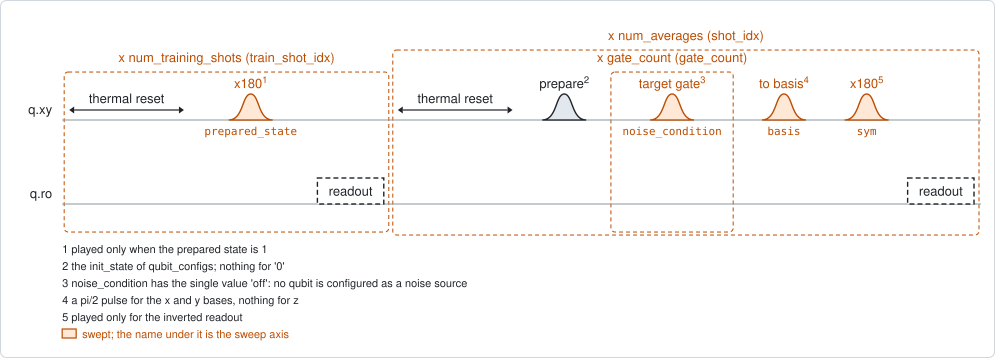
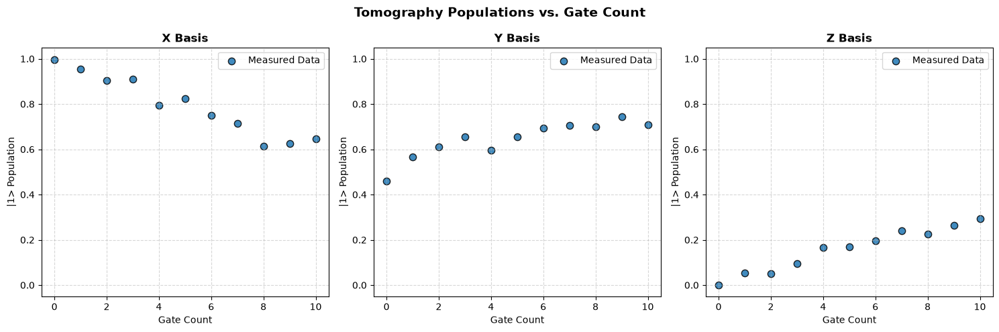

# qubit_tomography

## Purpose

Follows the state of a qubit while a gate is applied to it again and again. The
qubit is prepared in a chosen state, the target gate is played a number of times,
and the state is then measured along x, along y and along z. Doing that for each
gate count gives the path of the state vector, gate by gate: how far each gate
turns it, about which axis, and how fast it shrinks.

Each qubit has its own entry in `qubit_configs`: the state it starts in, the gate
that is repeated, an amplitude factor for that gate and a detuning of the drive
during it. A qubit with no entry starts in its ground state and repeats the pi
pulse.

It can also measure what one qubit's drive does to another. A qubit marked
`noise_mode` is a spectator: it plays its gates and is not measured. With
`interleave_noise` every point is taken twice, with the spectator's gates on and
with them replaced by an idle of the same length, alternating shot by shot. Slow
drift is then common to both, and the difference between the two is the effect
of the spectator's drive alone.

It writes nothing.

```
scqo run qubit_tomography --targets q1
scqo run qubit_tomography --targets q1 --set 'qubit_configs={"q1": {"init_state": "+", "target_gate": "X90"}}' --set gate_counts=0:20:2
scqo run qubit_tomography --targets q1 q2 --set 'qubit_configs={"q1": {"target_gate": "I"}, "q2": {"target_gate": "X", "noise_mode": true}}'
```

## Before running it

<!-- BEGIN generated: requires -->
GENERATED from `QubitTomography.requires` and its Parameters mixins - edit
the declaration, then run `python scripts/update_docs.py`.

The target is a `transmon` / `flux_transmon` / `fluxonium` carrying the operations `rx`, `readout`.

These device values must already be right:

| value | held by | used for | provided by |
|---|---|---|---|
| `drive_freq_hz` | drive channel | the x180 that prepares \|e> has to be on resonance | `qubit_ramsey`, `qubit_ramsey_flux_pulse`, `qubit_ramsey_phasor`, `qubit_spectroscopy` |
| `pi_amp` | drive channel | the x180 that prepares \|e> has to be a full pi pulse | `qubit_deterministic_benchmarking`, `qubit_pi_pulse_error`, `qubit_power_rabi` |
| `readout_freq_hz` | readout channel | the readout tone has to sit on the resonator | `readout_frequency`, `resonator_spectroscopy`, `resonator_spectroscopy_flux`, `resonator_spectroscopy_power_amp`, `resonator_spectroscopy_power_chain` |
| `readout_power_dbm` | readout channel | the readout has to be at its working power | `resonator_spectroscopy_power_amp`, `resonator_spectroscopy_power_chain` |
| `thermalization_time_s` | drive channel | how long the thermal reset waits (a per-run thermalization_time_ns replaces it) (with the default `reset_method=thermal`) | `qubit_relaxation` |

Needed only with a non-default setting:

| setting | value | held by | used for | provided by |
|---|---|---|---|---|
| `reset_method=active` | `readout_rotation_rad` | readout channel | the reset measurement is discriminated on the rotated axis | no shared experiment; set it by hand (`scqo set`) or by a backend's own writeback |
| `reset_method=active` | `readout_threshold` | readout channel | decides whether the reset plays its pi pulse | no shared experiment; set it by hand (`scqo set`) or by a backend's own writeback |
| `reset_method=active` | `readout_depletion_s` | readout channel | the settle between the reset measurement and the first pulse | `resonator_spectroscopy` |

A backend may need more than this - a knob only it consumes. `scqo run qubit_tomography --help` lists those where that driver is installed.
<!-- END generated: requires -->

The pi/2 pulses that prepare a state and rotate the measurement basis have to be
calibrated too. Which stored value holds their amplitude depends on the backend,
so it is listed with the backend's own requirements.

## Pulse sequence



The run has two parts.

**Training shots.** The qubit is prepared in its ground state and, by an `x180`,
in its excited state, and read out; every shot is kept. These
`num_training_shots` shots per state are what the classifier of this run is
trained on, so the run does not depend on a stored discriminator.

**Tomography shots.** For each shot: the reset, the pulse that prepares
`init_state`, the target gate `gate_count` times, a rotation into the measurement
basis, and the readout. The basis rotation is a pi/2 pulse for x and for y and
nothing for z. With `symmetrized_readout` every point is also measured with an
extra `x180` just before the readout, and the two results are combined so that a
readout that favours one state cancels to first order.

A spectator in `noise_mode` plays its own gate alongside the target gate, on its
own drive line, and takes no part in the preparation, the basis rotation or the
readout.

## Theory

*To be written.*

## Outputs

<!-- BEGIN generated: outputs -->
GENERATED from `QubitTomography.writes` and `.extracts` - edit the
declaration, then run `python scripts/update_docs.py`.

Record-only: `update()` proposes nothing.

Reported in `result.fit` and never written:

| fit key | meaning |
|---|---|
| `centers` | the centres of the \|0> and \|1> clouds found in the training shots |
| `readout_fidelity` | how well the classifier trained on those shots tells the two prepared states apart |
| `confusion_matrix` | its confusion matrix: row = prepared state, column = assigned state |
| `gate_counts` | the gate counts that were swept: the x axis of every list below |
| `population_x` | the \|1> population measured in the x basis at each gate count (noise ON when a noise source is interleaved) |
| `population_y` | the same in the y basis |
| `population_z` | the same in the z basis |
| `baseline_population_x` | the x-basis population with the noise source OFF (equal to population_x without one) |
| `baseline_population_y` | the same in the y basis |
| `baseline_population_z` | the same in the z basis |
| `delta_population_x` | noise ON minus noise OFF, x basis |
| `delta_population_y` | noise ON minus noise OFF, y basis |
| `delta_population_z` | noise ON minus noise OFF, z basis |
| `differential_drift` | the distance the Bloch vector moved between noise OFF and ON at each gate count |
| `interleaved_noise` | whether the run interleaved the two noise conditions |
| `success` | whether the classifier's fidelity is above one half |
<!-- END generated: outputs -->

Each shot is assigned to a state by the classifier trained on this run's
training shots, and the population in a basis is the share of shots assigned to
the excited state. With the symmetrized readout it is the average of the direct
result and one minus the inverted one.

Without a noise source the `baseline_` lists equal the plain ones and the
`delta_` lists are zero.

A run is `SUCCESSFUL` when the classifier separates the two training states with
a fidelity above one half. That is a statement about the readout, not about the
trajectory.

## Expected result



The excited-state population in the three bases against the gate count. Check
that:

- at gate count 0 the three values are those of the prepared state;
- the points move smoothly with the gate count, without jumps between
  neighbours.

The simulated data are schematic: a slow rotation with a decay, the same for
every configuration. They show the layout of the result, not the trajectory of
the gate that was asked for; the x-basis value starting at 1 is not what a
ground state gives. The run folder also holds the same data on the Bloch sphere
and the length of the state vector against the gate count.

## Traps

- **The cost multiplies.** Shots are taken for every combination of basis,
  readout symmetry, gate count and noise condition. The defaults are 3 by 2 by
  11, and twice that with an interleaved noise source, each `num_averages` times.
- **A spectator without interleaving.** With a `noise_mode` qubit and
  `interleave_noise=false` there is one condition, the spectator's gates are
  always played, and the data are labelled `off` all the same.
- **A failed classifier.** If the two training clouds overlap, every population
  is wrong, and only the outcome says so. Check `readout_fidelity` first.
- **The record of a spectator is empty.** A `noise_mode` qubit has to be among
  the targets, but it is not measured and has no fit of its own.

## References

- Related experiments: `single_shot_readout` (the readout this depends on),
  `qubit_deterministic_benchmarking` (the rotation error of one gate, from one
  basis), `qubit_sqrb` (the average gate error).
- Code: `scqo/experiments/qubit_tomography.py`,
  `scqat/estimators/qubit_tomography/`.
