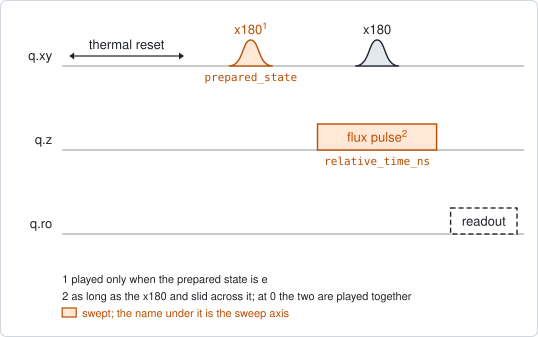
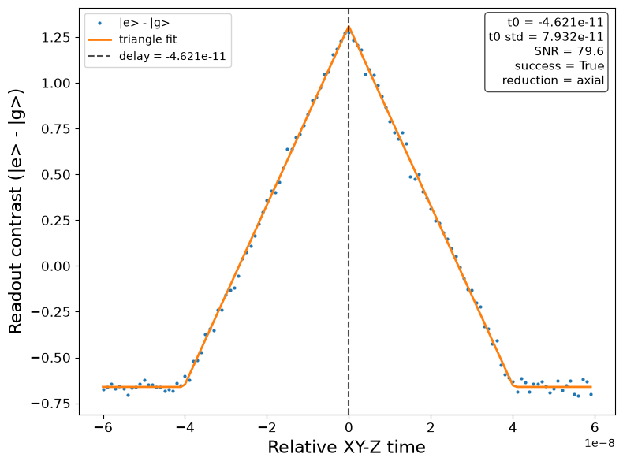

# qubit_xyz_delay

## Purpose

Measures how far apart in time a flux pulse and a drive pulse arrive at the
qubit when they are programmed for the same moment, and proposes the delay of
the flux line that makes them arrive together.

The two lines run through different electronics and cables, so their delays
differ. Every experiment that plays a flux pulse next to a drive pulse assumes
the difference has been removed.

The method uses the fact that a detuned qubit does not respond to its drive. An
`x180` and a flux pulse of the same length are played at a swept relative shift.
While the two overlap, the flux pulse moves the qubit away from the drive
frequency and the `x180` does not flip it. The more they overlap, the less the
qubit is flipped, so the readout against the shift is a triangle: the overlap of
two equal rectangles. Its peak is where the two pulses coincide at the qubit.

Each shift is measured for two prepared states, |g> and |e>. The fit is made on
the difference between the two, which keeps only the part of the signal that
depends on the shift.

```
scqo run qubit_xyz_delay --targets q1
scqo run qubit_xyz_delay --targets q1 --set half_scan_ns=100 --set z_pulse_amp_v=0.2
```

## Before running it

<!-- BEGIN generated: requires -->
GENERATED from `QubitXyzDelay.requires` and its Parameters mixins - edit
the declaration, then run `python scripts/update_docs.py`.

The target is a `transmon` / `flux_transmon` / `fluxonium` carrying the operations `rx`, `readout`, `flux_bias`.

These device values must already be right:

| value | held by | used for | provided by |
|---|---|---|---|
| `drive_freq_hz` | drive channel | the x180 has to be on resonance at the idle flux, so that only the flux pulse can make it miss | `qubit_ramsey`, `qubit_ramsey_flux_pulse`, `qubit_ramsey_phasor`, `qubit_spectroscopy` |
| `pi_amp` | drive channel | the x180 has to be a full pi pulse: it prepares \|e>, and its failure under the flux pulse is the signal | `qubit_deterministic_benchmarking`, `qubit_pi_pulse_error`, `qubit_power_rabi` |
| `pi_duration_s` | drive channel | the flux pulse is made as long as the x180, and this length is the half-width of the fitted triangle | no shared experiment; set it by hand (`scqo set`) or by a backend's own writeback |
| `idle_flux` | flux line | the flux pulse rides on this standing bias, where the x180 and the readout were calibrated | `pair_zz_coupler`, `qubit_ramsey_flux_pulse`, `qubit_spectroscopy_flux_pulse`, `resonator_spectroscopy_flux` |
| `flux_delay_s` | flux line | the fitted shift is added to the delay the line already has; a starting value is enough (the design value will do) | `qubit_xyz_delay` |
| `readout_freq_hz` | readout channel | the readout tone has to sit on the resonator | `readout_frequency`, `resonator_spectroscopy`, `resonator_spectroscopy_flux`, `resonator_spectroscopy_power_amp`, `resonator_spectroscopy_power_chain` |
| `readout_power_dbm` | readout channel | the readout has to be at its working power | `resonator_spectroscopy_power_amp`, `resonator_spectroscopy_power_chain` |
| `thermalization_time_s` | drive channel | how long the thermal reset waits (a per-run thermalization_time_ns replaces it) (with the default `reset_method=thermal`) | `qubit_relaxation` |

Needed only with a non-default setting:

| setting | value | held by | used for | provided by |
|---|---|---|---|---|
| `use_state_discrimination=true` | `readout_rotation_rad` | readout channel | the axis each shot is projected on before thresholding | no shared experiment; set it by hand (`scqo set`) or by a backend's own writeback |
| `use_state_discrimination=true` | `readout_threshold` | readout channel | splits \|0> from \|1> on that axis | no shared experiment; set it by hand (`scqo set`) or by a backend's own writeback |
| `reset_method=active` | `readout_rotation_rad` | readout channel | the reset measurement is discriminated on the rotated axis | no shared experiment; set it by hand (`scqo set`) or by a backend's own writeback |
| `reset_method=active` | `readout_threshold` | readout channel | decides whether the reset plays its pi pulse | no shared experiment; set it by hand (`scqo set`) or by a backend's own writeback |
| `reset_method=active` | `readout_depletion_s` | readout channel | the settle between the reset measurement and the first pulse | `resonator_spectroscopy` |

A backend may need more than this - a knob only it consumes. `scqo run qubit_xyz_delay --help` lists those where that driver is installed.
<!-- END generated: requires -->

`flux_delay_s` needs a value only because the result is added to it. For a line
that has never been aligned, 0 is the right start.

## Pulse sequence



After the reset the state is prepared: an `x180` for |e>, nothing for |g>. Then
the second `x180` and the flux pulse are played at the swept shift, and the
qubit is read out.

The flux pulse is as long as the `x180`. Its amplitude is `z_pulse_amp_v`, on
top of the idle flux. The shift runs from -`half_scan_ns` to `half_scan_ns` - 1
in steps of 1 ns. At 0 the two pulses are programmed for the same moment; at a
positive shift the flux pulse is played later.

The prepared state is the outer loop and the shift the inner one.

## Theory

*To be written.*

## Outputs

<!-- BEGIN generated: outputs -->
GENERATED from `QubitXyzDelay.writes` and `.extracts` - edit the
declaration, then run `python scripts/update_docs.py`.

Proposed by `update()`; each stays pending until it is accepted:

| field | held by | role | unit | meaning |
|---|---|---|---|---|
| `flux_delay_s` | flux line | knob | s | Output-path delay of this flux line relative to its target's drive line, calibrated by qubit_xyz_delay so a Z pulse and the XY drive it accompanies arrive together. The vendor realization may be PORT-level (shared by everything on that DAC output); a driver with no line-delay knob declares it Unrealized. |

Reported in `result.fit` and never written:

| fit key | meaning |
|---|---|
| `delay_shift_s` | the fitted position of the peak: how much later the flux pulse has to be played for the two pulses to coincide |
| `delay_std_s` | the fit's standard error on that position |
| `snr` | the height of the triangle over the scatter of the points far from it |
| `old_flux_delay_s` | the delay the line had during the run; the proposed value is this plus the shift |
<!-- END generated: outputs -->

The proposed `flux_delay_s` is absolute: the delay the line had during the run
plus the fitted shift. A positive shift means the flux pulse had to be played
later to meet the `x180`, so the line gets more delay. After the value is
accepted, a second run should find the peak at 0.

A run is `SUCCESSFUL` when all of these hold:

- the triangle fit converged with a positive height;
- the peak is at least one `x180` length away from both ends of the scan;
- the uncertainty of the peak position is below one eighth of the `x180` length;
- `snr` is above 3.

On a failed run `delay_shift_s` is only the position of the highest point, and
nothing is proposed.

## Expected result



The difference between the two prepared states against the shift. The points are
the data, the line is the fitted triangle and the dashed line its peak. The
horizontal axis is in seconds. Check that:

- there is one clear triangle, and its base is two `x180` lengths wide (here
  from -40 ns to 40 ns);
- both sides of it end in a flat floor inside the scan;
- the uncertainty in the box (`t0 std`) is a fraction of a nanosecond.

The simulated data are schematic. They show the shape to look for; they are not
a model of the two pulses. In the figure the peak is at 0 because the simulated
device starts with no delay.

## Traps

- **A scan too short for the pulse.** The fit is accepted only when the peak is
  one `x180` length away from both ends. With the default `half_scan_ns` of 60
  and a 40 ns `x180`, that allows a misalignment of 20 ns either way. A longer
  pulse, or a larger misalignment, needs a wider scan.
- **A flux pulse that barely moves the qubit.** The `x180` fails only if the
  flux pulse detunes the qubit by more than the bandwidth of the `x180`. Near
  the top of its arch the qubit moves little for a small pulse, and the triangle
  is then low. Raise `z_pulse_amp_v`.
- **The flux line is not alone.** The proposed value aligns this flux line with
  this qubit's drive line. Other lines that are played together with it, such as
  a coupler's flux line during a swap, are not moved. A large shift accepted on
  one line alone misaligns it from those.
- **A shift on the drive side looks the same.** The experiment measures a
  difference. If the delay of the drive line changed, every flux line that works
  with it is off by the same amount, and each reports it as its own shift
  (`BACKLOG.md` I31). Decide which side to correct before accepting.
- **The delay may belong to an output, not to a line.** A backend may realize
  `flux_delay_s` as the delay of the physical output the line is wired to.
  Everything played on that output then moves with it.
- **The offline simulation does not converge.** On the simulated backend the
  peak is drawn at the delay the line already has, so an accepted run doubles a
  non-zero delay instead of cancelling it (`BACKLOG.md` I39). It affects the
  practice mode only.

## References

- Related experiments: `qubit_power_rabi` (the `x180` this experiment relies
  on), `qubit_ramsey_cryoscope` and `qubit_spectroscopy_cryoscope` (the shape of
  the flux pulse, once its timing is right).
- Code: `scqo/experiments/qubit_xyz_delay.py`, `scqat/estimators/xyz_delay/`,
  `scqat/tools/fit_triangle.py`.
