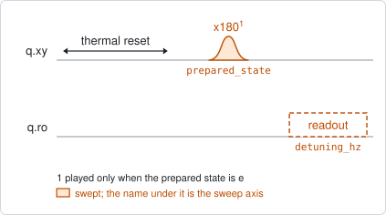
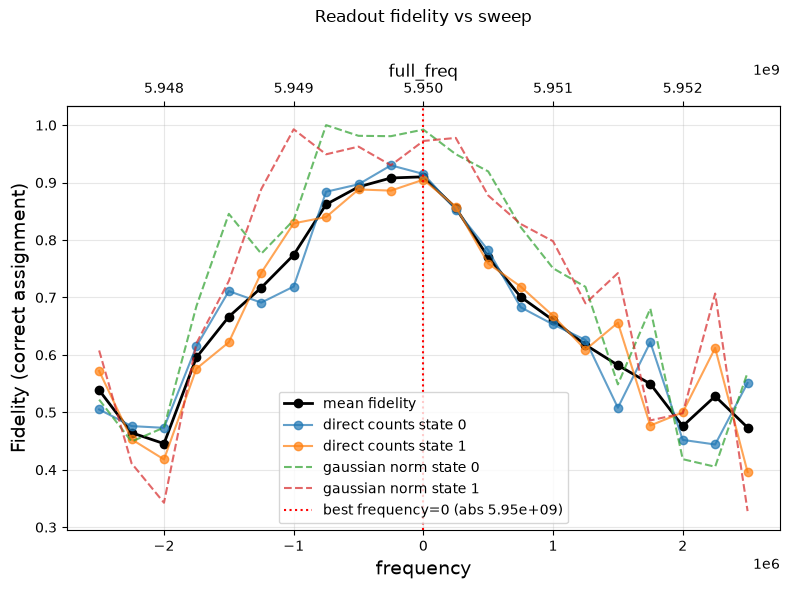

# readout_frequency

## Purpose

Chooses the readout frequency that tells the two qubit states apart best. The
resonator dip found by `resonator_spectroscopy` is where the resonator is with
the qubit in its ground state; the best frequency for reading the state lies
between the dips of the two states, and this experiment finds it by trying each
frequency with the qubit prepared in both.

It has two modes. `readout_mode=shot` keeps every shot and maximizes the
single-shot fidelity. `readout_mode=average` takes one averaged point per state
and maximizes the distance between them instead; it is faster and peaks at the
same frequency.

```
scqo run readout_frequency --targets q1
scqo run readout_frequency --targets q1 --set readout_mode=average
```

## Before running it

<!-- BEGIN generated: requires -->
GENERATED from `ReadoutFrequency.requires` and its Parameters mixins - edit
the declaration, then run `python scripts/update_docs.py`.

The target is a `transmon` / `flux_transmon` / `fluxonium` carrying the operations `readout`.

These device values must already be right:

| value | held by | used for | provided by |
|---|---|---|---|
| `readout_freq_hz` | readout channel | the swept window is centred on it, so it must already be on the dip | `readout_frequency`, `resonator_spectroscopy`, `resonator_spectroscopy_flux`, `resonator_spectroscopy_power_amp`, `resonator_spectroscopy_power_chain` |
| `readout_power_dbm` | readout channel | the best frequency is found for the power in use | `resonator_spectroscopy_power_amp`, `resonator_spectroscopy_power_chain` |
| `drive_freq_hz` | drive channel | the x180 that prepares \|e> has to be on resonance | `qubit_ramsey`, `qubit_ramsey_flux_pulse`, `qubit_ramsey_phasor`, `qubit_spectroscopy` |
| `pi_amp` | drive channel | the x180 that prepares \|e> has to be a full pi pulse | `qubit_deterministic_benchmarking`, `qubit_pi_pulse_error`, `qubit_power_rabi` |
| `thermalization_time_s` | drive channel | how long the thermal reset waits (a per-run thermalization_time_ns replaces it) (with the default `reset_method=thermal`) | `qubit_relaxation` |

Needed only with a non-default setting:

| setting | value | held by | used for | provided by |
|---|---|---|---|---|
| `reset_method=active` | `readout_rotation_rad` | readout channel | the reset measurement is discriminated on the rotated axis | no shared experiment; set it by hand (`scqo set`) or by a backend's own writeback |
| `reset_method=active` | `readout_threshold` | readout channel | decides whether the reset plays its pi pulse | no shared experiment; set it by hand (`scqo set`) or by a backend's own writeback |
| `reset_method=active` | `readout_depletion_s` | readout channel | the settle between the reset measurement and the first pulse | `resonator_spectroscopy` |

A backend may need more than this - a knob only it consumes. `scqo run readout_frequency --help` lists those where that driver is installed.
<!-- END generated: requires -->

## Pulse sequence



For every readout detuning the qubit is measured twice: once after the reset
alone, and once after an `x180` that prepares the excited state. The readout
pulse is played at the current readout frequency plus the detuning.

## Theory

*To be written.*

## Outputs

<!-- BEGIN generated: outputs -->
GENERATED from `ReadoutFrequency.writes` and `.extracts` - edit the
declaration, then run `python scripts/update_docs.py`.

Proposed by `update()`; each stays pending until it is accepted:

| field | held by | role | unit | meaning |
|---|---|---|---|---|
| `readout_freq_hz` | readout channel | knob | Hz | Readout tone / demodulation frequency (operating CHOICE; the fact is the resonator's f_dress0_hz — the dip with the qubit in \|0>, where the tone is parked). |
| `f_dress0_hz` | resonator mode | fact | Hz | Dressed resonator frequency with the qubit in \|0> — the spectroscopy dip at the idle point (flux + qubit state). This is what the readout tone is parked on, so readout_freq_hz seeds from it. |
| `f_dress1_hz` | resonator mode | fact | Hz | Dressed resonator frequency with the qubit in \|1>. No writer yet — a prepared-state readout-frequency sweep measures it; with f_dress0_hz it gives chi. |
| `chi_hz` | resonator mode | fact | Hz | Dispersive shift per excitation; chi = (f_dress0_hz - f_dress1_hz) / 2. |

Reported in `result.fit` and never written:

| fit key | meaning |
|---|---|
| `frequency_shift_hz` | the proposed readout frequency minus the one the run started from |
| `best_fidelity` | the single-shot fidelity at the chosen frequency (NaN in average mode) |
| `best_separation` | the distance between the two state blobs at the chosen frequency |
| `old_readout_freq_hz` | the readout frequency the run started from |
<!-- END generated: outputs -->

`f_dress0_hz`, `f_dress1_hz` and `chi_hz` are proposed only with
`dip_fit_method` set to `lorentzian` or `circle`, which fits the resonator dip
for each prepared state. With the default `none` only the readout frequency is
proposed.

`best_fidelity` is a number only in shot mode. In average mode there are no
shots to assign and it is NaN; the choice is made on `best_separation`.

## Expected result



The readout fidelity against the readout detuning. The black line is the mean
of the two states, the solid coloured lines are the counted fidelity of each
state, the dashed ones the fidelity from the fitted clouds, and the dotted
vertical line the chosen frequency. Check that:

- the curve has one clear maximum inside the window, with lower fidelity on both
  sides. A maximum at the edge means the best frequency is outside the window;
- the chosen frequency sits on that maximum;
- the maximum is broad compared with the frequency step. A maximum one point
  wide is noise: raise `num_shots`.

## Traps

- **The excited state is not prepared.** The experiment compares the two states,
  so a drive that is off resonance or a pi pulse of the wrong amplitude makes the
  two look alike and flattens the curve. Calibrate the drive first.
- **Reading the fidelity in average mode.** There is none. Average mode orders
  the frequencies correctly but says nothing about how good the readout is; run
  `single_shot_readout` at the chosen frequency for that.
- **A window that is too wide.** The default is 2.5 MHz on either side, in 21
  points. Far from the resonator both states read the same and those points only
  cost time.

## References

- Related experiments: `resonator_spectroscopy` (finds the dip this one starts
  from), `readout_power` (the same optimization over amplitude),
  `single_shot_readout` (measures the fidelity at the chosen point and calibrates
  the discriminator).
- Code: `scqo/experiments/readout_frequency.py`,
  `scqat/estimators/readout_fidelity/`.
