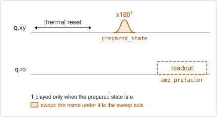
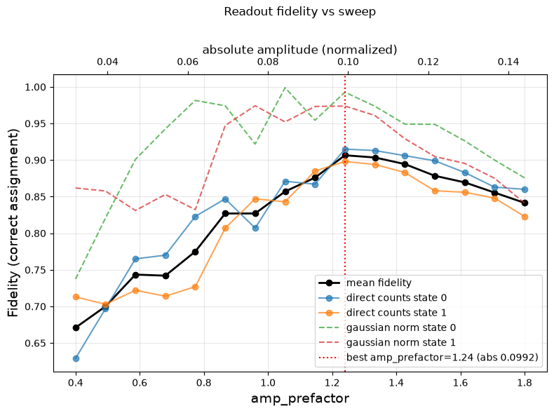

# readout_power

## Purpose

Chooses the readout amplitude that tells the two qubit states apart best. A
stronger readout separates the states further, until it starts to disturb the
qubit during the measurement; the best amplitude is the one just before that.
This experiment finds it by trying each amplitude with the qubit prepared in
both states.

The sweep is a factor of the amplitude already stored, so one window serves every
target of a multiplexed run.

It has two modes. `readout_mode=shot` keeps every shot and maximizes the
single-shot fidelity. `readout_mode=average` takes one averaged point per state
and maximizes the distance between them, which is faster but cannot see the
transitions the readout itself causes: it keeps rewarding more power.

```
scqo run readout_power --targets q1
scqo run readout_power --targets q1 --set end_amp_factor=1.4
```

## Before running it

<!-- BEGIN generated: requires -->
GENERATED from `ReadoutPower.requires` and its Parameters mixins - edit
the declaration, then run `python scripts/update_docs.py`.

The target is a `transmon` / `flux_transmon` / `fluxonium` carrying the operations `readout`.

These device values must already be right:

| value | held by | used for | provided by |
|---|---|---|---|
| `readout_freq_hz` | readout channel | the tone has to sit on the dip while its amplitude is swept | `readout_frequency`, `resonator_spectroscopy`, `resonator_spectroscopy_flux`, `resonator_spectroscopy_power_amp`, `resonator_spectroscopy_power_chain` |
| `readout_amp` | readout channel | the sweep is a factor of this stored amplitude | `readout_power` |
| `drive_freq_hz` | drive channel | the x180 that prepares \|e> has to be on resonance | `qubit_ramsey`, `qubit_ramsey_flux_pulse`, `qubit_ramsey_phasor`, `qubit_spectroscopy` |
| `pi_amp` | drive channel | the x180 that prepares \|e> has to be a full pi pulse | `qubit_deterministic_benchmarking`, `qubit_pi_pulse_error`, `qubit_power_rabi` |
| `thermalization_time_s` | drive channel | how long the thermal reset waits (a per-run thermalization_time_ns replaces it) (with the default `reset_method=thermal`) | `qubit_relaxation` |

Needed only with a non-default setting:

| setting | value | held by | used for | provided by |
|---|---|---|---|---|
| `reset_method=active` | `readout_rotation_rad` | readout channel | the reset measurement is discriminated on the rotated axis | no shared experiment; set it by hand (`scqo set`) or by a backend's own writeback |
| `reset_method=active` | `readout_threshold` | readout channel | decides whether the reset plays its pi pulse | no shared experiment; set it by hand (`scqo set`) or by a backend's own writeback |
| `reset_method=active` | `readout_depletion_s` | readout channel | the settle between the reset measurement and the first pulse | `resonator_spectroscopy` |

A backend may need more than this - a knob only it consumes. `scqo run readout_power --help` lists those where that driver is installed.
<!-- END generated: requires -->

## Pulse sequence



For every amplitude factor the qubit is measured twice: once after the reset
alone, and once after an `x180` that prepares the excited state. The readout
pulse is played at the stored amplitude times the factor.

## Theory

*To be written.*

## Outputs

<!-- BEGIN generated: outputs -->
GENERATED from `ReadoutPower.writes` and `.extracts` - edit the
declaration, then run `python scripts/update_docs.py`.

Proposed by `update()`; each stays pending until it is accepted:

| field | held by | role | unit | meaning |
|---|---|---|---|---|
| `readout_amp` | readout channel | knob | - | Readout pulse amplitude (zero for emission-collection readout). |

Reported in `result.fit` and never written:

| fit key | meaning |
|---|---|
| `opt_amp_prefactor` | the chosen factor of the stored amplitude |
| `best_fidelity` | the single-shot fidelity at the chosen amplitude (NaN in average mode) |
| `best_separation` | the distance between the two state blobs at the chosen amplitude |
| `old_readout_amp` | the readout amplitude the run started from |
<!-- END generated: outputs -->

`best_fidelity` is a number only in shot mode. In average mode there are no
shots to assign and it is NaN; the choice is made on `best_separation`.

## Expected result



The readout fidelity against the amplitude factor, with the absolute amplitude
that was played on the upper axis. The black line is the mean of the two states,
the solid coloured lines are the counted fidelity of each state, the dashed ones
the fidelity from the fitted clouds, and the dotted vertical line the chosen
factor. Check that:

- the fidelity rises with amplitude and then levels off or falls;
- the chosen factor is at the maximum, not at the top edge of the window. A
  fidelity still rising at the last point means the window ends too early.

## Traps

- **Using average mode to set the amplitude.** The separation keeps growing with
  power after the fidelity has started to fall, so average mode proposes too
  strong a readout. Use shot mode for the final value.
- **A factor that asks for more than full scale.** The window is bounded by the
  instrument: the factor times the stored amplitude has to stay within its range,
  and a driver refuses a window that does not. Lower `end_amp_factor`, or raise
  the readout power through the output chain (`readout_power_dbm`) first.
- **The frequency moves with the amplitude.** The best frequency was found at the
  old amplitude. After accepting a large change, run `readout_frequency` again.

## References

- Related experiments: `readout_frequency` (the same optimization over
  frequency), `single_shot_readout` (measures the fidelity at the chosen point
  and calibrates the discriminator), `resonator_spectroscopy_power_amp` (sets the
  absolute power the amplitude is a fraction of).
- Code: `scqo/experiments/readout_power.py`,
  `scqat/estimators/readout_fidelity/`.
