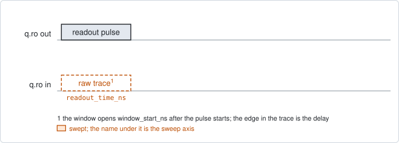
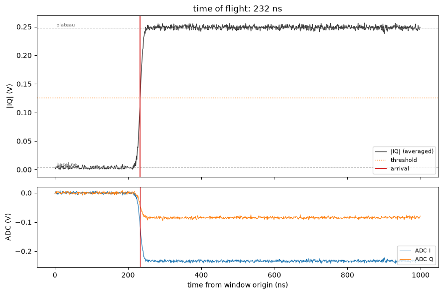

# readout_time_of_flight

## Purpose

Measures the readout round-trip delay: the time between emitting a readout pulse
and seeing it arrive at the digitizer. That delay decides where the integration
window sits. A wrong one costs readout fidelity without any error, because a
misplaced window still returns a well-formed number.

Run it after any re-cabling, fridge cycle or instrument swap.

The delay is stored in a field that only the vendor configuration has, under a
different name on each backend. So this experiment proposes nothing: it reports
the value and prints the field to write it into.

```
scqo run readout_time_of_flight --targets q1
```

## Before running it

<!-- BEGIN generated: requires -->
GENERATED from `ReadoutTimeOfFlight.requires` and its Parameters mixins - edit
the declaration, then run `python scripts/update_docs.py`.

The target is a `transmon` / `flux_transmon` / `fluxonium` carrying the operations `readout`.

These device values must already be right:

| value | held by | used for | provided by |
|---|---|---|---|
| `readout_amp` | readout channel | the pulse whose arrival is timed is played at this amplitude, scaled by readout_amp_factor; a starting value is enough (the design value will do) | `readout_power` |

A backend may need more than this - a knob only it consumes. `scqo run readout_time_of_flight --help` lists those where that driver is installed.
<!-- END generated: requires -->

## Pulse sequence



One readout pulse is played and the digitizer records the raw trace, averaged
over the shots. The acquisition window opens `window_start_ns` after the pulse
starts, and the default 0 means as early as the instrument allows, rather than
at the delay currently configured. So the trace begins before the pulse arrives
and the rising edge is inside it.

The swept axis is the time inside that trace, not a parameter that is stepped.

## Theory

*To be written.*

## Outputs

<!-- BEGIN generated: outputs -->
GENERATED from `ReadoutTimeOfFlight.writes` and `.extracts` - edit the
declaration, then run `python scripts/update_docs.py`.

Record-only: `update()` proposes nothing.

Reported in `result.fit` and never written:

| fit key | meaning |
|---|---|
| `time_of_flight_ns` | the delay to write into the vendor field: the arrival, rounded onto the instrument's timing grid |
| `arrival_ns` | the unrounded arrival of the pulse edge |
| `delta_ns` | time_of_flight_ns minus the delay the channel carried |
| `window_start_ns` | where the acquisition window opened, the frame the arrival was measured in |
| `old_delay_ns` | the delay the channel carried before the run |
| `grid_ns` | the timing grid the result was rounded onto |
| `rise_time_ns` | how long the edge takes to rise |
| `plateau_snr` | the plateau height over the baseline noise |
| `arrival_unresolved` | 1 when no edge stands out of the noise |
| `arrival_at_edge` | 1 when the edge sits at the very start of the window, so the true arrival may be earlier |
| `adc_saturated` | 1 when the trace reaches the digitizer's full scale (NaN when the backend declares no full scale) |
<!-- END generated: outputs -->

`time_of_flight_ns` is the number to write. The three flags say when not to
trust it: `arrival_unresolved` (no edge stands out), `arrival_at_edge` (the edge
is at the very start of the trace, so the pulse may have arrived earlier still)
and `adc_saturated`.

A run is `SUCCESSFUL` when the edge was found.

## Expected result



The upper panel is the magnitude of the averaged trace against the time since
the window opened, with the baseline, the plateau, the threshold halfway between
them and the arrival marked. The lower panel is the two raw quadratures. Check
that:

- there is a flat baseline first, then a clear rise to a plateau. The start of
  the rise is the delay;
- the baseline is longer than the rise itself. Without a baseline before the
  edge the arrival cannot be located;
- the plateau stands well above the noise (`plateau_snr`).

## Traps

- **No baseline before the edge.** If the window opens at or after the arrival,
  the pulse fills the trace from its first sample and `arrival_at_edge` is set.
  Set `window_start_ns` back to 0, which opens the window as early as the
  instrument allows.
- **A weak pulse.** With a readout amplitude chosen for a low photon number the
  edge may not stand out of the noise. Raise `readout_amp_factor` for this run;
  it does not change the stored amplitude.
- **It writes nothing.** Accepting the run changes no value. Enter the reported
  delay into the vendor configuration by hand, then run again to confirm that
  `delta_ns` is zero.

## References

- Related experiments: `single_shot_readout` (shows what a misplaced window
  costs), `resonator_spectroscopy`.
- Code: `scqo/experiments/readout_time_of_flight.py`,
  `scqat/estimators/readout_time_of_flight/`.
