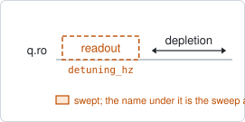
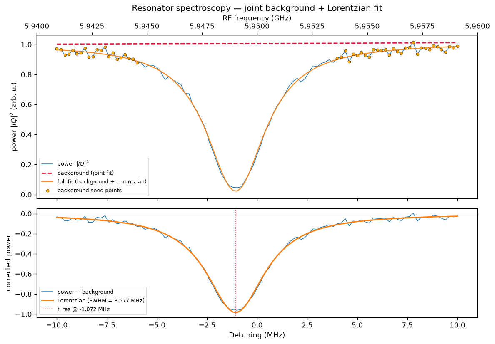

# resonator_spectroscopy

## Purpose

Finds a target's readout resonator: sweeps the readout frequency across a window
and locates the transmission dip. It is the first experiment run on a qubit,
because every other one reads the qubit through this resonator.

From one sweep it sets where the readout tone is parked, records the dip and its
linewidth as facts of the resonator, and derives from the linewidth how long to
wait after a readout before the next pulse. No other experiment calibrates that
wait.

Which resonator frequency the dip shows depends on the readout power. At low
power the qubit stays in its ground state and the dip is the dressed resonator;
above the punchout power it is the bare resonator. The experiment cannot tell
the two apart from one sweep, so `dip_branch` says which one you are measuring.

```
scqo run resonator_spectroscopy --targets q1
scqo run resonator_spectroscopy --targets q1 --set dip_branch=bare
```

## Before running it

<!-- BEGIN generated: requires -->
GENERATED from `ResonatorSpectroscopy.requires` and its Parameters mixins - edit
the declaration, then run `python scripts/update_docs.py`.

The target is a `transmon` / `flux_transmon` / `fluxonium` carrying the operations `readout`.

These device values must already be right:

| value | held by | used for | provided by |
|---|---|---|---|
| `readout_freq_hz` | readout channel | the swept window is centred on it; a starting value is enough (the design value will do) | `readout_frequency`, `resonator_spectroscopy`, `resonator_spectroscopy_flux`, `resonator_spectroscopy_power_amp`, `resonator_spectroscopy_power_chain` |
| `readout_power_dbm` | readout channel | decides which dip this is: the dressed resonator at low power, the bare one above punchout; a starting value is enough (the design value will do) | `resonator_spectroscopy_power_amp`, `resonator_spectroscopy_power_chain` |

A backend may need more than this - a knob only it consumes. `scqo run resonator_spectroscopy --help` lists those where that driver is installed.
<!-- END generated: requires -->

If the dip is not inside the default window of 10 MHz on either side, find it
first with `broadband_resonator_spectroscopy`.

## Pulse sequence



One readout pulse per point, at the current readout frequency plus the swept
detuning, followed by the depletion wait. No drive is played. The averaging loop
is the outer loop and the frequency sweep the inner one.

## Theory

*To be written.*

## Outputs

<!-- BEGIN generated: outputs -->
GENERATED from `ResonatorSpectroscopy.writes` and `.extracts` - edit the
declaration, then run `python scripts/update_docs.py`.

Proposed by `update()`; each stays pending until it is accepted:

| field | held by | role | unit | meaning |
|---|---|---|---|---|
| `readout_freq_hz` | readout channel | knob | Hz | Readout tone / demodulation frequency (operating CHOICE; the fact is the resonator's f_dress0_hz — the dip with the qubit in \|0>, where the tone is parked). |
| `readout_depletion_s` | readout channel | knob | s | Wait for the readout photons to leave the resonator before the next pulse; the calibration loop proposes depletion_factor / (2 pi x kappa_tot_hz) from resonator_spectroscopy — the readout twin of thermalization_time_s. |
| `f_dress0_hz` | resonator mode | fact | Hz | Dressed resonator frequency with the qubit in \|0> — the spectroscopy dip at the idle point (flux + qubit state). This is what the readout tone is parked on, so readout_freq_hz seeds from it. |
| `f_bare_hz` | resonator mode | fact | Hz | Bare (uncoupled) resonator frequency — the resonator with the qubit decoupled. From the dispersive flux fit, or directly from a high-power punchout. Design-legal: a datasheet designs the BARE resonator. |
| `kappa_tot_hz` | cavity / resonator mode | fact | Hz | Total linewidth (engineered for a buffer). |

Reported in `result.fit` and never written:

| fit key | meaning |
|---|---|
| `dip_detuning_hz` | where the dip sits in the swept window, relative to the readout frequency the run started from |
| `old_readout_freq_hz` | the readout frequency the run started from |
| `dip_branch` | which resonator frequency the dip was taken to be: dress0 or bare |
<!-- END generated: outputs -->

What is proposed depends on `dip_branch`:

- `dress0` (default): the readout frequency, the dressed dip `f_dress0_hz`, the
  linewidth `kappa_tot_hz`, and the depletion wait
  `depletion_factor / (2 pi x kappa_tot_hz)`.
- `bare`: only `f_bare_hz` and `kappa_tot_hz`. Nothing on the readout channel
  moves, because a punched-out dip does not say where to park the readout tone.

A run is `SUCCESSFUL` when the dip fit succeeded.

## Expected result



The upper panel is the measured power against the readout detuning, with the
fitted background (dashed) and the full fit through the dip. The lower panel is
the same dip after the background is removed, labelled with its width and its
position. Check that:

- the dip is well inside the window, with background on both sides;
- the fitted curve follows the dip's full depth and both shoulders;
- several points fall inside the linewidth. A dip resolved by one or two points
  gives an unreliable linewidth, and the depletion wait is derived from it.

## Traps

- **The dip is the wrong branch.** A run above the punchout power with the
  default `dip_branch=dress0` parks the readout tone on the bare resonator, where
  the qubit state no longer shifts it. If the power is in doubt, run
  `resonator_spectroscopy_power_amp` first; it shows both branches.
- **Too few points across the dip.** Narrow the window or raise
  `num_readout_freq_points` until the dip spans at least five points.
- **The dip sits at the edge of the window.** Recentre: accept the proposed
  `readout_freq_hz` and run again.

## References

- Related experiments: `broadband_resonator_spectroscopy` (find the dip before
  there is a starting frequency), `resonator_spectroscopy_power_amp` and
  `resonator_spectroscopy_power_chain` (choose the readout power, measure both
  branches), `resonator_spectroscopy_flux` (the dip against flux),
  `readout_frequency` (refine the frequency for state discrimination).
- Code: `scqo/experiments/resonator_spectroscopy.py`,
  `scqat/estimators/resonator_spectroscopy/`.
