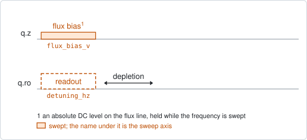
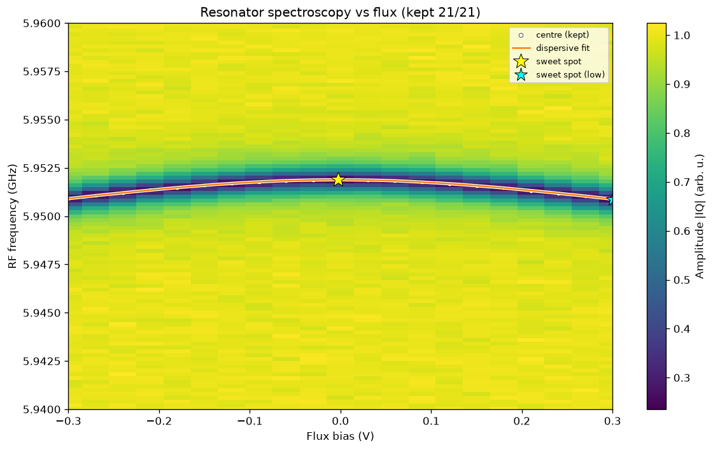

# resonator_spectroscopy_flux

## Purpose

Maps the resonator dip against the flux bias, and from the way the dip moves
finds the sweet spot and the flux period of a tunable qubit. It then parks the
qubit there: the flux line's idle point is set to the sweet spot and the readout
tone to the dip at that flux.

It is the first of three ways to place a qubit on its arch, and the only one
that needs neither a prior idle point nor a visible qubit, because it sees the
qubit only through its pull on the resonator. Its wide window is what gives the
period. `qubit_spectroscopy_flux_pulse` maps the arch on the qubit itself and
`qubit_ramsey_flux_pulse` resolves it locally to kHz.

The flux values are absolute: the probe sets the line's DC level at each point,
so the window is in volts at the instrument, not an excursion from the current
idle point.

```
scqo run resonator_spectroscopy_flux --targets q1
scqo run resonator_spectroscopy_flux --targets q1 --set analysis_method=sine
```

## Before running it

<!-- BEGIN generated: requires -->
GENERATED from `ResonatorSpectroscopyFlux.requires` and its Parameters mixins - edit
the declaration, then run `python scripts/update_docs.py`.

The target is a `transmon` / `flux_transmon` / `fluxonium` carrying the operations `readout`, `flux_bias`.

These device values must already be right:

| value | held by | used for | provided by |
|---|---|---|---|
| `readout_freq_hz` | readout channel | the swept window is centred on it; a starting value is enough (the design value will do) | `readout_frequency`, `resonator_spectroscopy`, `resonator_spectroscopy_flux`, `resonator_spectroscopy_power_amp`, `resonator_spectroscopy_power_chain` |

A backend may need more than this - a knob only it consumes. `scqo run resonator_spectroscopy_flux --help` lists those where that driver is installed.
<!-- END generated: requires -->

The coupling `g_hz` is only quantitative when two more things are known, and the
run works without either:

- the top of the qubit's arch. It is taken from the target's standing
  `drive_freq_hz`, else from the junction resistance in the design, else from
  the datasheet. With none of them the fit assumes a value and does not propose
  `f_bare_hz` or `g_hz`.
- the bare resonator frequency. A stored `f_bare_hz` from a punchout is pinned
  in the fit; a designed one is only used as a starting value.

## Pulse sequence



The flux line is set to one DC level, and at that level the readout frequency is
swept: one readout pulse per point, followed by the depletion wait. Flux is the
outer loop. With `flux_component` the level is applied to another entity's flux
line instead of the target's own.

## Theory

*To be written.*

## Outputs

<!-- BEGIN generated: outputs -->
GENERATED from `ResonatorSpectroscopyFlux.writes` and `.extracts` - edit the
declaration, then run `python scripts/update_docs.py`.

Proposed by `update()`; each stays pending until it is accepted:

| field | held by | role | unit | meaning |
|---|---|---|---|---|
| `flux_offset` | flux channel | fact | source-native | Sweet-spot offset of the transfer function flux/Phi0 = (x - flux_offset)/flux_per_phi0, where x is the ABSOLUTE set-point on the same plane as the line's idle_flux. An experiment whose sweep axis is relative to idle_flux re-references (absolute = idle_flux_at_run + fitted) before writing here. |
| `flux_per_phi0` | flux channel | fact | source-native | Source units of this line per flux quantum in the target's SQUID. |
| `idle_flux` | flux line | knob | source-native | Standing bias set-point of this line in the flux source's native unit (volts for an AWG line, amperes for a coil). A coupler's decouple point IS this knob on its own flux line. It is also the ORIGIN a '_pulse' flux experiment's swept window is measured from (its probe plays on top of this bias). |
| `readout_freq_hz` | readout channel | knob | Hz | Readout tone / demodulation frequency (operating CHOICE; the fact is the resonator's f_dress0_hz — the dip with the qubit in \|0>, where the tone is parked). |
| `f_bare_hz` | resonator mode | fact | Hz | Bare (uncoupled) resonator frequency — the resonator with the qubit decoupled. From the dispersive flux fit, or directly from a high-power punchout. Design-legal: a datasheet designs the BARE resonator. |
| `g_hz` | resonator mode | fact | Hz | Qubit-resonator coupling AT THE CURRENT IDLE POINT (the qubit frequency it was measured at). Written by the dispersive flux fit and by a punchout that knows the drive frequency. g = g_coeff sqrt(f_q f_bare), so this value goes stale when the qubit is re-tuned while g_coeff does not — a DESIGN g_hz likewise holds only at the design frequencies, and the flux fit rescales its seed to the chip's actual ones. |
| `g_coeff` | resonator mode | fact | - | Qubit-resonator coupling as a DIMENSIONLESS geometry constant: g_coeff = g_hz / sqrt(f_q f_bare_hz), the capacitance-ratio factor. Unlike g_hz this survives re-tuning, re-parking and cooldowns, so it is what a datasheet designs and what predicts g at a new idle point (g = g_coeff sqrt(f_q f_bare)). VALID BETWEEN transmon-regime idle points only — do NOT extrapolate it down a flux arch (measured and refuted 2026-08-18; see experiments/_transmon_estimate.py). |

Reported in `result.fit` and never written:

| fit key | meaning |
|---|---|
| `sweet_spot_res_hz` | the resonator dip at the upper sweet spot; proposed as readout_freq_hz |
| `sweet_spot_low_flux_v` | the flux of the LOWER sweet spot, half a period away |
| `sweet_spot_low_res_hz` | the resonator dip at the lower sweet spot |
| `n_good_flux` | how many flux points kept a usable dip |
| `old_readout_freq_hz` | the readout frequency the run started from |
| `old_idle_flux` | the idle flux the run started from |
| `f_q_max_hz` | dispersive method: the arch top the fit took as an input (never proposed here) |
| `ec_hz` | dispersive method: the charging energy the fit took as an input |
| `f_q_max_source` | dispersive method: where that arch top came from; 'assumed' withholds f_bare_hz and g_hz |
| `f_bare_source` | dispersive method: whether the bare frequency was pinned to a stored measurement or left free |
<!-- END generated: outputs -->

`flux_offset`, `flux_per_phi0`, `idle_flux` and `readout_freq_hz` are proposed
by both analysis methods. `f_bare_hz`, `g_hz` and `g_coeff` come from the
dispersive method only, and only when the arch top was measured rather than
assumed (`f_q_max_source`). `f_bare_hz` is not proposed again when the fit was
pinned to a stored measurement of it. When the swept line belongs to another
entity (`flux_component`), nothing is proposed.

A run is `SUCCESSFUL` when the flux-dependence fit succeeded.

## Expected result



The map shows the transmitted amplitude against flux and frequency. The dip is
the dark band, the fitted model is drawn over the dip centres, and the two stars
mark the upper and the lower sweet spot. Check that:

- the dip traces a smooth periodic curve whose maximum is the sweet spot;
- the window holds enough of a period for the curve to turn over. A window that
  shows only a slope cannot give the period;
- the fitted curve follows the tracked dips over the whole window, not only near
  the sweet spot.

## Traps

- **A coupling built on an assumed arch top.** The dispersive model does not fit
  the top of the arch; it takes it as an input. A wrong value is absorbed into
  `g_hz`, which comes out too large. Read `f_q_max_source` before using the
  coupling.
- **The window covers less than half a period.** The sweet spot is then
  extrapolated. Widen `start_flux_v` and `end_flux_v`.
- **Dips pinned at the edge of the frequency window.** Points where the dip left
  the window are rejected (`edge_margin_frac`); if many are, `n_good_flux` drops
  and the fit rests on few points. Widen the detuning window towards lower
  frequency, the direction the dip moves away from the sweet spot.

## References

- Related experiments: `qubit_spectroscopy_flux_pulse` and
  `qubit_ramsey_flux_pulse` (the other two ways to place the qubit on its arch;
  all three propose `idle_flux`), `resonator_spectroscopy_power_amp` (measures
  the `f_bare_hz` this fit can pin).
- Code: `scqo/experiments/resonator_spectroscopy_flux.py`,
  `scqat/estimators/resonator_spectroscopy_flux/`.
