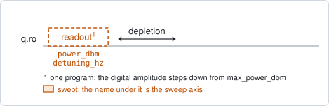
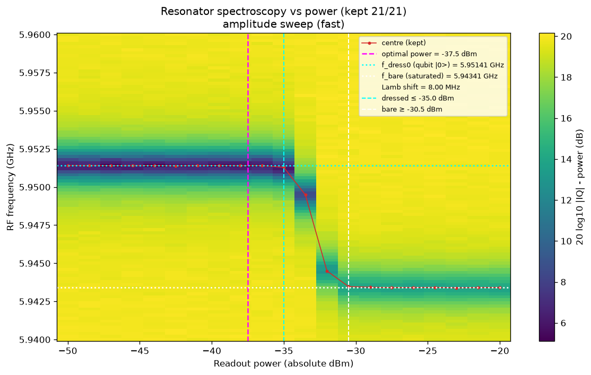

# resonator_spectroscopy_power_amp

## Purpose

The fast punchout: maps the resonator dip against readout power in one hardware
program, chooses the readout power, and measures both resonator frequencies.

At low power the qubit stays in its ground state and the dip is the dressed
resonator. As the power rises the qubit saturates, stops pulling the resonator,
and the dip moves to the bare frequency. The working point has to be on the
low-power side of that transition, and the distance between the two branches is
the one direct measurement of the bare resonator there is.

The output chain is solved once for `max_power_dbm` and the digital amplitude is
then stepped down from it, so the signal-to-noise ratio is best at the top of
the window and falls towards the bottom. Use this one for a quick scan and
`resonator_spectroscopy_power_chain` when every power point needs the best
signal.

```
scqo run resonator_spectroscopy_power_amp --targets q1
```

## Before running it

<!-- BEGIN generated: requires -->
GENERATED from `ResonatorSpectroscopyPowerAmp.requires` and its Parameters mixins - edit
the declaration, then run `python scripts/update_docs.py`.

The target is a `transmon` / `flux_transmon` / `fluxonium` carrying the operations `readout`.

These device values must already be right:

| value | held by | used for | provided by |
|---|---|---|---|
| `readout_freq_hz` | readout channel | the swept window is centred on it; a starting value is enough (the design value will do) | `readout_frequency`, `resonator_spectroscopy`, `resonator_spectroscopy_flux`, `resonator_spectroscopy_power_amp`, `resonator_spectroscopy_power_chain` |

A backend may need more than this - a knob only it consumes. `scqo run resonator_spectroscopy_power_amp --help` lists those where that driver is installed.
<!-- END generated: requires -->

The window must contain both branches, so it has to be wider than the pull of
the qubit on the resonator and extend towards the bare frequency.

## Pulse sequence



One readout pulse per point, swept in frequency and in power, followed by the
depletion wait. No drive is played. Power is the outer loop, then the averages,
and the frequency sweep is the inner loop.

## Theory

*To be written.*

## Outputs

<!-- BEGIN generated: outputs -->
GENERATED from `ResonatorSpectroscopyPowerAmp.writes` and `.extracts` - edit the
declaration, then run `python scripts/update_docs.py`.

Proposed by `update()`; each stays pending until it is accepted:

| field | held by | role | unit | meaning |
|---|---|---|---|---|
| `readout_freq_hz` | readout channel | knob | Hz | Readout tone / demodulation frequency (operating CHOICE; the fact is the resonator's f_dress0_hz — the dip with the qubit in \|0>, where the tone is parked). |
| `readout_power_dbm` | readout channel | knob | dBm | Absolute readout power at the output port; re-solves the chain, moving readout_amp as a COUPLED change. |
| `f_dress0_hz` | resonator mode | fact | Hz | Dressed resonator frequency with the qubit in \|0> — the spectroscopy dip at the idle point (flux + qubit state). This is what the readout tone is parked on, so readout_freq_hz seeds from it. |
| `f_bare_hz` | resonator mode | fact | Hz | Bare (uncoupled) resonator frequency — the resonator with the qubit decoupled. From the dispersive flux fit, or directly from a high-power punchout. Design-legal: a datasheet designs the BARE resonator. |
| `g_hz` | resonator mode | fact | Hz | Qubit-resonator coupling AT THE CURRENT IDLE POINT (the qubit frequency it was measured at). Written by the dispersive flux fit and by a punchout that knows the drive frequency. g = g_coeff sqrt(f_q f_bare), so this value goes stale when the qubit is re-tuned while g_coeff does not — a DESIGN g_hz likewise holds only at the design frequencies, and the flux fit rescales its seed to the chip's actual ones. |
| `g_coeff` | resonator mode | fact | - | Qubit-resonator coupling as a DIMENSIONLESS geometry constant: g_coeff = g_hz / sqrt(f_q f_bare_hz), the capacitance-ratio factor. Unlike g_hz this survives re-tuning, re-parking and cooldowns, so it is what a datasheet designs and what predicts g at a new idle point (g = g_coeff sqrt(f_q f_bare)). VALID BETWEEN transmon-regime idle points only — do NOT extrapolate it down a flux arch (measured and refuted 2026-08-18; see experiments/_transmon_estimate.py). |

Reported in `result.fit` and never written:

| fit key | meaning |
|---|---|
| `optimal_power_dbm` | the power chosen as the working point; proposed as readout_power_dbm |
| `frequency_shift_hz` | the proposed readout frequency minus the one the run started from |
| `old_readout_power_dbm` | the readout power the run started from |
| `old_readout_freq_hz` | the readout frequency the run started from |
| `lamb_shift_hz` | f_dress0_hz minus f_bare_hz: how far the qubit pulls its resonator |
| `dress_max_power_dbm` | the highest power at which the dip is still the dressed resonator (a property of the setup chain, not of the chip) |
| `bare_min_power_dbm` | the lowest power at which the dip has fully punched out |
| `branch_success` | 1 when both branches were resolved |
| `old_idle_flux` | the flux bias the dressed frequency was measured at |
| `g_source` | where the coupling came from: 'punchout', or 'none' when there is no calibrated drive frequency to turn the Lamb shift into g |
<!-- END generated: outputs -->

`g_hz` and `g_coeff` are proposed only when the target already has a calibrated
drive frequency: the coupling is computed from the measured pull and the
qubit-resonator detuning, and without the qubit frequency there is no detuning.
The two branch frequencies need no qubit. Each is proposed whenever that branch
was resolved, on its own: a window that only reached the low-power side still
gives `f_dress0_hz`.

A run is `SUCCESSFUL` when a working power was found and the frequency shift at
that power is finite.

## Expected result



The map shows the transmitted power against readout power and frequency, with
the tracked dip centre drawn over it. The horizontal dotted lines are the two
branch frequencies, the vertical dashed lines the chosen power and the two
plateau boundaries. Check that:

- the dip sits at one frequency on the low-power side and at another on the
  high-power side, with a transition between them;
- the chosen power is on the low-power plateau, below the transition;
- both plateaus are several points long. A plateau of one or two points is not a
  measurement of that branch: widen the power window.

## Traps

- **Only one branch in the window.** With the transition outside the power
  window, or the bare dip outside the frequency window, the run still returns a
  working point, but `branch_success` is 0, the missing branch is not proposed,
  and neither is the coupling, which needs both. Widen the window on the side
  that is missing.
- **Noise at the bottom of the power window.** The amplitude is small there by
  construction. If the low-power rows are too noisy to track the dip, raise
  `num_averages` or use `resonator_spectroscopy_power_chain`.

## References

- Related experiments: `resonator_spectroscopy_power_chain` (the same
  measurement with the output chain stepped per point), `resonator_spectroscopy`
  (one sweep at the chosen power), `resonator_spectroscopy_flux` (uses the
  `f_bare_hz` measured here to make its coupling quantitative).
- Code: `scqo/experiments/resonator_spectroscopy_power_amp.py`,
  `scqo/experiments/_punchout.py`,
  `scqat/estimators/resonator_spectroscopy_power/`.
